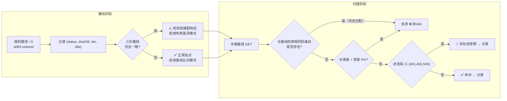
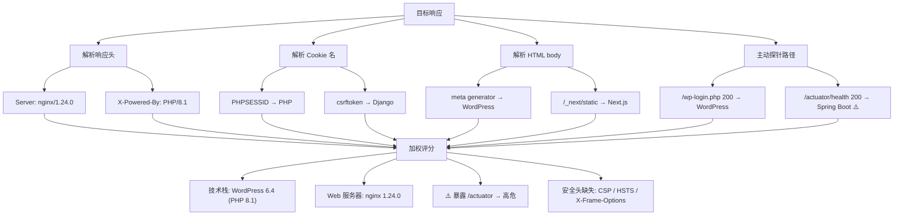

# Day 154 图解 — 目录扫描与指纹识别原理

> 本文件只使用 **Mermaid 代码块** 与 **ASCII 字符画**，不生成任何图片文件。

---

## 图 1：HTTP 请求在多层中间件中的流转（ASCII）

```
                    ┌─────────────────────────────────────────┐
   GET /admin/      │ 1. CDN / WAF（Cloudflare、阿里云盾）      │
   ────────────────►│    · IP 信誉、请求速率、正则规则           │
                    │    · 命中 → 403 / 自定义拦截页 / JS 挑战   │
                    └───────────────┬─────────────────────────┘
                                    │ 放行
                    ┌───────────────▼─────────────────────────┐
                    │ 2. 反向代理 / Web 服务器 (nginx)          │
                    │    · location 匹配                        │
                    │    · try_files $uri $uri/ /index.html     │  ◄── 软404 制造者
                    │    · 目录无斜杠 → 301                      │
                    └───────────────┬─────────────────────────┘
                                    │ proxy_pass
                    ┌───────────────▼─────────────────────────┐
                    │ 3. 应用服务器 (gunicorn / uvicorn / php)  │
                    │    · 进程池满 → 502                       │
                    │    · 超时    → 504                       │
                    └───────────────┬─────────────────────────┘
                                    │ WSGI/ASGI
                    ┌───────────────▼─────────────────────────┐
                    │ 4. 框架路由 (Django / Flask / FastAPI)     │
                    │    · 鉴权中间件: 未登录 → 302 /login       │
                    │    · catch-all 路由 → 200 自定义页         │
                    │    · 无匹配 → 404                          │
                    └──────────────────────────────────────────┘

结论：同一次请求可能被 4 层任意一层"改写"响应，
      这就是为什么"状态码"不能单独作为存在性判据。
```

---

## 图 2：软 404 检测算法（Mermaid 流程图）



**容差为什么取 5%？** 经验值：动态页面（时间戳、访问计数）通常让长度抖动
在 1%~3%；超过 5% 的差异往往意味着"结构不同"，即不同页面。这个值应该**可配置**，
因为不同站点差异极大。

---

## 图 3：目录扫描的三种"命中"类型（ASCII）

```
字典里的 10000 个路径
        │
        ├──────────────► 200 + 内容独特        →  ✅ 真实文件
        ├──────────────► 200 + 与基线一致      →  ❌ 软404（丢弃）
        ├──────────────► 301 /admin → /admin/  →  🔁 目录（存在！）
        ├──────────────► 302 → /login          →  🔑 受保护资源（存在！）
        ├──────────────► 401 / 403             →  🔑 存在但受限
        ├──────────────► 404                   →  ❌ 不存在
        ├──────────────► 429 / 503             →  ⚠️ 限流：立刻降速
        └──────────────► 500                   →  🟡 参数/环境问题，人工复核

最容易漏掉的：
  · 302 → 登录页   （90% 的扫描器用 allow_redirects=True，跟随跳转后拿到
                    登录页的 200，长度全都一样，反而被当成"软404"丢弃！）
  · 403            （被默认配置忽略）
  · 200 + 空 body  （有些 API 只要路由存在就返回 200 + {}）
```

> **重要细节**：`allow_redirects=True` 是很多扫描器误报/漏报的根源。
> 必须 `allow_redirects=False`，自己判断 `Location`。

---

## 图 4：线程池扫描的时间线（ASCII）

```
单线程（1 worker）：
t=0    ├─ req1 ├─ req2 ├─ req3 ├─ req4 ─┤   总耗时 = 4RTT
        RTT     RTT     RTT     RTT

4 线程：
t=0    ├─ req1 ─┤
       ├─ req2 ─┤                            总耗时 ≈ 1RTT（理想）
       ├─ req3 ─┤
       └─ req4 ─┘
       │◄───── RTT ─────►│

50 线程 + keep-alive：
  ┌── worker-1  ── req1 ─ req53 ─ req105 ... ─┐
  ├── worker-2  ── req2 ─ req54 ─ req106 ... ─┤
  │   ...                                      │   瓶颈从「RTT × N」
  └── worker-50 ── req50 ─ req102 ─ ...      ─┘   转移到「服务端处理能力」
                                                  和「WAF 速率阈值」

⚠️ 并发不是越大越好：超过服务端 MaxClients 后，
   你自己的请求开始排队 → 超时 → 误报为 "不存在"。
```

---

## 图 5：指纹识别证据加权（Mermaid）



**加权建议：**

| 证据类型 | 权重 | 理由 |
|---|---|---|
| 主动探针命中已知路径 | 3 | 路径存在是硬证据 |
| `Set-Cookie` 名 | 2 | 框架默认值，改动成本高 |
| 响应头 | 2 | 可伪造/可关闭 |
| HTML 特征字符串 | 2 | 可能来自模板复制 |
| favicon 哈希 | 1 | 有误报（同一公司多个产品复用） |
| 默认错误页样式 | 1 | 最不可靠 |

---

## 图 6：授权边界检查（ASCII，代码护栏逻辑）

```
                     ┌────────────────────────────┐
   用户传入 --url ──►│ 解析 host                   │
                     └──────────────┬─────────────┘
                                    │
                    ┌───────────────▼──────────────┐
                    │ host ∈ {127.0.0.1, localhost, │
                    │         ::1, 0.0.0.0} ?       │
                    └───────┬──────────────┬───────┘
                            │ 是           │ 否
                            │              ▼
                            │     ┌──────────────────────────┐
                            │     │ 是否带 --i-have-authorization? │
                            │     └────┬────────────────┬────┘
                            │          │ 是             │ 否
                            │          │                ▼
                            │          │        ┌────────────────┐
                            │          │        │ 打印合规提示    │
                            │          │        │ sys.exit(2)    │
                            │          │        └────────────────┘
                            ▼          ▼
                    ┌──────────────────────────────┐
                    │ 打印目标 + 并发 + 预计请求数    │
                    │ 强制 sleep(0.1) 起步限速       │
                    │ 开始扫描                       │
                    └──────────────────────────────┘
```

> **把边界写进代码而不是写进 README**，是因为人总有"就试一次"的冲动。
> 让程序在跑之前先替你踩一次刹车。
