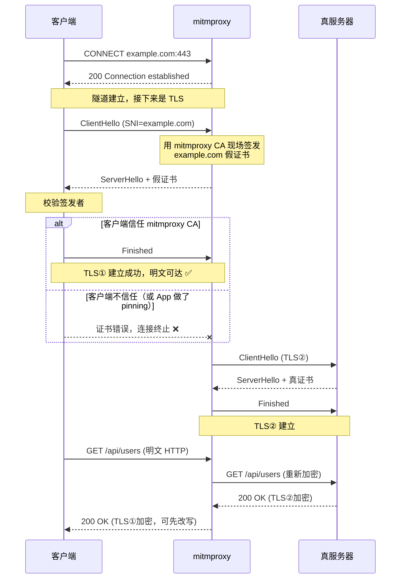

# Day 155 — mitmproxy 中间人：流量拦截、修改与 Addon 编程

> 阶段：Phase 7 — 进阶与性能优化 · 主题：mitmproxy 中间人
>
> 前置知识：Day 116 TCP/UDP、Day 146 HTTPS/TLS 分析、Day 151 SQL 注入（了解 HTTP 参数）、
> Day 149 JWT 安全、Day 154 目录扫描与指纹识别。
> 昨天我们用"发请求 + 看响应"的方式观察 Web；今天换个位置——
> **把自己插到客户端和服务器中间**，实时看到、改动、重放每一个包。

---

## ⚠️ 使用前必读：法律与伦理边界

中间人（MITM）拦截在技术上就是**解密别人的加密流量**。它对 TLS 的信任模型
是一次"合法但危险"的破坏，因此法律与伦理要求极高：

| 场景 | 是否合法 |
|---|---|
| 抓**自己手机/自己浏览器**的流量，且目的是调试自己的程序 | ✅ 合法 |
| 在自己的测试环境代理自己的 App ↔ 自己的服务器 | ✅ 合法 |
| 公司安全团队在**书面授权 + 员工知情**前提下做内部审计 | ⚠️ 需严格合规流程 |
| 抓同事、家人、陌生人的流量 | ❌ 违法 |
| 在公共 WiFi 上劫持他人流量 | ❌ 刑事犯罪 |

| 法域 | 相关法条 |
|---|---|
| 中国大陆 | 《刑法》第 285 条（非法获取计算机信息系统数据）、第 253 条之一（侵犯公民个人信息）；《网络安全法》第 27 条 |
| 美国 | CFAA 18 U.S.C. § 1030；Wiretap Act 18 U.S.C. § 2511 |
| 英国 | Computer Misuse Act 1990；Investigatory Powers Act 2016 |
| 欧盟 | GDPR（个人数据传输）；《网络犯罪公约》 |

**本日所有示例的目标域都限制为 `127.0.0.1` / `localhost` / `example.com`
等无害地址**；示例 03 内置域名白名单校验。

> 本系列定位是**安全防御与教学**：学 MITM 的目的是
> ①调试自己的程序、②理解"为什么证书校验这么重要"、③给自己做 App 抓包分析。
> 不是去截别人的密码。

---

## 一、概念解释

### 1.1 mitmproxy 是什么

一组**开源交互式 HTTPS 中间人代理**工具，用 Python 编写：

| 命令 | 形态 | 适用 |
|---|---|---|
| `mitmproxy` | 交互式 TUI（终端界面） | 人工探索：翻请求、改包、重放 |
| `mitmdump` | 无界面，纯命令行 | 脚本化 / 自动化 / 写进 CI |
| `mitmweb` | Web UI（浏览器界面） | 图形化查看，适合演示与团队协作 |

**它与 Fiddler / Charles / Burp 是同类**，区别在于：

1. **完全开源、跨平台**（Fiddler 偏 Windows，Charles 收费）；
2. **Addon 用 Python 写**——本系列已学完 154 天 Python，正好用得上；
3. **可嵌入**（`mitmproxy` 可以当 Python 库用，直接在代码里 in-process 起代理）。

**为什么需要中间人代理？** 因为 HTTPS 之后，流量是加密的：

```
没有代理:
  你的程序  ──TLS 加密隧道──►  服务器          ←  你只能看到"长度和字节数"

有中间人代理:
  你的程序  ──TLS①──►  mitmproxy  ──TLS②──►  服务器
                       ↑ 明文在这里
                       （对两段 TLS 各自解密/再加密，成为"可信的中间人"）
```

这里的关键点是：**mitmproxy 对客户端伪装成服务器，对服务器伪装成客户端**。
它能成功的前提是——**客户端信任 mitmproxy 自己签发的 CA 证书**。

### 1.2 为什么必须装 CA 证书

TLS 的核心安全保证是**证书链校验**：客户端拿到服务器证书后，会验证
"它是否由我信任的 CA 签发"。mitmproxy 要解密流量，就必须用自己的 CA
**现场签发一张"服务器名一模一样"的假证书**给客户端：

```
客户端  ──握手──►  mitmproxy
                     │ "我是 github.com"
                     │ (出示 mitmproxy 自签发的 github.com 证书)
客户端  ←───────────┘
   ↓ 校验：这张证书是谁签的？
   ├─ 若客户端信任 mitmproxy CA  →  校验通过 → 建立 TLS①  →  明文到手 ✅
   └─ 若客户端不信任            →  证书错误 → 连接失败 ❌
```

所以：**你必须在客户端（浏览器/手机/App）里安装并信任 mitmproxy 的根证书**，
否则只能看到一个加密的连接失败。

这也正是**防御要点**：任何 App 只要做 **certificate pinning（证书固定）**，
就能识别出"签发者不是真服务器"，MITM 立即失效。

### 1.3 三种代理模式

| 模式 | 客户端配置 | 原理 | 典型场景 |
|---|---|---|---|
| **正向代理（regular）** | 手动设置 HTTP 代理为 `127.0.0.1:8080` | 客户端主动把请求发给代理 | 浏览器插件、`curl -x`、`proxychains` |
| **透明代理（transparent）** | 无需配置 | 由 iptables/路由把流量重定向到代理端口 | 抓手机 App、抓 IoT 设备 |
| **反向代理（reverse）** | 目标指向代理端口 | 代理作为服务器对外提供，转发到上游 | 调试自己后端、测试证书问题 |
| **上游代理链（upstream）** | `--mode upstream:http://...` | 代理再走一层代理 | 穿透多层网络、Burp 联动 |

**为什么有这么多模式？** 因为"把流量导到代理"这件事，在不同客户端上
能力完全不同：

- 桌面浏览器：可以手动设代理 → 用正向；
- 手机 App：很多 App 忽略系统代理 → 只能透明代理（需要 root 或路由器支持）；
- 服务端程序：写死了目标地址 → 用反向代理改 DNS/hosts。

### 1.4 拦截与修改：能改什么

一次 HTTP 事务里，**所有**部分都可以改：

| 位置 | 可改写的内容 | 例子 |
|---|---|---|
| 请求行 | method / path / version | `GET /a` → `POST /admin` |
| 请求头 | 任意头 | 加 `X-Forwarded-For`、改 `Cookie`、删 `Referer` |
| 请求体 | JSON / form / 二进制 | 把 `{"role":"user"}` 改成 `{"role":"admin"}` |
| 响应行 | status code / reason | `403` → `200` |
| 响应头 | 任意头 | 删 `Content-Security-Policy` 看页面会不会被注入 |
| 响应体 | 任意内容 | 注入一段 JS 测试前端防御 |

**这就是"越权测试"和"前端安全测试"的核心手法**：
在代理层把自己伪装成管理员（改 `role`）、或伪装成攻击者（注入脚本），
看看**服务端有没有真的做校验**、**前端有没有真的做防御**。

### 1.5 Addon：用 Python 控制代理

mitmproxy 的扩展机制叫 **Addon**：一个普通 Python 对象，实现若干
**按事件名命名的方法**，mitmproxy 在对应时机调用它们。

```python
class MyAddon:
    def request(self, flow):        # 收到客户端请求、尚未转发时
        flow.request.headers["X-Test"] = "1"

    def response(self, flow):       # 收到服务器响应、尚未回给客户端时
        if flow.response.status_code == 404:
            flow.response.status_code = 200
```

**为什么用"事件回调"而不是中间件链？** 因为代理的生命周期事件
（连接建立、TLS 握手、请求、响应、WebSocket 帧、错误、断开）比
Web 框架的中间件丰富得多，事件模型更自然。

**Addon 的事件全景（生命周期）：**

```
     ┌─────────────┐
     │  client     │
     └──────┬──────┘
            ▼
     client_connected
            ▼
     tls_clienthello → tls_established_client
            ▼
     request  ←────────────────── 你能改请求
            ▼
     http_connect / requestheaders / request  (分阶段)
            ▼
     ┌─────────────┐
     │  server     │
     └──────┬──────┘
            ▼
     responseheaders → response ←── 你能改响应
            ▼
     websocket_*   (如果是 WebSocket)
            ▼
     client_disconnected / error
```

### 1.6 常见用途（正反两面）

| 用途 | 说明 | 立场 |
|---|---|---|
| 调试自己 App 的 API 调用 | 看请求参数、响应结构、时序 | ✅ 开发日常 |
| 复现线上问题 | 把生产响应抓下来，在本地重放 | ✅ 开发日常 |
| 弱网/异常注入测试 | 注入延迟、丢包、错误码，测客户端的健壮性 | ✅ 质量保障 |
| Mock 后端 | 用 map_local / 脚本返回假数据，前端不阻塞 | ✅ 前后端协作 |
| 越权/认证测试 | 改 role、改 JWT、改 Cookie 看服务端是否校验 | ✅ 授权渗透测试 |
| 屏蔽/篡改广告 | 改写响应体去广告 | ⚠️ 灰色 |
| 抓取他人流量 | 窃取凭据、cookie | ❌ 违法 |

### 1.7 与其他方案的对比

| 方案 | 层次 | 能看 HTTPS？ | 上手难度 | 适合 |
|---|---|---|---|---|
| **tcpdump / Wireshark** | 网络层（原始包） | ❌（只能看到密文） | 中 | 协议分析、找网络问题 |
| **mitmproxy** | 应用层（HTTP 语义） | ✅（装 CA 后） | 低 | API 调试、改包、自动化 |
| **浏览器 DevTools** | 应用层（仅浏览器内） | ✅（浏览器自己的栈） | 极低 | 前端调试，但抓不到 App |
| **charles / fiddler** | 应用层 | ✅ | 低 | 图形化，收费/平台限制 |
| **Burp Suite** | 应用层 + 主动扫描 | ✅ | 中高 | 专业渗透，价格高 |
| **frida + 脱壳** | 进程内 hook | ✅（绕过 pinning） | 高 | 逆向 App（Day 140 相关） |

**选择原则：** 只想看 API → DevTools/mitmproxy；要自动化 → mitmdump；
要跨设备/App → mitmproxy 透明代理；要主动扫描漏洞 → Burp。

---
## 二、原理解释（底层机制与设计动机）

### 2.1 HTTP 代理的两种形态：普通请求 vs CONNECT 隧道

客户端配置了 HTTP 代理后，行为分两种：

**（1）目标是 HTTP（明文）：**

```
GET http://example.com/a HTTP/1.1     ← 注意：请求行里是"绝对 URL"
Host: example.com
Proxy-Connection: keep-alive

代理收到后，把请求行改成相对形式，转发给 example.com。
```

**（2）目标是 HTTPS：**

```
CONNECT example.com:443 HTTP/1.1      ← 先建立隧道
Host: example.com:443

代理回复：
HTTP/1.1 200 Connection established

之后客户端在"这条隧道"里做 TLS 握手。
```

**关键理解点：**

- 明文 HTTP 时，代理**天然就能看到全部内容**，不需要任何证书；
- HTTPS 时，`CONNECT` 只是请求开一条**盲隧道**。mitmproxy 要想看内容，
  必须**不老实**——它回复 `200 Connection established` 之后，
  **自己扮演服务器完成 TLS① 握手**（出示自签证书），再**扮演客户端**
  去和真服务器做 TLS②。这就是 MITM 的全部魔法。

```
  客户端                      mitmproxy                      真服务器
    │                             │                             │
    │  CONNECT example.com:443    │                             │
    │────────────────────────────►│                             │
    │  200 Connection established │                             │
    │◄────────────────────────────│                             │
    │                             │                             │
    │  ClientHello                │                             │
    │────────────────────────────►│                             │
    │                             │  ① 判断 SNI = example.com    │
    │                             │  ② 用 CA 现场签一张          │
    │                             │     example.com 证书         │
    │  ServerHello + 自签证书      │                             │
    │◄────────────────────────────│                             │
    │  (若客户端信任 mitmproxy CA) │                             │
    │  Finished  ────────────────►│                             │
    │      ✅ TLS① 建立，明文可达   │                             │
    │                             │  ── TLS② 握手（用真证书）──►  │
    │                             │◄────────────────────────────│
    │                             │      ✅ TLS② 建立            │
    │  HTTP 明文请求 ─────────────►│  改写/记录后重新加密转发 ────►│
    │  HTTP 明文响应 ◄────────────│  ◄── 解密并改写后回传 ───────│
```

### 2.2 证书"现场签发"意味着什么

mitmproxy 内部维护一张 CA（`~/.mitmproxy/mitmproxy-ca-cert.pem`）。
每次遇到新的 SNI，它会：

1. 生成一对新的 **临时私钥**（或用缓存）；
2. 用 mitmproxy CA 的私钥**签发**一张 CN/SAN = 目标域名的证书；
3. 缓存这张证书（默认在内存 + `~/.mitmproxy/` 下）。

**三个重要推论：**

1. **不同域名得到不同证书**——所以 SAN 校验会通过（域名对得上）；
2. **签发者不同**——所以防 pinning 的 App 会拒；
3. **自签证书不受平台欢迎**——Android 7+ 起，用户安装的 CA 默认**不被
   应用信任**（除非 App 显式开启 `networkSecurityConfig` 或系统 CA）。

**这就是为什么"抓 Android App 的包"这么麻烦：**
需要 root + 把 CA 装到系统证书区，或者用 frida 绕过 pinning。

### 2.3 为什么修改响应体会破坏 `Content-Length`

HTTP/1.1 里，响应体的长度有三种告知方式：

| 方式 | 示例 | 含义 |
|---|---|---|
| `Content-Length: N` | `Content-Length: 342` | 定长，读 N 字节结束 |
| `Transfer-Encoding: chunked` | `chunked` | 分块，`0\r\n\r\n` 结束 |
| 无长度 + 连接关闭 | 无 | 读到 EOF 结束（HTTP/1.0 风格） |

如果你把响应体从 342 字节改成 400 字节，却**不改 `Content-Length`**：

```
客户端期待 342 字节 → 多出来的 58 字节被当作"下一个响应" → 协议错乱
```

**mitmproxy 的正确做法**：用 `flow.response.text = "新内容"` 或
`flow.response.content = b"..."`，它**自动**重算 `Content-Length`
并处理 `chunked`。**不要**手动去写 `flow.response.headers["Content-Length"]`
（除非你很清楚自己在干什么）。

### 2.4 gzip/br压缩：改包前必须先解压

服务器常返回 `Content-Encoding: gzip`。此时 `flow.response.content`
是**压缩后的字节**。你如果直接对压缩字节做字符串替换：

```python
# ❌ 错误：乱码 / 匹配不到
flow.response.content = flow.response.content.replace(b"old", b"new")

# ✅ 正确：用 text 属性，mitmproxy 自动解码/重编码
if "old" in flow.response.text:
    flow.response.text = flow.response.text.replace("old", "new")
```

**注意 `flow.response.text` 的代价**：它会把整个 body 解码成 `str`
（UTF-8 解码失败会抛异常），大文件（>几十 MB）会吃内存。
**规则：小文本用 `.text`，大文件/二进制用 `.content` 或 `.raw_content`。**

### 2.5 Addon 的执行顺序与"响应改写"的时机

Addon 支持**注册顺序**与 `@hook` 装饰器两种写法。默认按注册顺序执行。
重要事件顺序：

```
requestheaders  →  request  →  [转发]  →  responseheaders  →  response
   ↑ 此时只有头          ↑ 此时 body 已完整        ↑ 只有头        ↑ body 完整
```

**设计动机：** 分阶段是为了**流式**处理——大文件上传时，
你不可能等整个 body 到齐才决定要不要拦截。分阶段让你能在
**头阶段**就做出决策（比如直接拒绝），而不用等 body。

**两个常被误解的事实：**

1. `request` 事件触发时，body **已经完整读入**（除非开了 `stream_*` 系列事件）；
2. 在 `response` 里改 `flow.response` **会**生效，因为此时还没回给客户端。

### 2.6 透明代理为什么要靠 iptables

透明代理的目标是"客户端完全不知道有代理"。实现靠**网络层重定向**：

```bash
# Linux 上把 80/443 的流量重定向到 mitmproxy 的 8080
iptables -t nat -A PREROUTING -p tcp --dport 80  -j REDIRECT --to-ports 8080
iptables -t nat -A PREROUTING -p tcp --dport 443 -j REDIRECT --to-ports 8080
# 原目标地址会丢失，所以需要 SO_ORIGINAL_DST 找回
```

**关键问题：目标地址被 NAT 改掉了。** 代理必须通过 `getsockopt(SO_ORIGINAL_DST)`
把"客户端原本想访问谁"找回来，否则不知道要连哪里。
mitmproxy 的 `--mode transparent` 会自动处理这一步。

**为什么这在 macOS/Windows 上麻烦？** 因为那是 Linux 的 netfilter 特性，
其它系统要用 pf（macOS）/ WinDivert（Windows）。

### 2.7 为什么 Addon 里不能做"长时间阻塞操作"

mitmproxy 的事件循环（asyncio）是**单线程**的。你在 `request` 里写：

```python
time.sleep(10)          # ❌ 整个代理卡住 10 秒，所有连接都停
requests.get(...)       # ❌ 同步请求阻塞事件循环
```

正确做法：

- 用 `mitmproxy` 提供的异步 API（如 `flow.request` 的 `await` 变体）；
- 或者把重活丢到 `ThreadPoolExecutor` / `asyncio.to_thread`；
- 需要"挂起请求稍后继续"时，用 `flow.intercept()` + `flow.resume()`。

**这就是"代理为什么突然变慢"的最常见原因。**

### 2.8 为什么"本地实验台"能跑真 Addon：`sys.modules` 注入与 shim 的边界

本日的 `code/00-local-lab.py` 是一个**纯标准库**的 MITM 实验台：
它起一个假上游站点 + 一个真正的 HTTP 正向代理，并且在加载你的 Addon 之前，
把三个**模块对象**塞进 `sys.modules`：

```python
sys.modules["mitmproxy"]       = <shim 模块>     # 有 .http / .ctx 属性
sys.modules["mitmproxy.http"]  = <HTTPFlow/Request/Response/Headers/Response.make>
sys.modules["mitmproxy.ctx"]   = <ctx.log / ctx.options>
```

于是 Addon 里那句 `from mitmproxy import ctx, http` **会成功导入 shim** ——
这就是"一行都不用改就能换内核"的原理（Python 的导入系统按 `sys.modules`
命中，命中就不再去文件系统找）。

**shim 刻意对齐的语义（都是 mitmproxy 里最容易踩坑的地方）：**

| 语义 | shim 的行为 | 对应本日的坑 |
|---|---|---|
| `flow.response.text` 读取 | 按 `Content-Encoding` 自动 gunzip + 解码 | 坑 2 |
| `flow.response.text = ...` 赋值 | 按原编码重新压缩，并**自动重算 `Content-Length`** | 坑 1、坑 2 |
| `flow.request.content` / `.text` | 原始字节 / 解码文本分离 | 坑 3 |
| `flow.response.headers` | 大小写不敏感、保留重复头（`Set-Cookie`） | 坑 4 |
| `http.Response.make(...)` | 直接造响应，可跳过上游 | 坑 6 |
| `flow.request.path` vs `.url` | 前者只改路径，后者会改 host/port | 坑 7 |
| `ctx.log` / `ctx.options`（`loader.add_option`） | 有记录、可断言、支持 `--set` | 坑 5、坑 8 |

**必须知道的边界（它不能验证什么）：**

- ❌ **不支持 CONNECT/HTTPS**：本实验台没有 CA 体系，`CONNECT` 直接返回 501。
  想练 HTTPS 拦截必须用真 mitmproxy + 安装 CA 证书；
- ❌ 不支持 HTTP/2、WebSocket、TCP/UDP 流、`stream_*` 系列事件；
- ❌ 不模拟真实网络（延迟/丢包/连接池），所以**性能结论必须用真 mitmproxy 复核**；
- ✅ 能验证的是**事件时序、请求/响应改写语义、脱敏与落盘逻辑、白名单护栏** ——
  这些恰好是 Addon 里最容易写错的部分。

> 这里的工程方法论值得记住：**把"能离线验证的部分"和"必须真环境验证的部分"分开**。
> 前者做成自检（每次改代码都跑），后者写成手工验收步骤（发版前跑一次）。

### 2.9 中间人的成本模型：延迟、内存与证书

抓包看似"看一眼"，实际每一步都有代价：

| 环节 | 成本 | 量级 | 优化手段 |
|---|---|---|---|
| 多一次 TLS 握手（TLS①+TLS②） | 每个新域名 +1~2 RTT | 十毫秒级 | 证书与连接缓存（mitmproxy 默认开） |
| 现场签发证书（RSA/ECDSA 生成） | CPU 密集，**每个新 SNI 一次** | 首次几十毫秒 | 用 ECDSA、开证书缓存、预生成 |
| 读取完整 body | 内存 = 并发 × body 大小 | 大文件场景可达 GB | `stream_large_bodies`、`responseheaders` 阶段决策 |
| Python 回调 | 每个流 2 次（request/response） | 微秒~毫秒 | 回调里**绝不做**阻塞 IO/大计算 |
| 日志落盘 | 磁盘 I/O，可能成为瓶颈 | — | 缓冲写 + 轮转；只记需要的字段 |

**推论（写 Addon 的三条硬规则）：**

1. **回调要短**：`time.sleep`、同步 HTTP、大 JSON 解析都是"把代理变成串行器"；
2. **大 body 别用 `.text`**：解码+解压会把整个 body 放进内存（并且可能抛 `UnicodeDecodeError`）；
3. **只在需要时读 body**：能在 `responseheaders` 阶段决定的事，别等到 `response`。

---
## 三、定义与使用方法（API 速查表）

### 3.1 安装与首次运行

```bash
# 方式 1：pip（推荐，与本系列 Python 环境一致）
pip install mitmproxy
mitmdump --version

# 方式 2：pipx（隔离环境，不污染项目）
pipx install mitmproxy

# 方式 3：系统包（Ubuntu）
# sudo apt install mitmproxy

# 启动（默认监听 127.0.0.1:8080）
mitmproxy                 # TUI
mitmdump                  # 无界面
mitmweb                   # Web UI，默认 http://127.0.0.1:8081
```

**首次运行会生成 CA：**

```
~/.mitmproxy/
├── mitmproxy-ca-cert.pem      ← 给 Firefox/curl 用（PEM）
├── mitmproxy-ca-cert.cer      ← 给 Windows/Android 用
├── mitmproxy-ca-cert.p12      ← 给 iOS/macOS 用（双击导入）
└── mitmproxy-ca.pem           ← CA 私钥（⚠️ 绝不要外泄！）
```

> ⚠️ **`mitmproxy-ca.pem` 是私钥**。谁拿到它，就能伪造任何 HTTPS 站点。
> 不要提交到 git，不要发到聊天里，用完及时 `mitmproxy --set confdir=...` 隔离。

### 3.2 客户端配置

```bash
# curl
curl -x http://127.0.0.1:8080 https://example.com
curl -x http://127.0.0.1:8080 --cacert ~/.mitmproxy/mitmproxy-ca-cert.pem https://example.com

# 环境变量（大多数 CLI 工具认这两个）
export HTTP_PROXY=http://127.0.0.1:8080
export HTTPS_PROXY=http://127.0.0.1:8080
# ⚠️ 别忘 NO_PROXY，否则本机请求也会被代理
export NO_PROXY=127.0.0.1,localhost

# Python requests
proxies = {"http": "http://127.0.0.1:8080", "https": "http://127.0.0.1:8080"}
requests.get(url, proxies=proxies, verify="~/.mitmproxy/mitmproxy-ca-cert.pem")

# 浏览器：设置 → 网络 → 代理 → 手动 http/https = 127.0.0.1:8080
# 然后访问 http://mitm.it 下载对应平台的 CA 并安装信任
```

### 3.3 `mitmdump` 常用参数速查

```bash
# ── 监听 ──
mitmdump -p 8080                       # 端口
mitmdump --listen-host 0.0.0.0         # 对外监听（⚠️ 危险，仅内网授权场景）

# ── 模式 ──
mitmdump --mode regular                # 正向（默认）
mitmdump --mode transparent            # 透明（需 iptables）
mitmdump --mode reverse:http://127.0.0.1:3000   # 反向代理到本地上游
mitmdump --mode upstream:http://127.0.0.1:8081  # 走上游代理

# ── 流量控制（关键：只抓你想抓的）──
mitmdump -f "~u example\.com"          # 只看这个域
mitmdump -f "~m POST"                  # 只看 POST
mitmdump -f "~s"                       # 只看响应
mitmdump -f "~u api" | mitmdump --ignore-hosts ".*\.png"

# ── 输出 ──
mitmdump -w flows.mitm                 # 保存为 mitm 格式（可回放/重分析）
mitmdump -r flows.mitm                 # 读取并重新处理
mitmdump --set save_stream_file=all.mitm
mitmdump -n                            # 不加载任何 addon（纯净模式，排查问题用）

# ── 加载脚本（核心用法）──
mitmdump -s my_addon.py
mitmdump -s my_addon.py --set my_option=1

# ── 常用 set 项 ──
--set confdir=./mitmconf               # 隔离配置目录（含 CA）
--set block_global=false               # 允许非本机客户端连进来
--set connection_strategy=lazy         # 延迟连接上游（配合 map_local 有用）
--set upstream_cert=false              # 不校验上游证书（⚠️ 仅测试环境）
--set ssl_insecure=true                # 同上，跳过 TLS 校验
--set stream_large_bodies=10m          # 大 body 流式处理阈值
--set termlog_verbosity=info
```

### 3.4 `mitmproxy` TUI 快捷键速查

```
┌─ 三个主页面 ───────────────────────────────────────┐
│  q        返回上一级 / 退出                          │
│  ?        帮助（所有快捷键）                          │
│  Enter    进入选中的 flow                            │
│  Tab      在 Request / Response / Detail 间切换      │
│  /        搜索（正则）                                │
│  f        过滤（输入 filter 表达式，如 ~u api）        │
│  z        清空当前视图                                │
└────────────────────────────────────────────────────┘

┌─ 编辑与重放 ───────────────────────────────────────┐
│  e        编辑（按类型选：headers / body / method）   │
│  r        重放（replay）该请求                        │
│  R        重放并编辑后重放                            │
│  d        删除                                       │
│  i        设置 interception 断点（拦截并暂停）         │
│  a        恢复被拦截的 flow                           │
│  A        恢复全部                                    │
│  m        标记 / 取消标记                             │
│  w        保存 body 到文件                            │
│  |        用外部命令处理 body（如 |jq）                │
└────────────────────────────────────────────────────┘
```

### 3.5 Addon 事件速查（最常用的 15 个）

```python
class Addon:
    # ─── 连接层 ───
    def client_connected(self, client): ...
    def client_disconnected(self, client): ...

    # ─── TLS 层 ───
    def tls_clienthello(self, data): ...          # 客户端 ClientHello（看 SNI）
    def tls_established_client(self, tls): ...

    # ─── HTTP 请求 ───
    def http_connect(self, flow): ...             # CONNECT 请求
    def requestheaders(self, flow): ...           # 只有头，body 未读
    def request(self, flow): ...                  # ✅ 最常用：请求完整
    def request_error(self, flow): ...

    # ─── HTTP 响应 ───
    def responseheaders(self, flow): ...          # 只有头
    def response(self, flow): ...                 # ✅ 最常用：响应完整
    def error(self, flow): ...                    # 上游出错

    # ─── WebSocket / TCP / UDP ───
    def websocket_start(self, flow): ...
    def websocket_message(self, flow): ...
    def tcp_message(self, flow): ...
    def udp_message(self, flow): ...

    # ─── 生命周期 ───
    def running(self): ...
    def done(self): ...
    def load(self, loader): ...                   # 注册自定义 --set 选项
```

### 3.6 `flow` 对象属性速查

```python
flow.id                      # 唯一 ID（str）
flow.client_conn             # 客户端连接对象（.peername, .tls_setup ...）
flow.server_conn             # 服务器连接对象（.peername, .address, .sni）
flow.request                 # HTTPFlow.request
flow.response                # HTTPFlow.response（可能为 None）
flow.error                   # 如果出错
flow.type                    # "http" / "websocket" / "tcp" / "udp"

# ── request / response 共有属性 ──
flow.request.method          # "GET"
flow.request.scheme          # "https"
flow.request.host            # "example.com"
flow.request.host_header     # 可以单独改（vhost 测试用）
flow.request.port            # 443
flow.request.path            # "/api/v1/users?page=2"（含 query）
flow.request.url             # 完整 URL
flow.request.headers         # Headers 对象（大小写不敏感）
flow.request.content         # bytes（原始字节）
flow.request.text            # str（自动解码，gzip 自动解）
flow.request.query           # MultiDictView（可直接改 query 参数）
flow.request.urlencoded_form # MultiDictView（表单）
flow.request.cookies         # MultiDictView
flow.request.json()          # 若 body 是 JSON → dict

# ── 常用改写操作 ──
flow.request.headers["Authorization"] = "Bearer xxx"
flow.request.headers.pop("Cookie", None)          # 删除头（注意用 pop）
flow.request.url = "http://127.0.0.1/admin"       # 改 URL（谨慎，会改 host）
flow.request.path = "/admin?x=1"
flow.request.query["page"] = "1"
flow.request.json = {"role": "admin"}             # 自动重算 Content-Length
flow.request.text = '{"role":"admin"}'
flow.request.content = b"raw bytes"

# ── 响应改写 ──
flow.response.status_code = 200
flow.response.reason = "OK"
flow.response.headers["X-Debug"] = "1"
flow.response.text = flow.response.text.replace("old", "new")
flow.response.content = b"<html>fake</html>"

# ── 直接构造响应（不发到上游）──
from mitmproxy import http
flow.response = http.Response.make(
    200,
    b'{"mock": true}',
    {"Content-Type": "application/json"},
)
```

### 3.7 常用 filter 表达式（`-f` / 搜索）

```
~u pattern        URL 包含
~u ^https://      URL 以此开头
~h pattern        请求头包含
~hq pattern       请求头（仅请求）
~hs pattern       响应头
~b pattern        请求体包含
~bs pattern       响应体包含
~m POST           method 匹配
~c 200            状态码匹配
~d example.com    域名匹配
~s                是响应（而非请求）
~q                是请求
~t regex          content-type 匹配
!~u example      取反
~u api & ~m POST 组合（& = and, | = or）
```

### 3.8 常见排错速查

| 现象 | 原因 | 解决 |
|---|---|---|
| 浏览器提示 `NET::ERR_CERT_AUTHORITY_INVALID` | CA 没装/没信任 | 访问 `http://mitm.it` 安装并信任 |
| 所有请求都 `502` | 上游连不上 / DNS 问题 | `--set upstream_cert=false`、检查网络 |
| 只看到 `CONNECT` 看不到内容 | 客户端没信任 CA（或 App pinning） | 装 CA / 处理 pinning |
| 改 body 后页面白屏 | 忘了重算 `Content-Length` | 用 `.text` / `.content` 赋值 |
| 代理越来越慢 | 事件循环被阻塞 | 别用 `time.sleep` / 同步 IO |
| 本机请求也被代理了 | `NO_PROXY` 没设 | `export NO_PROXY=127.0.0.1,localhost` |
| 抓不到手机 App | App 忽略系统代理 | 透明代理 或 反向代理 |

---
## 四、图解

> 完整图解（6 张 Mermaid / ASCII 图）见 [`diagrams/README.md`](diagrams/README.md)。
> 核心两张如下。

### 4.1 HTTPS 中间人的证书拆分（Mermaid 时序图）



### 4.2 Addon 事件生命周期（ASCII）

```
 客户端请求
     │
     ▼
 ┌─────────────────────────────────────────────────────────────┐
 │ client_connected          ← 新 TCP 连接                      │
 │ tls_clienthello           ← 看到 SNI（判断要不要拦截）        │
 │ http_connect              ← CONNECT 请求                     │
 ├─────────────────────────────────────────────────────────────┤
 │ requestheaders(flow)      ← 头已到，body 未读                │
 │      │  可以在这里：改 URL / 改头 / 直接拒绝                  │
 │ request(flow)             ← ✅ body 已完整，最常用            │
 │      │  可以在这里：改 body / 加认证头 / 记日志               │
 ├─────────────────────────────────────────────────────────────┤
 │            ↓ 转发到上游 ↓                                     │
 ├─────────────────────────────────────────────────────────────┤
 │ responseheaders(flow)     ← 响应头已到                       │
 │      │  可以在这里：根据 Content-Type 决定要不要读 body        │
 │ response(flow)            ← ✅ body 已完整，最常用            │
 │      │  可以在这里：改状态码 / 改 body / 注入 / 删安全头      │
 ├─────────────────────────────────────────────────────────────┤
 │ 回给客户端                                                   │
 │ client_disconnected                                          │
 └─────────────────────────────────────────────────────────────┘

⚠️ 这些都是"同步"回调，跑在同一个事件循环里。
   任何一个里写 time.sleep(10)，整个代理停 10 秒。
```

---

## 五、完整可运行实战代码

| 文件 | 行数 | 内容 | 是否需要 mitmproxy |
|---|---|---|---|
| `code/00-local-lab.py` | ~1180 | **本地 MITM 实验台**（纯标准库）：假上游站点 + 真正向代理 + `mitmproxy` API shim（可零改动加载下面三个 Addon） | ❌ 不需要 |
| `code/01-addon-basics.py` | ~410 | 基础：最小 Addon、白名单、只读观察、事件配对 | ❌ 可选（两条路径都能跑） |
| `code/02-addon-pitfalls.py` | ~410 | 进阶：改包 8 大坑（Content-Length / gzip / 阻塞 / mock / 串站 / 脱敏 …） | ❌ 可选 |
| `code/03-traffic-tool.py` | ~645 | 实战：自动化流量处理工具（JSONL 落盘 + 三级脱敏 + HTML/MD 报表） | ❌ 可选 |

### 5.1 两条等价路径：真 mitmproxy vs 本地实验台

| | 路径 A：真 mitmproxy | 路径 B：本地实验台（仓库自带） |
|---|---|---|
| 前置 | `pip install mitmproxy`（要联网/编译） | 无（纯标准库） |
| 支持协议 | HTTP/HTTPS/HTTP2/WebSocket/TCP/UDP | **仅明文 HTTP** |
| HTTPS 拦截 | ✅（需给客户端装 CA 证书） | ❌（`CONNECT` 返回 501，并提示你用真 mitmproxy） |
| 典型用途 | 抓手机 App、抓真实站点、压测代理性能 | 学 Addon 语义、验证改写/脱敏逻辑、离线自检 |
| 命令 | `mitmdump -s x.py -p 8080` | `python3 00-local-lab.py --addon x.py` |

**方式 A（真 mitmproxy）：**

```bash
pip install mitmproxy
mitmdump -s code/01-addon-basics.py -p 8080
# 另开终端（HTTP 直连，无需 CA）：
curl -x http://127.0.0.1:8080 http://example.com/
# HTTPS 需要带上 mitmproxy 的 CA：
curl -x http://127.0.0.1:8080 --cacert ~/.mitmproxy/mitmproxy-ca-cert.pem https://example.com/

# 保存/回放（排查问题的利器）
mitmdump -w flows.mitm        # 存
mitmdump -r flows.mitm        # 读回来重新处理（可再挂 addon）
mitmdump -n -s code/01-addon-basics.py   # -n：不加载任何默认 addon（排除干扰）
```

**方式 B（本地实验台，不需要 mitmproxy；本仓库环境实测）：**

```bash
cd days/day-155-mitmproxy-interception/code

# 终端 1：起上游站点 + 正向代理 + 加载 Addon（端口自动分配，banner 里会打印）
python3 00-local-lab.py --addon 01-addon-basics.py
python3 00-local-lab.py --addon 02-addon-pitfalls.py --set demo_rewrite=true
python3 00-local-lab.py --addon 03-traffic-tool.py \
        --set traffic_out_dir=/tmp/traffic-out --set capture_domains=127.0.0.1

# 终端 2：用 curl 走代理（把 banner 里的端口填进去）
curl -s -x http://127.0.0.1:<代理端口> http://127.0.0.1:<上游端口>/api/users
curl -s -x http://127.0.0.1:<代理端口> -i http://127.0.0.1:<上游端口>/login
curl -s -x http://127.0.0.1:<代理端口> http://127.0.0.1:<上游端口>/gzip | gunzip
curl -s -x http://127.0.0.1:<代理端口> http://127.0.0.1:<上游端口>/mock/users
```

**离线自检（不联网、不装库、不写仓库）：**

```bash
cd /root/code/Learn-Python
for f in days/day-155-mitmproxy-interception/code/*.py; do
  echo "== $f"; python3 -B "$f" --self-test | tail -2
done
```

**输出目录约定：** `03-traffic-tool.py` 的默认输出目录是
**系统临时目录**（`<tmp>/day155-traffic-out`），不指定 `traffic_out_dir`
时不会在当前工作目录里创建 `./traffic-out` —— 演示产物不该进 git 工作树。
要落到指定位置就显式 `--set traffic_out_dir=/tmp/traffic-out`。

**护栏说明：**

- 三个 Addon 都只处理**白名单域**（`127.0.0.1` / `localhost` / `example.com`），
  其它域直接透传、不记录 —— 白名单是**最小权限原则**在工具层的落地；
- 落盘前自动**脱敏**：`Authorization` / `Cookie` / `Set-Cookie` /
  `password` / `token` / JWT 等一律替换为 `***`；
- 示例 02 的"危险改写"全部包在 `--set demo_rewrite=true` 后面，
  默认只**打印**不会真的改；
- `00-local-lab.py` 的监听地址**硬编码** `127.0.0.1`，且代理只允许连
  `127.0.0.1 / localhost / ::1` 作为上游（其它一律 403）——
  它不可能被当成"任意转发器"使用。

---

## 六、代码案例逐节说明

> 三个 Addon 都是"能被真 mitmdump 直接加载"的独立文件；`00-local-lab.py` 是
> 让你**不装 mitmproxy 也能跑它们**的实验台。下面逐一说明每个部分为什么这么写。

### 6.1 `00-local-lab.py` —— 三件套：假上游 + 真代理 + API shim

| 组件 | 关键设计 | 为什么 |
|---|---|---|
| `OriginHandler` / `start_origin()` | 假上游站点：`/api/users`、`/login`(302+Set-Cookie)、`/admin`(401)、`/gzip`(压缩正文)、`/slow`(0.5s)、`/`(HTML) | 让 Addon 有真实的"请求/响应"可改；`/gzip` 专门用来复现"压缩体不能直接替换" |
| `Headers` | 大小写不敏感 + **保留重复头**（`get_all`/`items` 都保留） | HTTP 头规范如此；`Set-Cookie` 必须能拿到多条 |
| `Message.text` / `.content` | `.text` 读取时自动解压；**赋值时按原编码重新压缩并重算 `Content-Length`** | 这就是坑 1/坑 2 的"正解"在 shim 里的实现 |
| `Response.make()` | 直接构造响应对象 | 对应坑 6（mock）：不发上游也能给客户端一个响应 |
| `_Loader.add_option()` | 兼容 `("name", bool, False, "help")` 和 `name=..., typespec=..., default=...` 两种签名 | 真实 mitmproxy 用的是关键字参数风格，而很多人照抄示例用位置参数 —— 两种都支持才不容易踩坑 |
| `install_shim()` / `load_addon()` | 注入 `sys.modules` → 按路径 exec Addon → 读模块级 `addons` → 依次 `load()` → `--set` 赋值 → `configure(changed)` → `running()` | 复刻 mitmdump 的加载时序；顺序反了 Addon 就会拿到未初始化的选项 |
| `run_addon_event()` | 按列表顺序分发 `request` / `response` / `error` | 与 mitmproxy 的注册顺序语义一致 |
| `ProxyHandler._handle()` | 解析请求行里的**绝对 URI** → 建 `flow` → `request` 事件 → 若 addon 造了响应就直接回；否则转发上游 → `response` 事件 → 回给客户端 | 这就是代理的完整生命周期；"addon 造了响应就跳过上游"是 mock 的判定点 |
| `_forward()` | 去掉 hop-by-hop 头（`Connection`/`Proxy-Connection`/`TE`/`Transfer-Encoding`…），用 `getheaders()` 保留重复响应头 | RFC 7230 §6.1；用 dict 会把多条 `Set-Cookie` 丢掉 |
| `_relay()` | 用 `send_response_only()` 而不是 `send_response()`；`Content-Length` **统一重算** | `send_response()` 会再塞一对 `Server`/`Date`，导致客户端收到重复头；长度重算是"改包后不协议错乱"的兜底 |
| `do_CONNECT()` | 返回 501 + 明确说明 | 诚实标注能力边界：HTTPS 拦截需要 CA，本实验台不做假承诺 |
| 安全设计 | 监听 `127.0.0.1` 硬编码；上游白名单；不写任何文件；不读本机文件 | 一个"能转发任意流量的实验台"本身就是风险源 |
| `--self-test` | 50 项断言：shim 语义（头/长度/gzip/URL）→ 代理转发（200/302/502/403）→ **真的加载 01/02/03 三个 Addon 各抓一轮流量并断言结果** | 这是本日"可验证性"的核心：Addon 不是"看起来对"，而是"在真代理里跑出来是对的" |

### 6.2 `01-addon-basics.py` —— 最小可用观察器

| 小节 | 为什么这么写 |
|---|---|
| `try: from mitmproxy import ctx, http / except ImportError` | 同一个文件既能被 mitmdump 加载，也能在没装的机器上做自检；`HAVE_MITM` 决定日志走 `ctx.log` 还是 `print` |
| `ALLOWED_HOSTS` | 白名单必须**精确枚举**，不能写 `endswith(".example.com")` —— 否则 `attacker.example.com.evil.com` 会被绕过 |
| `host_allowed()` | 三个细节：剥端口（`split(":")[0]`）、忽略大小写（RFC 4343）、`None`/空串安全 |
| `is_static()` | 先 `split("?")[0]` 再比后缀；**故意不含 `.js`** —— 很多接口把数据放在 `.js`/`.json` 里，一刀切会漏掉关键流量 |
| `flow.metadata["observe_seq"]` | mitmproxy **不保证** request/response 相邻（并发流交错），用 metadata 做"私有口袋"把两者配对 |
| `len(r.content)` 而不是 `len(r.text)` | 不触发解压/解码，恒定安全（坑 3） |
| 只读性质 | 全类不写 `flow.request.*` / `flow.response.*`，只写 `metadata`；自检里用"前后快照比对"断言这一点 |
| `request` 里 `flow.request.json()` | ⚠️ 是**方法**不是属性；自检里连"非法 JSON 不抛出"都覆盖了 |
| `--self-test` | 28 项：白名单边界（含子域）、静态资源、事件计数、`metadata` 配对、**只读保证**、JSON 解析容错、`error/websocket_start/done` 可调用、模块契约（`addons` 列表存在且实例正确） |

### 6.3 `02-addon-pitfalls.py` —— 8 个坑的"反例 vs 正解"

| 坑 | 错误做法（会怎么炸） | 正确做法 | 自检怎么证明 |
|---|---|---|---|
| 1 改体不重算长度 | 手工写死 `Content-Length` → 客户端把多出来的字节当成"下一个响应" | 给 `.text` / `.content` 赋值，让 mitmproxy 重算 | 构造 `_MitmLikeResponse`，断言赋值后长度自动同步；同时断言"手写长度与真实长度不符"这个反例 |
| 2 直接替换压缩字节 | `r.content.replace(b"old", b"new")` → 匹配不到（压缩后没有明文） | `r.text`（自动解压），赋值时自动重压缩 | gzip 往返：压缩体搜不到明文 → 解压可见 → 替换后仍是 gzip 且 Content-Length 正确 |
| 3 用 `.text` 统计大小 | 大文件吃内存；非法字节抛 `UnicodeDecodeError` | 统计用 `.content`；给人看才用 `.text` | 非法字节实测抛异常；`errors="replace"` 兜底 |
| 4 头大小写 | `r.headers["Server"]` → 可能 `KeyError` | 统一 `.get()`；shim 里用大小写不敏感的 `Headers` | 三种写法都能取到（shim 断言） |
| 5 用 `print()` | stdout 与流量输出混在一起、无法分级/关闭 | `ctx.log.*`（本文件封装成 `_log()`） | 断言 `_log` 是唯一出口；无 mitmproxy 时降级为 print |
| 6 mock 后忘了 return | 造了响应还会继续转发上游（或反之） | `flow.response = http.Response.make(...)` 后 **立即 return** | 集成自检里断言 mock 响应带 `X-MiniProxy: mocked by addon`（说明确实没走上游） |
| 7 改 URL 改出串站 | `flow.request.url = "http://other/"` → 请求发到别的站 | 只改 `flow.request.path`（host 不变） | 断言 `/api/old → /api/new` 后仍是相对路径；集成自检里实测请求落到上游的 `/api/new` |
| 8 不脱敏 | 把 `Authorization`/`Cookie` 明文写进日志 | `mask_headers()` + `mask()` | 断言 5 类敏感头被打码、非敏感头保留、短值全打码、`len==8` 边界 |

**两个实现细节：**

- `configure(self, updated)` 必须判断 `"demo_rewrite" in updated`：
  多人/多选项共存时，不判断会把**别人的**选项变化当成自己的开关（经典 bug）；
- `mask()` **保留前 4 + 后 4**：完全打码会失去可辨识性（排障时分不清是哪条凭据），
  保留首尾是"可调试"与"不泄露"的折中；长度 ≤ 8 全打码（否则保留首尾等于没脱敏）。

### 6.4 `03-traffic-tool.py` —— 拦截 → 脱敏 → 落盘 → 报表

| 组件 | 关键点 |
|---|---|
| `load/configure/running` | 注册两个自定义选项（`traffic_out_dir` / `capture_domains`），在 `running()` 里才打开文件（mitmproxy 的启动顺序保证此时目录可用） |
| `request()` | 只做两件事：白名单过滤 + 记录起始时间（`pending[flow.id]`）。**耗时只能在 response 里算**，因为 mitmproxy 不直接给 duration |
| 三级脱敏 | ① 头**名**匹配（`Authorization`/`Cookie`/`token`…）→ `***`；② 文本正则（`Bearer xxx`、`token=xxx`）；③ **JWT 三段式**整体替换 |
| `clip_body()` | 超过 8KB 截断并置 `body_truncated=True`；解码用 `errors="replace"`，二进制内容不会让工具崩 |
| `response()` | 组装一条 JSONL 记录；`flush()` 保证崩溃时不丢已抓到的流量 |
| `load_jsonl()` | 坏行跳过（日志文件常有被截断的最后一行），不让一条坏数据毁掉整份报表 |
| `summarize()` | 状态码/主机/路径/方法分布 + 慢请求 Top20 + 错误计数 + 字节总量 |
| `build_html()` | 内联 CSS，**所有外部字符串都过 `html.escape`** —— 报表里出现 `<script>` 时不会被执行（自检里专门断言了这一点） |
| `generate_reports()` | 输出 `report.html` + `report.md` |
| `--self-test` | 51 项：脱敏三层（含 JWT、边界长度、空值）、截断边界（恰好等于上限）、**真写 JSONL 并逐条断言**（含"文件里没有明文凭据"）、报表统计正确性、**HTML 转义防 XSS**、只读保证、模块契约。产物全部落 `tempfile` 临时目录 |

> 为什么这些"看起来像测试细节"的东西值得写进正文？
> 因为脱敏、截断、转义这三件事**失败时是静默的**：
> 日志照样能打开、报表照样能看，直到有人在报表里看到一串真实令牌。
> 只有测试能锁住它们。

---

## 七、运行命令与预期输出示例

> 下面的输出都是本机实录。**本仓库环境没有安装 mitmproxy**，所以联机部分
> 用自带的实验台（`00-local-lab.py`）演示 —— 它加载的是**同一份 Addon 代码**，
> 事件语义与 mitmproxy 一致。端口号是随机分配的，以实际 banner 为准。

### 7.1 起实验台（真实输出）

```bash
$ python3 -u 00-local-lab.py --addon 03-traffic-tool.py \
        --set traffic_out_dir=/tmp/traffic-out --set capture_domains=127.0.0.1
[info] [traffic] 开始捕获，白名单=['127.0.0.1']，输出=/tmp/traffic-out/flows.jsonl
✅ 已加载 Addon: ./03-traffic-tool.py（1 个实例）  选项: {'traffic_out_dir': '/tmp/traffic-out', 'capture_domains': '127.0.0.1'}
======================================================================
🎯 上游站点: http://127.0.0.1:40307
🎯 正向代理: http://127.0.0.1:44277
======================================================================
用 curl 走代理（-x 指定代理）：
  curl -x http://127.0.0.1:44277 http://127.0.0.1:40307/api/users
  curl -x http://127.0.0.1:44277 -i http://127.0.0.1:40307/login
  curl -x http://127.0.0.1:44277 http://127.0.0.1:40307/gzip | gunzip
  curl -x http://127.0.0.1:44277 http://127.0.0.1:40307/mock/users
```

> 提示：用 `python3 -u`（或 `--quiet`）避免 stdout 被块缓冲，Banner 能立刻看到。

### 7.2 走代理抓流量（真实输出）

```bash
$ curl -s -x http://127.0.0.1:44277 http://127.0.0.1:40307/api/users \
       -H "Authorization: Bearer secret-abc"
{"users": [{"id": 1, "name": "nina"}, {"id": 2, "name": "leo"}]}

$ curl -s -x http://127.0.0.1:44277 http://127.0.0.1:40307/gzip | gunzip
<!DOCTYPE html><html><head><title>Gzip Page</title></head>
<body><h1>gzip demo</h1><p>token=super-secret-token</p></body></html>
```

**Addon 03 落盘的结果（`flows.jsonl`，一行一条，已脱敏）：**

```
GET /api/users -> 200 | Authorization: ***   | size 64
GET /login     -> 302 | Authorization: None  | size 0
GET /gzip      -> 200 | Authorization: None  | size 121
```

**再由 JSONL 离线生成报表（不需要 mitmproxy）：**

```bash
$ python3 03-traffic-tool.py --report /tmp/traffic-out/flows.jsonl --out-dir /tmp/traffic-out
✅ 解析 3 条 | 错误 0 | 字节 185 | 慢请求 0
   HTML: /tmp/traffic-out/report.html
   MD  : /tmp/traffic-out/report.md
```

### 7.3 Addon 01 的实时日志（观察器）

```bash
$ python3 -u 00-local-lab.py --addon 01-addon-basics.py
[info] [observe] addon 已加载，白名单 = ['127.0.0.1', '::1', 'example.com', 'httpbin.org', 'localhost', 'www.example.com']
[info] [observe] 代理就绪，开始记录。Ctrl-C 退出。
$ curl -s -x http://127.0.0.1:<代理端口> -i http://127.0.0.1:<上游端口>/login | head -5
[info] [#1] → GET http://127.0.0.1:42899/login
[info] [1] ← 302 0B ? (127.0.0.1/login)
```

**怎么读：** `#1` 是 request 事件的序号，`[1] ←` 是同一个 flow 的 response
（靠 `flow.metadata` 配对）。`0B` 说明 302 没有正文，`?` 说明没有 `Content-Type`。

### 7.4 Addon 02 的改包效果（mock / 注入 / gzip）

```bash
# mock：/mock/ 前缀由 Addon 直接造响应，不上游
$ curl -s -x http://127.0.0.1:<代理端口> http://127.0.0.1:<上游端口>/mock/users
{"mock": true, "path": "/mock/users", "ts": 1758...}

# 注入：HTML 响应被插入一行 script，且 Content-Length 被正确重算
$ curl -s -x http://127.0.0.1:<代理端口> -D- -o/tmp/body.html http://127.0.0.1:<上游端口>/
HTTP/1.1 200 OK
Content-Type: text/html; charset=utf-8
Content-Length: 179
X-MiniProxy: proxied
$ grep -c "injected by mitmproxy" /tmp/body.html
1
```

集成自检里对这些点做了精确断言（真实输出）：

```
✅ Addon02 坑6：mock 响应来源标记: True
✅ Addon02 坑6：X-MiniProxy 说明未被上游覆盖: 'mocked by addon'
✅ Addon02 坑7：改 path 后请求落到上游的 /api/new（上游无此路径 → 404）: 404
✅ Addon02 坑1：Content-Length 与真实 body 长度一致: 179
✅ Addon02 坑2：Content-Encoding 保持 gzip: 'gzip'
✅ Addon02 坑2：gzip 页面上注入成功
✅ Addon02 坑2：Content-Length 与压缩后长度一致: 160
```

### 7.5 四个脚本的离线自检（**本日的可验证性证据**）

```bash
$ cd /root/code/Learn-Python
$ python3 -B days/day-155-mitmproxy-interception/code/00-local-lab.py --self-test
✅ Addon01：request() 被调用过一次: 1
✅ Addon03：Authorization 已脱敏: '***'
✅ 全部 50 项断言通过
SELF-TEST OK

$ python3 -B days/day-155-mitmproxy-interception/code/01-addon-basics.py --self-test
✅ 只读保证：请求/响应完全未被修改
✅ 全部 28 项断言通过
SELF-TEST OK

$ python3 -B days/day-155-mitmproxy-interception/code/02-addon-pitfalls.py --self-test
✅ 坑2: 重新压缩后解压可见替换结果: b'{"role":"admin"}'
✅ 全部 37 项断言通过
SELF-TEST OK

$ python3 -B days/day-155-mitmproxy-interception/code/03-traffic-tool.py --self-test
✅ JSONL: 整份文件里没有明文凭据
✅ 报表安全: 路径里的 <script> 被转义（不会在浏览器执行）
✅ 全部 51 项断言通过
SELF-TEST OK
```

**这套自检证明了什么、没证明什么：**

| 证明了 | 没证明（必须用真 mitmproxy） |
|---|---|
| Addon 的事件时序、请求/响应改写语义正确 | TLS 解密、CONNECT 隧道、CA 证书体系 |
| 改包后 `Content-Length`/`Content-Encoding` 自洽，客户端能完整收到 | HTTP/2、WebSocket、TCP/UDP 流处理 |
| 脱敏真的生效（含 JWT、body 内明文） | 真实网络下的性能与内存占用 |
| 白名单/只读/403 等护栏在真实请求路径上生效 | 各平台客户端的证书校验差异 |
| 落盘、报表、HTML 转义等"静默失败"的部分 | —— |

---

## 八、被抓到怎么办：检测中间人的原理（防御方视角）

> 学 MITM 的一半价值在这里：**知道它怎么被识破，才知道自己的流量为什么不该被随便代理**。

### 8.1 证书层面：最直接的破绽

| 破绽 | 客户端能看到什么 | 根因 |
|---|---|---|
| 签发者不同 | `NET::ERR_CERT_AUTHORITY_INVALID` / `unable to get local issuer certificate` | mitmproxy 用**自己的 CA** 现场签发，不在系统信任列表里 |
| 证书链不完整 | 某些客户端（严格校验）直接拒绝 | 代理可能只发叶证书 |
| 有效期异常短 | 证书是**当场生成**的，notBefore 就是刚才 | 现场签发的时间戳特征 |
| 主体与 SNI 不符 | `certificate verify failed: hostname mismatch` | 代理按 SNI 造证书，SNI 缺失/不一致时会露馅 |
| 指纹变化 | 同一域名两次访问（直连 vs 代理）**叶证书指纹不同** | 证书是临时的 |

**一句话**：只要有**可信的参照指纹**（pinning 或本地缓存），MITM 立刻暴露。

### 8.2 pinning（证书固定）：为什么它能防住

**原理**：客户端不再"信任系统 CA"，而是**只信任这一个站点预先指定的公钥/证书**。

```python
# OkHttp（Android）示例：pin 到 SPKI 的 SHA-256
CertificatePinner pinner = new CertificatePinner.Builder()
    .add("api.example.com", "sha256/AAAAAAAAAAAAAAAAAAAAAAAAAAAAAAAAAAAAAAAAAAA=")
    .add("api.example.com", "sha256/BBBBBBBBBBBBBBBBBBBBBBBBBBBBBBBBBBBBBBBBBBB=") // 备选证书！
    .build();
```

**为什么 MITM 过不了？** 因为攻击者（哪怕持有一个被系统信任的 CA 私钥）
**无法伪造**叶证书里那个**特定公钥**的签名 —— pinning 校验的是"公钥哈希相等"，
不是"链能否走到某个 CA"。所以：

- pin **叶证书/SPKI** → 防御力最强，但**证书轮换**时要发版（必须准备 backup pin + 多 pin 并存策略）；
- pin **根 CA** → 轮换容易，但只要系统里那个 CA 被攻破/被用户安装，pinning 就失效（Android 上用户 CA 默认不被 App 信任，这算一个缓冲）；
- pin **到多个备份证书**（Google 的 CT-style 要求）：避免"轮换即全量客户端失联"。

**绕过与反绕过（攻防实况，理解即可）：**

| 绕过思路 | 说明 | 防守方对策 |
|---|---|---|
| Hook 掉校验函数（Frida） | 运行时把 `checkServerTrusted` / `CertificatePinner` 打桩 | 代码混淆/完整性校验/RASP/多点多路径重复校验 |
| 改包重签（去掉 pinning 代码） | 反编译 App → 删校验 → 重签名安装 | 签名校验、服务端校验客户端完整性（App Attest / Play Integrity） |
| 把 CA 装进系统证书区 | Android 7+ 需 root；模拟器/越狱设备更容易 | 检测 root/越狱/调试状态，拒绝服务或降级功能 |
| 用系统证书库代理（企业 MDM） | 设备受管时合法途径 | 与 MDM 策略绑定 + 审计 |

> **注意**：这一节讲的是"攻防双方都在用的手段"，目的是让你**设计更有韧性的客户端**，
> 而不是教你去破解别人的 App。没有授权，上面的每一条都是违法的。

### 8.3 mTLS：唯一"结构上"防住 MITM 的办法

服务端要求客户端出示**客户端证书**并校验其私钥签名：

```
客户端 ──TLS──► 服务端
   ① 服务端要求客户端证书
   ② 客户端用自己的私钥签名（证明身份）
   ③ 服务端校验：这张客户端证书是否由**我的内部 CA** 签发
```

**为什么 MITM 失效？** 代理没有客户端私钥，**握手第二步就过不去** ——
它无法伪造签名（这是密码学保证，不是"实现得比较难绕过"）。
代价是证书分发/轮换/吊销的运维复杂度（这也是很多公司"想上没上"的原因）。

### 8.4 传输层与行为层指纹

| 指纹 | 内容 | 检测 MITM 的价值 |
|---|---|---|
| **JA3**（客户端） | ClientHello 里的版本/密码套件/扩展/曲线顺序 → MD5 | 代理与真实客户端的 TLS 栈不同 → JA3 变了；服务端可据此发现"有人在中间" |
| **JA3S**（服务端） | ServerHello 指纹 | 识别服务端是否换了实现 |
| HTTP/2 指纹 | SETTINGS 参数、窗口大小、伪头顺序 | 用 Python 库实现的代理，指纹与移动端/浏览器不同 |
| 头顺序与大小写 | 很多库会**重排/重写**头 | 与已知客户端基线对比即可发现 |
| 网络层 | 多一跳带来的 RTT 分布、TTL/MTU 变化 | 粗粒度，但结合时序可以做统计判定 |
| 证书透明度（CT）日志 | 你的域名证书应该出现在 CT 日志里；代理签发的**不会** | 强证据：客户端可结合 CT 校验 |

### 8.5 在本地实验台上"看到"证据（安全、可复现）

```bash
# 直连：上游真实的响应头
curl -s -D- -o /dev/null http://127.0.0.1:<上游端口>/

# 走代理：多出一条 X-MiniProxy，说明流量确实被中间人处理过
curl -s -D- -o /dev/null -x http://127.0.0.1:<代理端口> http://127.0.0.1:<上游端口>/
# → X-MiniProxy: proxied
```

真 mitmproxy 抓 HTTPS 时，同样的"证据"体现在：客户端看到的**证书签发者**变了、
**叶证书指纹**变了、RTT 多了几毫秒。把这三条记在你的验收清单里 ——
**部署中间人代理之前，先确认你的客户端能不能接受它**（这正是企业内网
强制代理时最容易翻车的地方）。

---

## 九、防护与修复原理（客户端 / 服务端 / 组织）

### 9.1 客户端侧（App / 桌面程序）

| 措施 | 效果 | 代价 |
|---|---|---|
| 证书 pinning（SPKI hash + backup pin） | 直接挡掉伪造证书 | 轮换要发版；必须准备多 pin |
| mTLS 客户端证书 | 结构性防御 | 证书分发/吊销成本 |
| 不信任用户安装的 CA（Android 7+ 默认行为） | 阻止"装个 CA 就能抓包" | 企业内网需要显式配置 `networkSecurityConfig` |
| 完整性校验（Play Integrity / App Attest） | 识别改包/越狱环境 | 依赖平台服务；隐私合规问题 |
| 检测代理环境（环境变量/系统代理/调试器） | 提高门槛 | 容易被绕过，只能当"提高成本" |
| 敏感操作二次校验（服务端侧配合） | 即使被解析也拿不到长期凭据 | 用户体验 |

### 9.2 服务端侧

- **短时令牌 + 绑定**：把 access token 有效期压到分钟级，绑定设备/IP 指纹/客户端证书；
- **TLS 指纹基线**：为你的 App 建立 JA3/JA3S 基线，出现明显偏离时告警（注意：企业代理/浏览器升级会造成误报，需要白名单）；
- **关键接口要求 mTLS**，把"仅靠 TLS"升级为"双向认证"；
- **审计**：登录/改密/转账这类动作，无论 TLS 是否完整，都要有服务端风控与二次确认；
- **不要**把"客户端 pinning"当成服务端防护 —— 反编译改包面前它是概率性防线。

### 9.3 组织与合规（做内部抓包时的底线）

1. **书面授权 + 知会制度**：抓包范围、时间窗、目标、数据留存期限写进授权；
2. **只抓"自有/受管设备"**：员工个人设备（BYOD）需要明确同意，且必须过法务/隐私评审；
3. **脱敏与最小化**：日志只留必要字段；`Authorization`/`Cookie`/口令一律 `***`（本日 `03` 就是模板）；
4. **隔离运行环境**：用独立 `--set confdir=` 存放 CA，用完删除；
   `~/.mitmproxy/mitmproxy-ca.pem` 是**私钥**，泄露等于能伪造任意站点；
5. **不做"生产常驻抓包"**：需要证据时开、取证完关；常驻代理本身就是个高危资产。

### 9.4 常见误解（反面清单）

- ❌ "我用了 HTTPS，所以没人能看我的请求" —— 只要客户端信任了代理 CA，明文就在代理内存里；
- ❌ "我装了 pinning，所以绝对安全" —— 改包/重签/root 设备面前它是**提高成本**，不是"不可能"；
- ❌ "`--set ssl_insecure=true` / `verify=False` 反正能跑通，就这样上线" —— 这是"关掉安检"，生产环境必须恢复校验；
- ❌ "抓同事/家人的流量看看" —— 《刑法》285/253 条之一、《网络安全法》27 条，这不是玩笑；
- ❌ "把 CA 私钥发给同事方便他抓包" —— 私钥只应留在你自己机器上。

### 9.5 自己抓包的最小合规 SOP（照做即可）

```
□ 1. 写清授权：目标（域名/App）、时间窗、速率、数据用途、留存期限
□ 2. 只在**自己的设备**上安装 CA；用独立 confdir：--set confdir=/tmp/mitm-<date>
□ 3. 只对白名单域开启记录（本日 Addon 默认就是白名单 + 透传）
□ 4. 落盘前脱敏；产物放临时目录；不提交到 git、不发到聊天
□ 5. 用完吊销/删除 CA（删除 confdir），检查有没有把 -ca-cert 装进受管设备
□ 6. 复盘：把这次抓包得到的结论写成文档，而不是把原始流量留着
```

---

## 十、思考题

1. **为什么 HTTP 代理不需要装证书，而 HTTPS 需要？**
   请从「哪里能看到明文」和「信任链如何建立」两个角度回答。

2. 一个 App 做了 **certificate pinning**，你装上 mitmproxy 的 CA 后
   依然抓不到内容。**为什么 pinning 能防住？** 如果你是该 App 的开发者，
   你会怎么设计 pinning 策略（pin 什么？备选证书怎么办？过期怎么办？）？

3. `flow.response.text = flow.response.text.replace("a", "b")` 这行代码，
   mitmproxy 内部**至少**帮你做了哪 4 件事？
   （提示：解压、解码、长度、传输编码）

4. 你在 `request` 回调里写了一个同步 HTTP 请求去查数据库，结果代理
   在 100 并发下完全卡死。**根因是什么？** 三种改法分别是什么？

5. **防御视角**：作为后端开发者，你如何快速判断"我的接口正在被中间人分析"？
   （提示：TLS 指纹、JA3、证书透明度、客户端证书、

   异常 User-Agent 与请求序列）

6. 为什么 `mitmdump -n -s script.py` 里的 `-n` 很重要？
   它在什么场景下会救你一命？（提示：加载顺序、官方 addon 干扰）

7. 透明代理在 Linux 上靠 iptables 重定向，但**目标地址会丢**。
   代理是靠什么找回原目标地址的？为什么 iOS/Android 上要 root 才能做？

8. **实现题**：本日的 `00-local-lab.py` 通过 `sys.modules` 注入实现"零改动加载 Addon"。
   请解释：Python 的导入系统为什么会命中你注入的模块？
   如果 Addon 里写的是 `import mitmproxy.http as mhttp`（而不是 `from mitmproxy import http`），
   你的 shim 还能工作吗？为什么？（提示：`sys.modules` 里需要有哪些键）

9. **防御题**：某 App 只做了"pin 叶证书公钥"，且只有一枚 pin。
   请列出**至少三种**会导致正常用户无法访问的场景（不必是攻击），
   并给出比"多加一枚 pin"更完备的轮换方案。

10. **判断 题**：服务端看到某客户端的 JA3 与 UA 严重不匹配（UA 声称是 iOS 原生 App，
    JA3 却是 Python 的 TLS 栈）。请给出 3 种可能解释，并说明你会怎么验证，
    以及为什么**不能**直接据此封禁。

---

## 附：本日文件清单

```
days/day-155-mitmproxy-interception/
├── README.md                      ← 本文（概念/原理/Addon API/检测/防护/代码逐节/实测输出）
├── code/
│   ├── 00-local-lab.py            ← 本地 MITM 实验台（纯标准库：假上游 + 真代理 + mitmproxy API shim）
│   ├── 01-addon-basics.py         ← 最小 Addon 与流量观察（28 项离线断言）
│   ├── 02-addon-pitfalls.py       ← 改包 8 大坑（37 项离线断言）
│   └── 03-traffic-tool.py         ← 实战：自动化流量处理工具（51 项离线断言）
├── diagrams/
│   └── README.md                  ← 6 张原理图
└── exercises/
    └── checklist.md               ← 完成清单 + 练习
```

**自检命令（全部离线、无第三方依赖、不写仓库）：**

```bash
cd /root/code/Learn-Python
for f in days/day-155-mitmproxy-interception/code/*.py; do
  echo "== $f"; python3 -B "$f" --self-test | tail -2
done
# 每个脚本都必须以 SELF-TEST OK 结尾（退出码 0）
```
