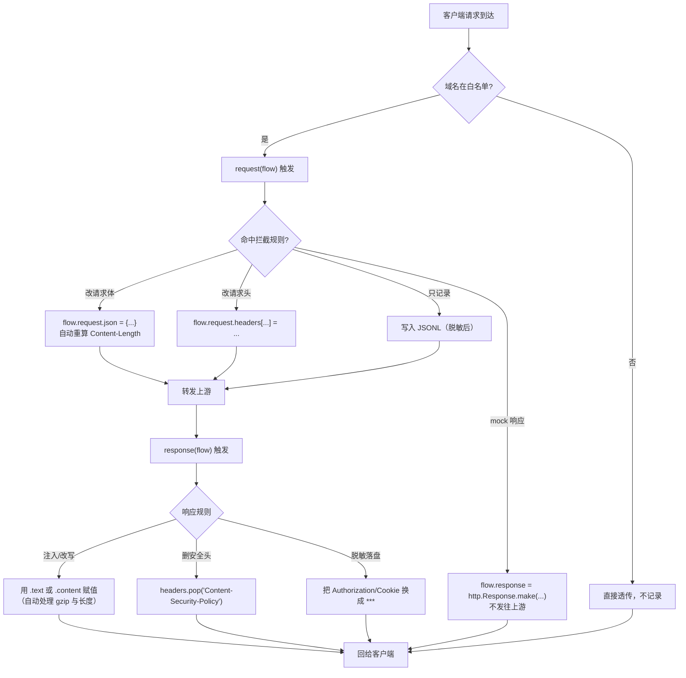

# Day 155 图解 — mitmproxy 中间人原理

> 全部为 Mermaid 代码块与 ASCII 字符画，不生成图片文件。

---

## 图 1：三种代理模式的流量路径（ASCII）

```
【1】正向代理 regular（客户端主动配置）
    浏览器/curl ──"请帮我转发"──► mitmproxy ──► 服务器
    客户端必须知道代理存在（设置 HTTP_PROXY）

【2】透明代理 transparent（iptables 重定向）
    手机 App ──► [路由器/网关 iptables REDIRECT] ──► mitmproxy ──► 服务器
    客户端完全不知道（前提：能控制网络路径 + 找回原始目标地址）

【3】反向代理 reverse（代理冒充服务器）
    客户端 ──► mitmproxy:8080 ──► http://127.0.0.1:3000（你的后端）
    客户端以为它就是服务器；用于调试自研后端 / 测试证书

【4】上游链 upstream（代理套代理）
    客户端 ──► mitmproxy A ──► mitmproxy B ──► 服务器
    用于：多层网络穿透、Burp 与 mitmproxy 联动
```

---

## 图 2：TLS 拆分的密钥与证书全景（ASCII）

```
                     ~/.mitmproxy/
                   ┌──────────────────────────┐
                   │ mitmproxy-ca.pem (私钥)   │  ⚠️ 拿到它=能伪造任何站点
                   │ mitmproxy-ca-cert.pem     │
                   └────────────┬─────────────┘
                                │ 签发
                                ▼
   客户端                     mitmproxy                    真服务器
      │                          │                            │
      │  ── TLS① 握手 ──────────►│                            │
      │                          │  用 CA 私钥签发            │
      │                          │  「example.com 证书」       │
      │◄── ServerHello + 假证书 ─│                            │
      │  ── TLS① 完成 ──────────►│                            │
      │    (K1 会话密钥)          │                            │
      │                          │  ── TLS② 握手 ────────────►│
      │                          │◄── 真证书 + ServerHello ───│
      │                          │  ── 验证（若开了校验）─────►│
      │                          │    (K2 会话密钥)            │
      │                          │                            │
      │── 明文 HTTP（K1 加密）──►│── 明文 HTTP（K2 加密）────►│
      │◄─ 明文 HTTP（K1 加密）───│◄─ 明文 HTTP（K2 加密）─────│

两个会话密钥 K1 ≠ K2，明文只在 mitmproxy 内存里出现。
```

---

## 图 3：Addon 决策流（Mermaid）



---

## 图 4：Content-Length 被改坏的经典事故（ASCII）

```
【错误做法】
  原响应:  Content-Length: 342          body = "Hello  world" (342B)
  脚本替换: body.replace("Hello", "Hello, dear")   → 348B
  但忘了改头 → 客户端只读 342 字节，多出 6 字节被当成"下一条响应"

  客户端视角:
  ┌───────────────────────────────┬──────────────┐
  │ 前 342 字节（body 被截断）      │ 残留 6 字节  │
  └───────────────────────────────┴──────────────┘
                                   ↓
                        协议错乱 / 页面白屏 / 卡住

【正确做法】
  flow.response.text = flow.response.text.replace("Hello", "Hello, dear")
  → mitmproxy 自动：
       ① 解开 Content-Encoding: gzip
       ② 按 charset 解码
       ③ 应用替换
       ④ 重新编码 + 重算 Content-Length（或改用 chunked）
```

---

## 图 5：事件循环被阻塞的后果（ASCII）

```
正常（每个回调都很快返回）：
  时间轴 ──►  req1  req2  req3  req4  req5 ...     吞吐 1000 req/s
              1ms   1ms   1ms   1ms   1ms

有人在 request() 里写了 time.sleep(10)：
  时间轴 ──►  req1[sleep 10s..............]req2 req3 ...
                              ↑
                    整个事件循环停在这里，
                    所有连接排队，客户端超时
              吞吐 0.1 req/s  ❌

正确姿势：
  · 纯计算/改写 → 直接同步做（微秒级，无所谓）
  · 网络 IO / 数据库 / 文件 → await（异步 API）
                             或 asyncio.to_thread(...)
                             或丢进 ThreadPoolExecutor
```

---

## 图 6：防御方视角 —— 为什么 pinning 能防住 MITM（ASCII）

```
【没有 pinning】
  App 判断：证书签发者 ∈ 系统信任的 CA 列表？
     → mitmproxy CA 已被用户装入系统 → 通过 → 流量被解密 ❌

【有 pinning】
  App 内置（或代码里写死）预期公钥指纹：
     sha256/AAAAAAAA...=  （真服务器证书公钥）
     或 只信任某个具体 CA（如 Let's Encrypt R3）

  App 判断：当前证书的公钥指纹 == 内置指纹？
     → mitmproxy 现场签的证书指纹不同 → 拒绝 → 抓包失败 ✅

【更强的方案】
  · Certificate Transparency 校验（检查 SCT）
  · 双向 TLS（mTLS）：服务器也验客户端证书
  · 客户端证书 + 请求签名（即便解密了也重放不了）
  · 加固：混淆/加壳、反调试、检测代理（检查系统代理设置）
```

> **结论（也是今天最该记住的一句）：**
> MITM 能成功，本质是"客户端选择信任了不该信的人"。
> 你抓得到自己的流量，是因为你在自己的设备上主动放弃了这项防护——
> 这也解释了为什么"抓得到"从来不是"服务器不安全"，而是"客户端信任配置被改了"。
