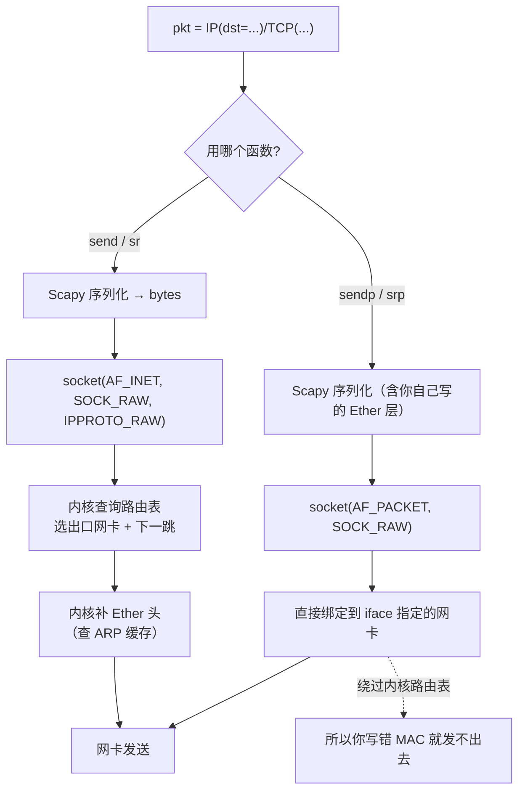

# Day 156 — Scapy 数据包构造：从 IP/TCP 到自定义网络探测工具

> 阶段：Phase 7 — 进阶与性能优化 · 主题：Scapy 数据包构造
>
> 前置知识：Day 116 TCP/UDP 协议、Day 115 socket 编程、Day 153 端口扫描进阶、
> Day 155 mitmproxy（应用层视角）。
> 前面几天我们站在**应用层**看流量（HTTP 请求、代理改包）。
> 今天往下走两层：**亲手构造 IP / TCP / UDP / ICMP 包并丢到网络上**。

---

## ⚠️ 使用前必读：法律边界

构造原始数据包（raw packet）意味着**绕过操作系统协议栈，自己决定每一个字段**。
这意味着你可以：

- 伪造源 IP（spoofing）→ 用于反射放大攻击、绕过基于 IP 的认证；
- 构造半开连接（SYN）→ 隐蔽端口扫描；
- 构造畸形包 → 探测协议栈实现缺陷。

**这些能力本身就是"攻击能力"**，所以法律风险比前几日更高：

| 法域 | 相关法条 |
|---|---|
| 中国大陆 | 《刑法》第 285、286 条；《网络安全法》第 27 条 |
| 美国 | CFAA 18 U.S.C. § 1030 |
| 英国 | Computer Misuse Act 1990, s.1 / s.3 |
| 欧盟 | 《网络犯罪公约》相关条款 |

**允许使用本日内容的场景（白名单）：**

1. **本机回环**（`127.0.0.1`）——最安全，什么都不会流出去；
2. **你自己的私网**（`192.168.x.x` / `10.x.x.x`），且设备都是你的；
3. 授权靶场 / 实验环境（含虚拟机、容器网络、netns）；
4. 你自己写的协议实现的**单元测试**。

**本日所有示例：**

- 目标 IP 必须落在**本机或私有网段**白名单内，否则拒绝执行；
- 默认 `--dry-run`（只构造不发送），要真发必须显式 `--send`；
- **不提供**任何伪造源 IP 的示例代码。

> 学会构造包最大的价值是**理解协议**：你从此能一眼看穿
> "为什么这个连接超时""为什么这个扫描能被检测到""为什么 MTU 会让包被丢"。

---

## 一、概念解释

### 1.1 Scapy 是什么，和 `socket` 有什么本质区别

| 维度 | `socket`（Day 115） | `scapy` |
|---|---|---|
| 抽象层次 | 传输层（TCP/UDP） | **链路层到应用层（L2~L7）都能自己拼** |
| 谁能填包头 | 内核 | **你** |
| 能改 TTL / 标志位 / 校验和吗 | ❌（要 setsockopt 且有限） | ✅ 任意字段 |
| 能收到"不是发给本机"的包吗 | ❌ | ✅（混杂模式） |
| 能构造 ICMP / ARP 吗 | ❌ | ✅ |
| 性能 | 快（内核态） | 慢（纯 Python） |
| 典型用途 | 业务网络编程 | 协议分析、安全测试、网络探测、教学 |

**一句话区别：**

```
socket  → "我要和某人通话"（内核负责把话打包、寄出）
scapy   → "我要亲手写一个信封，包括信封上的每一个字，然后自己投进邮筒"
```

**为什么需要 Scapy？** 因为在很多场景下，**内核不允许你做的事情，恰恰是理解
协议或做安全测试必须做的事情**：

- 内核不允许你发源 IP 不是本机的包（防伪造）；
- 内核不允许你发 TCP 标志位组合诡异的包（防畸形包）；
- 内核不关心 ARP 层的细节（自动处理了）；
- 内核不会把"不是发给你的包"交给你（除非混杂模式 + AF_PACKET）。

### 1.2 分层封装模型：理解 `/` 运算符

Scapy 的核心心智模型是**"用 `/` 把各层叠起来"**：

```python
pkt = Ether() / IP(dst="192.168.1.1") / TCP(dport=80) / b"GET / HTTP/1.0\r\n\r\n"
```

读作"**Ether 上面套 IP，IP 上面套 TCP，TCP 上面是这段载荷**"——
和网络教材里的封装图完全对应：

```
┌──────────────────────────────────────────────┐
│ 应用层数据  b"GET / HTTP/1.0\r\n\r\n"          │  ← 你提供的字节
├──────────────────────────────────────────────┤
│ TCP 头  sport=随机 dport=80 flags=S seq=...   │  ← Scapy 填
├──────────────────────────────────────────────┤
│ IP 头   src=本机 dst=192.168.1.1 ttl=64 proto=6│  ← Scapy 填
├──────────────────────────────────────────────┤
│ Ether    dst=MAC src=MAC type=0x0800          │  ← Scapy 填（或内核填）
└──────────────────────────────────────────────┘
```

**为什么用 `/` 这个运算符？** 因为 Python 的除法运算符**没有其它语义冲突**，
且视觉上就是"叠加"。Scapy 把 `/` 重载为 `__truediv__`，返回一个合并后的
`Packet` 对象。**注意：`/` 只能连接"层"，不能连接两个同层包**。

**如果你省略底层会怎样？**

- `send(IP(...)/TCP(...))`：Scapy 让**内核**帮忙补 Ether 层（走正常路由）；
- `sendp(Ether()/IP(...)/TCP(...))`：Scapy 在**链路层**直接发，
  绕过内核路由表（需要网卡名 `iface`）。

**这是 Scapy 新手最容易混淆的一组函数（`send` vs `sendp`）。**

### 1.3 发送与接收：`send*` / `sr*` 家族

| 函数 | 层次 | 发 | 收 | 一句话 |
|---|---|---|---|---|
| `send(pkt)` | L3 | ✅ | ❌ | 发 IP 包，不管回包 |
| `sendp(pkt)` | L2 | ✅ | ❌ | 发以太网帧，不管回包 |
| `sr(pkt)` | L3 | ✅ | ✅ | **发并收，返回 (answered, unanswered)** |
| `sr1(pkt)` | L3 | ✅ | ✅ | 发并收，只返回**第一个**回包 |
| `srp(pkt)` | L2 | ✅ | ✅ | 链路层版的 sr（常用于 ARP） |
| `srp1(pkt)` | L2 | ✅ | ✅ | 链路层只取第一个 |
| `srloop/sendpfast` | — | 循环 | — | 批量/高性能场景 |
| `sniff()` | — | ❌ | ✅ | 被动嗅探 |

**命名规律（记住它就不会用错）：**

```
send  / sr    → L3（IP 层，内核补 L2）
sendp / srp   → L2（链路层，自己给 L2）
带 1 后缀      → 只等第一个响应
带 loop 后缀   → 一直循环
带 flood 后缀  → 快速发送不等待
```

### 1.4 嗅探：`sniff()` 与 BPF 过滤

```python
from scapy.all import sniff

pkts = sniff(count=10, timeout=30, iface="eth0", filter="tcp port 80")
```

**为什么必须有 `filter`？** 因为不加过滤时，内核要把**每一个**包都
复制到用户态，Scapy 再用纯 Python 逐字段解析——在千兆网卡上瞬间吃满 CPU。
`filter` 使用 **BPF（Berkeley Packet Filter）** 语法，由**内核**先行过滤，
只把命中的包交给 Scapy。**这是性能生死线。**

**为什么需要 root / CAP_NET_RAW？** 因为创建 `AF_PACKET` 套接字、
把网卡切到混杂模式，都是特权操作。**这也是为什么容器里要加
`--cap-add=NET_RAW --cap-add=NET_ADMIN`。**

### 1.5 混杂模式（promiscuous）到底是什么意思

| 模式 | 网卡行为 |
|---|---|
| 普通模式 | 只把"目的 MAC 是我"的帧交给内核 |
| **混杂模式** | 把**经过网卡的所有帧**都交给内核（同网段的都能看到） |
| 监控模式（monitor） | WiFi 专用，收到所有 802.11 帧（含未关联的） |

**关键认知：**

- 交换机环境下，混杂模式**看不到别的端口**的流量（除非端口镜像/ARP 欺骗）；
- **Hub / WiFi / 虚拟机桥接**场景下，混杂模式能看到同网段的流量；
- 所以"嗅探"能拿到什么，取决于**你在网络拓扑里的位置**——
  这也是为什么面试常问"交换机如何防嗅探"（答案是：你防不了，只能防 ARP 欺骗）。

### 1.6 半开扫描（SYN scan）与 Scapy

用 `socket.connect()` 扫描会完成三次握手（留下日志、被应用层看到）；
用 Scapy 可以**只发 SYN**：

```
   扫描器                     目标
     │  SYN  ──────────────────►│
     │◄── SYN-ACK（端口开放）────│   ← 收到后立刻发 RST，不完成握手
     │  RST  ──────────────────►│
     │                          │
     │◄── RST,ACK（端口关闭）────│
     │                          │
     │  （无响应 = 被防火墙丢包） │
```

**为什么"半开"更隐蔽？** 因为在**应用层从未建立连接**，服务器的
Web/SSH 日志里不会出现这次连接。但**仍然会在网络层留下痕迹**——
IDS/防火墙能看到 SYN 而看不到后续握手（这正是 SYN 扫描的检测特征）。

**同时这也是 Scapy 的核心教学价值：** 你能亲手实现"内核不让你做的事"，
从而真正理解"为什么防火墙能看到扫描"。

### 1.7 Scapy 的定位：什么时候**不该**用它

| 场景 | 该用 Scapy 吗 | 原因 |
|---|---|---|
| 批量端口扫描生产环境 | ❌ | 太慢；用 nmap / masscan |
| 写 Web 爬虫 / API 客户端 | ❌ | 用 requests/httpx |
| 高吞吐流量采集 | ❌ | 用 dpdk / PF_RING / eBPF |
| 协议教学、报文构造 | ✅ | 无可替代 |
| 畸形包 / fuzz 测试 | ✅ | 能改任意字段 |
| ARP / ICMP / 自定义协议实验 | ✅ | 内核不给你做 |
| PCAP 解析与特征提取 | ⚠️ | 小文件可以，大文件用 dpkt/pyshark/scapy+PcapReader 流式 |

**一句话：Scapy 是"协议的显微镜"，不是"网络的流水线"。**

---
## 二、原理解释（底层机制与设计动机）

### 2.1 一次 `send()` 在内核里发生了什么

```
你的 Python 进程
   │  pkt = IP(dst="10.0.0.5")/ICMP()
   │  send(pkt)
   ▼
Scapy 序列化：把 Python 对象 → bytes（逐字段 pack，自动算校验和）
   ▼
socket(AF_INET, SOCK_RAW, IPPROTO_RAW)     ← 需要 CAP_NET_RAW
   │  sendto(bytes, (dst, 0))
   ▼
内核路由表查询 → 选出出口网卡与下一跳
   ▼
内核补上 Ether 头（源/目的 MAC 由 ARP 缓存决定）
   ▼
网卡驱动 → DMA → 物理发送
```

**关键点：**

1. `send()` 走的是 `AF_INET + SOCK_RAW`，**内核仍参与**（补 L2、查路由）；
2. `sendp()` 走的是 `AF_PACKET + SOCK_RAW`，**直接指定网卡**，
   连 Ether 头都由你决定——所以它需要 `iface` 参数；
3. 用 `SOCK_RAW` 时，有些平台（Linux）**内核会自动补 IP 校验和**，
   有些平台不会；Scapy 默认自己算，可用 `IP(len=...)` 之类手动覆盖。

**为什么必须 root？** 因为 `SOCK_RAW` / `AF_PACKET` 允许你构造任意报文，
是典型的"可绕过内核安全策略"的能力。Linux 用 capability 收窄权限：
`CAP_NET_RAW`（发原始包）、`CAP_NET_ADMIN`（改网卡配置）。

### 2.2 Scapy 的对象模型：`Packet` + `Field`

Scapy 每个协议层都是一个 Python 类，字段用**类属性 + 描述符**声明：

```python
class IP(Packet):
    name = "IP"
    fields_desc = [
        BitField("version", 4, 4),        # 4 位
        BitField("ihl", None, 4),         # 4 位，None = 自动计算
        ByteField("tos", 0),              # 8 位
        ShortField("len", None),          # 16 位，None = 自动计算
        ShortField("id", 1),
        FlagsField("flags", 0, 3, ["MF", "DF", "evil"]),
        BitField("frag", 0, 13),
        ByteField("ttl", 64),
        ByteEnumField("proto", 0, {1: "icmp", 6: "tcp", 17: "udp"}),
        XShortField("chksum", None),      # None = 自动计算
        IPField("src", "127.0.0.1"),
        IPField("dst", "127.0.0.1"),
    ]
```

**设计动机（这是 Scapy 最巧妙的地方）：**

- **`None` 表示"等我算"**：`len`、`chksum`、`ihl` 这些"派生字段"，
  在序列化时根据实际内容自动计算；
- **字段级联（overloading）**：`IP(dst="1.2.3.4", ttl=1)` 或
  `IP()/TCP()` 都能工作，因为 `Packet.__init__` 用**位置/关键字参数**
  匹配 `fields_desc`；
- **可变字段（`fuzz` / `RandShort()`）**：把字段设成随机生成器对象，
  每次序列化都取新值——这是 fuzz 测试的基础。

**`/` 运算符的实现：**

```python
def __truediv__(self, other):
    # 把 other 挂到 self 的 payload 上（或合并到最后一层）
    ...
```

所以 `IP()/TCP()` 得到的是"一个 IP 包，payload 是 TCP 对象"，
序列化时**自底向上**逐层 pack。

### 2.3 校验和（checksum）是怎么算出来的

IPv4 头校验和是**16 位反码求和**：

```
1. 把头部按 16 位分组
2. 全部相加（进位回卷）
3. 取反码
```

Scapy 的 `IP.chksum` 字段为 `None` 时，在 `post_build` 阶段调用
`checksum(pkt)` 计算并回填。TCP/UDP 校验和更麻烦——它需要一个
**伪首部（pseudo-header）**：

```
伪首部（仅用于计算，不真正发送）:
  ┌────────────┬────────────┬──────────┬─────────┐
  │ 源 IP (32) │ 目的 IP(32)│ 0 │proto │ TCP 长度 │
  └────────────┴────────────┴──────────┴─────────┘
                              ↑ 这里隐藏了一个经典陷阱：
                                伪首部里的 proto 字段是 8 位，但为了
                                16 位对齐，前面补 0，所以其实占了 16 位
```

**为什么 TCP 校验和要包含伪首部？** 为了**防止报文被错误投递**：
如果路由器把包投到了错误的 IP，接收方算校验和会不一致（因为源/目的 IP
参与了计算），从而丢弃。这是"端到端校验"思想的一个体现。

**常见错误**：手动改 TCP 载荷后忘了重算校验和 → 抓包看是"TCP checksum
incorrect"，服务端静默丢弃。**Scapy 的规则：用 `pkt[TCP].payload = b"..."`，
不要绕过对象直接改 `bytes`。**

### 2.4 为什么 Scapy 慢

| 环节 | 代价 |
|---|---|
| Python 对象 → bytes 序列化 | 每个字段一次 Python 函数调用 |
| bytes → Python 对象 反序列化 | 逐层猜测下一层类型（`guess_payload_class`） |
| 内省（introspection） | `fields_desc` 描述符查找 |
| 无零拷贝 | 每层都做一次内存复制 |
| 单线程 | 默认没有并行发送 |

**量级参考：**

- Scapy 构造 1 万个包：约几秒；
- 用 `sendpfast`（底层调 tcpreplay）或 `AsyncSniffer` 会快不少；
- nmap 用 C 写的扫描一个 C 段只要几秒，Scapy 同样任务要几分钟。

**结论：** 教学/实验/低频探测用 Scapy，**量大用专用工具**。

### 2.5 `sniff()` 的内核路径与丢包

```
网卡收到帧
   ▼
内核 netif_receive_skb
   ├─→ 协议栈（正常的 TCP/IP 处理）
   └─→ AF_PACKET 套接字（Scapy 的 socket）
          │  ① BPF 过滤（如果设置了 filter）
          │  ② 放入环形缓冲区（默认 208KB！）
          │  ③ 用户态 recvfrom()
          ▼
       Scapy 逐层解析 → Packet 对象
```

**丢包的三个原因：**

1. **环形缓冲区太小**：默认 `net.core.rmem_default` / `rmem_max` 约 200KB，
   突发流量下瞬间写满 → 内核直接丢；
2. **用户态处理太慢**：Scapy 解析速度跟不上包速率；
3. **没有 BPF 过滤**：全部包都往用户态搬。

**解决：**

```bash
# 放大缓冲区（需要 root）
sysctl -w net.core.rmem_max=26214400
sysctl -w net.core.rmem_default=26214400
```

```python
# Scapy 侧：用 PcapReader / AsyncSniffer + 只处理必要字段
from scapy.all import AsyncSniffer
sniffer = AsyncSniffer(iface="eth0", filter="tcp", prn=handler, store=False)
sniffer.start()
```

**为什么 `store=False` 很重要？** 默认 `sniff()` 会把**所有**包存在
一个 list 里返回——长时间嗅探时内存会无限增长直到 OOM。
**`store=False` 是长时间嗅探的必备参数。**

### 2.6 TTL 与 traceroute 原理

traceroute 的原理极其优雅：

```
TTL=1 的包 → 第一跳路由器收到，TTL 减到 0 → 回 ICMP Time Exceeded
TTL=2 的包 → 第二跳路由器 → 回 ICMP Time Exceeded
...
TTL=N 的包 → 到达目标 → 回 ICMP Echo Reply（或目标端口的响应）
```

**逐跳递增 TTL，收集每一跳的源 IP，就得到了路径。**
Scapy 自带 `traceroute()`，也可以手写（本日示例 03 会用 Scapy 复现）：

```python
ans, unans = sr(IP(dst=target, ttl=(1, 10)) / ICMP(), timeout=1)
```

**为什么会有 `*`（超时）？** 三种情况：
① 该跳路由器配置了"不发送 ICMP 超时"（隐蔽路由）；
② 丢包；
③ 链路太长/超时太短。

### 2.7 ARP 与局域网发现

ARP 是"IP → MAC"的解析协议，工作在**链路层**（无 IP 头）：

```
"谁是 192.168.1.1？请告诉 192.168.1.100"
  → 广播帧（目的 MAC = ff:ff:ff:ff:ff:ff）
  ← 单播应答："192.168.1.1 是 aa:bb:cc:dd:ee:ff"
```

**用 Scapy 做局域网存活发现（本日示例 03 的第二个功能）：**

```python
ans, unans = srp(Ether(dst="ff:ff:ff:ff:ff:ff") /
                 ARP(pdst="192.168.1.0/24"), timeout=2)
for snd, rcv in ans:
    print(rcv.psrc, rcv.hwsrc)      # IP + MAC
```

**为什么比 ping 扫描快且准？**

- ARP 走链路层，**不受主机防火墙"禁 ICMP"影响**（很多主机不回 ping 但必须回 ARP）；
- 交换机必须转发 ARP 广播，响应是单播，速度快。

**安全警示：** ARP 没有认证，所以可以**伪造 ARP 应答**（ARP 欺骗），
这也是抓包/中间人的经典手段。**本日不提供任何 ARP 欺骗示例**——
只做"查询"，不做"应答"。

---
## 三、定义与使用方法（API 速查表）

### 3.1 安装与权限

```bash
pip install scapy
# Linux 还需要（可选但推荐）：libpcap 用于 BPF 过滤
sudo apt install libpcap-dev

# 权限：原始套接字需要 root 或 capability
sudo python3 script.py

# 或者（更安全，只给必要能力）
sudo setcap cap_net_raw,cap_net_admin+eip $(readlink -f $(which python3))

# Docker 里
# docker run --cap-add=NET_RAW --cap-add=NET_ADMIN ...
```

```python
# 检查是否有权限（不抛异常的写法）
from scapy.all import conf
try:
    conf.L3socket()
    print("✅ 有原始套接字权限")
except Exception as e:
    print("❌ 权限不足，需要 root 或 CAP_NET_RAW：", e)
```

### 3.2 常用协议层与关键字段

```python
from scapy.all import *

# ─── 链路层 ───
Ether(dst="ff:ff:ff:ff:ff:ff", src=None, type=0x0800)
ARP(op=1, pdst="192.168.1.1", hwdst="00:00:00:00:00:00")
       # op: 1=who-has(请求) 2=is-at(应答)

# ─── 网络层 ───
IP(src="127.0.0.1", dst="127.0.0.1",
   ttl=64, tos=0, id=1,
   flags="DF", frag=0, proto=6)
IPv6(dst="::1")
ICMP(type=8, code=0)      # 8=Echo Request, 0=Echo Reply
                         # 3=Dest Unreachable, 11=Time Exceeded
ICMPv6ND_NS(tgt="...")    # IPv6 邻居发现

# ─── 传输层 ───
TCP(sport=12345, dport=80,
    flags="S",            # S=SYN A=ACK F=FIN R=RST P=PSH U=URG（可组合 "SA"）
    seq=1000, ack=0,
    window=8192,
    options=[("MSS",1460), ("SAckOK", b""), ("WScale", 7)])
UDP(sport=12345, dport=53)

# ─── 应用层 ───
DNS(rd=1, qd=DNSQR(qname="example.com", qtype="A"))
Raw(load=b"hello")        # 任意字节载荷
```

**常用 TCP 标志位组合：**

| flags | 含义 | 用途 |
|---|---|---|
| `S` | SYN | 发起连接（半开扫描） |
| `SA` | SYN+ACK | 接受连接 |
| `A` | ACK | 确认 |
| `F` | FIN | 关闭 |
| `R` | RST | 重置 |
| `PA` | PSH+ACK | 带数据的报文 |
| `FPU` | FIN+PSH+URG | 经典的"圣诞树包"（畸形包测试） |
| `""` | 无标志 | null scan（部分系统不响应） |

### 3.3 发送 / 接收函数速查

```python
# ── 只发不收 ──
send(IP(dst="127.0.0.1")/ICMP(), verbose=0)             # L3
sendp(Ether()/IP(dst="127.0.0.1")/ICMP(), iface="lo")   # L2
send(..., loop=1, inter=0.5)                            # 循环发
sendp(..., count=10, inter=0.1)
send(..., return_packets=True)                          # 返回发出的包

# ── 发并收 ──
ans, unans = sr(IP(dst="127.0.0.1")/ICMP(), timeout=2)
r = sr1(IP(dst="127.0.0.1")/TCP(dport=80, flags="S"), timeout=2)
ans, unans = srp(Ether(dst="ff:ff:ff:ff:ff:ff")/ARP(pdst="192.168.1.0/24"),
                 timeout=2, verbose=0)

# ── 参数对照 ──
timeout=2         # 每个响应等待秒数
inter=0.1         # 发送间隔（秒），限速用
retry=2           # 未响应重试次数
verbose=0         # 静默（脚本里必加！）
multi=False       # True = 一个包可对应多个响应
filter="icmp"     # BPF 过滤（只收匹配的）
iface="eth0"      # 指定网卡
nofilter=True     # 关闭内核 BPF（性能差，仅调试用）

# ── 结果对象 ──
for snd, rcv in ans:
    print(rcv.summary())     # 一行摘要
    print(rcv.show())        # 完整字段树
    print(bytes(rcv))        # 原始字节
```

### 3.4 嗅探速查

```python
from scapy.all import sniff, AsyncSniffer

# ── 同步（阻塞）──
pkts = sniff(count=5, timeout=10, iface="lo", filter="icmp",
             prn=lambda p: print(p.summary()),   # 每包回调
             store=False)                        # 不存内存！长期嗅探必备

# ── 异步（推荐）──
sniffer = AsyncSniffer(iface="lo", filter="tcp port 8080",
                       prn=handler, store=False)
sniffer.start()
time.sleep(30)
sniffer.stop()
# 或 sniffer.join()

# ── 保存 / 读取 ──
wrpcap("out.pcap", pkts)          # 写
pkts = rdpcap("out.pcap")        # 一次读入（小心大文件）
with PcapReader("big.pcap") as pr:   # 流式读（大文件必用）
    for p in pr:
        process(p)
```

**BPF filter 速查（和 tcpdump 相同）：**

```
icmp                         ICMP 全部
tcp port 80                  TCP 且源或目的端口 80
tcp[tcpflags] & tcp-syn != 0 只看 SYN
udp and dst port 53          去往 53 的 UDP
host 192.168.1.5             指定主机
net 192.168.1.0/24           网段
vlan 100                     指定 VLAN
not port 22                  排除 SSH（别把自己锁在外面）
```

### 3.5 显示与检查速查

```python
p = IP(dst="127.0.0.1")/ICMP()/b"hello"

p.summary()            # 'IP / ICMP / Raw'
p.show()               # 树状字段（含校验和）
p.show2()              # 序列化后重新解析再显示（校验和已回填）★
hexdump(p)             # 十六进制 dump
bytes(p)               # 序列化
len(p)                 # 总长度

p[IP].ttl              # 按层名索引
p[IP].ttl = 32         # 改字段
p.haslayer(TCP)        # 是否含 TCP
p.getlayer(ICMP).type
p[Raw].load            # 载荷
p.payload              # 下一层对象

# 分层迭代
for layer in p:
    print(layer.name)

# 复制与修改
q = p.copy()
q[IP].ttl = 1
```

### 3.6 IP 段 / 端口段写法（Scapy 的特色）

```python
IP(dst="192.168.1.1-10")         # 连续 10 个 IP
IP(dst="192.168.1.0/24")         # 整个 C 段
IP(dst=["1.1.1.1", "8.8.8.8"])   # 列表
TCP(dport=[80, 443, 8080])       # 多端口
TCP(dport=(1, 1024))             # 端口范围
IP(ttl=(1, 5))                   # ttl 从 1 到 5 → 用于 traceroute
```

**注意：** 这种"多值字段"在 `send()` 时会**展开成多个包**，
`sr()` 时要注意 `ans` 数量与匹配关系。

### 3.7 常用内置工具函数

```python
arping("192.168.1.1")                      # ARP 探测
ping("192.168.1.1")                        # ICMP ping
traceroute("8.8.8.8", dport=80)            # 路由追踪
fragment(pkt, fragsize=1480)               # 分片（理解 MTU 用）
defrag([p1, p2])                           # 重组
sniff(...)                                 # 嗅探
wrpcap / rdpcap / PcapReader               # PCAP
Route / conf.route                         # 路由表
```

### 3.8 常见异常与排错速查

| 现象 | 原因 | 解决 |
|---|---|---|
| `PermissionError: [Errno 1] Operation not permitted` | 没有 CAP_NET_RAW | `sudo` 或 setcap |
| `WARNING: No route found for IPv6` | 无关紧要，可忽略 | 设置 `conf.ipv6_enabled=False` |
| 发出去收不到响应 | 目标不回 / 被过滤 / TTL 太小 | 换回环测试；`show2()` 看校验和 |
| `sniff()` 收不到包 | 网卡选错 / 没权限 / filter 写错 | `conf.ifaces` 查网卡名；先不加 filter |
| 抓包看到 `checksum incorrect` | 手动改了载荷没重算 | 用 `payload=` 赋值而非改 bytes |
| IP 分片导致解析异常 | MTU 太小 / 大包 | `fragment()` 或减小载荷 |
| 长时间嗅探后内存暴涨 | `store=True`（默认） | `store=False` |
| 吞吐上不去 | Scapy 纯 Python 解析 | 用 BPF 过滤 + `store=False` + 少解析字段 |

---
## 四、图解

> 完整图解（6 张）见 [`diagrams/README.md`](diagrams/README.md)。核心三张如下。

### 4.1 `send` vs `sendp` 的内核路径（Mermaid）



### 4.2 半开扫描（SYN scan）状态机（ASCII）

```
              端口开放                    端口关闭              被防火墙过滤
  扫描器        目标        扫描器         目标       扫描器       目标
    │            │            │             │           │           │
    │── SYN ────►│            │── SYN ─────►│           │── SYN ───►│
    │            │            │             │           │           X  (丢弃)
    │◄─ SYN-ACK ─│            │◄─ RST,ACK ──│           │           │
    │── RST ────►│            │   (结束)     │           │   超时     │
    │  (结束)     │            │             │           │           │

  判定逻辑：
    SYN-ACK  →  open      （然后必须发 RST 让对方别再等，这也是扫描痕迹）
    RST,ACK  →  closed
    无响应    →  filtered  （或超时，需区分 timeout 与 unreachable）

⚠️ 三个"看不到的东西"：
   1. 应用层没有任何日志（连接从未建立）
   2. 但网络层/IDS 能看到"SYN 之后没有握手"→ 这是 SYN 扫描的检测特征
   3. 发大量 SYN 不完成握手 = SYN Flood 的特征，会被限速/拉黑
```

### 4.3 Scapy 序列化流水线（ASCII）

```
  Python 对象                       序列化（build）                字节流
┌────────────────┐    fields_desc  ┌──────────────────┐    ┌──────────────┐
│ Ether          │ ─────────────►  │ 逐字段 pack      │ →  │ 14 字节       │
│  └ IP          │                 │ 自动算:          │    │ ┌──────────┐ │
│     └ TCP      │                 │  · ihl/len       │    │ │ 20 字节  │ │
│        └ Raw   │                 │  · chksum        │    │ │ 20 字节  │ │
└────────────────┘                 │  · 校验和回填     │    │ │ 载荷     │ │
                                   └──────────────────┘    │ └──────────┘ │
                                                            └──────────────┘

反向（dissect / 解析）：
  字节流 → 按 hints 猜测下一层 → 递归构造 Packet 对象
           ↑ 这里是最慢的一步（guess_payload_class）

所以：p.show() 显示的是"对象"；p.show2() 会先 build 再 dissect，
      因此能看到"自动算出来的校验和"。
```

---


## 五、攻击方式·手段·原理 与 检测原理

> 本日所有演示都限定在**回环 / 自己私网 / 临时目录**里。下面每条都写清三件事：
> **攻击者怎么做 → 为什么这样能成 → 防守方靠什么特征发现它**。
> 理解"检测特征"才是学会用 Scapy 的真正目的：你造得出包，就看得懂流量。

### 5.1 SYN 半开扫描（Port Scan）

**手段与原理**：用 `socket.connect()` 扫描会完成三次握手，目标的应用层日志里
会留下访问记录。改为"只发 SYN、收到 SYN-ACK 后立刻 RST"：

```
   扫描器                     目标                      IDS/防火墙
     │  SYN  ─────────────────►│                        │
     │◄── SYN-ACK（端口开放）───│                        │ 记录：SYN 之后没有任何握手完成
     │  RST  ─────────────────►│（连接从未建立，无应用日志）│
     │                         │                        │
     │  SYN  ─────────────────►│                        │
     │◄── RST,ACK（端口关闭）───│                        │
     │                         │                        │
     │  SYN  ─────────────────►│   （被规则丢弃）         │ 同源大量无后续 SYN ⇒ 速率告警
     │     超时 ⇒ filtered      │                        │
```

**为什么"半开"更隐蔽**：应用层从来没有连接，所以 Web/SSH 日志是干净的。
**为什么仍然会被发现**：网络层的模式很显眼 ——
`横向（很多不同端口）× 未完成握手`。

**本日代码的做法**（`03-network-probe.py` 的 `ports` 子命令）：

| 收到的响应 | 判定 | 依据 |
|---|---|---|
| `SYN,ACK` | `open` | 端口在监听 |
| `RST,ACK` 或 `RST` | `closed` | 没有人监听 |
| 无响应（超时） | `filtered` | 被防火墙/ACL 丢弃 |
| ICMP type=3 | `icmp-unreachable` | 网络层不可达 |

判定逻辑被抽成纯函数 `classify_syn_result()`，因此**不需要网卡就能验证**（见自检）。

### 5.2 ICMP 探测（ping）与"为什么有些主机 ping 不通但服务是活的"

**手段与原理**：ICMP Echo Request（type=8）→ 主机回 Echo Reply（type=0）。
这是最轻量的存活探测：一个包就能判断"主机是否在线"。

```
   探测方              目标
     │ ICMP type=8 ────►│
     │◄─ ICMP type=0 ────│  存活
     │      （无响应）     │  不在线 / 被防火墙挡了 ICMP / 只在特定接口回应
```

**关键认知（面试常问）**：**"ping 不通" ≠ "主机不在线"**。
很多主机（尤其是云主机和加固后的服务器）**故意不回 ICMP**，
但 22/80/443 照样开着。所以：

| 探测方式 | 看到的是 | 禁 ICMP 时 |
|---|---|---|
| ICMP ping | 网络层是否回应 | ❌ 误判为离线 |
| TCP SYN 到具体端口 | 服务是否在听 | ✅ 仍然准确 |
| ARP 请求（同网段） | 链路层是否回应 | ✅ 仍然准确 |

### 5.3 Traceroute 探测（TTL 逐跳）

**手段与原理**：利用 TTL 每经一跳减 1、减到 0 就回 `ICMP Time Exceeded`
（type=11）的规则，**逐跳递增 TTL** 就能画出路径：

```
TTL=1 ──► 路由器1：TTL→0 → 回 ICMP type=11（记录第 1 跳）
TTL=2 ──► 路由器1 转发 → 路由器2：TTL→0 → 回 type=11（记录第 2 跳）
…
TTL=N ──► 到达目标 → 回 Echo Reply（type=0）或 TCP RST ⇒ 结束
```

**为什么会出现 `*`**：① 该跳设备配置了"不发送 ICMP"；② 丢包；③ 超时设太短；
④ 运营商对 ICMP 限速。**所以 `*` 不代表故障**，只代表"这一跳没告诉我们"。

**本日代码**：`trace` 子命令手写这套逻辑（不用 scapy 自带的 `traceroute()`），
每一跳打印 IP + RTT + 响应类型，命中 type=0 就停。

### 5.4 ARP 存活发现（局域网）

**手段与原理**：ARP 是"IP → MAC"的解析协议，**没有 IP 头**，直接挂在
EtherType=0x0806 上。发一个广播请求，谁认为"这个 IP 是我"就单播回应。

```
探测方(192.168.1.100)                目标(192.168.1.1)
   │ Ether(dst=ff:ff:ff:ff:ff:ff)        │
   │ ARP(op=1, pdst=192.168.1.1)         │
   │ ────────── 广播 ──────────────────► │
   │◄──────── 单播应答 ──────────────────│
   │   ARP(op=2, sender_ip=192.168.1.1, sender_mac=aa:bb:…)   │
```

**为什么比 ping 扫描更快更准**：

| 方式 | 依赖 | 主机禁 ICMP 时 | 说明 |
|---|---|---|---|
| ICMP ping | 网络层 | ❌ 误判离线 | 需要路由 |
| **ARP 请求** | **链路层** | ✅ 仍能发现 | **必须回 ARP**（否则自己上不了网） |

**安全含义（本日不做，但必须知道）**：ARP 没有认证 → 谁都能发"我是网关"
（ARP 欺骗）→ 这就是局域网抓包/中间人的基础。
**防御**：DHCP Snooping + 动态 ARP 检测（DAI）+ 静态绑定 + 端口安全。
**检测特征**：**同一个 IP 被两个不同 MAC 宣告**（Day157 的检测器就抓这个）。

### 5.5 畸形包与 fuzz（Christmas Tree / NULL 扫描）

**手段与原理**：内核不允许你发"标志位组合诡异"的 TCP 包，
但 Scapy 可以任意拼字段：

| 标志组合 | 名称 | 原理与用途 |
|---|---|---|
| `FPU` | Christmas Tree | 所有标志一起置位；探测老式协议栈的异常处理 |
| `""` | NULL scan | 一个标志都不置；某些系统（RFC 793 规定应丢弃）不响应 |
| `SF` | SYN+FIN 同时置位 | 逻辑上矛盾；用来测协议栈实现健壮性 |

**检测特征**：这类包在**正常流量里根本不存在**，
所以 IDS 写一条"TCP 标志位组合异常"的规则就能命中（误报极低）。

### 5.6 分片与 MTU 绕过

**手段与原理**：有些 IDS 不重组分片，只看"第一个分片"。
攻击者把攻击载荷切成小片、**让第一个分片里只有一半的握手/请求头**，
就能让路由器放行、让 IDS 看不到真实载荷（分片逃避）。
反向地，MTU 不匹配会导致大包被丢弃（"能 ping 通小包，就是传不了文件"）。

**本日代码**（`04-checksum-and-pcap-lab.py` 实验 5）：用 scapy 的 `fragment()`
切出 3 个分片，**验证每个分片的 IP 校验和都正确**（因为分片重写了 IP 头！），
再自己按 `frag_offset`（**单位 8 字节**）重组回原包。你会亲眼看到：

- 分片大小必须是 8 的倍数（因为偏移字段以 8 字节为单位）；
- 非末片 `MF=1`、末片 `MF=0`；
- 重组时**必须**检查偏移连续 + 末片 MF=0，否则拼出来的是残缺数据（比报错更危险）。

### 5.7 检测原理总结：行为特征 > 单包特征

| 攻击行为 | 单包特征 | **行为特征（真正能用的判据）** |
|---|---|---|
| 端口扫描 | 一个 SYN（正常） | 同源 → 多端口 + 握手从未完成 |
| SYN 洪水 | 一个 SYN（正常） | 同源同端口短时间内大量纯 SYN，间隔匀速 |
| ARP 欺骗 | 一个 ARP 应答（正常） | 同一 IP 被两个 MAC 宣告 |
| TTL 探测 | 一个 ICMP 超时（正常） | 同一源对同一目标**递增 TTL** 连发 |
| 畸形包扫描 | 一个 SYN+FIN（异常） | 标志位组合在正常流量中不存在 → 极低误报 |

**ID 运维视角：怎么区分"Scapy 写的扫描器"和 nmap？**

| 维度 | nmap | 手写 Scapy |
|---|---|---|
| 默认源端口 | 高随机、有规律 | 常写死（如本日演示的 40000/50000） |
| TCP 选项 | 精心伪造（模仿各 OS 指纹） | 常常**不带选项**或只有 MSS |
| 时间间隔 | 自适应（有 `--max-rate`、退避） | 常常是固定 `inter=` |
| 窗口大小 | 按指纹库设置 | 常是 scapy 默认 8192 或随意值 |
| 标志组合 | 规范 | 容易出现奇怪组合（`FPU`/`""`） |

结论：**指纹是有用的，但不可靠**（nmap 也能伪装）。真正稳定的是
**行为基线**："这个源平时只访问 1 个端口，今天扫了 8 个"。

---

## 六、防护/修复原理

### 6.1 服务端：减少暴露面 + 抗资源耗尽

| 目标 | 措施 | 原理 |
|---|---|---|
| 少开端口 | 只监听必要服务；管理口不对外 | 扫描能发现的东西越少越好 |
| 抗 SYN 洪水 | `net.ipv4.tcp_syncookies=1` | 半连接队列满时用加密 cookie 代替分配 TCB，不消耗内存 |
| 队列调优 | 合理设置 `tcp_max_syn_backlog`、`somaxconn` | 队列太小，正常突发也会连不上 |
| 限速 | 防火墙/IPS 对同源 SYN 限速 | 让扫描和洪水变得"成本很高" |
| 记录 | 服务端日志 + 网络流日志（NetFlow） | 事后溯源需要**两侧**证据 |

### 6.2 网络侧：让探测拿不到有效信息

- **关闭不必要的 ICMP**（但要想清楚：关掉会丧失排障能力）；
- **黑洞路由 / IPS**：对反复扫描的源直接丢弃；
- **端口敲门（port knocking）/ 跳板**：管理口默认不可见；
- **VLAN 分段**：把 ARP 欺骗的影响限制在一个广播域内；
- **出口过滤（egress filtering）**：**防源 IP 伪造**最关键的一条 ——
  运营商/边界设备丢弃"源地址不属于本网段"的包，
  这样 SYN 洪水就不能伪造源 IP 了（这也是本日代码**不提供**伪造示例的原因）。

### 6.3 主机侧：不做"内网可信"的假设

- 主机防火墙（Windows Defender Firewall / nftables）：默认拒绝入站；
- **只监听必要的接口**（`0.0.0.0` vs `127.0.0.1` 差很多）；
- 服务加固：不用默认端口不等于安全，但能挡掉大量自动化扫描；
- **不要为了"方便排障"长期开着 tcpdump 抓全流量**（凭据泄露风险）。

### 6.4 检测侧：把攻击特征变成监控指标

这是安全工程师真正该做的事：**把攻击者的行为特征写成可观测的指标**。

| 指标 | 数据来源 | 含义 |
|---|---|---|
| SYN 与 SYN-ACK 数量比 | 抓包/流日志 | 比值明显 >1 ⇒ 有只发起不完成的连接 |
| 单源目的端口数（单位时间） | 流日志 | 横向扩散 ⇒ 扫描 |
| 单源 SYN 速率（pps） | 抓包/防火墙 | 突增 ⇒ 洪水 |
| ARP 中"IP→MAC"映射变化 | `arpwatch` / 交换机 | 同 IP 换 MAC ⇒ 欺骗或热备切换 |
| TCP 标志位组合异常计数 | IDS | 畸形包探测 |

**误报控制是检测工程的第一优先级**：
一条误报率高的规则会被运维直接关掉，等于没有。
本日所有离线自检都遵循同一条纪律 —— **先证明"正常流量不会被误报"**。

### 6.5 合规边界（本日代码已内建）

| 护栏 | 实现位置 |
|---|---|
| 目标必须是回环/私网/链路本地 | `check_target()` / `check_targets()` |
| 默认 dry-run，必须显式 `--send` 才发包 | `01-scapy-basics.py` |
| 嗅探默认只允许 `lo`，物理网卡要显式确认 | `iface_allowed()` + `--allow-physical` |
| 不提供源 IP 伪造 | 代码里没有 `IP(src=...)` 的用户可控入口，自检还断言源地址必须在白名单内 |
| 抓包的输出默认落在临时目录 | `tempfile.mkdtemp()`（不污染工作树、不误提交） |

---

## 七、代码案例逐节说明

| 文件 | 行数 | 内容 | 自检是否需 root/网卡 |
|---|---|---|---|
| `code/01-scapy-basics.py` | 429 | 分层构造、字段读写、`send`/`sendp`/`sr1`、dry-run 护栏 | 否 |
| `code/02-sniff-pitfalls.py` | 449 | 嗅探 8 大坑 + 可离线验证的规则 | 否 |
| `code/03-network-probe.py` | 496 | 实战工具：ICMP ping / 手写 traceroute / ARP 发现 / SYN 扫描 | 否 |
| `code/04-checksum-and-pcap-lab.py` | 591 | **新增**：校验和从零实现 + pcap 格式 + 分片重组实验室 | 否 |

### 7.1 `01-scapy-basics.py` —— 分层构造基础

| 节 | 函数 | 讲什么 |
|---|---|---|
| 护栏 | `check_target(dst)` | 只放行回环/私网/链路本地；公网与组播一律拒绝，并给出**原因文本** |
| 构造 | `build_examples(dst)` | 7 个演示包：ICMP / TCP SYN / TCP+HTTP / UDP+DNS / Ether+ICMP / 多端口 / 随机字段 |
| 结构 | `demo_structure()` | `summary()`、`layers()`、`haslayer()`、字段读写、载荷访问 |
| 校验和 | `demo_show2()` | `show()` vs `show2()`：为什么对象上的 `chksum` 是 `None` |
| 序列化 | `demo_bytes()` | `bytes(pkt)` 后重新 `IP(...)` 解析，才能看到自动算出的 `len`/`chksum` |
| 展开 | `demo_expand()` | 多值字段（`dport=[80,443,8080]`）在发送时才展开 |
| 发送 | `do_send(dst)` | `send` / `sr1` / `sr` / `sendp` 的真实调用（需 root，默认不执行） |
| 自检 | `self_test()` | ① 护栏 ② 分层顺序 ③ 校验和逐字节 ④ **纯标准库反码和复核** ⑤ **pcap 往返（自己写→scapy 读）** |

**自检里最值得看的两条**：

```python
# ① 校验和不是"魔法"：自己实现 16 位反码和，验证 scapy 的字节
check_eq(_ones_complement_sum(hdr), 0xFFFF, "含校验和的 IP 头反码和应为 0xFFFF")
check_eq(hdr[10:12].hex(), "66cd", "IPv4 头校验和字节（scapy 计算值）")

# ② pcap 格式自己写、让 scapy 读（linktype=101 = DLT_RAW 裸 IP）
#    这一步证明"我们真的理解 pcap 字节结构"，而不是只会调库
_write_pcap(pcap_path, frames, linktype=101)
back = rdpcap(pcap_path)
```

### 7.2 `02-sniff-pitfalls.py` —— 嗅探 8 大坑

| 坑 | 现象 | 本日如何**离线**验证 |
|---|---|---|
| 1 `store=True` | 长时间嗅探内存线性增长 → OOM | `simulate_sniff(1000, store=True/False)` 断言保留对象数 1000 vs 0，并用 `tracemalloc` 比内存峰值 |
| 2 不设 `filter` | 内核把每个包都搬到用户态 → CPU 打满 | `validate_bpf()` 拦截空/括号不配对/引号不配对/超长表达式 |
| 3 网卡名猜错 | 一个包都收不到 | `iface_allowed()` 白名单：默认只 `lo`，物理网卡需显式确认 |
| 4 以为混杂模式万能 | 交换机环境下看不到别的端口 | `visibility_note(topology)`：交换机→看不到（除非镜像）、Hub→看得到、WiFi→monitor |
| 5 `prn` 里做重活 | 处理速度 < 到达速度 → 丢包 | `compute_loss(sent, recv)` 算出丢包率（含除零与"收多"的边界） |
| 6 `prn` 返回值 | 返回 Packet 会被当成"待发送的包" | 断言 `prn` 必须返回 `None` |
| 7 `rdpcap` 读大文件 | 内存爆炸 | `PcapReader` 流式读，与 `rdpcap` 结果**逐字节比对一致** |
| 8 原样存盘/外发 | 里面可能有别人的凭据 | 敏感关键词扫描 + `mask_secret()` 掩码（保留长度便于比对，不含原文） |

**两条工程纪律**（`.py` 注释里也写了）：

```python
# ① 长时间嗅探必须 store=False，否则 list 一直 append 到 OOM
sniffer = AsyncSniffer(iface=iface, filter=bpf, prn=prn, store=False, promisc=False)

# ② prn 必须"快进快出"且**返回 None**
def prn(p):
    stats[summarize_packet(p).get("proto", "OTHER")] += 1
    return None          # 返回 Packet 会被调度器当成"要发出去的包"
```

### 7.3 `03-network-probe.py` —— 探测工具（4 个子命令）

| 部分 | 函数 | 讲什么 |
|---|---|---|
| 护栏 | `parse_targets()` / `check_targets()` | 单点/区间/网段/IPv6 解析；公网/组播拒绝（**IPv6 区间写法会崩，已加固**） |
| 端口 | `parse_ports()` | `22,80,8000-8002` 解析；顺序写反容错；越界与非数字拦截 |
| 判定 | `classify_syn_result()` | 半开扫描的结果判定（纯函数 → 可离线验证） |
| ping | `cmd_ping()` | 手写 ICMP Echo，统计 RTT min/avg/max 与丢包率 |
| trace | `cmd_trace()` | 手写 traceroute：TTL 递增，识别 type 11/0/3 |
| arp | `cmd_arp_scan()` | 链路层存活发现，输出 IP+MAC |
| ports | `cmd_ports()` | SYN 半开扫描；收到 SYN-ACK 后**必须补发 RST**（否则对方半开连接堆积） |
| 自检 | `self_test()` | 6 组纯逻辑断言 + 报文构造断言（无需 root） |

**一个容易被忽略的细节**：SYN 扫描收到 `SYN-ACK` 后必须发 `RST`，
否则目标会保留一个半开连接（占用它的资源，也让你的扫描更显眼）。

### 7.4 `04-checksum-and-pcap-lab.py` —— 新增实验室（5 个实验）

| 实验 | 内容 | 结论 |
|---|---|---|
| 1 | RFC 1071 官方测试向量 | `00 01 f2 03 f4 f5 f6 f7` → 反码和 `0xddf2`、校验和 `0x220d` |
| 2 | 伪首部到底有没有用 | 漏掉伪首部的校验和**一定验证失败**；换目的 IP 校验和就变（NAT 必须改校验和的根因） |
| 3 | RFC 1624 增量更新 | TTL 64→63 时，"增量更新"的结果 == "全量重算" |
| 4 | pcap 格式 | 自己写 → scapy 读；scapy 写 → 自己读（**双向交叉验证**） |
| 5 | 分片与 MTU | 3 个分片、每片校验和都正确、偏移 `[0,185,370]`、乱序可重组、缺片报错 |

自检覆盖：RFC 向量、与 scapy 的字节级校验和比对、伪首部必要性、
ICMP 无伪首部、增量更新 4 组向量、pcap 往返（含大端与截断文件）、分片重组。

**实验 2 的完整推理（这是本文件的核心价值）**：

```
过程序：seg = [sport|dport|seq|ack|off|flags|win|checksum|urg]
① 正确算法：checksum(伪首部 + seg) → 填进去 → 接收方验证通过
② 错误算法：checksum(seg 自己) → 填进去 → 接收方（带伪首部）验证**失败**
   ⇒ 这就是"有些人自己写协议栈，抓包一看 TCP checksum incorrect"的真实原因
```

---

## 八、运行命令 + 预期输出示例

### 8.1 环境

```bash
python3 -V            # 本环境：Python 3.12.3
python3 -c "import scapy; print(scapy.VERSION)"   # 本环境：2.7.0

# 没装 scapy 时：自检里依赖 scapy 的部分会自动跳过，纯逻辑断言照常执行
pip install scapy
```

### 8.2 四个自检（**离线、不需要 root、不需要网卡、不联网**）

```bash
cd /root/code/Learn-Python/days/day-156-scapy-packet-craft/code
python3 -B 01-scapy-basics.py --self-test
python3 -B 02-sniff-pitfalls.py --self-test
python3 -B 03-network-probe.py --self-test
python3 -B 04-checksum-and-pcap-lab.py --self-test
```

**真实输出（01）**：

```text
========================================================================
离线自检
========================================================================
✅ check_target(): 放行 6 个回环/私网/链路本地地址，拒绝 6 个公网/组播/非法输入（说明：8.8.8.8 是公网地址。本示例只允许回环/私…）
✅ build_examples(): 构造了 7 个演示包 ['ether_icmp', 'icmp_echo', 'tcp_http', 'tcp_multi', 'tcp_random', 'tcp_syn', 'udp_dns']
✅ 字段读写: dst/flags/dport/ttl 全部正确
✅ 分层顺序: ['IP', 'TCP']；带载荷的包: ['IP', 'TCP', 'Raw']
✅ 序列化: 40 字节，IP.len = 40，chksum = 0x9ccd（build 不回写原对象，需 dissect）
✅ 载荷变化影响长度（29 vs 36），IP.chksum = 0x7cdd vs 0x7cd6
✅ UDP/DNS 构造:  IP / UDP / DNS Qry b'example.com.'
✅ 纯标准库复核：IPv4 头反码和 = 0xffff（应为 0xffff），校验和字段 = 0x66cd（与 scapy 一致）
✅ pcap 往返：标准库写入 2 个包 → scapy rdpcap 读回，字段/载荷/时间戳全部一致（linktype=101 DLT_RAW）
SELF-TEST OK
```

**真实输出（02）**：

```text
========================================================================
离线自检：8 个坑的可验证部分（不需要 root / 网卡 / 真实流量）
========================================================================
✅ 坑1: store=True 保留 1000 个对象、峰值 4366KB；store=False 保留 0 个、峰值 0KB
✅ 坑2: BPF 表达式校验（空/括号/引号/超长 全部拦下）
✅ 坑3: 网卡白名单（默认只允许 lo，物理网卡需显式确认合规责任）
✅ 坑4: 可见性由拓扑决定 —— 交换机=看不到 / Hub=看得到 / WiFi=monitor 模式
✅ 坑5: 丢包率可计算 —— {'packets': 1000, 'received': 800, 'lost': 200, 'loss_pct': 20.0}
✅ 坑6: prn 必须返回 None（返回 Packet 会被当成待发送的包）
✅ 坑7: 大 pcap 用 PcapReader 流式迭代，而不是 rdpcap 一次性载入
✅ 坑8: 敏感载荷可检测且可脱敏（示例：Ba**********************==(len=26)）
✅ summarize_packet(): {'len': 40, 'time': ..., 'src': '127.0.0.1', 'dst': '127.0.0.1', 'ttl': 64, 'proto': 'TCP', 'sport': 20, 'dport': 443, 'flags': 'S'}
✅ summarize_packet() 三协议覆盖: TCP/UDP/ICMP 字段均正确
✅ 两种读法一致：rdpcap 4 包 == PcapReader 4 包（字节级相同，证明 store/流式只是内存策略差异）

真实嗅探示例（回环，需要 sudo）：
  sudo python3 02-sniff-pitfalls.py --sniff -i lo -f icmp -t 20
SELF-TEST OK
```

（注：坑 1 里的 `峰值 4366KB` 与 `summarize_packet()` 里的 `time` 会随运行环境微变，
不影响断言 —— 断言只比对**结构与关系**，不比对内存字节数与时钟。）

**真实输出（03，节选）**：

```text
✅ parse_targets(): 单点/区间/网段/IPv6 全部正确，且含空格的输入被清理
✅ check_targets(): 放行 ['127.0.0.1', '10.1.2.3', '192.168.0.1', '172.16.9.9']
   拒绝 '8.8.8.8': 公网地址（本工具只允许本机/私网）
   拒绝 '239.1.1.1': 组播（会影响整个网段）
   拒绝 'bad': 非法 IP
✅ parse_ports(): 逗号/区间/顺序容错/越界与非法输入拦截 全部正确
✅ classify_syn_result(): filtered/open/closed/icmp/other 五种结果判定正确
✅ TTL 阶梯构造: [1, 2, 3, 4, 5]
✅ IP(ttl=(1,3)) 展开为 [1, 2, 3] 个包（traceroute 的一行写法）
✅ ARP 请求构造: dst=ff:ff:ff:ff:ff:ff op=1 （scapy 把 /30 展开成 4 个地址，hosts() 只取 2 个）
✅ SYN 构造: IP / TCP 127.0.0.1:ftp_data > 127.0.0.1:http S
✅ ICMP 类型号: 8=Echo Request / 0=Echo Reply（ping 的判定依据）
✅ 源地址护栏: 只允许本机/私网（本工具不提供任何源 IP 伪造能力）
SELF-TEST OK
```

**真实输出（04）**：

```text
========================================================================
离线自检：校验和 / RFC 向量 / 增量更新 / pcap 往返 / 分片
========================================================================
✅ 校验和：RFC 1071 向量（ddf2 / 220d）+ 奇数长度 + 空输入 一致
✅ 与 Scapy 交叉验证：IPv4 头 0x66cd、TCP 段 0x6c7e 完全一致
✅ 伪首部：漏掉它一定验证失败，加上它一定通过
✅ ICMP：无伪首部，与 TCP/UDP 的算法不同（这条最容易记混）
✅ RFC 1624：TTL 递减的增量更新结果 == 全量重算（4 组向量）
✅ pcap 往返：自写自读 + Scapy 交叉读，字节与时间戳一致
✅ 大端 pcap：魔数 0xd4c3b2a1 被识别，字节序自动切换
✅ 截断容错：尾部残包被丢弃，不抛异常（抓包进程被 kill 时的常态）
✅ 分片：3 片、偏移 [0, 185, 370]、每片校验和正确、乱序可重组、缺片报错
SELF-TEST OK
```

### 8.3 dry-run 演示（不发包，不需要 root）

```bash
python3 -B 01-scapy-basics.py --show            # 构造 + 字段/结构/校验和讲解
python3 -B 02-sniff-pitfalls.py                 # 不带 --sniff 会自动转为离线自检
python3 -B 03-network-probe.py                  # 不带子命令会自动转为离线自检
python3 -B 04-checksum-and-pcap-lab.py          # 5 个实验的讲解版
```

`04` 讲解版的关键输出片段（真实运行）：

```text
实验 1：RFC 1071 官方测试向量
  数据 : 00 01 f2 03 f4 f5 f6 f7
  反码和 = 0xddf2   （RFC 1071 给出 ddf2）
  校验和 = 0x220d   （RFC 1071 给出 220d）

  奇数长度必须补零：
    ones_complement_sum(01)   = 0x0100（补了一个 0x00 字节后才等于偶数长度版本）
    ones_complement_sum(0100) = 0x0100

实验 2：伪首部到底有没有用？（TCP 校验和忘了伪首部会怎样）
  带伪首部的正确校验和 : 0x6c7e
  只算段本身（错误做法）: 0x809b
  用错误值验证（带伪首部）: False ← 必须失败
  用正确值验证（带伪首部）: True ← 必须通过

  再换个目的 IP 试试（伪首部把 IP 也纳入了校验范围）：
    校验和 = 0xfff7  ← 与 0x6c7e 不同，说明**源/目的 IP 参与了校验**

实验 3：改一个字段，校验和能「增量更新」吗？（RFC 1624）
  TTL=64 时校验和 = 0x66ce
  全量重算(TTL=63) = 0x67ce
  增量更新(TTL=63) = 0x67ce
  两者相同？True  ← 路由器就是靠这个省掉整包重算的
  增量结果能通过验证？True

实验 4：pcap 格式 —— 自己写，让 Scapy 读（交叉验证）
  已写出 3 个包 → <tmp>/lab.pcap（180 字节）
  本文件读回 : [(1700000000.0, 38), (1700000000.25, 40), (1700000000.5, 30)]
  Scapy 读回 : [(1700000000.0, 38), (1700000000.25, 40), (1700000000.5, 30)]
  ✅ 两种实现读出的字节完全一致 —— 说明 pcap 格式我们理解对了
  ✅ 反向验证：Scapy 写出的 pcap，我们读回 2 个包

（注：实验 3 的数值 0x66ce 是这份"手工构造、id=0"的头算出来的；
 换个字段（比如 ID 从 0 改成 1）校验和就会变成别的值 ——
 这正是本实验要证明的"任何字段变化都必须重算/更新校验和"。）
```

### 8.4 真实发送/嗅探（需要 sudo + 真实网卡；**目标只能是本机/自己的私网**）

```bash
# 1) 发到回环并收响应（01）
sudo python3 01-scapy-basics.py --send --dst 127.0.0.1

# 2) 在回环上嗅探 ICMP（02；另开一个终端跑 ping 127.0.0.1）
sudo python3 02-sniff-pitfalls.py --sniff -i lo -f "icmp" -t 20 --store --out /tmp/lo-icmp.pcap

# 3) 探测工具（03）
sudo python3 03-network-probe.py ping 127.0.0.1 --count 4
sudo python3 03-network-probe.py trace 127.0.0.1 --max-hops 5
sudo python3 03-network-probe.py ports 127.0.0.1 --dports 22,80,443,8080
sudo python3 03-network-probe.py arp-scan 192.168.1.0/24        # 只能扫你自己的网段
```

**为什么这些必须单独说明？** 因为它们需要
① root/CAP_NET_RAW；② 真实网卡；③ 会真的产生流量（可能触发告警）。
而**自检路径完全不需要这三样**：这正是本次改造的重点 ——
把"可验证"和"需权限"彻底解耦：**能不能证明它对，与能不能跑起来，是两件事。**

`--send` 之外的所有路径都是 dry-run：只构造、只打印，一个包都不发。

### 8.5 护栏拒绝时的输出（预期行为）

```text
$ python3 -B 01-scapy-basics.py --show --dst 8.8.8.8
⛔ 拒绝执行： 8.8.8.8 是公网地址。本示例只允许回环/私网目标。如确需测试，请使用你自己的靶场环境。
$ echo $?
2
```

```text
$ python3 -B 03-network-probe.py ping 8.8.8.8
⛔ 拒绝执行：
   8.8.8.8: 公网地址（本工具只允许本机/私网）
$ echo $?
2
```

---

## 九、思考题

1. **为什么 `send()` 不需要 `iface` 参数，而 `sendp()` 需要？** 请从"内核参与程度"解释。
2. Scapy 里 `IP(len=None)` 的 `None` 有什么特殊含义？为什么要这样设计（而不是让用户自己填）？
3. TCP 校验和为什么要包含**伪首部**？如果没有伪首部，会出现什么问题？
   （提示：本日 `04` 实验 2 能直接跑出答案）
4. 你用 Scapy 做了 1 万次 SYN 扫描，发现**大量端口返回 filtered**，
   而 nmap 扫同一目标成功。可能的原因有哪些？（至少 3 条）
5. **为什么交换机环境下嗅探看不到别的端口流量？** 那么 ARP 欺骗为什么能让嗅探成功？
   防御方应该怎么防 ARP 欺骗？
6. 长时间 `sniff()` 导致内存暴涨，**根因**是什么？如果已经跑了 3 小时不能重启，有什么补救办法？
7. **防御视角**：作为 IDS 运维，你会用什么特征识别"Scapy 写的扫描器"与"nmap 的扫描"的差异？
8. 为什么说"Scapy 是协议的显微镜，不是网络的流水线"？举一个 Scapy 做不了/不该做的真实场景。
9. **新增**：为什么"分片后的每个 IP 分片都要重算校验和"？
   如果某个中间设备只改了 `frag_offset` 而没重算校验和，接收端会发生什么？
   （提示：`04` 实验 5 自检里验证了每片的校验和）
10. **新增**：RFC 1624 的增量更新为什么能成立？
    它依赖反码和的哪些数学性质？（提示：结合律、交换律、"0xFFFF 等价于 0"）
11. **新增**：本日 02 的自检用 `tracemalloc` 断言了 `store=True` 的内存峰值更高。
    为什么要断言"内存关系"而不是断言"具体字节数"？
    （提示：什么样的断言才稳定到可以写进 README 当预期输出）

---

## 附：本日文件清单

```
days/day-156-scapy-packet-craft/
├── README.md                          ← 本文
├── code/
│   ├── 01-scapy-basics.py             ← 分层构造与发送基础（含 pcap 往返交叉验证）
│   ├── 02-sniff-pitfalls.py           ← 嗅探 8 大坑（全部可离线验证）
│   ├── 03-network-probe.py            ← 实战：ping / traceroute / ARP 发现 / SYN 扫描
│   └── 04-checksum-and-pcap-lab.py    ← 新增：校验和 + pcap 格式 + 分片重组实验室
├── diagrams/
│   └── README.md                      ← 6 张原理图
└── exercises/
    └── checklist.md                   ← 完成清单 + 练习
```

**本次改造要点（相对之前的内容）**：

| 项目 | 之前 | 现在 |
|---|---|---|
| 自检协议 | 打印"全部离线自检通过。" | 统一打印 `SELF-TEST OK`；失败时打印**实际值 vs 期望值**并 `exit 1` |
| 联网依赖 | 自检里的部分断言依赖 scapy 存在 | 全部断言可用纯标准库跑；scapy 相关部分自动跳过（并明确提示原因） |
| 校验理解 | 只讲"scapy 会自动算" | **自己实现反码和**，与 scapy 字节级比对 + RFC 1071/1624 官方向量 |
| pcap 理解 | 只有 `wrpcap`/`rdpcap` 调用 | **自己写 pcap 字节**，让 scapy 读回来交叉验证（含大端与截断容错） |
| 分片 | 只在思考题里提过 | `04` 实验 5：分片 → 每片校验和 → 偏移 8 字节单位 → 自己重组 → 缺片报错 |
| 攻击/防护 | 散落在各节 | 第五节（攻击+检测原理）、第六节（防护/修复）集中成章 |
