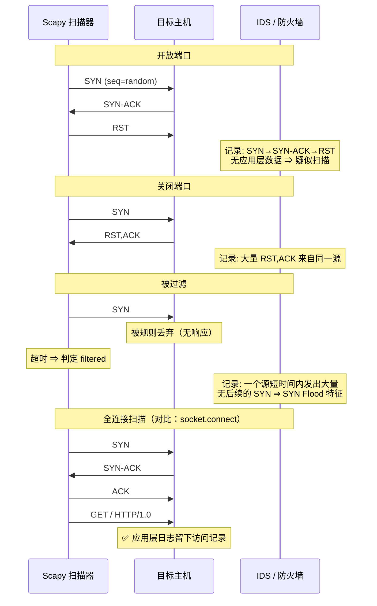

# Day 156 图解 — Scapy 数据包构造原理

> 全部为 Mermaid 代码块与 ASCII 字符画，不生成图片文件。

---

## 图 1：协议封装与 `/` 运算符（ASCII）

```
  你在 Python 里写：
      Ether() / IP(dst="127.0.0.1") / TCP(dport=80, flags="S") / b"GET / HTTP/1.0\r\n\r\n"

  实际对应的字节布局（自上而下 = 从内到外）：
  ┌────────────────────────────────────────────────────────────┐
  │ Ethernet II                                                 │
  │  ┌───────────────┬───────────────┬────────────┐            │
  │  │ dst MAC (6B)  │ src MAC (6B)  │ type 0x0800│            │
  │  └───────────────┴───────────────┴────────────┘            │
  │  ┌────────────────────────────────────────────────────────┐ │
  │  │ IPv4 Header (20B)                                      │ │
  │  │  ver/ihl │ tos │ len │ id │ flags/frag │ ttl │ proto=6 │ │
  │  │  chksum  │ src │ dst                                  │ │
  │  │  ┌──────────────────────────────────────────────────┐  │ │
  │  │  │ TCP Header (20B)                                  │  │ │
  │  │  │  sport │ dport=80 │ seq │ ack │ flags=S │ win    │  │ │
  │  │  │  chksum │ urgptr │ options(MSS/SAckOK/WScale)     │  │ │
  │  │  │  ┌────────────────────────────────────────────┐  │  │ │
  │  │  │  │ Payload: b"GET / HTTP/1.0\r\n\r\n"         │  │  │ │
  │  │  │  └────────────────────────────────────────────┘  │  │ │
  │  │  └──────────────────────────────────────────────────┘  │ │
  │  └────────────────────────────────────────────────────────┘ │
  └────────────────────────────────────────────────────────────┘

  Scapy 的字段默认值策略：
    · 能自动算的 → None（len / chksum / ihl）
    · 有合理默认的 → 具体值（ttl=64, version=4）
    · 用户必须给的 → 保持默认（dst 默认 127.0.0.1，你不改就发给自己）
```

---

## 图 2：发送路径对比（ASCII）

```
【send / sr】—— 内核参与，L3
   pkt (IP/TCP)
        │  Scapy 序列化
        ▼
   socket(AF_INET, SOCK_RAW, IPPROTO_RAW)
        │  sendto()
        ▼
   内核：查路由表 → 选网卡 → 查 ARP 缓存得到目的 MAC
        │
        ▼
   内核补 Ether 头 → 网卡发送
   ↳ 好处：不用管 MAC、自动走对网卡
   ↳ 限制：IP 头由内核"部分监督"，某些字段会被内核覆盖

【sendp / srp】—— 绕过内核路由，L2
   pkt (Ether/IP/TCP)
        │  Scapy 序列化（包括你自己写的 Ether 头）
        ▼
   socket(AF_PACKET, SOCK_RAW)  bind(iface)
        │  send()
        ▼
   直接交给网卡驱动
   ↳ 好处：能完全控制 L2（ARP 欺骗、自定义以太类型、VLAN 等）
   ↳ 代价：必须自己写对 dst MAC，否则包发出去没人收
```

---

## 图 3：SYN 扫描与检测特征（Mermaid）



**为什么防火墙能识别扫描？**
→ 因为"正常用户"不会有"大量只有 SYN 没有后续"或"大量 RST"的行为。
**行为特征，而不是单包特征。**

---

## 图 4：嗅探的内核路径与丢包点（ASCII）

```
   网卡收到帧
        │
        ▼
   内核 netif_receive_skb
        │
        ├──────────────────────────────► 正常协议栈处理（TCP/IP）
        │
        └──► AF_PACKET 套接字（Scapy）
                 │
                 │ ① BPF 过滤（filter="icmp"）  ← 尽量在这里砍掉 99% 的包
                 │      内核态执行，零拷贝到用户态
                 ▼
             ② 环形缓冲区（默认 ~208KB）        ← ⚠️ 丢包点 1：突发流量写满即丢
                 │
                 ▼
             ③ 用户态 recvfrom() → Scapy dissect
                 │                              ← ⚠️ 丢包点 2：Python 解析太慢
                 ▼
             ④ pkts.append(pkt)  (store=True)   ← ⚠️ 丢包点 3（内存）：越攒越多 → OOM

   对策：
     · filter=...        内核态过滤
     · store=False       不攒列表
     · 提高 rmem_max      放大环形缓冲区
     · PcapReader 流式    处理大 PCAP 时不要 rdpcap
```

---

## 图 5：traceroute 的 TTL 逐跳原理（ASCII）

```
   TTL=1  ┌─────────┐
   ──────►│ 路由器1 │  TTL→0 → 回 ICMP Time Exceeded (from 路由器1)
          └─────────┘        ▲ 记录第 1 跳

   TTL=2  ┌─────────┐
   ──────►│ 路由器1 │ TTL→1 继续
          └────┬────┘
               ▼
          ┌─────────┐
          │ 路由器2 │  TTL→0 → 回 ICMP Time Exceeded (from 路由器2)
          └─────────┘        ▲ 记录第 2 跳

   TTL=N  ... ─────► 目标主机 → 回 ICMP Echo Reply 或 TCP RST
                              ▲ 到达，结束

   Scapy 写法（一行就够）：
       ans, unans = sr(IP(dst=target, ttl=(1, 30)) / ICMP(), timeout=1)
                     ↑ ttl 给一个范围 = 自动展开成 30 个包

   为什么会出现 `*`（无响应）？
     ① 路由器配置了不回复 ICMP
     ② 该跳丢包
     ③ timeout 太短
     ④ 运营商做了 ICMP 限速
```

---

## 图 6：ARP 查询与局域网发现（ASCII）

```
   探测主机 192.168.1.100                    目标 192.168.1.1
        │                                          │
        │ Ether(dst=ff:ff:ff:ff:ff:ff)             │
        │ ARP(op=1, pdst=192.168.1.1)              │
        │ ──────── 广播 ──────────────────────────►│
        │    "谁是 192.168.1.1？告诉 192.168.1.100" │
        │                                          │
        │                                          │ 查自己的 IP
        │◄──────── 单播应答 ───────────────────────│
        │    "192.168.1.1 是 aa:bb:cc:dd:ee:ff"     │
        │                                          │

  为什么 ARP 扫描比 ping 扫描可靠？
   ┌────────────────────────────┬──────────────┬──────────────┐
   │ 方式                       │ 依赖         │ 主机禁 ICMP 时│
   ├────────────────────────────┼──────────────┼──────────────┤
   │ ICMP ping                  │ 网络层       │ ❌ 误判离线   │
   │ ARP 请求（L2）              │ 必须回 ARP   │ ✅ 仍能发现   │
   └────────────────────────────┴──────────────┴──────────────┘

  ⚠️ 安全提示：
     ARP 无认证 ⇒ 可以伪造应答（ARP 欺骗）⇒ 局域网中间人的基础。
     本日只做「查询」，不做「应答」；不提供任何欺骗示例。
     防御：动态 ARP 检测（DAI）、ARP 静态绑定、端口安全、VLAN 隔离。
```
