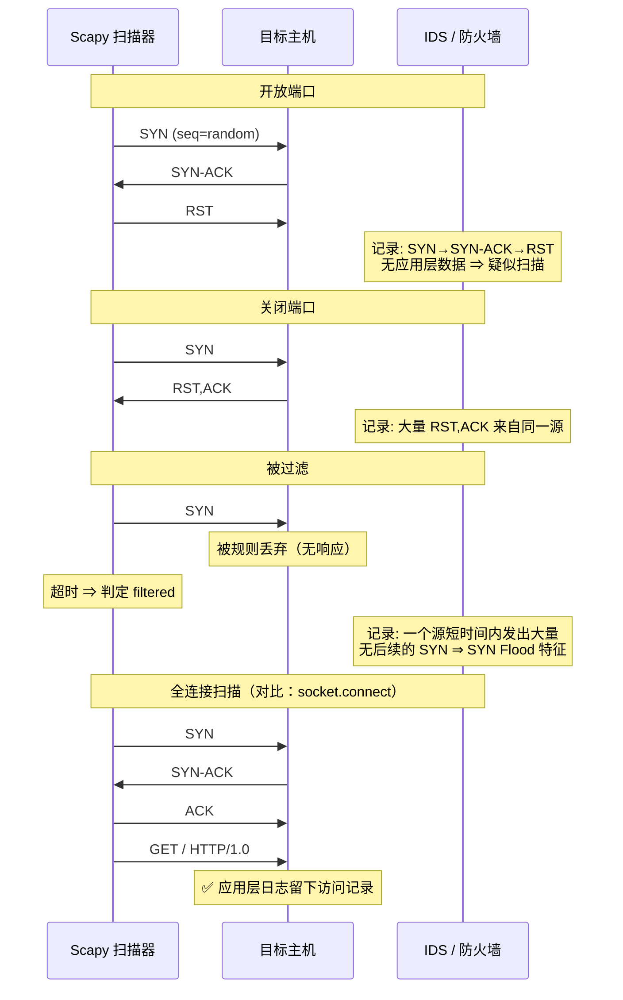

# Day 156 图解 — Scapy 数据包构造原理

> 全部为 Mermaid 代码块与 ASCII 字符画，不生成图片文件。

---

## 图 1：协议封装与 `/` 运算符（ASCII）

```
  你在 Python 里写：
      Ether() / IP(dst="127.0.0.1") / TCP(dport=80, flags="S") / b"GET / HTTP/1.0\r\n\r\n"

  实际对应的字节布局（自上而下 = 从内到外）：
  ┌────────────────────────────────────────────────────────────┐
  │ Ethernet II                                                 │
  │  ┌───────────────┬───────────────┬────────────┐            │
  │  │ dst MAC (6B)  │ src MAC (6B)  │ type 0x0800│            │
  │  └───────────────┴───────────────┴────────────┘            │
  │  ┌────────────────────────────────────────────────────────┐ │
  │  │ IPv4 Header (20B)                                      │ │
  │  │  ver/ihl │ tos │ len │ id │ flags/frag │ ttl │ proto=6 │ │
  │  │  chksum  │ src │ dst                                  │ │
  │  │  ┌──────────────────────────────────────────────────┐  │ │
  │  │  │ TCP Header (20B)                                  │  │ │
  │  │  │  sport │ dport=80 │ seq │ ack │ flags=S │ win    │  │ │
  │  │  │  chksum │ urgptr │ options(MSS/SAckOK/WScale)     │  │ │
  │  │  │  ┌────────────────────────────────────────────┐  │  │ │
  │  │  │  │ Payload: b"GET / HTTP/1.0\r\n\r\n"         │  │  │ │
  │  │  │  └────────────────────────────────────────────┘  │  │ │
  │  │  └──────────────────────────────────────────────────┘  │ │
  │  └────────────────────────────────────────────────────────┘ │
  └────────────────────────────────────────────────────────────┘

  Scapy 的字段默认值策略：
    · 能自动算的 → None（len / chksum / ihl）
    · 有合理默认的 → 具体值（ttl=64, version=4）
    · 用户必须给的 → 保持默认（dst 默认 127.0.0.1，你不改就发给自己）
```

---

## 图 2：发送路径对比（ASCII）

```
【send / sr】—— 内核参与，L3
   pkt (IP/TCP)
        │  Scapy 序列化
        ▼
   socket(AF_INET, SOCK_RAW, IPPROTO_RAW)
        │  sendto()
        ▼
   内核：查路由表 → 选网卡 → 查 ARP 缓存得到目的 MAC
        │
        ▼
   内核补 Ether 头 → 网卡发送
   ↳ 好处：不用管 MAC、自动走对网卡
   ↳ 限制：IP 头由内核"部分监督"，某些字段会被内核覆盖

【sendp / srp】—— 绕过内核路由，L2
   pkt (Ether/IP/TCP)
        │  Scapy 序列化（包括你自己写的 Ether 头）
        ▼
   socket(AF_PACKET, SOCK_RAW)  bind(iface)
        │  send()
        ▼
   直接交给网卡驱动
   ↳ 好处：能完全控制 L2（ARP 欺骗、自定义以太类型、VLAN 等）
   ↳ 代价：必须自己写对 dst MAC，否则包发出去没人收
```

---

## 图 3：SYN 扫描与检测特征（Mermaid）



**为什么防火墙能识别扫描？**
→ 因为"正常用户"不会有"大量只有 SYN 没有后续"或"大量 RST"的行为。
**行为特征，而不是单包特征。**

---

## 图 4：嗅探的内核路径与丢包点（ASCII）

```
   网卡收到帧
        │
        ▼
   内核 netif_receive_skb
        │
        ├──────────────────────────────► 正常协议栈处理（TCP/IP）
        │
        └──► AF_PACKET 套接字（Scapy）
                 │
                 │ ① BPF 过滤（filter="icmp"）  ← 尽量在这里砍掉 99% 的包
                 │      内核态执行，零拷贝到用户态
                 ▼
             ② 环形缓冲区（默认 ~208KB）        ← ⚠️ 丢包点 1：突发流量写满即丢
                 │
                 ▼
             ③ 用户态 recvfrom() → Scapy dissect
                 │                              ← ⚠️ 丢包点 2：Python 解析太慢
                 ▼
             ④ pkts.append(pkt)  (store=True)   ← ⚠️ 丢包点 3（内存）：越攒越多 → OOM

   对策：
     · filter=...        内核态过滤
     · store=False       不攒列表
     · 提高 rmem_max      放大环形缓冲区
     · PcapReader 流式    处理大 PCAP 时不要 rdpcap
```

---

## 图 5：traceroute 的 TTL 逐跳原理（ASCII）

```
   TTL=1  ┌─────────┐
   ──────►│ 路由器1 │  TTL→0 → 回 ICMP Time Exceeded (from 路由器1)
          └─────────┘        ▲ 记录第 1 跳

   TTL=2  ┌─────────┐
   ──────►│ 路由器1 │ TTL→1 继续
          └────┬────┘
               ▼
          ┌─────────┐
          │ 路由器2 │  TTL→0 → 回 ICMP Time Exceeded (from 路由器2)
          └─────────┘        ▲ 记录第 2 跳

   TTL=N  ... ─────► 目标主机 → 回 ICMP Echo Reply 或 TCP RST
                              ▲ 到达，结束

   Scapy 写法（一行就够）：
       ans, unans = sr(IP(dst=target, ttl=(1, 30)) / ICMP(), timeout=1)
                     ↑ ttl 给一个范围 = 自动展开成 30 个包

   为什么会出现 `*`（无响应）？
     ① 路由器配置了不回复 ICMP
     ② 该跳丢包
     ③ timeout 太短
     ④ 运营商做了 ICMP 限速
```

---

## 图 6：ARP 查询与局域网发现（ASCII）

```
   探测主机 192.168.1.100                    目标 192.168.1.1
        │                                          │
        │ Ether(dst=ff:ff:ff:ff:ff:ff)             │
        │ ARP(op=1, pdst=192.168.1.1)              │
        │ ──────── 广播 ──────────────────────────►│
        │    "谁是 192.168.1.1？告诉 192.168.1.100" │
        │                                          │
        │                                          │ 查自己的 IP
        │◄──────── 单播应答 ───────────────────────│
        │    "192.168.1.1 是 aa:bb:cc:dd:ee:ff"     │
        │                                          │

  为什么 ARP 扫描比 ping 扫描可靠？
   ┌────────────────────────────┬──────────────┬──────────────┐
   │ 方式                       │ 依赖         │ 主机禁 ICMP 时│
   ├────────────────────────────┼──────────────┼──────────────┤
   │ ICMP ping                  │ 网络层       │ ❌ 误判离线   │
   │ ARP 请求（L2）              │ 必须回 ARP   │ ✅ 仍能发现   │
   └────────────────────────────┴──────────────┴──────────────┘

  ⚠️ 安全提示：
     ARP 无认证 ⇒ 可以伪造应答（ARP 欺骗）⇒ 局域网中间人的基础。
     本日只做「查询」，不做「应答」；不提供任何欺骗示例。
     防御：动态 ARP 检测（DAI）、ARP 静态绑定、端口安全、VLAN 隔离。
```

---

## 图 7：校验和的三种覆盖范围（Day156 示例 04 的实验对象）

```
① IPv4 头校验和：只覆盖头部，每跳都要更新
   ┌───────────────── IPv4 头（20~60 字节）─────────────────┐
   │ ver/ihl │ tos │ total_len │ id │ flags/frag │ ttl │ proto │
   │ checksum ← 算它的时候先把本字段置 0                     │
   │ src │ dst │ options                                    │
   └────────────────────────────────────────────────────────┘
   · 不含载荷！（所以载荷改了不影响 IP 校验和 —— 这正是"改了载荷却只报 TCP
     checksum incorrect"的原因）
   · 路由器每跳把 TTL 减 1，用 RFC 1624 的增量更新（不重算整头）

② TCP/UDP 校验和：伪首部 + 整段（头 + 载荷）
   ┌──── 伪首部（12 字节，**不发送**，只参与计算）────┐
   │ src IP(4) │ dst IP(4) │ 0 │ proto(1) │ L4长度(2) │
   └──────────────────────────────────────────────────┘
            ＋
   ┌──────── TCP/UDP 头 ＋ 载荷 ────────┐
   │ sport │ dport │ …checksum          │
   └────────────────────────────────────┘
   · 伪首部的"那个 0 字节"是为了 16 位对齐，漏掉它校验和必错
   · 源/目的 IP 参与计算 ⇒ NAT 改地址必须同时改校验和

③ ICMP 校验和：只覆盖 ICMP 消息本身（**没有伪首部**）
   ┌──── type │ code │ checksum │ id │ seq │ 载荷 ────┐
   └──────────────────────────────────────────────────┘
   · 这条最容易和 ② 记混：TCP/UDP 有伪首部，ICMP 没有

反码和算法（RFC 1071）：
   1) 16 位一组当大端整数相加（奇数长度末尾补 0x00）
   2) 进位回卷（可能卷多次）
   3) 取反码 = 校验和字段的值
   4) 验证：含校验和字段整段再算一次，结果应为 0xFFFF

   官方测试向量：00 01 f2 03 f4 f5 f6 f7 → 和 0xddf2，校验和 0x220d
```

---

## 图 8：pcap 文件格式与"自己写、让 Scapy 读"的交叉验证

```
全局头 24 字节（小端示例）：
  偏移 0    d4 c3 b2 a1   ← 魔数 0xA1B2C3D4 的小端写法（判字节序就看它）
  偏移 4    02 00 04 00   ← 版本 2.4
  偏移 8    00 00 00 00   ← thiszone（永远是 0）
  偏移 12   00 00 00 00   ← sigfigs（永远是 0）
  偏移 16   ff ff 00 00   ← snaplen 65535
  偏移 20   65 00 00 00   ← network = 101（DLT_RAW：裸 IP，没有链路层头）
                          ⚠️ 这个字段决定解析起点：标成 1(Ethernet) 就会去读 14 字节头

每包记录头 16 字节：
  ┌ 秒(4) │ 微秒(4) │ incl_len(4) │ orig_len(4) ┐ + incl_len 字节的包数据
  └ 浮点误差保护：usec >= 1000000 时 秒+1、微秒-1000000

交叉验证（Day156 示例 04 实验 4 / Day157 pcap_lib 自检）：
   我们自己写 ─────────────► scapy.rdpcap 读 ──► 字节/时间戳逐项比对 ✅
   scapy.wrpcap 写 ────────► 我们自己读 ────────► 包数/字节比对 ✅
   ↑ 只有两个**独立实现**都读出同样的东西，才能说明"格式我们理解对了"

字节序判断表（按小端读前 4 字节）：
   0xa1b2c3d4 → 小端 + 微秒     0xa1b23c4d → 小端 + 纳秒
   0xd4c3b2a1 → 大端 + 微秒     0x4d3cb2a1 → 大端 + 纳秒
   判错的后果：incl_len 变成天文数字 → read() 一口吃掉大半个文件

截断容错：抓包进程被 kill → 最后一条记录不完整 → **丢弃残包正常结束**
          （比"抛异常让整次分析失败"更符合工程现实）
```

---

## 图 9：分片与 MTU（Day156 示例 04 实验 5）

```
原始包：IP(20) + ICMP(8) + 载荷(4000) = 4028 字节

fragment(pkt, fragsize=1480)   ← fragsize 指"每片的 IP 载荷"上限

 ① frag=0    MF=1  偏移=0      1480 字节载荷  ┐
 ② frag=185  MF=1  偏移=1480   1480 字节载荷  ├ 偏移单位是 8 字节！185×8=1480
 ③ frag=370  MF=0  偏移=2960   1048 字节载荷  ┘ 末片 MF=0 表示结束

每个分片：IP 头被**重写**（total_len / flags / frag 都变了）
        ⇒ 每个分片的 IP 校验和都必须重算（自检里逐片验证）

重组（自己实现，别用 scapy 的 defrag —— 见 C2 的实测记录）：
   按 frag×8 排序 → 去掉各片 IP 头 → 载荷首尾相接
   必须检查两件事：
     · 偏移连续（缺中间片 → 报错）
     · 末片 MF=0（末尾缺片 → 报错）
   ↑ "尽力拼"比"报错"更危险：残缺数据会一路解析出错误结论
```

---

## 图 10：本日 4 个代码文件的职责划分

```
                 ┌──────────────────────────────────────────┐
                 │  01-scapy-basics.py                      │
                 │  分层构造 / 字段读写 / chksum 的 None 语义 │
                 │  send·sendp·sr1（默认 dry-run，需 --send）│
                 └───────────────┬──────────────────────────┘
                                 │ 都依赖同一个前提：
                                 │ "我知道字节长什么样"
                 ┌───────────────▼──────────────────────────┐
                 │  04-checksum-and-pcap-lab.py（新增）      │
                 │  ① 反码和从零实现（RFC 1071/1624）        │
                 │  ② pcap 字节结构与双向交叉验证            │
                 │  ③ 分片：每片校验和 + 自己重组            │
                 └───────────────┬──────────────────────────┘
                                 │ 把"看不见的一层"摊开后
        ┌────────────────────────┴────────────────────────┐
        │                                                 │
┌───────▼───────────────────┐              ┌──────────────▼────────────────┐
│ 02-sniff-pitfalls.py      │              │ 03-network-probe.py           │
│ 嗅探 8 坑（store/BPF/权限/  │              │ ping / traceroute / ARP /      │
│ 混杂模式/丢包/prn/大文件/合规）│             │ SYN 扫描（含护栏与结果判定）     │
└───────────────────────────┘              └───────────────────────────────┘
```
