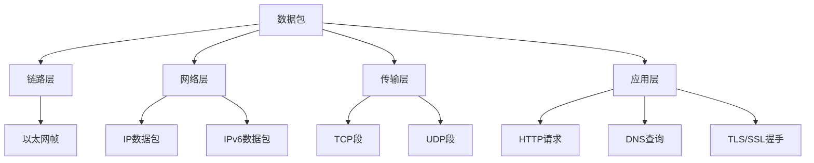

# Day 157 — pyshark 流量分析

**主题**：使用 `pyshark` 进行 Python 中的 PCAP 文件分析和网络流量检查

## 概念解释

### 什么是 pyshark？
`pyshark` 是一个基于 `tcpdump` 的 Python 接口，用于在 Python 中直接分析网络流量捕获文件（PCAP）。它让你无需在命令行中手动运行 tcpdump/tshark 即可解析网络数据包。

### 核心概念
- **PCAP (Packet CAPture)**：网络流量捕获的标准文件格式，由 tcpdump, Wireshark 等工具生成
- **接口**：pyshark 为 tshark 的各种协议提供了 Python 封装
- **协议过滤**：在捕获或读取时筛选特定协议（如 HTTP, TCP, IP 等）
- **数据包**：网络传输的基本单位，包含源/目标地址、协议、载荷等信息

### pyshark 与 scapy 的区别
- **pyshark**：专注于协议分析，直接映射 tshark/Wireshark 的解析结果；速度较快，适合大量包的快速分析
- **scapy**：更加通用，可以构建、发送、捕获数据包；协议解析更灵活但相对较慢

## 原理解释

### 底层机制
1. **依赖 tshark**：pyshark 本质上是 tshark（Wireshark 的命令行界面）的 Python 封装。它通过子进程调用 tshark 并解析输出。
2. **PCAP 读取**：读取 PCAP 文件时，pyshark 调用 tshark 的 `-r` 参数读取文件，然后解析输出的 XML/JSON 格式数据。
3. **协议栈解析**：每个数据包都有协议栈结构（链路层→网络层→传输层→应用层），pyshark 提供了对应的属性访问方式。

### 工作流程
```
PCAP 文件
    ↓ (tshark -r)
XML/JSON 输出
    ↓ (pyshark 解析)
Python 对象
    ↓ (用户代码)
分析/可视化/报告
```

### 性能考量
- pyshark 通过子进程通信，每个数据包都需要 fork 一个进程解析
- 对于大规模包（>10,000 个），考虑使用批量处理或仅提取关键字段
- 可以通过 `only_summaries=True` 只获取摘要信息，提高性能

## 定义与使用方法

### 安装
```bash
pip install pyshark
# 需要安装 tshark: brew install wireshark (mac) 或 apt-get install tshark (linux)
```

### 基本用法 — 读取 PCAP 文件

```python
import pyshark

# 读取 PCAP 文件
cap = pyshark.FileCapture('capture.pcap', only_summaries=True)

# 遍历数据包
for packet in cap:
    print(packet.number, packet.ip.src, packet.ip.dst)
    
cap.close()
```

### 常用类和属性

| 对象 | 关键属性 | 说明 |
|------|----------|------|
| `FileCapture` | `packets` | 数据包列表迭代器 |
| `Packet` | `number` | 数据包编号 |
|  | `ip` | IP 层信息 (src, dst) |
|  | `tcp` | TCP 层信息 (src_port, dst_port, flags) |
|  | `http` | HTTP 层信息 (方法, host, 路径) |
|  | `wsse` | SSL/TLS 层信息 |
| `Capture` | `bpf_filter` | BPF 血量过滤器 |

### API 速查表

```python
# 创建捕获器
cap = pyshark.FileCapture('file.pcap', 
                          display_filter='tcp',  # 只显示TCP包
                          only_summaries=True)   # 只获取摘要

# 遍历数据包
for pkt in cap:
    # IP 层
    print(pkt.ip.src_ip)       # 源IP
    print(pkt.ip.dst_ip)       # 目标IP
    print(pkt.ip.protocol)   # 协议
    
    # TCP 层
    print(pkt.tcp.src_port)    # 源端口
    print(pkt.tcp.dst_port)    # 目标端口
    print(pkt.tcp.flags)       # TCP标志位
    
    # HTTP 层 (如果是HTTP流量)
    if hasattr(pkt, 'http'):
        print(pkt.http.method)     # GET/POST等
        print(pkt.http.host)       # 主机名
        print(pkt.http.request_uri)# 请求路径

# 统计
total_packets = len(list(cap))  # 总包数
```

### 常用方法

```python
cap = pyshark.FileCapture('file.pcap')

# 计数
packet_count = len(cap)  # 或 list(cap).__len__()

# 过滤后重新遍历
filtered = cap.display_filter('tcp')  # 设置过滤器
for pkt in filtered:
    ...

# 关闭捕获
cap.close()

# 检查特定协议是否存在
if hasattr(pkt, 'tcp'):
    # 有TCP层
    pass
```

## ASCII 图解

### 网络流量分析工作流

```
┌─────────────┐     ┌──────────────────┐     ┌─────────────────────┐
│  PCAP文件    │────▶│   tshark命令行    │────▶│   XML/JSON输出       │
│ (捕获的流量) │     │ (协议解析引擎)    │     │ (结构化数据)         │
└─────────────┘     └──────────────────┘     └─────────────────────┘
           │                      │                      │
           │                      │                      │
           ▼                      ▼                      ▼
     ┌─────────────┐      ┌─────────────┐      ┌─────────────┐
     │  pyshark     │      │  Python     │      │  用户代码   │
     │ 封装层        │      │ 解释执行     │      │ 业务逻辑   │
     └─────────────┘      └─────────────┘      └─────────────┘
                                                │
                                                ▼
                                             ┌─────────────────┐
                                             │  结果/报告/图表  │
                                             └─────────────────┘
```

### 数据包结构图 (Mermaid)



## 实战代码案例

### 案例 1：基本的 PCAP 文件遍历与统计

```python
#!/usr/bin/env python3
"""案例 1：基本的 PCAP 文件遍历与统计"""

import pyshark

def count_packets_by_protocol(pcap_file):
    """统计每种协议的包数"""
    protocol_counts = {}
    
    cap = pyshark.FileCapture(pcap_file)
    
    try:
        for packet in cap:
            # 获取网络层协议
            if hasattr(packet, 'ip'):
                proto = 'IP'
            elif hasattr(packet, 'ipv6'):
                proto = 'IPv6'
            elif hasattr(packet, 'tcp'):
                proto = 'TCP'
            elif hasattr(packet, 'udp'):
                proto = 'UDP'
            else:
                proto = 'Other'
            
            protocol_counts[proto] = protocol_counts.get(proto, 0) + 1
    finally:
        cap.close()
    
    return protocol_counts

if __name__ == "__main__":
    pcap = 'example_traffic.pcap'
    counts = count_packets_by_protocol(pcap)
    
    print(f"PCAP文件: {pcap}")
    print("=" * 50)
    for proto, count in sorted(counts.items()):
        print(f"{proto}: {count} 个数据包")
    print("=" * 50)
    print(f"总计: {sum(counts.values())} 个数据包")
```

### 案例 2：提取 HTTP 请求信息

```python
#!/usr/bin/env python3
"""案例 2：提取 HTTP 请求信息"""

import pyshark

def extract_http_requests(pcap_file):
    """从 PCAP 中提取所有 HTTP 请求"""
    http_requests = []
    
    cap = pyshark.FileCapture(pcap_file, 
                              display_filter='http')
    
    try:
        for packet in cap:
            if hasattr(packet, 'http'):
                request = {
                    '源地址': packet.ip.src_ip if hasattr(packet, 'ip') else 'N/A',
                    '目的地址': packet.ip.dst_ip if hasattr(packet, 'ip') else 'N/A',
                    '方法': packet.http.method,
                    '主机': packet.http.host,
                    '路径': packet.http.request_uri,
                    '协议版本': packet.http.version if hasattr(packet.http, 'version') else '1.1'
                }
                http_requests.append(request)
    finally:
        cap.close()
    
    return http_requests

if __name__ == "__main__":
    pcap = 'web_traffic.pcap'
    requests = extract_http_requests(pcap)
    
    print(f"从 {pcap} 提取了 {len(requests)} 个 HTTP 请求")
    print("=" * 70)
    for req in requests:
        print(f"{req['方法']} {req['路径']} - {req['主机']} "
              f"({req['源地址']} → {req['目的地址']})")
    print("=" * 70)
```

### 案例 3：异常流量检测 (进阶)

```python
#!/usr/bin/env python3
"""案例 3：异常流量检测 - 识别可疑的 TCP 连接"""

import pyshark
from collections import Counter, defaultdict

def detect_suspicious_connections(pcap_file, threshold=10):
    """检测超过阈值的连接对"""
    src_dst_counts = Counter()
    
    cap = pyshark.FileCapture(pcap_file,
                              display_filter='tcp')
    
    try:
        for packet in cap:
            if hasattr(packet, 'ip') and hasattr(packet, 'tcp'):
                key = f"{packet.ip.src_ip}:{packet.tcp.src_port}" \
                      f" → {packet.ip.dst_ip}:{packet.tcp.dst_port}"
                src_dst_counts[key] += 1
    finally:
        cap.close()
    
    # 找出可疑连接
    suspicious = [(k, v) for k, v in src_dst_counts.items() 
                  if v > threshold]
    
    return suspicious

if __name__ == "__main__":
    pcap = 'network_traffic.pcap'
    suspicious = detect_suspicious_connections(pcap, threshold=5)
    
    print(f"检测到 {len(suspicious)} 个可疑连接 (阈值: 5+)")
    print("=" * 80)
    for conn, count in suspicious:
        print(f"连接: {conn} - 出现次数: {count}")
    print("=" * 80)
```

## 思考题

1. **协议识别**：在一个混合了 IPv4、IPv6、TCP、UDP 和 ICMP 的 PCAP 文件中，你如何设计过滤器只提取 TCP 数据包？pyshark 中 `display_filter` 和 `bpf_filter` 有什么区别？

2. **性能权衡**：pyshark 通过子进程调用 tshark 来解析数据包。如果你需要分析一个包含 100,000 个数据包的 PCAP 文件，你会如何优化代码以减少内存和处理时间？何时应该考虑改用 scapy？

3. **隐私与合规**：在企业环境中分析网络流量捕获文件时，有哪些合规考量？如何确保在分析过程中不泄露敏感的企业内部信息？

4. **协议解析的局限性**：pyshark 并非能够完美解析所有协议场景。你遇到过 pyshark 无法正确解析的协议或字段吗？当 pyshark 解析失败时，你会如何回退到使用原始的二进制数据或 scapy？

5. **扩展性设计**：如果要设计一个网络流量分析平台，你会如何使用 pyshark 作为核心组件？请设计一个简单的插件架构，允许用户添加自定义的流量分析功能（如自定义协议解析、可视化、报告生成等）。

---
*内容结束 - 学习目标：掌握使用 pyshark 进行 PCAP 文件分析的完整流程，包括基本读取、协议过滤、HTTP 信息提取以及异常检测能力。*