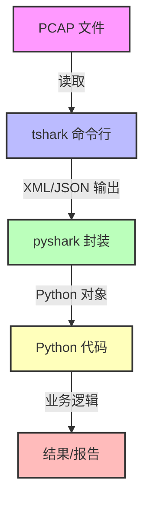
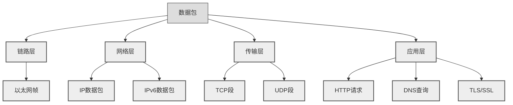
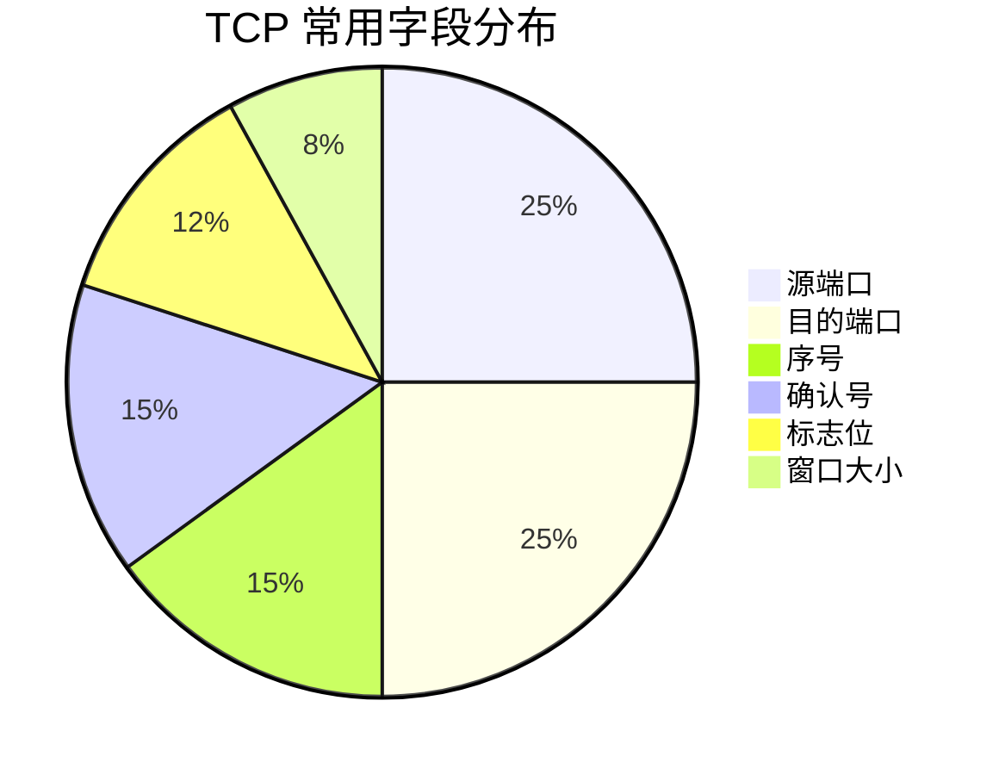
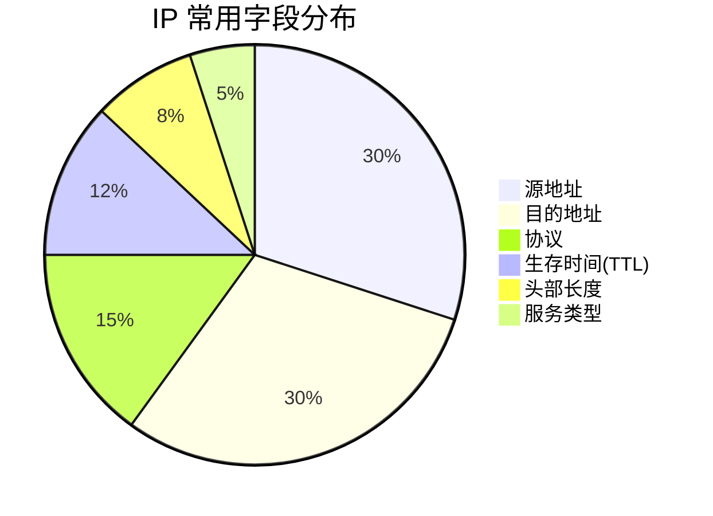

# Day 157 — pyshark 流量分析 图解

## PCAP 数据包流转流程

```mermaid
flowchart TD
    %% 定义样式
    classDef pcap fill:#f9f,stroke:#333,stroke-width:2px;
    classDef tshark fill:#bbf,stroke:#333,stroke-width:2px;
    classDef pyshark fill:#bfb,stroke:#333,stroke-width:2px;
    classDef python fill:#ffb,stroke:#333,stroke-width:2px;
    classDef user fill:#fbb,stroke:#333,stroke-width:2px;

    PCAP[PCAP 文件]:::pcap
    TSHARK[tshark 命令行]:::tshark
    PYSHARK[pyshark 封装]:::pyshark
    PYTHON[Python 代码]:::python
    RESULT[结果/报告]:::user

    PCAP -->|读取| TSHARK
    TSHARK -->|XML/JSON 输出| PYSHARK
    PYSHARK -->|Python 对象| PYTHON
    PYTHON -->|业务逻辑| RESULT

    %% 备注: tshark 是 Wireshark 的命令行解析引擎
    %% pyshark 将 tshark 的输出解析为 Python 对象
```

## 数据包协议栈结构

```mermaid
graph TD
    classDef layer fill:#ddd,stroke:#333,stroke-width:1px;
    classDef protocol fill:#eee,stroke:#555,stroke-width:2px;

    Packet[数据包]:::layer
    
    Link[链路层]:::protocol
    Net[网络层]:::protocol
    Trans[传输层]:::protocol
    App[应用层]:::protocol
    
    Ether[以太网帧]:::protocol
    IP[IP数据包]:::protocol
    IPv6[IPv6数据包]:::protocol
    TCP[TCP段]:::protocol
    UDP[UDP段]:::protocol
    HTTP[HTTP请求]:::protocol
    DNS[DNS查询]:::protocol
    TLS[TLS/SSL]:::protocol
    
    Packet --> Link
    Packet --> Net
    Packet --> Trans
    Packet --> App
    
    Link --> Ether
    Net --> IP
    Net --> IPv6
    Trans --> TCP
    Trans --> UDP
    App --> HTTP
    App --> DNS
    App --> TLS
```

## 常用协议字段快速查找

```mermaid
pie
    title TCP 常用字段分布
    "源端口" : 25
    "目的端口" : 25
    "序号" : 15
    "确认号" : 15
    "标志位" : 12
    "窗口大小" : 8
```

```mermaid
pie
    title IP 常用字段分布
    "源地址" : 30
    "目的地址" : 30
    "协议" : 15
    "生存时间(TTL)" : 12
    "头部长度" : 8
    "服务类型" : 5
```