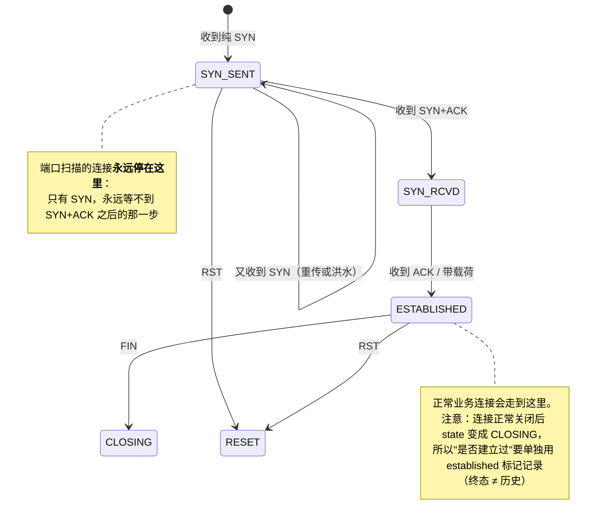

# Day 157 — 流量分析机制图解

> 全部为 ASCII 字符画与 Mermaid 代码块，不生成图片文件。

---

## 图 1：pcap 文件格式逐字节

```
┌────────────────────────── 全局头（24 字节，整个文件只有一份）──────────────────────────┐
│ 偏移  0        4        8       12       16              20                          │
│      ┌────────┬────────┬────────┬────────┬───────────────┬──────────────┐            │
│      │ magic  │ ver    │thiszone│sigfigs │   snaplen     │   network    │            │
│      │ 4B     │ 2B+2B  │  4B    │  4B    │     4B        │     4B       │            │
│      └────────┴────────┴────────┴────────┴───────────────┴──────────────┘            │
│       a1b2c3d4  0200 04   0000…    0000…    0000ffff      00000001(Ethernet)          │
│        ↑ 魔数里藏着字节序！                      ↑ 抓包截断长度     ↑ 链路类型          │
└──────────────────────────────────────────────────────────────────────────────────────┘
┌────────────────────────── 每包记录头（16 字节，重复 N 次）────────────────────────────┐
│      ┌──────────┬──────────┬───────────┬────────────┐                                │
│      │ ts_sec   │ ts_usec  │ incl_len  │  orig_len  │  ← 紧跟 incl_len 字节的包数据    │
│      └──────────┴──────────┴───────────┴────────────┘                                │
│         秒          微秒      实际写入长度    线上原长                                  │
│                                 ↑ snaplen 截断时 incl_len < orig_len                  │
└──────────────────────────────────────────────────────────────────────────────────────┘
                        ↑ 注意：**没有"总包数"字段**！只能读到文件尾。

字节序判断表（按小端读前 4 字节 → 决定后续 struct 前缀）：
  0xa1b2c3d4 → 小端 + 微秒   → "<"，时间戳 ÷ 1e6
  0xa1b23c4d → 小端 + 纳秒   → "<"，时间戳 ÷ 1e9
  0xd4c3b2a1 → 大端 + 微秒   → ">"，时间戳 ÷ 1e6
  0x4d3cb2a1 → 大端 + 纳秒   → ">"，时间戳 ÷ 1e9
```

---

## 图 2：pcapng 块结构（Wireshark 的默认保存格式）

```
每个块的统一外形：  [类型(4) | 总长度(4) | 内容 …… | 总长度(4)]
                                                        ↑ 长度写两次！
                    ↑ 总长度包含头尾这 12 字节

┌ SHB Section Header（0x0A0D0D0A）───────────────────────┐
│ 字节序魔数 0x1A2B3C4D │ 版本 1.0 │ 段长度（-1=到 EOF）  │
└────────────────────────────────────────────────────────┘
┌ IDB Interface Description（0x00000001）────────────────┐
│ linktype │ 保留 │ snaplen │ 选项：if_tsresol / if_name  │
└────────────────────────────────────────────────────────┘
        │
        │  选项 if_tsresol（1 字节）的**双重含义**：
        │     最高位 0 → 分辨率 = 10⁻ⁿ   （n=6 → 微秒，默认）
        │     最高位 1 → 分辨率 = 2⁻ⁿ   （0x80|6 → 1/64 秒）
        │  把 2⁻ⁿ 当成唯一的解释方式，时间戳精度会掉到 15.625ms
        │  —— 这种 bug 不报错，只是数字微错，只能靠断言抓出来
        ▼
┌ EPB Enhanced Packet（0x00000006）──────────────────────┐
│ 接口号 │ ts高32位 │ ts低32位 │ caplen │ origlen │ 数据  │
└────────────────────────────────────────────────────────┘
        ↑ 时间戳拼成 64 位整数（避免 2038 问题）
```

未知块（NRB/ISB/厂商自定义）必须**按长度跳过**，否则 Wireshark 一升级，工具就废。

---

## 图 3：pyshark 与标准库双路径（本日的架构）

```
                              ┌──────────────────────────────────────┐
                              │ 统一中间表示 IR                       │
                              │ number / ts / ip.src / tcp.dstport    │
                              │ http.request.uri / dns.qry.name …     │
                              │ （字段名对齐 Wireshark 显示过滤器名）    │
                              └────────────────▲─────────────────────┘
                                               │
        ┌──────────────────────────────────────┴──────────────────────────────────┐
        │                                                                          │
┌───────┴──────────────┐                                          ┌────────────────┴───────┐
│ pyshark 路径（全协议）│                                          │ pcap_lib 路径（零依赖） │
│                      │                                          │                        │
│ pyshark.FileCapture  │                                          │ open() 读字节           │
│        │             │                                          │        │               │
│        ▼             │                                          │        ▼               │
│ subprocess → tshark  │                                          │ 自己 dissect（纯 Python）│
│        │             │                                          │        │               │
│        ▼             │                                          │        ▼               │
│ XML/JSON → 对象      │                                          │ dict（层名对齐 Wireshark）│
└──────────────────────┘                                          └────────────────────────┘
        │                                                                  │
        └──────────────────────► 同一套统计/过滤/检测代码 ◄─────────────────┘

选择策略：
  --backend auto    → 能用 pyshark 就用，否则静默降级（**打印提示**）
  --backend pyshark → 不可用则**明确报错**（不许静默降级，否则你不知道自己在跑哪条路）
  --backend stdlib  → 强制标准库（CI / 自检用，确定性最高）
```

---

## 图 4：BPF 与 display filter 的执行位置

```
   网卡收帧
      │
      ▼
  内核 netif_receive_skb
      │
      ├────────────────────────────► 正常协议栈（TCP/IP 处理）
      │
      └──► AF_PACKET 套接字
               │
               │  ★ BPF 在这里执行（内核态，编译成字节码）
               │    只能看**固定字节偏移**：
               │      tcp[2:2]==80   ← 从 TCP 头起第 2 字节（源端口）
               │      tcp[4:2]==80   ← 目的端口
               │      tcp[13] & 2    ← SYN 位
               │    不命中的包在这里就被丢掉 → **零拷贝到用户态**
               ▼
           环形缓冲区（默认约 208KB）  ← 突发流量写满即丢包
               ▼
           用户态：dissect（逐层解析，贵）
               ▼
           ★ display filter 在这里执行（用户态，按协议字段求值）
                tcp.flags.syn == 1
                能看任意解析出来的字段，但每个包都要先解析一遍
               ▼
           统计 / 检测 / 报告

结论：BPF 决定"你手里有什么"；display filter 决定"你先看哪一条"。
      丢掉的包，display filter 永远找不回来。
```

---

## 图 5：三层封装的解析（dissection）流水线

```
原始字节
  │
  │ 以太网头 14 字节
  ├─────────► dst_mac | src_mac | ethertype
  │                                  │
  │            0x8100(VLAN) ─────────┴──► 再剥 4 字节 TCI，继续看内层类型
  │            0x0800 ──► IPv4      0x86DD ──► IPv6      0x0806 ──► ARP（到头）
  ▼
IPv4 头（ihl×4 字节；**单位是 4 字节**）
  ├─────────► src | dst | ttl | proto | flags/frag | checksum(验证！)
  │                                       │
  │              frag_offset≠0 或 MF=1 ───┴──► 分片：不是首片就没有传输层头，停止
  │              6 ──► TCP   17 ──► UDP   1 ──► ICMP（到头）
  ▼
TCP 头（data_offset×4 字节；**单位也是 4 字节**）
  ├─────────► sport | dport | seq | ack | flags | window | checksum(带伪首部验证)
  │                                                              │ 选项必须 4 字节对齐
  ▼
应用层：先看端口，再看内容特征
  ├── 53  ──► DNS（label / 压缩指针 0xC0xx / 资源记录）
  ├── 80/8080/8000 ──► HTTP（请求行 / 头 / 体）
  └── 其它端口 ──► 若内容以 "GET /" "HTTP/1." 开头 → 也是 HTTP（C2 常用非标端口）
```

---

## 图 6：TCP 连接状态机（检测器的基础设施）



---

## 图 7：校验和的三种覆盖范围

```
IPv4 头校验和：只覆盖头部（20~60 字节）
┌──────────────── IPv4 头 ────────────────┐
│ … ttl │ proto │ checksum(置0后计算) │ … │   ← 每跳 TTL 变化都要增量更新
└─────────────────────────────────────────┘

TCP/UDP 校验和：伪首部 + 整段
┌──── 伪首部（12 字节，**不发出去**，只参与计算）────┐
│  src IP(4) │ dst IP(4) │ 0 │ proto(1) │ L4长(2) │
└───────────────────────────────────────────────────┘
        ＋
┌──── TCP/UDP 头 ＋ 载荷 ────┐
│ sport │ dport │ …checksum   │
└────────────────────────────┘
     ↑ 改 IP/端口/载荷 ⇒ 必须重算（NAT、中间人改包最容易在这里翻车）

ICMP 校验和：只覆盖 ICMP 消息本身（**没有伪首部**）
┌──── type │ code │ checksum │ id │ seq │ 载荷 ────┐
└──────────────────────────────────────────────────┘
```

---

## 图 8：检测原理（行为特征，而不是单包特征）

```
① 端口扫描（横向 + 不完成握手）
   10.0.0.66 ──SYN──► :21     ✗ 无握手
             ──SYN──► :22     ✗ 无握手
             ──SYN──► :23     ✗ 无握手
             ………      8 个不同端口，0 条连接完成      → MEDIUM 告警

② SYN 洪水（纵向 + 同端口堆量）
   10.0.0.99 ──SYN×25──► :80   （同一四元组 25 个纯 SYN，无握手）
                               → HIGH 告警

③ 明文凭据
   GET /login  Authorization: Basic <base64>  Cookie: SESSION=…
        └─ 只输出掩码 + 指纹，绝不回显原文

④ DNS 隧道（长度 + 熵 + 不复用）
   a1b2c3…u1v.tunnel.evil.example
   └─ 43 字符 label、熵 4.91 bit/char（正常词 "intranet" 只有 2.50）
   └─ 每次子域都不同（故意穿透缓存）

⑤ C2 心跳（时间规律）
   10.0.0.77 ──SYN──► 10.0.0.40:4444   t = 10s
             ──SYN──►                 t = 70s   ← 间隔 60.000
             ──SYN──►                 t = 130s  ← 间隔 60.000   jitter = 0%
             ──SYN──►                 t = 190s  ← 间隔 60.000
   人的间隔是随机的；木马的间隔过于守时 → 可疑

⑥ ARP 欺骗
   10.0.0.1 ← "我是 10.0.0.1，MAC aa:…:01"    （真网关）
   10.0.0.1 ← "我是 10.0.0.1，MAC aa:…:de:ad"  （攻击者伪造）
        └─ 同一 IP 两个 MAC ⇒ CRITICAL

⑦ 校验和异常
   包被改了头却没重算校验和 ⇒ 重算后比对不上
   （注意排除网卡 checksum offload 造成的误报）

共同点：**聚合 + 基线 + 阈值**。单个包永远看不出这些。
```

---

## 图 9：一个正常 HTTP 会话的完整包序列（本日合成流量的前 13 个包）

```
t=0.000  DNS Query   10.0.0.10:53124 → 10.0.0.53:53   intranet.example.com
t=0.012  DNS Resp    10.0.0.53:53 → 10.0.0.10:53124  A 10.0.0.20
t=0.013  TCP SYN     10.0.0.10:49152 → 10.0.0.20:80   seq=1000            ┐
t=0.014  SYN+ACK     10.0.0.20:80 → 10.0.0.10:49152   seq=5000 ack=1001   ├ 三次握手
t=0.014  ACK         10.0.0.10:49152 → 10.0.0.20:80   ack=5001            ┘
t=0.015  PSH+ACK     GET /login HTTP/1.1  (218 字节)  ← Authorization + Cookie
t=0.016  ACK         服务端确认收到
t=0.030  PSH+ACK     HTTP/1.1 200 OK  (52 字节)
t=0.031  ACK         客户端确认
t=0.032  FIN+ACK     客户端发起关闭                                      ┐
t=0.033  FIN+ACK     服务端也关闭                                        ├ 四次挥手
t=0.034  ACK         最终确认                                            ┘

状态机视角：SYN_SENT → SYN_RCVD → ESTABLISHED → CLOSING
检测器视角：这条连接 completed=True，**不会**被误报成扫描；
            但它的 Authorization/Cookie 会被"明文凭据"检测器抓到。
```
