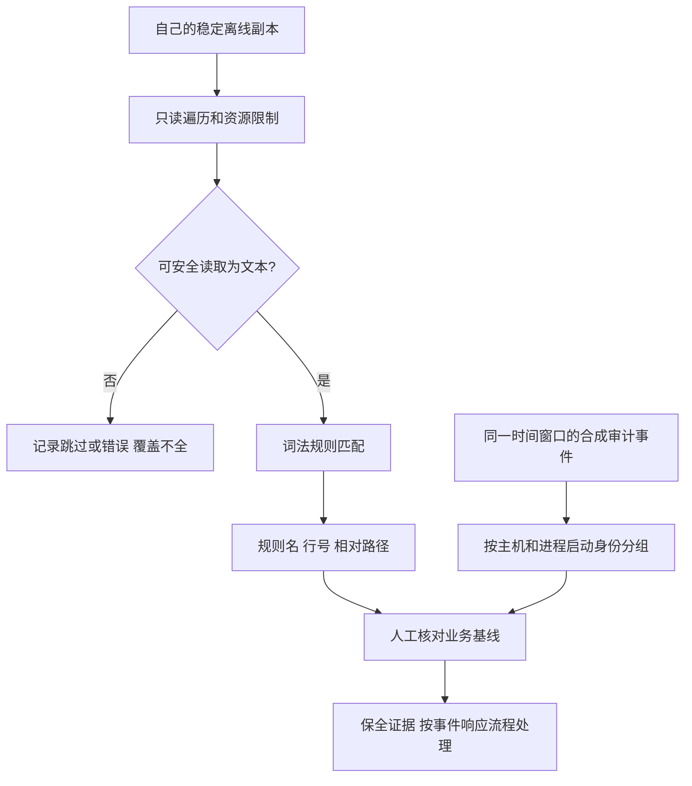

# Day 158 — 检测与复核流程



不能从“命中”直接连到“删除”；不能从“没有命中”直接连到“安全”。

## 两类证据

```text
静态：文件中的 API 名称 → 只能说明存在该词法线索
行为：文件写入 + 子进程 → 需同主机、同进程实例、同时间窗
                                   ↓
                      结合基线进行人工审阅
```

进程 PID 会复用；只有 PID 相同不足以关联两个事件。教程、注释也可能包含危险 API 的名称，需控制误报。
