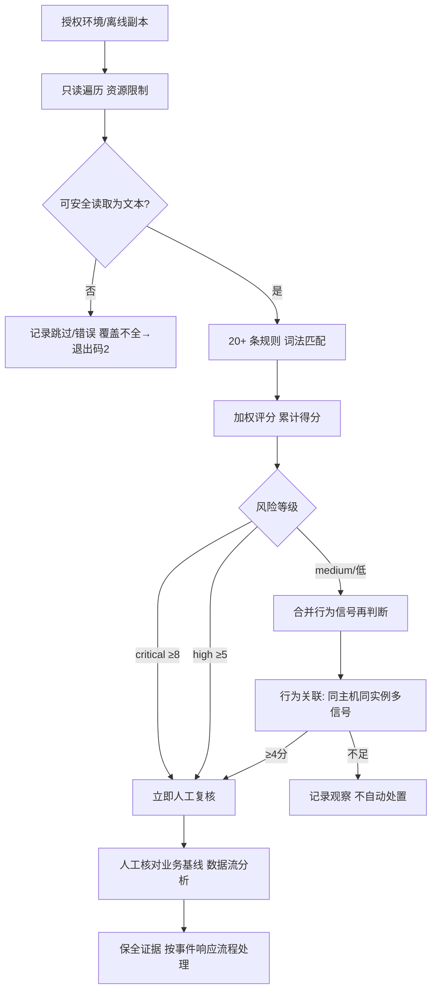

# Day 158 — 实战检测流程与评分模型

## 静态扫描 → 评分 → 定级 → 人工复核



不能从"命中"直接连到"删除"；不能从"没有命中"直接连到"安全"。
`truncated` / `walk_errors` 非空时，报告必须如实标注覆盖不全。

## 两类证据

```text
静态：文件中的 API 名称 + 行号 → 加权评分 → 风险等级（复核线索）
行为：文件写入 + 子进程 + 命令参数 → 同主机、同进程启动标识、同时间窗 → 关联分
                                   ↓
                      结合基线进行人工审阅
```

## 评分模型

- 权重 1–3（命令执行/动态求值 3，编码混淆 2，弱特征 1）
- 同规则重复命中：第 1 次记权重，之后每次 +1，单规则封顶 3 次
- 等级阈值：critical ≥8 · high ≥5 · medium ≥3 · low ≥1 · clean 0

进程 PID 会复用；只有 PID 相同不足以关联两个事件，`instance` 必须含启动身份。
教程、注释、文档也可能命中危险 API 名称，需用业务基线压制误报。
