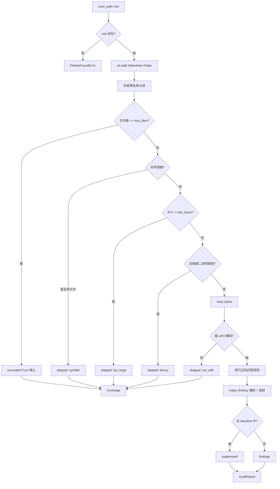

# Day 159 — 安全审计工具：扫描器设计 · 报告生成 · CLI 整合

> **Phase 10 — 网络安全开发（Day 146–165）** · 主题：安全审计工具（实战）
>
> **使用边界（重要）**：本课的工具只用于**你自己拥有或已获书面授权**的本地目录
> （自己的项目、离线副本、授权仓库）。工具箱是**只读**的：不修改、不删除被审计
> 文件，**不发起任何网络请求**，不尝试利用任何"疑似漏洞"。它检查的是
> **配置与代码中的已知风险模式**，输出的**复核线索**，不是"漏洞结论"。
> 样本中的凭据全部是公开示例值或占位符。

## 1. 学习目标

完成本课后，你应该能够：

- 说清**安全审计 / 漏洞扫描 / 渗透测试**三者的边界，知道本工具属于哪一类
- 设计一个扫描器的五个组成部分：目标模型、规则模型、引擎、结果模型、报告模型
- 区分**严重度（impact）**与**置信度（certainty）**，并能用 `priority` 排序复核队列
- 让报告**不可能**泄露明文凭据（结构性脱敏，而不是"记得脱敏"）
- 让工具**如实声明覆盖缺口**，而不是用"0 命中"冒充"安全"
- 把扫描结果接进 CI：理解退出码 0/2/3/4 的语义与优先级
- 用 `baseline` 治理误报，同时保证抑制项**可见、可审计、可复查**

## 2. 概念解释

### 2.1 什么是安全审计（Security Audit）

安全审计是**以既定基线为准绳，系统性收集证据、比对差异、输出可复核结论**的过程。
它的产物是"证据 + 判断 + 建议"，不是"感觉安全"。

三个容易混淆的概念，边界必须清楚：

| | 做什么 | 有无副作用 | 典型产物 |
|---|---|---|---|
| **安全审计 (audit)** | 对照基线检查配置/代码/权限，收集证据 | 只读 | 审计报告、复核线索、整改项 |
| **漏洞扫描 (scan)** | 用规则批量匹配已知问题模式 | 只读（本课）或轻探测 | 命中清单 + 分级 |
| **渗透测试 (pentest)** | 主动利用漏洞验证影响 | **有副作用**，需授权与窗口 | 利用证据、影响评估 |

本课实现的是**审计/扫描**：读文件、匹配规则、出报告。它**没有**发送请求、
没有尝试登录、没有验证漏洞是否真能被利用——这也是它能安全地跑在
任何一台机器上的原因。

### 2.2 扫描器的五个组成部分

一个能长期维护的扫描器，一定把这五件事分开（而不是写成一个 500 行的脚本）：

```text
Target  →  Rule  →  Engine  →  Finding  →  Report
目标     规则      引擎       结果        报告
```

- **Target（目标模型）**：扫什么？目录 or 单文件；哪些目录是黑名单。
  默认不扫全盘：越权扫描既危险又制造噪声。
- **Rule（规则模型）**：检查什么？每条规则 = `id + 严重度 + 置信度 + why + remediation`。
- **Engine（引擎）**：怎么扫？遍历策略、单文件大小上限、文件数上限、异常处理。
- **Finding（结果模型）**：证据怎么存？位置 + 脱敏后的证据 + 指纹 + 修复建议。
- **Report（报告模型）**：给谁看？JSON 给机器、Markdown 给人、摘要与退出码给 CI。

### 2.3 严重度 ≠ 置信度（本课最重要的一个概念）

```text
严重度 severity   = 这个风险一旦被利用，影响有多大      （客观、与检测方式无关）
置信度 confidence = 这条命中真的是问题的把握有多大      （取决于匹配方式）
```

例子：正则匹配到 `MD5`（弱算法）—— 影响力有限，而且"它在密码学用途还是
缓存键用途"根本看不出来 → `severity=low, confidence=low`。
而匹配到 `AKIA` 开头的 Access Key —— 影响极大，且这个前缀形态极其确定
→ `severity=critical, confidence=high`。

**为什么必须分开？** 因为处置方式完全不同：

- 高影响 + 低把握 → 必须**先去验证**（不能直接派修，那会造成大量无效工单）
- 低影响 + 高把握 → **排期修**（确定性高，但不紧急）

如果只有一个"危险等级"字段，这两类会被塞进同一个队列，
结果是复核人员被噪音淹没，真正的高危反而被淹没在第 30 条之后。

`priority = (severity+1) × (confidence+1)`（1..15），分档 `P0/P1/P2/P3`。
用乘法是因为它天然表达"任一维很低都会拉低优先级"，而加法做不到。

### 2.4 覆盖缺口（coverage gap）

扫描器**永远**会漏东西：文件太大跳过、二进制不解析、编码不对读不了、
符号链接不跟进、达到文件数上限截断、权限不足读失败……

这些不是"边缘情况"，而是**报告可信度的边界**。因此：

- 所有跳过与错误都要计数（`Coverage.skipped` / `Coverage.errors` / `truncated`）
- 只要有任何一项非空，`Coverage.complete == False`
- 此时报告**必须**在显眼位置声明缺口，并且**不得**出现"未发现问题"的结论

一句话：**"扫描 0 命中"只有在覆盖完整时才是有意义的信息。**

## 3. 原理解释

### 3.1 为什么规则必须携带 `why` 和 `remediation`

一个只给出 `rule_id` 的报告，对复核人员来说就是一封没有落款的举报信：
他知道"有东西不对"，但不知道"为什么不对、下一步做什么"。

```python
Rule(id="tls_verify_disabled", ..., why="verify=False 让中间人攻击变得平凡，加密只剩心理安慰作用",
     remediation="恢复校验；如为自签名证书，改为显式配置受信任的 CA 包")
```

规则库因此是**知识的载体**，不是一堆正则。这也解释了为什么规则要有
`cwe` 字段：它让不同工具的结果可以互相映射（同一问题在不同扫描器里
叫什么名字不重要，CWE-295 只有一个）。

### 3.2 为什么"脱敏"要在数据结构层做，而不是打印时做

事故链是这样的：`原始行 → Finding 对象 → 某人加了 --debug → 明文进 CI 日志`。
只要**明文曾经存在于结果对象里**，就总有一天会漏出去。

所以本课的实现是：

- `Finding` **没有** `raw` 字段（结构上不存在）
- `make_finding()` 只写入 `masked`（前 4 位 + 星号，超长截断）与 `evidence_sha256`
- `mask()` 保留前 4 位的理由：可以在日志/配置里**定位**到它（`AKIA`、`eyJ`、`sk-`）
- 指纹用于跨报告比对"是不是同一个值"，但不可还原

这就是"让事故在结构上不可能发生"，而不是"靠纪律避免"。

### 3.3 为什么审计工具必须是只读的

因为**发现问题的组件不应该有权处置问题**。

如果扫描器能自动 `chmod` / 自动删除"疑似后门"，那么一次误报就会变成
一次生产事故；而误报在模式匹配类工具里是**必然存在**的（见 3.6）。
把权限切开之后，误报的代价最多是一条无效工单。

工程上具体表现为：`scan_path()` 只调用 `read_bytes()`
（读文件、不写、不改权限、不发网络请求），`lab` 子命令的一切写入都发生在
`tempfile.TemporaryDirectory()` 里，退出即清理。

### 3.4 为什么必须自限资源

审计脚本跑在别人的机器上（CI runner、同事的笔记本、生产跳板机）。
没有上限的扫描会把对方拖死，而"我们的审计工具让生产变慢了"是最容易
被卸载的工具。三条硬上限：

| 上限 | 默认 | 作用 |
|---|---|---|
| `max_bytes` | 1 MiB / 文件 | 不读巨型日志/数据库导出 |
| `max_files` | 1000 / 次 | 达到上限即 `truncated=True`，报告声明截断 |
| `exclude_dirs` | `.git` `node_modules` `__pycache__` `.venv` … | 排除巨型无关目录 |

注意 `truncated` 属于**覆盖缺口**：静默截断比慢更危险。

### 3.5 为什么 baseline 抑制必须"可见"

误报是模式匹配的固有问题（见 3.6），所以必须有 `baseline`。但直接
"过滤掉命中"会让 baseline 退化成永久消音器：没人知道我们接受过多少风险。

本课的做法：命中的条目**不删除**，移入 `report.suppressed` 并单独计数，
Markdown 报告里单独一节列出（规则 + 位置 + 严重度），并写明
"抑制 ≠ 修复，请在评审记录中说明原因与复查日期"。

`baseline` 文件本身也应该进版本控制：它是一张需要评审、需要定期复查的
风险接受清单（`#` 开头为注释，支持 `rule:path` 与 `rule:sha256` 两种键）。

### 3.6 为什么"误报"是这类工具的固有属性

规则是"模式"，模式匹配不看上下文。三个只靠正则无法回答的问题：

1. **用途**：`md5(...)` 是给密码哈希用，还是给缓存键用？
2. **数据流**：`eval(expr)` 的 `expr` 是常量，还是外部输入？
3. **上下文**：文档/注释里提到 `password = "..."`，算不算凭据？

所以本课的规则里，凡是有歧义的都给**低置信度**（`weak_hash_or_cipher`、
`dynamic_eval`），而形态极其确定的（私钥 PEM 头、云 Access Key 前缀）
才给高置信度。此外，`docs/notes.md` 这类文档命中是**故意保留**的样本——
它演示了误报的真实形态，也是练习 6 的对象。
## 4. 核心机制详解

### 4.1 引擎执行流程



三个设计细节：

1. **`followlinks=False`**：不跟随符号链接目录，避免顺着 `link → /etc` 走出审计范围。
   文件级符号链接也默认跳过并计数。
2. **二进制后缀判断在读取之前**：省 IO；代价是"文本内容改了 .png 后缀"会漏，
   这是有意的取舍（宁可漏一个，也不要每次都把 500 MB 的镜像读进内存）。
3. **`consume()` 内部吞掉 OSError 但记录到 `errors`**：
   单个文件读不了不能让整次审计崩掉，但也不能静默忽略。

### 4.2 规则库（13 条，四类）

| 类别 | 规则 id | 严重度 | 置信度 | 匹配形态 |
|---|---|---|---|---|
| secret | `secret_private_key` | critical | high | `-----BEGIN ... PRIVATE KEY-----` |
| secret | `secret_cloud_access_key` | critical | high | `AKIA` + 16 位 |
| secret | `secret_hardcoded_credential` | high | medium | `password/token/api_key = "…"` |
| secret | `secret_bearer_jwt` | medium | medium | `eyJ…`.`…`.`…` |
| config | `config_debug_enabled` | medium | high | 行首 `DEBUG = True/1/on` |
| config | `tls_verify_disabled` | high | high | `verify=False` |
| config | `tls_legacy_protocol` | medium | high | `TLSv1.0/1.1`、`SSLv3` |
| config | `world_writable_chmod` | high | medium | `chmod 777/666/a+rwx` |
| crypto | `weak_hash_or_cipher` | low | low | `md5/sha1/des/rc4` |
| code | `shell_exec_enabled` | medium | high | `shell=True` |
| code | `dynamic_eval` | medium | low | `eval(` / `exec(` |
| supply | `insecure_package_index` | medium | high | `index-url = http://…` |
| supply | `unpinned_dependency` | low | medium | `requirements*.txt` 中无版本行 |

**规则编写要点（踩过的坑）**：

- 凭据规则**不能**写 `\bpassword\b`：变量名常见写法是 `DB_PASSWORD`，
  下划线是单词字符，`\b` 会把最常见的情况直接漏掉（本课规则里写了注释说明）。
- 依赖规则必须带 `file_glob='requirements*.txt'`，否则全仓库每一行都会被匹配。
- 弱算法规则用 `(?i)` 但要给低置信度：`MD5` 出现在文档里也会命中。

### 4.3 匹配的粒度与去重

```python
inspect_text(name, text, rules, baseline)
  → 逐行 re.finditer(pattern, line, flags)
  → 每个匹配生成一个 Finding(rule_id, path, line, masked, sha256)
  → dedupe(): 以 (rule_id, path, line) 为键去重
```

为什么用 `(rule_id, path, line)` 而不是整行内容？
因为同一行里出现两次相同值（例如一行写了两个 `password=`）属于**同一处问题**，
去重后复核人员只看一次；而同一行触发**不同规则**时必须都保留——它们是不同问题。

### 4.4 覆盖统计字段

| 字段 | 含义 | 为什么重要 |
|---|---|---|
| `files_scanned` | 成功读取并解析的文件数 | 报告里唯一能证明"真的扫了"的数字 |
| `bytes_read` | 累计读取字节 | 异常大或异常小都提示范围不对 |
| `skipped: {reason: n}` | 跳过分类计数 | 四类：`too_large` / `binary` / `not_utf8` / `symlink` |
| `errors: [..]` | 读取失败的文件 | 权限问题往往出现在最需要审计的地方 |
| `truncated` | 是否达到 `max_files` | 静默截断 = 用"没扫完"冒充"没问题" |
| `complete` | 上述是否全空 | 唯一的"结果可用于下结论"的开关 |
| `gaps` | 人类可读的缺口列表 | 直接进报告的覆盖声明段 |

### 4.5 报告的三层结构

```text
summary   {findings, suppressed, by_severity, by_triage_band}   ← 一眼看规模
coverage  {files_scanned, skipped, errors, complete, gaps}      ← 结论可信度
findings  [ {rule, severity, confidence, priority, band,
             path, line, masked, evidence_sha256,
             why, remediation, cwe} ]                           ← 复核依据
```

Markdown 渲染顺序刻意是：**摘要 → 覆盖声明 → 命中明细 → 抑制清单 → 免责声明**。
覆盖声明必须在明细**之前**，因为它决定了明细能不能被当作结论使用。

### 4.6 门禁退出码

| 退出码 | 含义 | CI 中的反应 |
|---|---|---|
| 0 | 无达到阈值的命中，且覆盖完整 | 通过 |
| 2 | 用法错误 / 目标不存在 | 修流水线配置 |
| 3 | 存在严重度 ≥ `--fail-on` 的命中 | 派人处理，或加 baseline（需评审） |
| 4 | 覆盖不全 | **先修工具/权限**，结果暂不可信 |

优先级：`2 > 4 > 3 > 0`。把 4 排在 3 之前，是这份设计里最容易被忽略、
也最重要的一条：**不可信的结果不配当门禁依据。**

### 4.7 快速开始

```bash
cd ~/code/Learn-Python
D=days/day-159-security-audit-toolkit/code

python3 $D/01-scanner-core.py --self-test      # 规则引擎基础（内存样本）
python3 $D/02-report-builder.py --self-test    # 报告生成与覆盖声明
python3 $D/03-audit-toolkit.py --self-test     # CLI 整合
python3 $D/03-audit-toolkit.py rules           # 查看 13 条规则
python3 $D/03-audit-toolkit.py lab             # 临时目录演示项目 → 报告 + 退出码 3
python3 $D/03-audit-toolkit.py scan ./your-project --fail-on high
python3 $D/03-audit-toolkit.py scan ./your-project --format json --output /tmp/audit.json
python3 $D/03-audit-toolkit.py report /tmp/audit.json --format markdown
```

无第三方依赖，Python 3.10+ 即可（本仓库在 3.12 上验证）。
## 5. 定义与使用方法（API 速查）

### 5.1 数据结构

| 结构 | 字段 | 说明 |
|---|---|---|
| `Rule` | `id / title / severity / confidence / category / why / remediation / cwe / pattern / file_glob / flags` | `frozen=True`；构造时校验 severity 与 confidence 合法性 |
| `Finding` | `rule_id / title / severity / confidence / category / cwe / path / line / masked / evidence_sha256 / why / remediation` | **没有 raw 字段**（结构性脱敏）；`key` = `(rule_id, path, line)`；`band` 属性 |
| `Coverage` | `files_scanned / bytes_read / skipped / errors / truncated / complete / gaps` | `complete` 与 `gaps` 是派生属性 |
| `AuditReport` | `root / findings / suppressed / coverage / rules_evaluated` | `by_severity()` / `by_band()` / `at_or_above(t)` / `to_dict()` |

### 5.2 函数速查

| 函数 | 签名要点 | 用途 |
|---|---|---|
| `local_rules()` | `→ list[Rule]` | 内置 13 条规则（每次返回新列表，可安全追加） |
| `priority(sev, conf)` | `→ int 1..15` | triage 分值 |
| `triage_band(sev, conf)` | `→ 'P0'..'P3'` | 分档（≥12 P0、≥8 P1、≥4 P2、其余 P3） |
| `mask(value, keep=4, cap=32)` | `→ str` | 脱敏；超长截断并附 `(len=N)` |
| `fingerprint(value)` | `→ str(16)` | SHA-256 前 16 位，跨报告比对用 |
| `inspect_text(name, text, rules, baseline=())` | `→ (findings, suppressed)` | 审计一段文本（内存，无 IO） |
| `scan_path(root, rules=None, *, max_files=1000, max_bytes=1MiB, baseline=(), exclude_dirs=None, allow_symlinks=False)` | `→ AuditReport` | 只读扫描文件/目录 |
| `dedupe(findings)` | `→ list` | 按 `(rule_id, path, line)` 去重 |
| `summarize(report)` | `→ str` | 一行摘要（含覆盖状态） |

### 5.3 报告层函数（`02-report-builder.py`）

| 函数 | 用途 |
|---|---|
| `escape_md(text)` | 转义 `|` 与反引号，防止文件名切碎 Markdown 表格 |
| `sort_findings(findings)` | 优先级降序 → 路径 → 行号 |
| `load_baseline(path)` | 读 baseline 文件（`#` 注释；空行忽略） |
| `coverage_warning(report)` | 生成覆盖声明（完整时也给正面声明） |
| `render_markdown(report, title)` | 人类可读报告 |
| `gate_exit_code(report, fail_on)` | CI 门禁退出码 0/3/4 |

### 5.4 CLI 速查（`03-audit-toolkit.py`）

| 子命令 | 参数 | 说明 |
|---|---|---|
| `scan <target>` | `--format {markdown,json}` `--fail-on {low,medium,high,critical}` `--baseline FILE` `--max-files N` `--max-bytes N` `--output FILE` | 扫描并输出报告；退出码即门禁结果 |
| `report <report.json>` | `--format {markdown,json}` | 由 JSON 重新渲染（复核人员无需重扫） |
| `rules` | — | 打印规则库（id/严重度/置信度/类别/CWE） |
| `lab` | `--format` `--fail-on` | 临时目录生成演示项目并扫描，退出即清理 |
| `--self-test` | — | 自测，输出 `SELF-TEST OK` |

### 5.5 baseline 文件格式

```text
# 已知并接受的风险（需评审 + 复查日期）
secret_hardcoded_credential:docs/notes.md      # 按"规则:路径"抑制
world_writable_chmod:deploy/fix_perms.sh
secret_cloud_access_key:1a5d44a2dca19669       # 按"规则:证据指纹"抑制
```

三种键都支持：`rule:path`、`rule:sha256`、`rule:path:line`。

## 6. 实战流程（六步）

1. **定范围**：明确审计目标的边界（哪个目录、哪个仓库、哪台机器的哪份副本），
   拿到授权记录。范围外的目录用黑名单挡住。
2. **快照去噪声**：优先扫描**离线副本**或 Git 工作区，避免扫到
   `.venv`、`node_modules`、构建产物这类必定产生噪声的目录。
3. **扫描**：`scan --format json --output audit.json`，把 JSON 作为唯一的
   机器可信中间产物（后续 diff、归档、工单都用它）。
4. **先读覆盖，再读命中**：`coverage.complete` 为 false 时，
   先把 `gaps` 处理掉（提高 `--max-bytes`、补权限、缩小范围），
   再谈命中项。
5. **按优先级复核**：P0/P1 逐条人工确认——值是真的凭据还是示例？
   调用是否真的接收外部输入？确认后再进整改流程。
6. **写 baseline 并留痕**：确认为误报或已接受的，写进 baseline 文件
   （带原因与复查日期），提交进版本控制；不要用"删除规则"来消除噪音。

## 7. 常见陷阱（对照表）

| 陷阱 | 症状 | 正确做法 |
|---|---|---|
| 报告写绝对路径/主机名 | 转发即泄露内部拓扑 | 只保留末级目录名 + 相对路径 |
| 打印命中的原始行 | 明文凭据进 CI 日志 | 只输出 `masked` + `evidence_sha256` |
| 覆盖不全仍写"未发现问题" | 漏掉的正是问题所在 | `complete == False` 时强制声明缺口 |
| Markdown 不转义 | 文件名里的 `|` 切碎表格 | 统一 `escape_md()` |
| 空结果无输出 | 分不清"没命中"和"没跑" | 空结果也输出摘要行 |
| baseline 直接过滤 | 无人知道接受过多少风险 | 抑制项单独计数并列出 |
| 默认扫全盘 | 越权 + 噪声淹没 | 必须显式指定目标，默认黑名单 |
| 用命中数考核 | 有人会去关规则 | 考核"高危命中确认时长 + 复发率" |
| 自动处置 | 误报升级为生产事故 | 发现与处置分权限，工具只读 |

## 8. 局限（必须写进报告，不能省略）

- **纯模式匹配**：看不见数据流（外部输入是否真的到达危险调用）、
  看不见运行时行为、看不见权限关系。
- **无漏洞利用验证**：命中项未被证实可利用；也不判断实际影响面。
- **规则是教学基线**：13 条远不及生产规则集，需按业务补充。
- **不解析压缩包/二进制**：压缩包里的凭据、图片马、二进制配置都看不见。
- **未评测检出率**：没有在带标签的真实样本集上计算 precision/recall，
  因此**不能**替代生产审计产品，也不能作为合规结论的依据。

## 9. 思考题

1. 报告里，文档误报（`docs/notes.md` 的 `password = "example-value"`）与
   真实私钥命中看起来同样"严重"。这对"用命中数考核团队"意味着什么？
2. 如果允许审计工具自动处置（自动改 chmod、自动删密钥），
   哪一类故障会从"漏报"升级成"生产事故"？
3. 退出码把"覆盖不全(4)"排在"命中(3)"之前。请举一个**反例场景**，
   说明在某些组织里这个优先级可能需要调整，以及调整的代价。
4. 本课 13 条规则全是模式匹配。请列出至少三类它**结构上**看不见的风险，
   并各给一个"纯模式匹配会产生误判"的具体例子。
5. `baseline` 里的抑制项如果长期不复查，会发生什么？
   请设计一个能让"抑制腐化"暴露出来的机制（提示：报告里加哪些字段、
   CI 里加哪条检查）。
