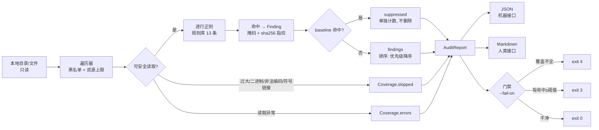
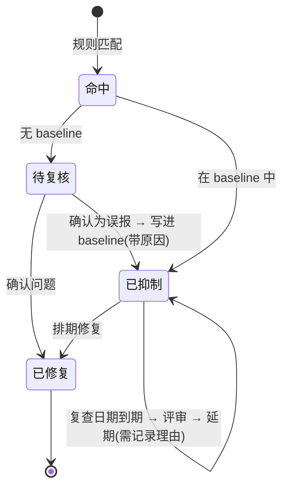

# Day 159 — 安全审计工具：架构与数据流图解

## 1. 端到端数据流



关键点：**跳过与错误(灰)与命中(黄)汇入同一个报告对象**。
只把命中写进报告的工具，会用"0 命中"撒谎；把缺口写进报告的
工具，才有资格说"这次没发现问题，且我知道自己漏了什么"。

## 2. 五个设计要素与它们的失败模式

```text
Target  ──►  Rule  ──►  Engine  ──►  Finding  ──►  Report
  │           │          │            │             │
  │           │          │            │             └─ 失败模式: 覆盖不声明
  │           │          │            └─ 失败模式: 证据含明文 → 二次泄露
  │           │          └─ 失败模式: 不设上限 → 拖死被审计机器
  │           └─ 失败模式: 没有 why/remediation → 复核人员只能猜
  └─ 失败模式: 默认扫全盘 → 越权 + 噪声淹没
```

## 3. triage 矩阵：影响 × 把握

严重度（行，客观影响）× 置信度（列，这条命中是问题的把握）：

```text
              confidence=low   medium   high
severity=critical   P0(10)      P0(15)   P0(15)   ← critical 与 high 同档: 宁可多看一眼
severity=high       P1(6)       P1(9)    P0(12)
severity=medium     P2(4)       P2(6)    P1(9)
severity=low        P3(2)       P3(3)    P2(4)    ← 低危+低把握 = 直接沉底
severity=info       P3(1)       P3(2)    P3(3)
```

公式：`priority = (severity_index + 1) × (confidence_index + 1)`，
分档：`≥12 → P0`、`≥8 → P1`、`≥4 → P2`、其余 `P3`。

为什么要乘而不是加？因为"确定的低危"和"不确定的高危"处理方式完全不同：
前者排期修，后者必须先去验证。加法会把这两种混成同一个分数。

## 4. 退出码语义（CI 接口）

```text
       ┌──────────────── 退出码优先级 ────────────────┐
       │ 高                                         低 │
       │ 2 用法/目标错误 → 4 覆盖不全 → 3 命中≥阈值 → 0 通过
       └───────────────────────────────────────────────┘
```

为什么"覆盖不全"要排在"命中"前面？
因为 CI 门禁的价值在于**可信**。当扫描只覆盖了 60% 的文件时，
"没有高危命中"这句话本身不成立；此时先修工具与权限，再谈修业务代码。

## 5. 报告的三层使用者

```text
JSON     ──► CI / 工单系统 / 后续 diff 比对（机器只吃结构化数据）
Markdown ──► 复核人员（要位置、证据、为什么、怎么修）
stderr   ──► 操作者（一行摘要 + 退出码解释，不污染报告正文）
```

一条实用纪律：**报告正文里不出现绝对路径和主机名**。
报告会被转发出去，`/home/niedong/internal-finance-svc/...` 这类路径
本身就是情报。末级目录名 + 相对路径足够定位问题。

## 6. baseline 的生命周期



baseline 是"我们已知并接受的风险清单"，不是回收站。
教程 / 注释 / 示例值造成的误报应当进 baseline；真实凭据绝不能进。
