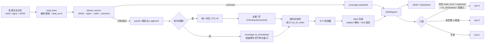
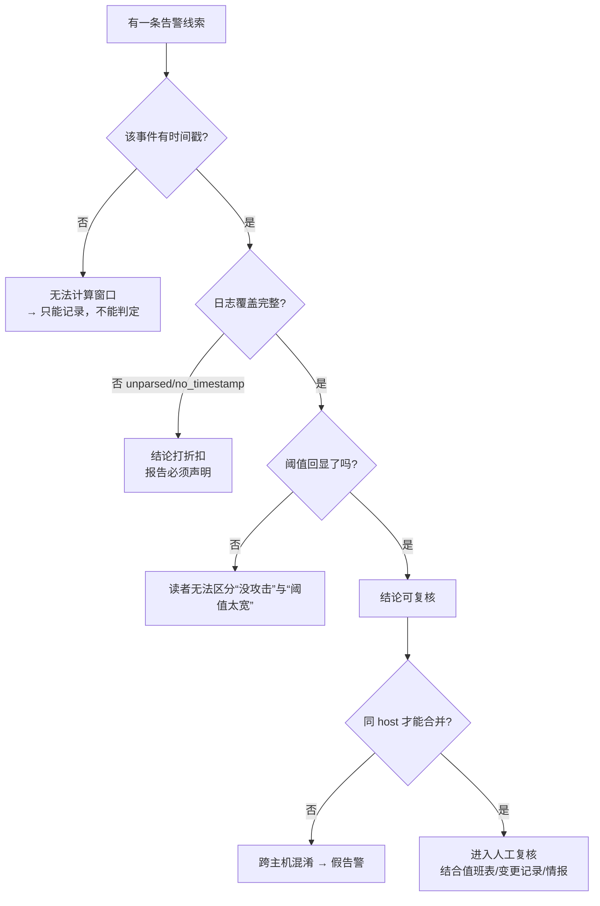

# Day 160 — 安全日志分析：标准化与检测图解

## 1. 端到端流水线



灰线（unparsed / no_timestamp / read_error）与告警同样重要：
它们是"这次分析的结论有多可信"的答案。

## 2. 时间窗口：滑动窗口统计

```text
失败事件（同一 host + src_ip）：
  t=0s   ●
  t=10s  ●
  t=20s  ●
  t=25s  ●
  t=40s  ●
  t=45s  ●
  t=50s  ●
  t=60s  ●
  t=65s  ●
  t=70s  ●
  ...
窗口 W = 300s，阈值 = 8

滑窗前进：每当右端纳入一个新事件，就弹出所有 (now - left) > W 的旧事件。
              ┌──────────── W = 300s ────────────┐
   ...  ●  ●  ●  ●  ●  ●  ●  ●  ●  ●
                                  ↑
                          窗口内计数 = 10 ≥ 8 → 告警

为什么用滑动窗口而不是"按固定分钟分桶"？
  分桶会给攻击者一个免费的规避手法：把 9 次失败均摊到相邻两个桶（各 4～5 次），
  两个桶都低于阈值。滑动窗口看的是"任意 W 秒内"，无法靠对齐边界躲开。
```

## 3. 主体键：为什么必须带 host

```text
日志合并前的两台机器：
  web01: admin ← 203.0.113.7   （失败 6 次）
  web02: admin ← 203.0.113.7   （失败 6 次）

错误做法：按 src_ip 聚合      → 203.0.113.7 共 12 次 → 1 条告警（跨主机混淆）
正确做法：按 (host, src_ip) 聚合 → 2 条独立告警，各 6 次 → 若阈值 8 则都不告警
                                    ↑
                    这才是事实：两台机器各自被尝试了 6 次，
                    而"同一台机器被打了 12 次"是一个不存在的场景。
```

同理，`(host, user)` 不能用 `user` 代替：`admin@web01` 与 `admin@web02`
可能是完全不同的人，也可能连账号体系都不同。

## 4. 分布式爆破：per-IP 规则的盲区

```text
单源规则（阈值 8）看到的：            账号聚合（阈值 10，来源 ≥3）看到的：
  198.51.100.1 → 3 次  ✗               svc@web01 ← {.1, .2, .3, .4, .5}
  198.51.100.2 → 3 次  ✗               600s 内 15 次失败，5 个来源
  198.51.100.3 → 3 次  ✗                        ↓
  198.51.100.4 → 3 次  ✗              告警：分布式口令猜测
  198.51.100.5 → 3 次  ✗              （severity=medium，confidence=medium：
                                        共享出口 IP / NAT 也可能长这样）
```

教训：**规则抓不到的东西，不代表没发生**。
报告里必须写清"本次跑了哪些检测器、用了什么阈值"，否则读报告的人
会以为"覆盖了全部攻击手法"。

## 5. 可判定性决策树



## 6. 七个检测器一览

| 检测器 | 主体键 | 严重度 | 置信度 | 主要误报来源 |
|---|---|---|---|---|
| `brute_force_single_source` | (host, src_ip) | high/critical | high | 自动化脚本用错凭据、健康检查 |
| `brute_force_distributed` | (host, user) | medium | medium | NAT/共享出口、代理池正常流量 |
| `failed_then_success` | (host, user, src_ip) | high | medium | 本人连续输错 | 
| `login_from_unexpected_source` | (host, user) | medium | medium | 出差、VPN 切换、动态 IP |
| `login_from_single_source` | (host, user) | low | low | 无基线时的启发式，几乎必然误报 |
| `off_hours_success` | (host, user) | low | low | 值班、发布窗口、跨时区 |
| `web_auth_abuse` | (host, src_ip) | medium | medium | 前端重试、监控探测 401 |
| `path_traversal_probe` | (host, src_ip) | medium | high | 安全扫描器、爬虫抓取历史链接 |

置信度不是"我们有多确定"，而是"**只看日志能有多确定**"。
没有值班表、变更记录、来源情报时，任何检测器的置信度都上不了 high——
这些外部信息才是把 confidence 抬起来的东西。
