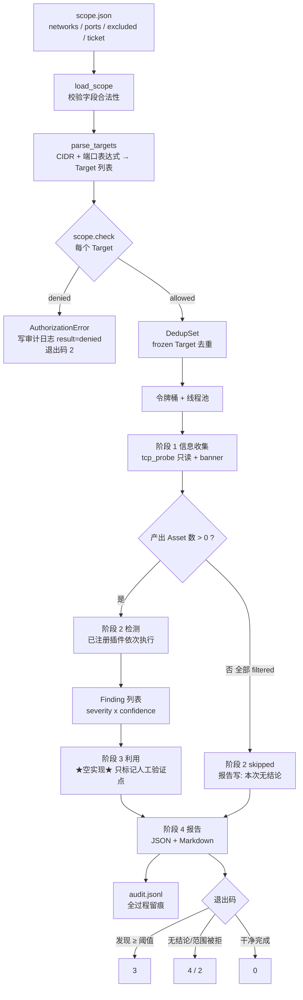

# Day 161 — 渗透测试框架：编排与范围校验图解

## 1. 框架全景（数据流 + 门禁）



注意 `阶段 3` 是灰色空实现：它**不产生任何网络行为**，
只在报告里输出"以下点位需要人工在授权窗口内验证"。

## 2. TCP connect 三态判定

```text
                       socket.connect_ex((host, port), timeout=0.5)
                                      │
        ┌─────────────────────────────┼───────────────────────────────┐
        ▼                             ▼                               ▼
   return 0                    ECONNREFUSED                       timeout
   ┌─────────┐                 ┌─────────┐                     ┌──────────┐
   │  open   │                 │ closed  │                     │ filtered │
   │ 有监听  │                 │ 主机活着│                     │ 不可判定 │
   │ 可抓banner│                │ 无服务  │                     │ 有拦截   │
   └────┬────┘                 └────┬────┘                     └────┬─────┘
        │                           │                               │
        ▼                           ▼                               ▼
  读服务主动发来的问候语       记 hosts_alive 事实            计入 coverage
  （绝不主动发送数据）        （主机存活是有用情报）        ★ 不可写成 closed ★
        │
        ▼
  service = guess_service(port, banner)
```

**关键：三态在报告里必须分开统计。**

```text
⚠️ 错误报告： 该网段仅 3 个端口开放           ← 把 filtered 当 closed
✅ 正确报告： 开放 3 / 关闭 12 / 不可判定 50（filtered，需换网络路径复测）
```

## 3. 阶段结果传播（skipped 的价值）

```text
阶段1 信息收集 ──ok(assets=4)──▶ 阶段2 检测 ──ok(findings=2)──▶ 阶段3 利用(空) ──▶ 报告
     │                               
     └──failed(全 timeout)──▶ 阶段2 = skipped("上游无可用资产")
                                    │
                                    ▼
                        报告写「本次无结论」，而不是「未发现问题」
                        ★ 静默失败：在空输入上算出 0 个问题 ⇒ 必须禁止 ★
```

## 4. 令牌桶限速

```text
capacity=5（= workers）, rate=2 conn/s

tokens
  5 ┤●●●●●
    │
  3 ┤●●●
    │        ← 每 0.5s 补 1 个（不超容量）
  1 ┤●
    │
  0 ┤   ●────●────●────●────●       取用=放行一个 connect
    └───┬────┬────┬────┬────┬────▶ t(s)
        0   0.5  1.0  1.5  2.0

workers=8  → 同时在途 ≤ 8   （背压）
rate=50/s  → 每秒新增 ≤ 50  （礼貌）
```

## 5. 插件注册表与执行顺序

```text
@framework.plugin("http_banner", priority=20)
def http_banner(ctx): ...

registry（有序）:
  ┌──────────────┬──────────┐
  │ name         │ priority │
  ├──────────────┼──────────┤
  │ port_state   │ 10       │  ← 先判端口状态（事实层）
  │ banner_grab  │ 20       │  ← 再抓 banner（事实层）
  │ service_guess│ 30       │  ← 再推服务（推断层）
  │ weak_config  │ 40       │  ← 最后做配置类判定（结论层）
  └──────────────┴──────────┘

规则：事实层 → 推断层 → 结论层；同 priority 按注册顺序（稳定）
代价：隐式控制流 + ctx 膨胀 → 用「只读 ctx + return Finding」约束
```

## 6. 审计日志时间线（一次真实运行的形状）

```text
09:10:01  scope_check  127.0.0.1:8000          in_scope    ticket=LAB-SELF-001
09:10:01  scope_check  10.0.0.5:22             denied      ← 越界！立即终止
09:10:01  run_abort    -                        exit=2      原因=AuthorizationError

（修正 scope 后重跑）
09:11:20  scope_check  127.0.0.1:8000          in_scope
09:11:20  phase_begin  collect                 targets=1
09:11:20  probe        127.0.0.1:8000          open        elapsed_ms=0.6
09:11:20  probe        127.0.0.1:8001          closed      elapsed_ms=0.3
09:11:21  phase_end    collect                 ok          assets=1 filtered=0
09:11:21  phase_begin  detect                  plugins=3
09:11:21  finding      127.0.0.1:8000          high/medium fake-ssh-banner
09:11:21  phase_end    detect                  ok          findings=1
09:11:21  phase_skip   exploit                 （本课空实现，等人工验证）
09:11:21  run_end       -                       exit=3      findings=1
```
