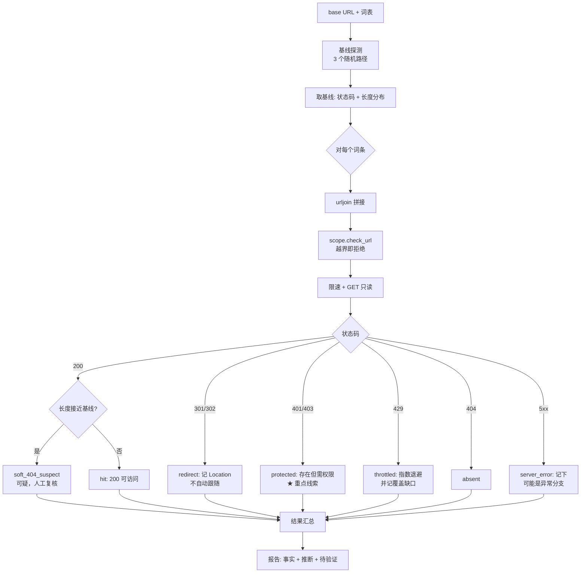

# Day 162 — 阶段项目（一）：安全审计工具箱 · 端口扫描 + 目录爆破 + 指纹识别

> **Phase 10 — 网络安全开发（Day 146–165）** · 主题：安全审计工具箱（Day 162–165 四天项目的第 1 天）
>
> **使用边界（重要）**：
> - 只对**你自己拥有、或已获书面授权**的目标做审计。
> - 本课所有实验都跑在 `127.0.0.1` 上的**自建实验服务**（`code/audit_core.py` 里的 `LabHTTP`）。
> - 探测全部**只读**：TCP connect、`GET` 请求。**不做**登录爆破、**不做**参数注入、
>   **不上传**任何文件、**不改动**目标任何数据。
> - 目录爆破使用**内置的 30 个词条**，且默认限速 5 请求/秒——
>   目的是讲清机制，不是提供"扫站武器"。
> - 教材中的地址一律为回环或文档网段（RFC 5737）。

## 1. 学习目标

完成本课后，你应该能够：

- 说清"安全审计工具箱"这个项目的模块边界：**端口扫描 / 目录爆破 / 指纹识别**各解决什么问题
- 解释 **TCP connect 三态**（`open` / `closed` / `filtered`）在**报告层面**的区别，
  以及为什么 `filtered` 必须写成"不可判定"
- 解释**目录爆破**的判定逻辑：状态码分类 + **软 404 基线** + 响应长度噪声
- 说清 `403` / `301` / `200` / `429` 在目录爆破中**分别意味着什么**，
  以及为什么"只认 200"会漏掉最关键的一类发现（**403 往往才是真正的入口**）
- 实现一个**指纹识别器**：把 Server 头、`X-Powered-By`、Cookie 名、`<title>`、
  `meta generator` 等信号汇总成"技术栈推断 + 置信度"
- 明确指纹识别**为什么天然低置信**：所有信号都由目标控制，可以被任意伪造
- 把三个模块整合成一个 CLI，输出统一的 JSON/Markdown 报告与语义化退出码
- 说清本工具**不做**什么（利用、提权、绕过、处置），以及这些边界为什么是必要的

## 2. 概念解释

### 2.1 阶段项目要做什么

Day 159 做了"审计工具箱 v0"（规则引擎 + 报告 + CLI 门禁），Day 160 做了日志分析。
Day 162–165 把这几天分散的能力**拼成一个完整的资产审计工具**，四天分工：

```text
Day 162（今天）  资产面：端口扫描 + 目录爆破 + 指纹识别   ← 先知道"有什么"
Day 163          漏洞面：SQLi 检测 + XSS 检测             ← 再知道"哪里可能有问题"
Day 164          流量面：代理中间人 + 流量分析             ← 再看"实际发生了什么"
Day 165          交付面：报告生成 + Docker 部署            ← 最后"怎么交出去"
```

**为什么资产面必须先做？** 因为漏洞检测需要"目标清单 + 参数清单 + 技术栈",
这三样全靠今天这三个模块产出。没有它们，后面的检测器只能靠人工喂 URL。

### 2.2 三个模块的职责与失败模式

| 模块 | 输入 → 输出 | 核心难点 | 典型失败模式 |
|---|---|---|---|
| **端口扫描** | IP/CIDR + 端口范围 → 开放端口 + 服务 | 三态判定、超时、限速 | 把 `filtered` 当 `closed`；超时不合理 |
| **目录爆破** | URL + 词表 → 可访问路径 + 状态分类 | **软 404**、响应长度噪声、限速 | 把软 404 全当"发现"；漏掉 403 |
| **指纹识别** | 响应头 + HTML → 技术栈推断 | 信号可信度、误判、版本泄露 | 把可伪造的头当事实；置信度虚高 |

三者的共同点：**它们都只产出"线索"，不产出"结论"。**
报告里必须区分"看到的事实"（`Server: lab-nginx/1.18.0` 这个字符串出现了）
与"推断的结论"（"这可能是 nginx 1.18.0"），后者置信度上限受目标可控性限制。

### 2.3 目录爆破的判定逻辑（这是本课最容易写错的地方）

一个朴素实现是：**状态码 200 → 存在；其他 → 不存在**。它有三个致命问题：

**问题 1：软 404（soft 404）。** 很多服务对不存在的路径也返回 `200` +
一个"页面不存在"的 HTML。这时"200 即存在"会产出成百个假发现。

```text
GET /a7f3k2  → 200, len=812, body="<h1>Page Not Found</h1>…"   ← 随机路径也是 200！
GET /admin/  → 200, len=1240                                   ← 这才是真的
```

**解法：先取基线。** 用**随机生成**的路径发若干次请求，得到"不存在时"的
`(状态码, 响应长度)` 基线；之后凡是与基线"状态码相同且长度接近"的结果，
一律标记为 `soft_404`（**可疑但不确认**）。

**问题 2：只认 200，漏掉最有价值的发现。**

| 状态码 | 含义 | 在目录爆破里的意义 |
|---|---|---|
| `200` | 可访问 | 存在且可读（但也可能是软 404） |
| `301`/`302` | 重定向 | 存在；常是"目录少了斜杠"或登录跳转 |
| **`403`** | **存在但禁止访问** | **最值得关注**：路径真实存在，只是当前身份没权限；往往是管理入口 |
| `401` | 需要认证 | 存在，且明确要求凭据 |
| `429` | 被限速 | **不是"不存在"**，而是"你问得太快"——必须退避 |
| `404` | 不存在 | 常规"没有" |
| `500` | 服务端错误 | 路径可能触发了异常处理分支（也要记） |

**问题 3：429 被当成 404。** 目录爆破最容易被目标的反自动化机制拦下。
一旦出现 `429`，正确动作是**指数退避 + 记录覆盖缺口**，而不是继续猛冲，
更不是把 429 记成"不存在"——那会让报告谎称"扫描完成、无发现"。

### 2.4 指纹识别：信号与可信度

指纹识别的本质是**从响应里找"厂商线索"**，然后推断。常用信号及可信度：

| 信号 | 例子 | 可信度 | 为什么 |
|---|---|---|---|
| `Server` 响应头 | `lab-nginx/1.18.0` | **低** | 可任意伪造；反向代理会覆盖 |
| `X-Powered-By` | `PHP/7.4.33` | 低 | 同上，且常被安全加固移除 |
| `Set-Cookie` 名称 | `LABSESSID`、`PHPSESSID` | 中 | 改名容易，但改名成本高于改头 |
| HTML `<title>` | `Lab Portal` | 中 | 反映业务，不反映技术栈 |
| `<meta name="generator">` | `lab-cms 0.9` | 中 | 由 CMS 模板输出，改动需改模板 |
| 特有路径 | `/server-status` + `Apache` 风格输出 | 中高 | 需要真的存在该模块 |
| 错误页特征 | Tomcat 的 `404` 页样式 | 中 | 需要覆盖默认配置才会变 |

**结论：单靠响应头的指纹，置信度上限是"低"。**
要提升到"中"，必须**多信号交叉**（例如 `Server` + Cookie 名 + 特有路径 三者一致）。
要提升到"高"，需要**主动验证**——而主动验证通常意味着发更多请求，
**可能越界**，所以本课刻意停在"中"，并在报告里写明"需要人工确认"。

### 2.5 为什么要限速：目录爆破的伦理下限

目录爆破是**请求量最大**的模块。1000 词表 × 10 个目录 = 10000 次请求，
这已经不是"测试"，而是"压力测试"。所以本课设了三条硬规则：

1. **默认 5 请求/秒**（约等于人工浏览的速度），并发 1（串行）。
2. **词表上限 30 条**（内置），且每条例都是常见的**公开文档化路径**。
3. **出现 429 立刻退避**（0.5s → 1s → 2s，上限 4s），并把"未完成"写进报告。

这三条不是性能妥协，而是**授权边界的技术表达**：
"我被允许探测，但没有被允许压垮目标。"

### 2.6 从"线索"到"报告"：三档措辞

| 档位 | 措辞模板 | 用于 |
|---|---|---|
| 事实 | "响应中出现 `Server: lab-nginx/1.18.0`" | 头字段、状态码、长度 |
| 推断 | "疑似 nginx 1.18.0（多信号交叉，置信度中）" | 指纹 |
| 待验证 | "需要人工在授权窗口内确认（登录页是否存在默认凭据）" | 403/401 的入口 |

**永远不要在报告里写"发现漏洞"** ——除非有人工验证记录。
本工具只做到第二档。

## 3. 原理深入

### 3.1 URL 拼接：为什么必须用 `urljoin` 而不是字符串相加

目录爆破要处理三类路径：

```text
/admin      （相对路径）
/admin/     （目录）
http://other/evil   （绝对 URL —— 危险！）
```

如果直接 `base + path`，第三条会拼成 `http://127.0.0.1:8080http://other/evil`；
如果用 `urljoin(base, path)`，第三条会变成 **`http://other/evil`** ——
**跳出授权范围**。所以本课在拼接后**必须再做一次范围校验**：

```text
urljoin(base, word)  →  scope.check_url(url)  →  通过才允许发请求
```

这是 Day 161 "范围门禁" 在 HTTP 层的复刻：**任何由外部输入构造出的目标，
在使用前都要重新校验。**

### 3.2 不跟随重定向：为什么要"看见"而不是"走完"

`urllib` 默认自动跟随 301/302。目录爆破里这会导致两个问题：

1. **真实状态被隐藏**：`/admin` → 301 → `/admin/` → 200，
   你只知道最终 200，看不出"少了斜杠"这个事实；
2. **可能被引到范围外**：`Location: http://other/...` 会被自动跟随。

所以本课用自定义 `HTTPRedirectHandler` 捕获重定向而**不自动跟随**，
在结果里记录 `redirect_to`，由调用方决定是否人工跟进（并重新校验范围）。

### 3.3 响应长度噪声：为什么用"接近"而不是"相等"

软 404 的页面里常常嵌有时间戳、随机 token、访问 ID。同一个 404 页面
两次请求的长度可能差 30~50 字节。所以判定要容差：

```text
|len(result) - len(baseline)| ≤ max(32, 5% × len(baseline))  →  视为与基线一致（软 404）
```

**但要注意反向风险**：容差太大，会把真实存在的页面误判成软 404（漏报）。
所以本课的做法是**双重标记**：既算 `soft_404_suspect`，也保留原始长度，
让人工复核时能看到"它到底有多像基线"。

### 3.4 会话与 Cookie：为什么本课不发第二类请求

真实工具常做"先登录、再带 Cookie 扫"以发现更多路径。本课**不做**：

- 登录尝试 = 凭据爆破边缘，必须有**单独的书面授权**；
- 带 Cookie 的扫描会访问**已认证区域**，可能触碰到真实业务数据；
- 一旦自动化登录出错（例如被锁账号），会造成**生产事故**。

所以本课只做**匿名视角**的审计，并在报告里明确声明："本次未使用任何凭据，
因此认证后可见的路径不在覆盖范围内。" 这句话本身就是报告可信度的一部分。

### 3.5 指纹识别为什么"必须允许被证伪"

指纹断言的形式必须是**可证伪**的：

```text
❌ 不受证伪："目标使用 nginx"
✅ 可证伪：  "响应头 Server 的值为 'lab-nginx/1.18.0'（证据），
              推断为 nginx 系（置信度：中，依据：单信号未交叉验证）"
```

为什么？因为指纹会直接影响后续行动（决定测哪些漏洞、用什么手法）。
一个不可证伪的断言会让人**无法反驳、也难以复核**。
把"证据 + 推断 + 置信度"三件套写在一起，
复核者才能独立判断"这个推断值不值得信"。

## 4. 核心机制详解

### 4.1 端口扫描：三态与"服务推断"的两步走

```text
目标 host:port
   │
   ├─ connect_ex == 0        → open       → 抓 banner（只读服务主动发的问候语）
   ├─ errno == 111 (ECONNREFUSED) → closed → 主机存活，该端口无服务
   ├─ timeout / errno == 11  → filtered   → 不可判定（被过滤或链路问题）
   └─ 其他 OSError           → error      → 本轮无有效结论
```

**服务名是两步推断的**：

1. **banner 优先**：`SSH-2.0-…` → ssh；`HTTP/1.1 …` → http；
   `220 …ESMTP` → smtp。banner 是服务自报家门，比端口号可靠。
2. **端口号兜底**：没有 banner 时用 IANA 端口对照表（80 → http），
   但要在报告里标注 `service_source="port_map"`（**低置信**），
   因为端口可以随意改（把 SSH 放到 443 是很常见的做法）。

为什么必须标注来源？因为"8080 是 HTTP"和"8080 的 banner 自称 HTTP"
是两个完全不同可信度的断言。

### 4.2 目录爆破的完整判定流水线



### 4.3 指数退避的数学：为什么是 ×2 而不是 ×1.5

被限速（429）时，目标是"在不加剧压力的前提下尽快恢复"。退避序列：

```text
第 1 次 429 → 等 0.5s
第 2 次     → 等 1.0s
第 3 次     → 等 2.0s
第 4 次     → 等 4.0s（上限）
```

为什么翻倍？因为 429 通常来自**滑动窗口限流**：如果窗口是 60 秒 100 次，
等待时间必须与"超出量"同量级才能复原。×2 的增长在 4 次内就能覆盖 8 倍量级，
而 ×1.5 需要约 5~6 次；同时 ×2 的实现最简单（一个乘法），不容易写出 bug。

**上限 4 秒的意义**：防止退避退到"扫描实际停止"。
如果连续 429 到上限仍然被拒，正确动作是**停止并把"未完成的词条数"写进报告**，
而不是无限等待（那会变成对目标的持久占用）。

### 4.4 指纹信号聚合：为什么用"清单 + 打分"而不是"if-else 大判断"

朴素写法：

```python
if "nginx" in server: tech = "nginx"
elif "apache" in server: tech = "apache"
```

它的问题：**无法表达多信号、无法表达置信度、无法表达证据**。
本课改成"信号清单"结构：

```text
Signals = [ (tech, source, value, weight), ... ]

Server: lab-nginx/1.18.0     → (nginx, "header:Server", "lab-nginx/1.18.0", 0.4)
Set-Cookie: LABSESSID=…      → (lab-cms, "cookie", "LABSESSID", 0.3)
<meta generator="lab-cms 0.9">→ (lab-cms, "html:meta", "lab-cms 0.9", 0.5)
/server-status 200 Apache 风格→ (apache, "path:/server-status", "…", 0.6)

聚合：按 tech 累加 weight（上限 0.95）
  置信度 = high ≥0.8 ；medium ≥0.5 ；low ≥0.2 ；info <0.2
```

好处：**可解释**。报告能写出"因为看到 A、B、C，所以推断 X（权重合计 0.7）"。
复核者可以逐条反驳——这就是 3.5 节说的"可证伪"。

### 4.5 统一报告：三模块结果如何合并

三个模块产出三类不同结构，报告层用一个**统一的 Finding 模型**收敛：

```text
Finding(key, title, severity, confidence, target, evidence, detail)
priority = (severity+1) × (confidence+1) → P0/P1/P2/P3
```

| 模块 | 产出 Finding 的示例 | severity / confidence |
|---|---|---|
| 端口扫描 | `unexpected_open_port`（高位端口暴露） | info / medium |
| 端口扫描 | `cleartext_service`（http/telnet） | high / medium |
| 目录爆破 | `protected_path`（403/401） | medium / **high**（状态码是硬事实） |
| 目录爆破 | `backup_artifact`（`/backup.zip` 可下载） | high / medium |
| 目录爆破 | `soft_404_noise`（基线一致） | info / high |
| 指纹识别 | `tech_fingerprint`（多信号） | info / medium |
| 指纹识别 | `version_disclosure` | low / medium |

**注意 `protected_path` 的置信度是 high**：`403` 这个状态码本身是硬事实
（服务器明确说了"存在但禁止"），只是"它是否重要"需要人工判断。
**事实的置信度**和**重要性的置信度**是两回事，报告里必须分开。

### 4.6 退出码与覆盖缺口

沿用 Day 159–161 的语义：

```text
2  用法/范围错误（越界 URL、参数非法）        → 不可执行
4  覆盖不完整（存在 429/timeout/filtered）    → 本轮无结论
3  有 P0/P1 发现                              → 进入人工复核
0  干净完成                                   → 归档
优先级：2 > 4 > 3 > 0
```

**新增一条与 429 相关的规则**：目录爆破只要出现 **≥1 次 429**，
整轮就标记 `coverage.incomplete=True`，退出码至少为 4。
理由：429 说明"目标认为我在压它"，此时任何"未发现"的结论都不成立——
**漏掉的路径可能就在被限速的那段时间里。**
