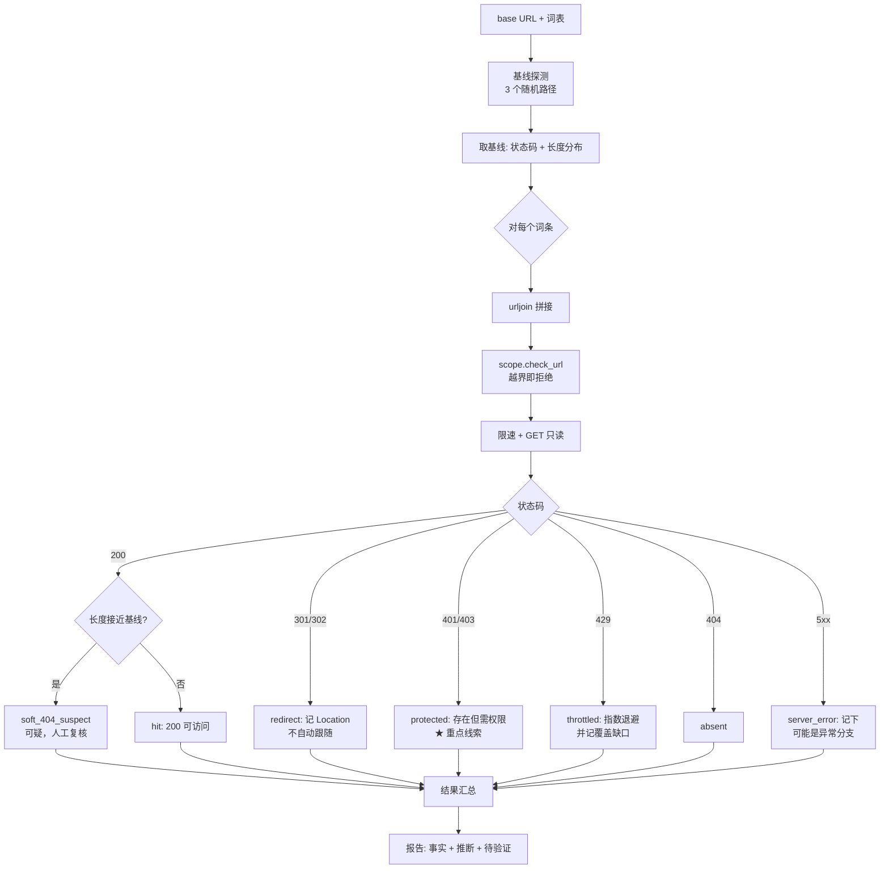

# Day 162 — 阶段项目（一）：安全审计工具箱 · 端口扫描 + 目录爆破 + 指纹识别

> **Phase 10 — 网络安全开发（Day 146–165）** · 主题：安全审计工具箱（Day 162–165 四天项目的第 1 天）
>
> **使用边界（重要）**：
> - 只对**你自己拥有、或已获书面授权**的目标做审计。
> - 本课所有实验都跑在 `127.0.0.1` 上的**自建实验服务**（`code/audit_core.py` 里的 `LabHTTP`）。
> - 探测全部**只读**：TCP connect、`GET` 请求。**不做**登录爆破、**不做**参数注入、
>   **不上传**任何文件、**不改动**目标任何数据。
> - 目录爆破使用**内置的 30 个词条**，且默认限速 5 请求/秒——
>   目的是讲清机制，不是提供"扫站武器"。
> - 教材中的地址一律为回环或文档网段（RFC 5737）。

## 1. 学习目标

完成本课后，你应该能够：

- 说清"安全审计工具箱"这个项目的模块边界：**端口扫描 / 目录爆破 / 指纹识别**各解决什么问题
- 解释 **TCP connect 三态**（`open` / `closed` / `filtered`）在**报告层面**的区别，
  以及为什么 `filtered` 必须写成"不可判定"
- 解释**目录爆破**的判定逻辑：状态码分类 + **软 404 基线** + 响应长度噪声
- 说清 `403` / `301` / `200` / `429` 在目录爆破中**分别意味着什么**，
  以及为什么"只认 200"会漏掉最关键的一类发现（**403 往往才是真正的入口**）
- 实现一个**指纹识别器**：把 Server 头、`X-Powered-By`、Cookie 名、`<title>`、
  `meta generator` 等信号汇总成"技术栈推断 + 置信度"
- 明确指纹识别**为什么天然低置信**：所有信号都由目标控制，可以被任意伪造
- 把三个模块整合成一个 CLI，输出统一的 JSON/Markdown 报告与语义化退出码
- 说清本工具**不做**什么（利用、提权、绕过、处置），以及这些边界为什么是必要的

## 2. 概念解释

### 2.1 阶段项目要做什么

Day 159 做了"审计工具箱 v0"（规则引擎 + 报告 + CLI 门禁），Day 160 做了日志分析。
Day 162–165 把这几天分散的能力**拼成一个完整的资产审计工具**，四天分工：

```text
Day 162（今天）  资产面：端口扫描 + 目录爆破 + 指纹识别   ← 先知道"有什么"
Day 163          漏洞面：SQLi 检测 + XSS 检测             ← 再知道"哪里可能有问题"
Day 164          流量面：代理中间人 + 流量分析             ← 再看"实际发生了什么"
Day 165          交付面：报告生成 + Docker 部署            ← 最后"怎么交出去"
```

**为什么资产面必须先做？** 因为漏洞检测需要"目标清单 + 参数清单 + 技术栈",
这三样全靠今天这三个模块产出。没有它们，后面的检测器只能靠人工喂 URL。

### 2.2 三个模块的职责与失败模式

| 模块 | 输入 → 输出 | 核心难点 | 典型失败模式 |
|---|---|---|---|
| **端口扫描** | IP/CIDR + 端口范围 → 开放端口 + 服务 | 三态判定、超时、限速 | 把 `filtered` 当 `closed`；超时不合理 |
| **目录爆破** | URL + 词表 → 可访问路径 + 状态分类 | **软 404**、响应长度噪声、限速 | 把软 404 全当"发现"；漏掉 403 |
| **指纹识别** | 响应头 + HTML → 技术栈推断 | 信号可信度、误判、版本泄露 | 把可伪造的头当事实；置信度虚高 |

三者的共同点：**它们都只产出"线索"，不产出"结论"。**
报告里必须区分"看到的事实"（`Server: lab-nginx/1.18.0` 这个字符串出现了）
与"推断的结论"（"这可能是 nginx 1.18.0"），后者置信度上限受目标可控性限制。

### 2.3 目录爆破的判定逻辑（这是本课最容易写错的地方）

一个朴素实现是：**状态码 200 → 存在；其他 → 不存在**。它有三个致命问题：

**问题 1：软 404（soft 404）。** 很多服务对不存在的路径也返回 `200` +
一个"页面不存在"的 HTML。这时"200 即存在"会产出成百个假发现。

```text
GET /a7f3k2  → 200, len=812, body="<h1>Page Not Found</h1>…"   ← 随机路径也是 200！
GET /admin/  → 200, len=1240                                   ← 这才是真的
```

**解法：先取基线。** 用**随机生成**的路径发若干次请求，得到"不存在时"的
`(状态码, 响应长度)` 基线；之后凡是与基线"状态码相同且长度接近"的结果，
一律标记为 `soft_404`（**可疑但不确认**）。

**问题 2：只认 200，漏掉最有价值的发现。**

| 状态码 | 含义 | 在目录爆破里的意义 |
|---|---|---|
| `200` | 可访问 | 存在且可读（但也可能是软 404） |
| `301`/`302` | 重定向 | 存在；常是"目录少了斜杠"或登录跳转 |
| **`403`** | **存在但禁止访问** | **最值得关注**：路径真实存在，只是当前身份没权限；往往是管理入口 |
| `401` | 需要认证 | 存在，且明确要求凭据 |
| `429` | 被限速 | **不是"不存在"**，而是"你问得太快"——必须退避 |
| `404` | 不存在 | 常规"没有" |
| `500` | 服务端错误 | 路径可能触发了异常处理分支（也要记） |

**问题 3：429 被当成 404。** 目录爆破最容易被目标的反自动化机制拦下。
一旦出现 `429`，正确动作是**指数退避 + 记录覆盖缺口**，而不是继续猛冲，
更不是把 429 记成"不存在"——那会让报告谎称"扫描完成、无发现"。

### 2.4 指纹识别：信号与可信度

指纹识别的本质是**从响应里找"厂商线索"**，然后推断。常用信号及可信度：

| 信号 | 例子 | 可信度 | 为什么 |
|---|---|---|---|
| `Server` 响应头 | `lab-nginx/1.18.0` | **低** | 可任意伪造；反向代理会覆盖 |
| `X-Powered-By` | `PHP/7.4.33` | 低 | 同上，且常被安全加固移除 |
| `Set-Cookie` 名称 | `LABSESSID`、`PHPSESSID` | 中 | 改名容易，但改名成本高于改头 |
| HTML `<title>` | `Lab Portal` | 中 | 反映业务，不反映技术栈 |
| `<meta name="generator">` | `lab-cms 0.9` | 中 | 由 CMS 模板输出，改动需改模板 |
| 特有路径 | `/server-status` + `Apache` 风格输出 | 中高 | 需要真的存在该模块 |
| 错误页特征 | Tomcat 的 `404` 页样式 | 中 | 需要覆盖默认配置才会变 |

**结论：单靠响应头的指纹，置信度上限是"低"。**
要提升到"中"，必须**多信号交叉**（例如 `Server` + Cookie 名 + 特有路径 三者一致）。
要提升到"高"，需要**主动验证**——而主动验证通常意味着发更多请求，
**可能越界**，所以本课刻意停在"中"，并在报告里写明"需要人工确认"。

### 2.5 为什么要限速：目录爆破的伦理下限

目录爆破是**请求量最大**的模块。1000 词表 × 10 个目录 = 10000 次请求，
这已经不是"测试"，而是"压力测试"。所以本课设了三条硬规则：

1. **默认 5 请求/秒**（约等于人工浏览的速度），并发 1（串行）。
2. **词表上限 30 条**（内置），且每条例都是常见的**公开文档化路径**。
3. **出现 429 立刻退避**（0.5s → 1s → 2s，上限 4s），并把"未完成"写进报告。

这三条不是性能妥协，而是**授权边界的技术表达**：
"我被允许探测，但没有被允许压垮目标。"

### 2.6 从"线索"到"报告"：三档措辞

| 档位 | 措辞模板 | 用于 |
|---|---|---|
| 事实 | "响应中出现 `Server: lab-nginx/1.18.0`" | 头字段、状态码、长度 |
| 推断 | "疑似 nginx 1.18.0（多信号交叉，置信度中）" | 指纹 |
| 待验证 | "需要人工在授权窗口内确认（登录页是否存在默认凭据）" | 403/401 的入口 |

**永远不要在报告里写"发现漏洞"** ——除非有人工验证记录。
本工具只做到第二档。

## 3. 原理深入

### 3.1 URL 拼接：为什么必须用 `urljoin` 而不是字符串相加

目录爆破要处理三类路径：

```text
/admin      （相对路径）
/admin/     （目录）
http://other/evil   （绝对 URL —— 危险！）
```

如果直接 `base + path`，第三条会拼成 `http://127.0.0.1:8080http://other/evil`；
如果用 `urljoin(base, path)`，第三条会变成 **`http://other/evil`** ——
**跳出授权范围**。所以本课在拼接后**必须再做一次范围校验**：

```text
urljoin(base, word)  →  scope.check_url(url)  →  通过才允许发请求
```

这是 Day 161 "范围门禁" 在 HTTP 层的复刻：**任何由外部输入构造出的目标，
在使用前都要重新校验。**

### 3.2 不跟随重定向：为什么要"看见"而不是"走完"

`urllib` 默认自动跟随 301/302。目录爆破里这会导致两个问题：

1. **真实状态被隐藏**：`/admin` → 301 → `/admin/` → 200，
   你只知道最终 200，看不出"少了斜杠"这个事实；
2. **可能被引到范围外**：`Location: http://other/...` 会被自动跟随。

所以本课用自定义 `HTTPRedirectHandler` 捕获重定向而**不自动跟随**，
在结果里记录 `redirect_to`，由调用方决定是否人工跟进（并重新校验范围）。

### 3.3 响应长度噪声：为什么用"接近"而不是"相等"

软 404 的页面里常常嵌有时间戳、随机 token、访问 ID。同一个 404 页面
两次请求的长度可能差 30~50 字节。所以判定要容差：

```text
|len(result) - len(baseline)| ≤ max(32, 5% × len(baseline))  →  视为与基线一致（软 404）
```

**但要注意反向风险**：容差太大，会把真实存在的页面误判成软 404（漏报）。
所以本课的做法是**双重标记**：既算 `soft_404_suspect`，也保留原始长度，
让人工复核时能看到"它到底有多像基线"。

### 3.4 会话与 Cookie：为什么本课不发第二类请求

真实工具常做"先登录、再带 Cookie 扫"以发现更多路径。本课**不做**：

- 登录尝试 = 凭据爆破边缘，必须有**单独的书面授权**；
- 带 Cookie 的扫描会访问**已认证区域**，可能触碰到真实业务数据；
- 一旦自动化登录出错（例如被锁账号），会造成**生产事故**。

所以本课只做**匿名视角**的审计，并在报告里明确声明："本次未使用任何凭据，
因此认证后可见的路径不在覆盖范围内。" 这句话本身就是报告可信度的一部分。

### 3.5 指纹识别为什么"必须允许被证伪"

指纹断言的形式必须是**可证伪**的：

```text
❌ 不受证伪："目标使用 nginx"
✅ 可证伪：  "响应头 Server 的值为 'lab-nginx/1.18.0'（证据），
              推断为 nginx 系（置信度：中，依据：单信号未交叉验证）"
```

为什么？因为指纹会直接影响后续行动（决定测哪些漏洞、用什么手法）。
一个不可证伪的断言会让人**无法反驳、也难以复核**。
把"证据 + 推断 + 置信度"三件套写在一起，
复核者才能独立判断"这个推断值不值得信"。

## 4. 核心机制详解

### 4.1 端口扫描：三态与"服务推断"的两步走

```text
目标 host:port
   │
   ├─ connect_ex == 0        → open       → 抓 banner（只读服务主动发的问候语）
   ├─ errno == 111 (ECONNREFUSED) → closed → 主机存活，该端口无服务
   ├─ timeout / errno == 11  → filtered   → 不可判定（被过滤或链路问题）
   └─ 其他 OSError           → error      → 本轮无有效结论
```

**服务名是两步推断的**：

1. **banner 优先**：`SSH-2.0-…` → ssh；`HTTP/1.1 …` → http；
   `220 …ESMTP` → smtp。banner 是服务自报家门，比端口号可靠。
2. **端口号兜底**：没有 banner 时用 IANA 端口对照表（80 → http），
   但要在报告里标注 `service_source="port_map"`（**低置信**），
   因为端口可以随意改（把 SSH 放到 443 是很常见的做法）。

为什么必须标注来源？因为"8080 是 HTTP"和"8080 的 banner 自称 HTTP"
是两个完全不同可信度的断言。

### 4.2 目录爆破的完整判定流水线



### 4.3 指数退避的数学：为什么是 ×2 而不是 ×1.5

被限速（429）时，目标是"在不加剧压力的前提下尽快恢复"。退避序列：

```text
第 1 次 429 → 等 0.5s
第 2 次     → 等 1.0s
第 3 次     → 等 2.0s
第 4 次     → 等 4.0s（上限）
```

为什么翻倍？因为 429 通常来自**滑动窗口限流**：如果窗口是 60 秒 100 次，
等待时间必须与"超出量"同量级才能复原。×2 的增长在 4 次内就能覆盖 8 倍量级，
而 ×1.5 需要约 5~6 次；同时 ×2 的实现最简单（一个乘法），不容易写出 bug。

**上限 4 秒的意义**：防止退避退到"扫描实际停止"。
如果连续 429 到上限仍然被拒，正确动作是**停止并把"未完成的词条数"写进报告**，
而不是无限等待（那会变成对目标的持久占用）。

### 4.4 指纹信号聚合：为什么用"清单 + 打分"而不是"if-else 大判断"

朴素写法：

```python
if "nginx" in server: tech = "nginx"
elif "apache" in server: tech = "apache"
```

它的问题：**无法表达多信号、无法表达置信度、无法表达证据**。
本课改成"信号清单"结构：

```text
Signals = [ (tech, source, value, weight), ... ]

Server: lab-nginx/1.18.0     → (nginx, "header:Server", "lab-nginx/1.18.0", 0.4)
Set-Cookie: LABSESSID=…      → (lab-cms, "cookie", "LABSESSID", 0.3)
<meta generator="lab-cms 0.9">→ (lab-cms, "html:meta", "lab-cms 0.9", 0.5)
/server-status 200 Apache 风格→ (apache, "path:/server-status", "…", 0.6)

聚合：按 tech 累加 weight（上限 0.95）
  置信度 = high ≥0.8 ；medium ≥0.5 ；low ≥0.2 ；info <0.2
```

好处：**可解释**。报告能写出"因为看到 A、B、C，所以推断 X（权重合计 0.7）"。
复核者可以逐条反驳——这就是 3.5 节说的"可证伪"。

### 4.5 统一报告：三模块结果如何合并

三个模块产出三类不同结构，报告层用一个**统一的 Finding 模型**收敛：

```text
Finding(key, title, severity, confidence, target, evidence, detail)
priority = (severity+1) × (confidence+1) → P0/P1/P2/P3
```

| 模块 | 产出 Finding 的示例 | severity / confidence |
|---|---|---|
| 端口扫描 | `unexpected_open_port`（高位端口暴露） | info / medium |
| 端口扫描 | `cleartext_service`（http/telnet） | high / medium |
| 目录爆破 | `protected_path`（403/401） | medium / **high**（状态码是硬事实） |
| 目录爆破 | `backup_artifact`（`/backup.zip` 可下载） | high / medium |
| 目录爆破 | `soft_404_noise`（基线一致） | info / high |
| 指纹识别 | `tech_fingerprint`（多信号） | info / medium |
| 指纹识别 | `version_disclosure` | low / medium |

**注意 `protected_path` 的置信度是 high**：`403` 这个状态码本身是硬事实
（服务器明确说了"存在但禁止"），只是"它是否重要"需要人工判断。
**事实的置信度**和**重要性的置信度**是两回事，报告里必须分开。

### 4.6 退出码与覆盖缺口

沿用 Day 159–161 的语义：

```text
2  用法/范围错误（越界 URL、参数非法）        → 不可执行
4  覆盖不完整（存在 429/timeout/filtered）    → 本轮无结论
3  有 P0/P1 发现                              → 进入人工复核
0  干净完成                                   → 归档
优先级：2 > 4 > 3 > 0
```

**新增一条与 429 相关的规则**：目录爆破只要出现 **≥1 次 429**，
整轮就标记 `coverage.incomplete=True`，退出码至少为 4。
理由：429 说明"目标认为我在压它"，此时任何"未发现"的结论都不成立——
**漏掉的路径可能就在被限速的那段时间里。**

## 5. API 速查

### 5.1 `audit_core` 模块速查

| 名称 | 类型 | 作用 | 关键点 |
|---|---|---|---|
| `Scope(networks, ports, http_bases, ticket)` | dataclass | 授权范围 | `check_host_port` / `check_url` 是仅有的两个出口 |
| `Scope.check_url(url)` | 方法 | **HTTP 层门禁** | 协议/主机/端口 + 基址前缀三重校验 |
| `parse_host_spec(spec)` | 函数 | IP/CIDR → 主机表 | **拒绝域名**（避免 DNS 外发） |
| `parse_port_spec(spec)` | 函数 | `"8080,8000-8002"` → 端口表 | 有序去重 |
| `LabHTTP(port, throttle_after)` | 类 | 本机实验服务 | `throttle_after=N`：第 N 个请求后返回 429 |
| `fetch(url, timeout)` | 函数 | **只读 GET** | 不跟随重定向、不带凭据、体只读 4KB |
| `HttpResult` | dataclass | 响应快照 | `status/length/headers/redirect_to/error` |
| `scan_port(host, port, timeout, retries)` | 函数 | 单端口探测 | 三态 + banner + `service_source` |
| `scan_ports(hosts, ports, scope, ...)` | 函数 | 批量探测 | 内部先过门禁，再限速 |
| `TokenBucket(rate, capacity).acquire()` | 类 | 限速 | 默认 5 请求/秒（目录爆破） |
| `build_baseline(base, scope, samples=3)` | 函数 | **软 404 基线** | 随机路径取 (状态码, 长度) |
| `Baseline.matches(status, length)` | 方法 | 容差判定 | `max(32, 5% × baseline)` |
| `dir_brute(base, words, scope, rate, max_backoff)` | 函数 | 目录爆破 | 返回 (条目, 基线, 覆盖统计)；429 指数退避 |
| `classify(status, length, baseline, soft)` | 函数 | 状态码分类 | 8 个分类，见 5.2 |
| `collect_signals(main, probes)` | 函数 | 指纹信号采集 | 每条信号带 `source` 与 `weight` |
| `score_signals(signals, cap=0.95)` | 函数 | 指纹打分 | 上限 0.95：永不"确定" |
| `Finding.priority` | 属性 | `(sev+1)×(conf+1)` | P0≥20 / P1≥12 / P2≥6 / P3 |
| `build_report(...)` / `render_markdown(...)` | 函数 | 报告 | JSON + Markdown 双份 |

### 5.2 目录分类速查（8 类）

| 分类 | 触发条件 | 报告措辞 | 典型置信度 |
|---|---|---|---|
| `accessible` | 200 且长度**不接近**基线 | "可访问，需确认内容与权限" | 状态码 high，内容 medium |
| `soft_404` | 200 且长度**接近**基线 | "软 404 可疑（疑似不存在）" | high（但含义是"不存在"） |
| `protected` | 401 / 403 | "存在但当前身份无权限" | **high**（状态码是硬事实） |
| `redirect` | 301/302/303/307/308 | "重定向至 X（未跟随）" | high |
| `missing` | 404 | "不存在" | high |
| `throttled` | 429 | "**未完成**：目标限速" | high（覆盖缺口） |
| `server_error` | 5xx | "响应异常，可能是错误处理分支" | medium |
| `error` | 网络异常（status=0） | "本轮无有效结论" | — |

### 5.3 指纹信号权重表（实现值）

| 信号 | source 前缀 | 权重 | 单信号置信度 |
|---|---|---|---|
| `Server` 头 | `header:Server` | 0.40 | low |
| `X-Powered-By` 头 | `header:X-Powered-By` | 0.25 | low |
| `Set-Cookie` 名 | `cookie` | 0.20 | low |
| `<meta name="generator">` | `html:meta` | 0.30 | low |
| `<title>` | `html:title` | 0.10 | info |
| 特有路径（`/server-status` + Apache 风格输出） | `path:…` | 0.60 | medium |
| ZIP 魔数 `PK` | `path:…` | 0.50 | medium |

分档：`high ≥0.80`｜`medium ≥0.50`｜`low ≥0.20`｜`info <0.20`；
**上限 0.95**（永不 1.0）。实测：`lab-cms` = cookie 0.20 + meta 0.30 = **0.50 → medium**。

### 5.4 退出码

| 码 | 触发 | 处理 |
|---|---|---|
| 2 | 范围/参数错误（越界 URL、域名、非法端口） | 不可执行，修范围重跑 |
| 4 | 覆盖不完整：**任意 429**、端口 filtered/error、目录错误 | 本轮无结论，缩小词表/降速重跑 |
| 3 | 有 P0/P1 发现 | 进入人工复核队列 |
| 0 | 干净完成 | 归档 |

优先级 `2 > 4 > 3 > 0`。**429 必须把退出码抬到 4**，因为漏掉的路径可能就在被限速那段时间里。

## 6. 实战代码案例：一次完整的工具箱运行

以下输出为 `03-audit-toolkit.py lab` 的**实测结果**（本机 Linux + Python 3.12，
实验服务 `LabHTTP` 绑定 `127.0.0.1:8080`，词表 30 条，20 请求/秒）。

### 6.1 正常运行

```text
$ python3 code/03-audit-toolkit.py lab
[lab]    实验 HTTP 服务已启动：http://127.0.0.1:8080
[ports]  目标 3 个 → open 1 (127.0.0.1:8080)
[dirs]   完成 30/30｜限速 0｜退避事件 0｜耗时 1.46s
[dirs]   基线：status=200 len=77（随机路径实测，用于识别软 404）
[fp]     信号 7 条 → 推断 6 项：apache(0.6/medium), lab-cms(0.5/medium),
         zip-artifact(0.5/medium), lab-nginx(0.4/low), php(0.25/low), lab portal(0.1/info)
[find]   发现 33 条：{'P3': 27, 'P1': 4, 'P2': 2}
         P1 protected_path     受保护路径（403）: /admin/
         P1 backup_artifact    可下载的备份/归档文件: /backup.zip
         P1 protected_path     受保护路径（403）: /config.json
         P1 protected_path     受保护路径（401）: /logs/
         P2 version_disclosure Server 暴露版本: lab-nginx/1.18.0
[exit]   3
```

**三条 P1 的构成很值得看**：

- `protected_path × 3`（`/admin/` 403、`/config.json` 403、`/logs/` 401）
  —— 这正是"只认 200 的工具会全部漏掉"的那一类；它们是**最值得人工跟进的入口**。
- `backup_artifact`（`/backup.zip` 可下载）—— 报告只写"可下载"这一**事实**，
  **不去下载、不去解包**（那会越界，也可能触碰真实数据）。

### 6.2 软 404：19 条"200"其实是"不存在"

同一轮里，30 条词条的分类实测分布：

```text
accessible  5 条：healthz, login, backup.zip, api/v1/users, index.html
missing     1 条：phpinfo.php
protected   3 条：admin/, config.json, logs/
redirect    2 条：admin, portal
soft_404   19 条：robots.txt, sitemap.xml, favicon.ico, server-status, dashboard, …
```

**19 条 `soft_404`** 就是这个实验服务的价值所在：它模拟了真实世界里
"重写规则把未匹配路径统统交给同一页面"的常见错误配置。
没有基线的脚本会把这 19 条全部报成"发现"。

> ⚠️ 一个诚实的小坑（实测可见）：`/server-status`（len=65）与 `/robots.txt`（len=54）
> 因为长度落在基线容差内，被标成了 `soft_404_suspect`，而它们**其实存在**。
> 这说明容差参数是**误报/漏报的滑块**；本课的做法是同时保留
> `soft_404_suspect` 与原始长度，让人工复核时能看到"它到底有多像基线"。

### 6.3 429：覆盖缺口必须抬到退出码 4

```text
$ python3 code/03-audit-toolkit.py lab --http-port 8085 --throttle-after 8
[lab]    实验 HTTP 服务已启动：http://127.0.0.1:8085（429 限速演示：第 8 个请求后开始限速）
[ports]  目标 3 个 → open 0 (无)
[dirs]   完成 5/30｜限速 25｜退避事件 25｜耗时 91.79s
[find]   P1 coverage_gap  目录爆破未完成：目标限速
[exit]   4（覆盖不完整 → 本轮无结论）
```

三个数字连起来读：

- `限速 25` —— 30 条词条里有 25 条**没拿到有效结果**；
- `耗时 91.79s` —— 25 次退避 × 最长达 4 秒，这就是"礼貌"的代价；
- `exit 4` —— **"未发现"这个结论不成立**，必须重跑（降速、缩词表，或与客户约定窗口）。

### 6.4 越界：URL 层门禁

```text
$ python3 code/03-audit-toolkit.py dirs --base http://192.0.2.1:8080 --rate 500
⛔ AuthorizationError: 主机不在授权网段内: 192.0.2.1（URL: http://192.0.2.1:8080）
   （越界是策略拒绝：不重试、不跳过、整轮终止）
退出码：2
```

词表里出现 `//evil.example/x` 时也是同样的结果——`urljoin` 会
**正确地**拼出 `http://evil.example/x`，所以拼接后必须再过一次门禁（见 6.5）。

### 6.5 各子命令速览

```bash
D="days/day-162-安全审计工具箱-part1/code"
python3 "$D/03-audit-toolkit.py" ports --hosts 127.0.0.1 --ports 8080-8082
python3 "$D/03-audit-toolkit.py" dirs  --base http://127.0.0.1:8080 --rate 20
python3 "$D/03-audit-toolkit.py" fingerprint --base http://127.0.0.1:8080
python3 "$D/03-audit-toolkit.py" scan --hosts 127.0.0.1 --ports 8080 \
        --base http://127.0.0.1:8080 --rate 20 --tag day162-scan
```

报告落在 `out/<tag>-report.json` 与 `out/<tag>-report.md`（`out/` 已在 `.gitignore`）。

## 7. 常见陷阱（对照表）

| # | 陷阱 | 症状 | 正确做法 |
|---|---|---|---|
| 1 | 只认 200 | 满屏假发现；漏掉 403/401 的真正入口 | 分类 + 软 404 基线 |
| 2 | 不取基线就先扫 | 无法判断"200 是否存在" | 先随机路径取基线（samples≥3） |
| 3 | 基线长度用**相等**判定 | 有噪声的软 404 被当成发现 | 容差 `max(32, 5%)`，并保留原始长度 |
| 4 | 容差过大 | 真实小页面被误判为软 404（漏报） | 保留双标记，人工复核 |
| 5 | 429 记成 404 | 报告谎称"扫描完成、无发现" | 429 单列 + 退出码抬到 4 |
| 6 | 429 后继续猛冲 | 加剧目标压力，可能被拉黑 | 指数退避 0.5→1→2→4（上限） |
| 7 | 自动跟随重定向 | 真实状态码被隐藏；可能被引到范围外 | 自定义 handler 捕获而不跟随 |
| 8 | 词条字符串相加 | 拼出坏 URL（问题被掩盖） | `urljoin` + **拼接后复检范围** |
| 9 | 词表无上限、无限速 | 事实上的压力测试 | 内置短词表 + 默认 5 请求/秒 |
| 10 | 把响应头当事实 | 指纹置信度虚高（头可任意伪造） | 多信号交叉 + 写明"需人工确认" |
| 11 | 把 banner/HTML 原样写进报告 | 目标可注入控制字符/Markdown | `sanitize()` 净化 + 截断 |
| 12 | 登录后再扫（带 Cookie） | 触碰真实业务数据、可能锁账号 | 本课只做**匿名视角**，并在报告声明覆盖边界 |
| 13 | 报告写"发现漏洞" | 措辞越界，责任无法界定 | 只到"事实/推断/待验证"三档 |

## 8. 局限与边界（必须写进交付报告）

**能力局限**

- **只有资产面**：本工具产出的都是"线索"，**没有任何"已验证漏洞"**。
  漏洞面在 Day 163，验证与利用必须由人工在单独授权的窗口完成。
- **匿名视角**：不使用任何凭据，因此**认证后可见的路径完全不在覆盖范围内**。
- **词表只有 30 条**：真实审计需要按业务定制词表（并单独授权）。
- **指纹低置信**：单信号不可信；`Server` 头可被任意伪造。
- **无 WAF 绕过能力**：本课刻意不做绕过。遇到 403/429 就记录并停下，交给人工。
- **不评测检出率**：没有带标签的基准集，**不能**作为合规审计的唯一依据。

**刻意不做（设计选择）**

| 不做 | 原因 |
|---|---|
| 登录 / 凭据爆破 / 带 Cookie 扫描 | 需要单独书面授权；错误尝试可能导致账号锁定（生产事故） |
| POST / 上传 / 参数注入 | 会修改目标数据，超出"只读审计"边界 |
| 下载备份文件、解包查看 | 可能触碰真实敏感数据；报告只写"可下载"这一事实 |
| 绕过 403/429（改头、代理轮换、并发压制） | 绕过防护 = 攻击能力；授权测试应留下痕迹而非隐藏自己 |
| 自动处置（封 IP、改配置） | 误报会升级为生产事故；处置必须走独立授权流程 |
| 扩大范围（"顺手扫一下邻居网段"） | 越界不是技术失误，是合规事故 |

## 9. 思考题

1. 软 404 基线用"随机路径"取。如果服务器的 404 页面**每次都带一个随机 token**，
   长度会在 ±40 字节内跳动。你的容差策略要如何调整，才能既不误报又不漏报？
   有没有比"随机路径"更可靠的基线取法（提示：两次请求同一条不存在的路径）？
2. 本课把 `protected_path`（403/401）定为**高置信度**，但严重度只有 medium。
   请说明"事实置信度"与"影响严重度"为什么必须分开评估。
   如果 403 出现在 `/admin/` 而不是 `/logs/`，你会怎么调整严重度，依据是什么？
3. 429 出现时必须把退出码抬到 4。如果客户明确说"我不在乎完整覆盖，
   我只要你在 5 分钟内给我能扫到的部分"，你会怎么设计报告与退出码才既不撒谎又不碍事？
4. 指纹识别的信号全部可被目标伪造。请设计一个**不增加请求、不越界**的方法，
   把"lab-nginx"这条推断从 `low` 提升到 `medium`，并说明为什么它仍然不能到 `high`。
5. 本课刻意不做"带 Cookie 扫描"。如果业务方要求覆盖认证后区域，
   你会要求哪些前置条件（授权、环境、账号、时间窗、回滚）？至少 4 条，并说明各自对应什么风险。
6. 把这三个模块接入 CI（每次发布前对测试环境跑一遍）时，
   `429` 和 `soft_404` 两类结果会怎么影响流水线稳定性？你会如何取舍？
