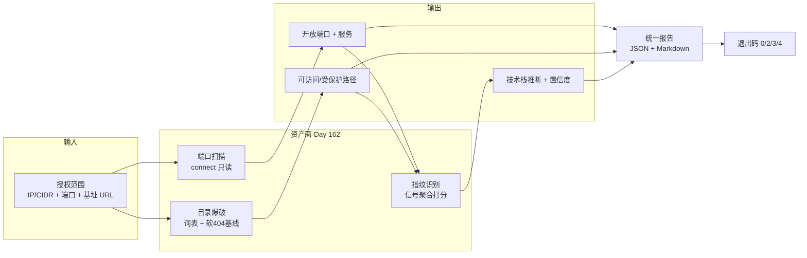

# Day 162 — 安全审计工具箱：端口扫描 · 目录爆破 · 指纹识别图解

## 1. 三模块总览（资产面）



端口在左，路径在中，指纹在右：**先有面，再有树，最后有"是什么"**。
后续 Day 163 的漏洞检测会消费这三份产物。

## 2. 端口扫描：三态与两类不可判定

```text
connect_ex((host, port), timeout)
        │
   ┌────┴──────────────────────────────┬──────────────────────┐
   ▼                                   ▼                      ▼
   0                              ECONNREFUSED            timeout / 11
┌────────┐                        ┌────────┐            ┌──────────┐
│  open  │                        │ closed │            │ filtered │
│ 有服务 │                        │ 主机活 │            │ 不可判定 │
└───┬────┘                        └────┬───┘            └────┬─────┘
    │                                  │                     │
    ▼                                  ▼                     ▼
banner 读取（只读）              ""主机存活""是情报      记 coverage 缺口
    │                                                        │
    ▼                                                        ▼
service = banner ⇒ 高置信      端口号表 ⇒ 标 port_map（低置信）
```

**报告必须同时出现这三个数字**，否则客户会以为"没开放的端口就是不存在"：

```text
open 2 ｜ closed 79 ｜ filtered 0 ｜ error 0        （可判定 81 / 81）
open 0 ｜ closed 0  ｜ filtered 3 ｜ error 0        （可判定 0 → 无结论，退出码 4）
```

## 3. 目录爆破：判定流水线与状态码语义

```text
基线：随机路径 ×3  →  得到 (状态码, 长度) 分布
     GET /a7f3k2  → 200 len=812
     GET /z9q1m4  → 200 len=812      ← 软 404！随机路径也是 200

逐词条：urljoin(base, word) → scope.check_url() → 限速 → GET
        │
   ┌────┴───────────────────────────────────────────────────────────┐
   ▼                          ▼                ▼            ▼       ▼
 200 且长度≈基线            403/401          301/302      429     5xx
 ┌──────────────┐         ┌──────────┐     ┌────────┐  ┌──────┐ ┌──────┐
 │soft_404可疑  │         │protected │     │redirect│  │退避  │ │error │
 │(人工复核)    │         │★重点线索 │     │不跟随  │  │记缺口│ │记事实│
 └──────────────┘         └──────────┘     └────────┘  └──────┘ └──────┘
```

**状态码语义表（背下来）**

| 码 | 是否存在 | 意义 | 报告措辞 |
|---|---|---|---|
| 200 | 是 | 可访问（也可能软 404） | "可访问，需确认内容与权限" |
| 301/302 | 是 | 重定向（常是少斜杠/登录跳转） | "存在，重定向至 …（未跟随）" |
| 401 | 是 | 需认证 | "存在，需凭据（本次未尝试登录）" |
| **403** | **是** | **禁止访问** | **"存在但当前身份无权限——管理入口重点候选"** |
| 429 | **未知** | 被限速 | **"未完成：目标限速，覆盖不完整"** |
| 404 | 否 | 不存在 | "不存在" |
| 5xx | 可能是 | 服务端异常 | "响应异常，可能是错误处理分支" |

## 4. 指纹识别：信号 → 打分 → 置信度

```text
信号采集                      权重        聚合（按 tech 累加）
─────────────────────────────────────────────────────────────
Server: lab-nginx/1.18.0      0.40 ─▶ lab-nginx = 0.40 → low
X-Powered-By: PHP/7.4.33      0.25 ─▶ php       = 0.25 → low
Set-Cookie: LABSESSID=…       0.20 ┐
<meta generator="lab-cms 0.9">0.30 ┴▶ lab-cms   = 0.50 → medium ★交叉验证
<title>Lab Portal</title>     0.10 ─▶ lab portal= 0.10 → info
/server-status（Apache 风格） 0.60 ─▶ apache    = 0.60 → medium
─────────────────────────────────────────────────────────────
置信度分档：high ≥0.80 ｜ medium ≥0.50 ｜ low ≥0.20 ｜ info <0.20
上限 0.95：**永不给出"确定使用 X"的断言**（所有信号都可被伪造）
```

**为什么所有响应头类信号都只有"低"置信？**

```text
目标：Server: lab-nginx/1.18.0        ← 这一个字符串完全由目标控制
                       ▲
                       └── 它可能真是 nginx，也可能是任何服务器改的名
                           所以"头字段"只是**线索**，不是**证据**
```

提升置信度的唯一合法路径是**多信号交叉** + **可验证路径**，
而"主动验证"（发包试探版本）通常超出"只读审计"的边界——
所以本课停在"中"，并写明"需要人工确认"。

## 5. 限速与退避时间线

```text
速率：默认 5 请求/秒，串行（并发 1）——约等于人工浏览速度

t(s)  0.0   0.2   0.4   0.6   0.8   1.0   1.2  ...
      ●     ●     ●     ●     ●     ●     ●        正常节奏（5/s）
            │
            └── 目标返回 429 ──▶ 退避 0.5s ──▶ 1.0s ──▶ 2.0s ──▶ 4.0s(上限)
                                                     │
                                                     └─ 仍 429 ⇒ 停止并记
                                                        coverage.incomplete=True
                                                        → 退出码至少 4
```

**关键规则**：429 出现 ≥1 次 ⇒ 本轮"未发现"这个结论不成立。
因为漏掉的路径很可能就在被限速的那段时间里。

## 6. 报告分层：事实 / 推断 / 待验证

```text
┌───────────────────────────────────────────────────────────────┐
│ 事实层（可直接复核）                                          │
│   · GET /server-status → 200, len=1123                        │
│   · Server: lab-nginx/1.18.0                                  │
│   · GET /admin/ → 403                                         │
├───────────────────────────────────────────────────────────────┤
│ 推断层（写明依据与置信度）                                    │
│   · 疑似 lab-cms（cookie + meta generator，权重 0.60 → 中）   │
│   · 疑似 nginx 系（Server 头单信号，权重 0.40 → 低）          │
├───────────────────────────────────────────────────────────────┤
│ 待验证层（人工在授权窗口内做）                                 │
│   · /admin/ 是否存在默认凭据？→ 需单独书面授权                │
│   · /backup.zip 内容是否含敏感数据？→ 只记录"可下载"这一事实  │
└───────────────────────────────────────────────────────────────┘
```

**绝不在报告里出现的句子**："发现漏洞"、"系统存在风险，可被入侵"。
工具只做到"待验证"，验证与利用必须由人、在有单独授权的窗口内完成。

## 7. 与前后几天的衔接

```text
Day 159 审计工具箱 v0 ─┐
Day 160 日志分析     ─┼─▶ Day 162 资产面（端口/目录/指纹）
Day 161 渗透框架     ─┘         │
                                ▼
                     Day 163 漏洞面（SQLi / XSS 检测）
                                │
                                ▼
                     Day 164 流量面（代理 + 流量分析）
                                │
                                ▼
                     Day 165 交付面（报告 + Docker 部署）
```
