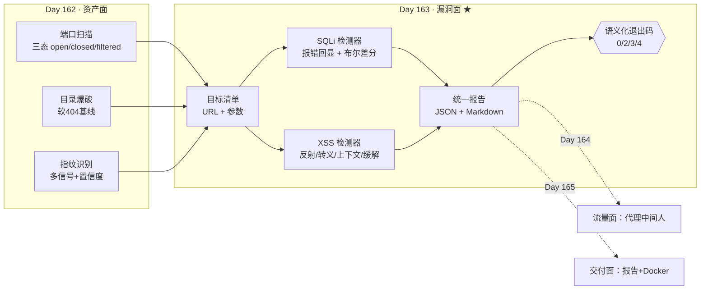

# Day 163 — 阶段项目（二）：安全审计工具箱 · SQLi 检测 + XSS 检测

> **Phase 10 — 网络安全开发（Day 146–165）** · 主题：安全审计工具箱（Day 162–165 四天项目的第 2 天）
>
> **使用边界（重要，读完再动手）**：
> - 只对**你自己拥有、或已获书面授权**的目标做审计。
> - 本课所有实验都跑在 `127.0.0.1` 上的**自建靶标**（`code/vuln_core.py` 里的 `LabVulnHTTP`）。
> - 探测全部**只读**：只发 `GET`、**不 POST**、不写数据、不带凭据、不跟随重定向。
> - SQLi 只做**检测**：不 `UNION` 取数、不拖库、不 `DROP`、不注释绕过后半段 SQL。
> - **不做时间盲注**（`SLEEP`/`pg_sleep`）：那是在目标上"占用资源"，本课刻意排除。
> - XSS 探针**不是可执行载荷**：用自定义标签 `<zq163>`（浏览器不执行），
>   而不是 `<script>alert(1)</script>`。原因见 2.6，这是本课最重要的避坑点。
> - 默认限速 **2 请求/秒**，每个参数最多 **4 个探针**（硬闸门）。
> - 教材中的地址一律为回环或文档网段（RFC 5737 的 `192.0.2.0/24`）。

---

## 1. 学习目标

完成本课后，你应该能够：

- 说清阶段项目四天的分工，以及为什么**漏洞面必须建立在资产面之上**
- 解释 **error-based（错误回显）** 与 **boolean-based（布尔差分）** 两种 SQLi 检测技术的
  判定条件，以及各自**为什么**需要不同的参照物
- 说清布尔差分**为什么必须锚定 baseline**——只比 `true`/`false` 两者会被"回显型"页面骗到
- 解释**探针计划**为什么固定为 4 个、顺序为什么不能乱
- 实现反射型 XSS 的**四层判定**：反射确认 → 转义判定 → 上下文判定 → 缓解措施检查
- 说清 XSS **上下文**（文本节点 / 属性 / `<script>` 块 / 注释）为什么决定严重度
- 解释**为什么探针不该是可执行载荷**，以及"用 `<script>alert(1)</script>` 做检测"的三个害处
- 把两个检测器整合成一个 CLI 流水线，产出统一 JSON/Markdown 报告 + **语义化退出码**
- 说清"**覆盖不完整**"为什么必须独立成一个退出码（`4`），不能和"通过"混在一起
- 明确本工具**不做**什么（取数、绕过、利用、处置），以及这些边界为什么是必要的

---

## 2. 概念解释

### 2.1 阶段项目要做什么（今天站在哪个位置）

Day 159 做了"审计工具箱 v0"（规则引擎 + 报告 + CLI 门禁），Day 160 做了日志分析。
Day 162–165 把这几天分散的能力**拼成一个完整的资产审计工具**，四天分工：

```text
Day 162（昨天）  资产面：端口扫描 + 目录爆破 + 指纹识别   ← 有哪些"资产"
Day 163（今天）  漏洞面：SQLi 检测 + XSS 检测             ← 资产上"哪里可能有问题"  ★本课
Day 164          流量面：代理中间人 + 流量分析            ← 实际"发生了什么"
Day 165          交付面：报告生成 + Docker 部署           ← 最后"怎么交出去"
```

**为什么漏洞面必须建立在资产面之上？** 因为漏洞检测需要三样输入：

| 漏洞检测需要 | 由谁产出（Day 162） | 缺了会怎样 |
|---|---|---|
| **目标清单**（哪些主机/端口活着） | 端口扫描（TCP connect 三态） | 只能靠人工手输 URL，规模上不去 |
| **入口清单**（哪些路径可访问） | 目录爆破（软 404 基线 + 状态分类） | 找不到 `/product`、`/search` 这类带参端点 |
| **技术栈线索**（Server/框架/语言） | 指纹识别（多信号汇总 + 置信度） | 无法预判该用哪种报错特征、哪种编码链 |

所以今天开工前，你手上应该已经有一份"**URL + 参数**"清单。
`code/targets.example.txt` 就是这个清单的示例格式。

### 2.2 两个检测器的职责与失败模式

| 检测器 | 输入 → 输出 | 核心难点 | 典型失败模式 |
|---|---|---|---|
| **SQLi 检测** | 带参 URL → 技术(报错/布尔/无) + 证据 | 参照物选择、动态页面噪声 | 只比长度；把动态内容当注入 |
| **XSS 检测** | 带参 URL → 反射/转义/上下文/缓解措施 | 假阳性（回显≠漏洞）、上下文判定 | 把"回显了"当成"能执行" |

两者共同点同 Day 162：**它们只产出"线索"，不产出"结论"**。
报告里必须区分：

```text
事实     「error 探针的响应里出现了 sqlite3. 这个字符串」        ← 可复验，目标无法否认
推断     「这说明服务端把用户输入拼进了 SQL」                    ← 依据事实 + 常识
待验证   「能取到数据」                                          ← 本工具**不做**，留给人
```

### 2.3 SQLi 检测：两段式判定（这是今天最容易写错的地方）

朴素实现是：**发一堆"注入 payload"，响应长度变了就报洞**。它会被两种东西骗：

```text
骗局 1（回显型页面）  页面把你的输入原样打印出来
    GET /echo?id=1      → len=114
    GET /echo?id=1'     → len=120     ← 长度变了！但它只是"多打印了一个引号"
    GET /echo?id=1 AND 1=2 → len=122  ← 又变了！其实完全无害

骗局 2（动态内容）    页面里有时间戳、随机推荐、广告位
    同一 URL 请求两次，长度就能差出几十字节
```

所以本课的检测器采用**两段式**判定，顺序不可颠倒：

```text
第 1 段：报错回显（error-based）—— 强证据，优先级最高
    探针 #1 = 原值 + '        → 期待"语法被搞坏"的可观测后果
    成立条件：HTTP 5xx 或 响应体命中数据库报错特征
    ↑ 这一步不需要参照物：报错本身就是自证

第 2 段：布尔差分（boolean-based）—— 弱证据，必须锚定 baseline
    探针 #2 = 原值 AND 1=1    → 恒真，结果集应与"正常查询"一致
    探针 #3 = 原值 AND 1=2    → 恒假，结果集应变为空
    成立条件（三个必须同时满足）：
      ① true 与 false 的状态码相同
      ② true 的响应"贴近 baseline"
      ③ false 的响应"明显偏离 baseline"
```

**为什么要"贴近 baseline"这一条？** 因为如果只看 `true ≠ false`，
骗局 1 那种"原样回显"的页面又会通过：`1 AND 1=1` 和 `1 AND 1=2`
长度不同（字符串本身就不同长），于是误报。加上①~③之后：

```text
/echo 陷阱（已转义、原样回显）实测：
    baseline  1            200   114
    error     1'           200   120
    true      1 AND 1=1    200   122
    false     1 AND 1=2    200   122
    → 条件③不成立（false 也贴近 baseline）→ 判定 none ✅ 没有误报

/product 有缺陷端点（字符串拼接）实测：
    baseline  1            200   124
    error     1'           500   ...
    → 第 1 段就命中（HTTP 500 + sqlite3. 报错特征）→ error_based ✅

/safe-product 安全对照（参数化）实测：
    baseline  1            200   167
    error     1'           200   139
    true      1 AND 1=1    200   139
    false     1 AND 1=2    200   139
    → 没有报错，且三个探针完全一致（值被当字面量）→ none ✅
```

### 2.4 四个探针为什么是"四个"

| # | 标签 | 值 | 作用 | 少了它会怎样 |
|---|---|---|---|---|
| 0 | `baseline` | 原值 | 建立"正常响应"锚点 | 布尔差分没有参照物 → 只能瞎猜 |
| 1 | `error` | 原值 + `'` | 破引号 → 触发语法错误 | 漏掉 error-based（最强证据） |
| 2 | `true` | `原值 AND 1=1` | 恒真对照 | 差分不成对，无法排除"页面本来就在变" |
| 3 | `false` | `原值 AND 1=2` | 恒假对照 | 同上 |

**为什么不多发几个？** 两个理由：

1. **授权成本**：每多一个探针，就是多一次"真的进入了目标业务逻辑"的请求。
   本课把上限做成**硬闸门**（`MAX_PROBES_PER_PARAM = 4`），
   超了直接抛 `ScopeError` 而不是"温柔地跳过"——边界必须能让程序停下来。
2. **边际收益**：更多探针（`OR 1=1`、`UNION`、编码变体）属于"检测之上的事"，
   它们开始接近"利用"，本课刻意不做。

### 2.5 XSS 检测：四层判定

反射型 XSS 的判定不是"有没有反射"这么简单，而是四层：

```text
第 1 层  反射确认   输入有没有回到响应里？            → reflected: bool
第 2 层  转义判定   回来的是原样字节还是 HTML 实体？   → raw_tag / escaped
第 3 层  上下文判定 回在文本节点、属性、<script>、注释？→ context
第 4 层  缓解措施   CSP / nosniff / charset 有没有？   → mitigations: list
```

**每一层都可能单独导致误判**：

| 只做到 | 会误判成 | 我们的靶标里谁专治它 |
|---|---|---|
| 第 1 层 | `/echo`（已转义）被判为"反射型 XSS" | `/echo` 假阳性陷阱 |
| 第 1、2 层 | 所有反射都评成同一严重度 | `/greeting`（`<script>` 块，high）vs `/comment`（注释，low） |
| 第 1、2、3 层 | 漏掉"注入成立后有没有兜底" | `/safe-search`（转义 + CSP，0 缺口） |

### 2.6 为什么探针**不是**可执行载荷（本课最重要的避坑点）

新手最容易写出的探针是 `<script>alert(1)</script>`。本课刻意**不用**它：

1. **没必要**。检测只需要证明"危险字符原样进入了 HTML"。
   判断依据是**响应体里的字节**，不需要浏览器真的执行一次。
2. **有副作用**。一旦有任何人（包括你自己后续用浏览器复核）打开那个 URL，
   脚本就在**你的**浏览器上下文里执行——审计就从"只读"变成了"真的攻击了自己"。
   反射型 XSS 的 URL 是可以被分享、被爬虫抓取、被日志记录的，副作用会扩散。
3. **会被拦**。`<script>` 是最先被 WAF / 浏览器 / 框架拦截的模式。
   测出来的"安全"其实只是"被挡了"，**反而掩盖了真实缺陷**。

所以本课探针是：

```python
XSS_MARKER = "zq163x7"          # 唯一标记：用于在响应里精确定位"我们的输入落在了哪"
XSS_PROBE  = XSS_MARKER + '"\'><zq163>'
#            └─ 唯一标记 ─┘ └破引号┘└─ 破标签：自定义标签，浏览器不认识 → 不执行 ─┘
```

`<zq163>` 是**自定义标签**：HTML 解析器会把它当未知元素（进 DOM，但不执行任何脚本）。
它能证明"标签注入成立"（第 2 层的 `raw_tag`），却不会带来任何执行风险。

> 这也是"唯一标记"存在的意义：为了在 HTML 里定位上下文，
> 你必须能在响应中**唯一地**找到自己的输入。用 `test`、`123` 这种值，
> 页面里到处都是，上下文判定会直接失效。

### 2.7 覆盖完整性：为什么"没测完"必须独立成一种结果

自动化扫描器最大的伦理与技术问题，是**把"限速后的空结果"当成"干净"**。

```text
目标返回 429 → 探针没拿到有效响应 → 没有发现 → 报告写"无风险"
                                        ↑ 这是彻头彻尾的假阴性
```

本课的处理：**每一个探针的 429 都被计数**，并生成一条独立的
`coverage_gap`（覆盖缺口）发现，同时在报告头部写明"覆盖：**不完整**"，
最后用**退出码 4** 把它交给上层：

| 退出码 | 含义 | 上层动作 |
|---|---|---|
| `0` | 跑完且无 P0/P1 | 归档，继续 |
| `2` | 越界 / 用法错误 | 停下并人工确认授权（**不重试**） |
| `3` | 有 P0/P1 发现 | 阻断发布 / 拉起人工复核 |
| `4` | 覆盖不完整（429/异常） | 降速重跑；**不能**当成"通过" |

---

## 3. 原理解释

### 3.1 错误回显（error-based）的判定链

```text
用户输入 1'
   ↓
服务端拼接：  "SELECT * FROM products WHERE id = '" + "1'" + "'"
   ↓
数据库解析：  ... WHERE id = '1''        ← 引号不配对 → 语法错误
   ↓
数据库抛异常：sqlite3.OperationalError: near "1'": syntax error
   ↓
[缺陷] Web 层把异常详情直接渲染进响应（verbose error）
   ↓
检测器的可观测证据：HTTP 500  +  响应体命中 "sqlite3." 特征
```

`vuln_core.py` 里的 `_fake_execute()` 就是一版**确定性的最小复刻**：

```python
if expr.count("'") % 2 == 1:                    # 引号不配对 → 语法错误
    raise LabSQLError(f'near "{expr}": syntax error')
if re.search(r"and\s+1\s*=\s*2", expr, re.I):   # 恒假 → 空结果
    return []
if re.search(r"and\s+1\s*=\s*1", expr, re.I):   # 恒真 → 全部结果
    return list(PRODUCTS)
return [p for p in PRODUCTS if str(p["id"]) == expr.strip()]
```

**为什么用假引擎而不是真数据库？** 三个好处，缺一不可：

1. **可复现**：`sqlite3` 版本一换、SQL 方言一改，报错文本就变，特征是脆的；
   假引擎是纯函数，行为永远一致（所以能写进 `--self-test` 当断言）。
2. **零依赖**：不需要装任何数据库，一个 `python3` 就能跑完一整课。
3. **不可能误伤**：它**没有**任何真实数据、没有网络出口——即使探针写错，
   最坏结果也只是本地一个 HTTP 500。

**报错特征库为什么只匹配、不回抄？**

```python
SQL_ERROR_SIGNATURES = (r"sql syntax", r"sqlite3\.", r"syntax error",
                        r"unclosed quotation mark", r"you have an error in your sql",
                        r"quoted string not properly terminated", r"ora-\d{5}",
                        r"pg_query\(\)", r"mysql_fetch", r"warning:\s*mysql")
```

真实的数据库报错页常常带出**表名、列名、甚至数据片段**。把它们抄进报告
= 顺手把目标的内部信息泄露到审计报告里（而报告会流转、会归档）。
所以 `match_sql_error()` 只返回**命中的特征名**（如 `sqlite3\.`）。

### 3.2 探针计划与硬闸门

```python
lim = RateLimiter(rate=rate)                 # 令牌桶，默认 2 req/s
plan = [("baseline", base_value),
        ("error",    base_value + "'"),
        ("true",     f"{base_value} AND 1=1"),
        ("false",    f"{base_value} AND 1=2")]
```

每个探针都要经过三道处理：

```text
set_query_param(url, param, value)   # ① 安全改写 URL（保留其它参数、正确百分号编码）
        ↓
scope.check_url(target)              # ② 改写后再校验一次（防止探针把 URL 带出范围）
        ↓
lim.get(target)                      # ③ 限速 + 计数；超上限抛 ScopeError
```

**② 为什么要在改写后**再校验一次？因为"参数值进 URL"本身就是一次**改写**，
改写可能改变 host/port/路径前缀（比如值里带 `@`、`../`、`//`）。
门禁放在**唯一出口**上，比"入口查一次"更难绕过。

`set_query_param()` 里还有一条容易忽略的规则：

```python
if not found:
    raise ScopeError(f"URL 中不存在参数 {name!r}")
```

参数不存在时**不擅自添加**——新增一个参数可能改变业务行为
（比如 `?debug=1`、`?admin=true`，那已经是"探测行为"，不是"检测"）。

### 3.3 布尔差分的数学：为什么必须锚定 baseline

记 `L(·)` 为响应长度（或任意可比较的响应指纹），`B` 为 baseline：

```text
朴素判据（错）:      L(true) ≠ L(false)              → 判为注入
    反例 /echo:     122 ≠ 122? 不成立；但换个页面就成立 → 误报

本课判据（对）:      同状态码 ∧ close(L(true), B) ∧ ¬close(L(false), B)
    其中 close(a,b) ⇔ |a-b| ≤ max(tol_abs, tol_rel × max(a,b))
                     默认 tol_abs=32, tol_rel=5%
```

`tol_rel`（相对容差）的意义：大页面（几十 KB）的长度波动绝对值天然更大，
固定阈值会让大页面上恒真/恒假都判成"贴近"。用 `max(绝对, 相对)` 两者取大，
是一个工程上稳妥的折中。

实测三条曲线（来自 `01-sqli-detect.py` 的输出）：

```text
                    baseline   error    true    false   判定
/product  (有缺陷)     124       500      —       —     error_based（第 1 段命中）
/safe-product(安全)    167       139     139     139    none（三探针完全一致）
/echo     (陷阱)       114       120     122     122    none（false 也"贴近"→差分不成立）
```

**注意 `/safe-product` 那一行**：`error` 探针长度 139 ≠ baseline 167。
如果只看"长度变了"，这里会**误报**。原因是参数化后 `1'` 被当成**字面量**，
查询结果为空（"没有匹配的商品"比"有 2 条商品"短）。这正是"长度 ≠ 注入"的活证据。

### 3.4 上下文判定算法

```python
def classify_context(body, marker):
    idx = body.find(marker)
    if idx < 0: return "none"                     # 没反射，没有上下文
    before = body[:idx]                           # 只看标记**之前**的内容

    if before.rfind("<!--") > before.rfind("-->"):            # ① 在注释里？
        return "html_comment"
    open_block = max(before.rfind("<script"), before.rfind("<style"))
    if open_block != -1 and open_block > before.rfind("</script>") \
            and open_block > before.rfind("</style>"):        # ② 在脚本/样式块里？
        return "script_block"
    if before.rfind("<") > before.rfind(">"):                 # ③ 在标签内部？
        fragment = body[before.rfind("<"):idx]
        if re.search(r"=\s*\"[^\"]*$", fragment): return "attr_quoted_double"
        if re.search(r"=\s*'[^']*$",  fragment): return "attr_quoted_single"
        return "attr_unquoted"
    return "text_node"                                        # ④ 否则：文本节点
```

核心思想：**看"标记左边最近的未闭合结构是什么"**。

```text
   <!-- 注释 -->  <script>…</script>  <input value="…">
   ↑           ↑  ↑               ↑   ↑       ↑     ↑
   注释区间         脚本块区间            属性区间
```

`rfind(...)` 比较"最后一次出现位置"是判断"我是否落在某个区间内部"的标准技巧：
如果 `<!--` 的最后位置 > `-->` 的最后位置，说明注释**开着没关**，我就在注释里。

### 3.5 转义判定的三个布尔量

```python
out.reflected = XSS_MARKER in body                      # 标记出现过
out.raw_full  = XSS_PROBE  in body                      # 连引号都原样出现（最强）
out.raw_tag   = "<zq163>"  in body                      # 标签原样出现 → HTML 注入成立
out.escaped   = ("&lt;zq163&gt;" in body) or (html.escape(XSS_PROBE, quote=True) in body)
```

为什么 `raw_full` 比 `raw_tag` 强？因为 `"` `'` `>` 全都没被处理，
说明服务端**几乎没有任何输出编码**——闭合属性、闭合字符串都成为可能。

`escaped` 用**两种写法**判断（字面实体 + `html.escape` 的标准产物），
是为了覆盖"只转义了 `<` `>`"和"按 HTML 规范全转义"两种实现。

### 3.6 缓解措施：头部是事实，不是结论

```python
def check_xss_mitigations(headers) -> list[str]:
    # 检查三样：CSP / X-Content-Type-Options: nosniff / Content-Type 里的 charset
```

| 缺的东西 | 缺了意味着什么 | **不**意味着什么 |
|---|---|---|
| `Content-Security-Policy` | 注入一旦成立，没有纵深防御兜底 | 不代表存在 XSS |
| `X-Content-Type-Options: nosniff` | 可能被 MIME 嗅探利用（配合上传场景） | 同上 |
| `Content-Type` 无 `charset` | 可能触发编码混淆（如 UTF-7 时代的经典问题） | 同上 |

报告用 `xss_mitigation_missing` 这条**独立发现**承载它，
严重度 `low` / 置信度 `high`——因为"头确实没了"是硬事实，但推论链很短，
不该抬到 high 严重度。实测：有缺陷的 `/search` 缺 2 项，安全对照 `/safe-search` 缺 0 项。

### 3.7 优先级评分：为什么严重度与置信度要相乘

```python
score  = (严重度序号+1) × (置信度序号+1)      # SEVERITY_LEVELS = info,low,medium,high,critical
P0 ≥20   P1 ≥12   P2 ≥6   P3 其余
```

**为什么相乘而不是相加？** 因为安全结论的两个维度是**独立**的：

```text
high 严重度 + low  置信度 → (4+1)×(1+1) = 10 → P2    "可能很严重，但先别急着叫醒人"
medium 严重度 + high 置信度 → (2+1)×(4+1) = 15 → P1    "不致命，但证据确凿，得处理"
high 严重度 + high 置信度 → 25 → P0                    "又严重又确凿"
```

相加会把它压成一维，`high+low` 和 `medium+medium` 变得无法区分。

### 3.8 语义化退出码

```python
def exit_code(findings, incomplete) -> int:
    if incomplete: return 4                                    # 覆盖不完整优先
    if any(f.priority in ("P0","P1") for f in findings): return 3
    return 0
```

**为什么 `4` 的优先级比 `3` 高（先判断 incomplete）？**
因为"没测完"会**掩盖**发现——如果 429 让一半目标没结论，
报告里即使有 P1 也是不完整的 P1。先告诉上层"这轮结论不可信"，
再谈发现了什么，是更诚实的顺序。（越界的 `2` 由异常路径抛出，
语义是"根本没开始测"，自然在 4 之前。）

---

## 4. 图解

### 4.1 四天项目里的位置与数据流



### 4.2 SQLi 检测的两段式判定

```text
                    ┌──────────────────────────────┐
   URL + 参数  ───▶ │  Scope.check_url() 门禁      │ 越界 → AuthorizationError → 退出码 2
                    └──────────────┬───────────────┘
                                   ▼
                    ┌──────────────────────────────┐
                    │ 探针 #0 baseline  原值        │──▶ B (锚点)
                    │ 探针 #1 error     原值 + '    │
                    │ 探针 #2 true      原值 AND 1=1│
                    │ 探针 #3 false     原值 AND 1=2│
                    └──────────────┬───────────────┘
                                   ▼
              第 1 段：error 探针 5xx 或命中报错特征？
                    ├── 是 ──▶ technique = error_based   （强证据，直接返回）
                    └── 否 ──┐
                             ▼
              第 2 段：同状态码 ∧ close(true,B) ∧ ¬close(false,B)？
                    ├── 是 ──▶ technique = boolean_based （弱证据，置信度 medium）
                    └── 否 ──▶ technique = none          （只说明这 4 个探针没命中）
```

### 4.3 三个参照点的实测长度对比（一眼看懂为什么要 baseline）

```text
 长度
  180 │                         ▓▓▓
  160 │                         ▓▓▓
  140 │        ▓▓▓   ▓▓▓ ▓▓▓    ▓▓▓         ▓▓▓ = baseline
  120 │ ▓▓▓    ▓▓▓   ▓▓▓ ▓▓▓    ▓▓▓   ▓▓▓   ░░░ = error/true/false
  100 │ ░░░░░  ░░░   ░░░ ░░░    ░░░   ░░░
      └──────────────────────────────────────
        /echo          /safe-product  /product
        114→120/122/122  167→139×3     124→(500 报错)
        ↑ false 也贴近 B  ↑ 三探针一致   ↑ 第 1 段命中
        → none  ✅        → none ✅      → error_based ✅
```

### 4.4 XSS 四层判定与上下文风险阶梯

```text
  探针 zq163x7"'><zq163>
        │
        ▼
 ① 反射确认 ── 标记没出现？ ─▶ info / 未见反射（≠ 安全）
        │ 出现
        ▼
 ② 转义判定 ── &lt;zq163&gt;？ ─▶ info / 已转义（/echo 陷阱在此沉默）
        │ 原样
        ▼
 ③ 上下文判定
      script_block        → high   ← 闭合字符串即可执行 JS（最危险）
      attr_unquoted       → high
      attr_quoted_double  → medium ← /profile
      text_node           → medium ← /search
      html_comment        → low    ← /comment（需先闭合注释）
        │
        ▼
 ④ 缓解措施 ── 缺 CSP/nosniff/charset？ ─▶ 追加一条 low 发现的独立 Finding
```

---

## 5. 定义与使用方法（API 速查表）

### 5.1 `vuln_core.py` 模块速查

| 名称 | 类型 | 作用 |
|---|---|---|
| `Scope` | dataclass | 授权范围：`networks` / `ports` / `http_bases` / `ticket` |
| `Scope.check_url(url)` | 方法 | **唯一**允许构造请求的出口；越界抛 `AuthorizationError` |
| `default_lab_scope(port)` | 函数 | 生成"只允许回环该端口"的范围 |
| `LabVulnHTTP(port, host, throttle_after)` | 上下文管理器 | 起/停本机靶标；`throttle_after` 用于演示 429 |
| `fetch(url, timeout)` | 函数 | 只读 GET：不跟随重定向、不发送凭据、只读前 8KB |
| `set_query_param(url, name, value)` | 函数 | 安全改写单个查询参数；参数不存在抛 `ScopeError` |
| `TokenBucket(rate, capacity)` | 类 | 令牌桶限速；`.acquire()` 返回等待秒数 |
| `RateLimiter(rate, max_probes)` | 类 | 限速 + 探针硬上限 + 429/异常计数 |
| `detect_sqli(url, scope, param, rate, timeout, tol_abs, tol_rel)` | 函数 | → `SqliResult` |
| `match_sql_error(body)` | 函数 | 返回命中的**特征名**（不抄报错全文） |
| `detect_xss(url, scope, param, rate, timeout)` | 函数 | → `XssResult` |
| `classify_context(body, marker)` | 函数 | → `text_node`/`attr_*`/`script_block`/`html_comment`/`none` |
| `check_xss_mitigations(headers)` | 函数 | 返回**缺失项**的文字列表 |
| `Finding` | dataclass | 统一发现结构；`.priority` 由严重度×置信度算出 |
| `findings_from_sqli/xss(results)` | 函数 | 结果 → 发现列表（含 `coverage_gap`） |
| `build_report(...)` / `render_markdown(...)` / `write_report(...)` | 函数 | 报告构造/渲染/落盘 |
| `exit_code(findings, incomplete)` | 函数 | `2/3/4/0` 语义化退出码 |

### 5.2 探针与阈值常量

| 常量 | 值 | 为什么是这个值 |
|---|---|---|
| `DEFAULT_RATE` | `2.0` | 探针会真正进入业务逻辑，比目录爆破（5/s）更克制 |
| `MAX_PROBES_PER_PARAM` | `4` | 四探针计划的硬闸门：超了抛异常，不悄悄跳过 |
| `READ_LIMIT` | `8192` | 响应体只读前 8KB：够判定，又不把整站拖下来 |
| `DEFAULT_TIMEOUT` | `2.0` | 漏检（超时）比慢更可接受 |
| `XSS_MARKER` | `zq163x7` | 唯一标记：能在响应里唯一定位自己的输入 |
| `XSS_PROBE` | `zq163x7"'><zq163>` | 破引号 + 破标签 + **非可执行**自定义标签 |
| `tol_abs` / `tol_rel` | `32` / `0.05` | 长度容差：`max(32, 5%×max(a,b))` |
| `SQL_ERROR_SIGNATURES` | 10 条正则 | 只匹配特征名，**不回抄**报错全文 |

### 5.3 `XssResult` 字段语义

| 字段 | 类型 | 含义 |
|---|---|---|
| `reflected` | bool | 唯一标记是否出现在响应里 |
| `raw_full` | bool | 整个探针字符串原样出现（最强证据） |
| `raw_tag` | bool | `<zq163>` 原样出现 → HTML 注入成立 |
| `escaped` | bool | 出现的是 HTML 实体 → 本轮未见注入 |
| `context` | str | 上下文；决定严重度 |
| `severity` / `confidence` | str | 严重度 / 置信度（分开表达"多严重"和"多确定"） |
| `risk_note` | str | 人类可读结论 |
| `mitigations` | list[str] | 缺失的缓解措施（**事实**，不是结论） |
| `throttle_or_error` | bool | 本轮无有效响应 → 置信度 `unknown` |

### 5.4 CLI 速查

```bash
python3 03-vuln-scan-cli.py --lab                                  # 内置靶标，全量跑
python3 03-vuln-scan-cli.py --lab --throttle-after 6               # 演示覆盖不完整 → 退出码 4
python3 03-vuln-scan-cli.py --lab --targets targets.example.txt    # 用自写清单
python3 03-vuln-scan-cli.py --base http://127.0.0.1:8080 \
        --targets targets.example.txt --rate 1 --tag my-audit      # 扫自己的授权目标
python3 03-vuln-scan-cli.py --lab --json-only                      # 只出 JSON
python3 vuln_core.py --self-test                                   # 引擎自检 → SELF-TEST OK
```

---

## 6. 实战代码案例

本日代码全部在 `code/` 下，**每个文件都能单独 `python3` 运行**。

### 6.1 `code/vuln_core.py` — 共享引擎（1016 行）

包含：范围门禁 → 本机靶标（8 个端点）→ 只读 HTTP 客户端 → 限速 → 两个检测器
→ Finding/报告/退出码 → `--self-test` 端到端自检。

靶标的 8 个端点（**故意**安排的"有缺陷 / 安全对照 / 陷阱"三组对照）：

| 端点 | 设计意图 | 期望检测结果 |
|---|---|---|
| `/product?id=1` | 字符串拼接（缺陷） | `error_based` ✅ |
| `/safe-product?id=1` | 参数化（安全对照） | `none`（必须沉默） |
| `/search?q=x` | 原样反射进文本节点 | `text_node` / medium |
| `/safe-search?q=x` | `html.escape` + CSP（安全对照） | 已转义 / 0 缺口 |
| `/profile?name=x` | 反射进双引号属性 | `attr_quoted_double` / medium |
| `/greeting?name=x` | 反射进 `<script>` 块 | `script_block` / **high** |
| `/comment?note=x` | 反射进 HTML 注释 | `html_comment` / low |
| `/echo?id=x` | **已转义**但原样回显（陷阱） | SQLi 与 XSS 都必须 `none` |

### 6.2 `code/01-sqli-detect.py` — 基础用法

展示"探针表 + 三段判定"，用四个断言把结论钉死：

```python
r1 = show("① 有缺陷的端点 /product（字符串拼接）", f"{base}/product?id=1", scope)
assert r1.technique == "error_based"      # 单引号 → 报错特征
r2 = show("② 安全对照 /safe-product（参数化）", ...)
assert r2.technique == "none"             # 同一业务的两种写法，结论相反
r3 = show("③ 假阳性陷阱 /echo（原样回显，已转义）", ...)
assert r3.technique == "none"             # 长度变了 ≠ 注入
```

实测输出（节选）：

```text
③ 假阳性陷阱 /echo（原样回显，已转义）
  参数: id   基准值: '1'
  探针        注入值                      状态     长度
  baseline  1                       200    114
  error     1'                      200    120
  true      1 AND 1=1               200    122
  false     1 AND 1=2               200    122
  判定技术: none
  证据    : 探针未触发报错，且布尔对未形成「贴近基线 / 偏离基线」的差值
```

**如果去掉 baseline 锚定**，`true=122 ≠ false=122` 不成立，
但把探针换成 `1 OR 1=1` / `1 AND 1=2` 就会出现差值 → 直接误报。
这就是"锚定 baseline"的实际价值。

### 6.3 `code/02-xss-detect.py` — 进阶用法与避坑

逐层打印四层判定，覆盖全部四种上下文 + 两个安全对照 + 缓解措施对比：

```text
① 有缺陷 /search（反射进文本节点）   → text_node / medium
② 有缺陷 /profile（反射进双引号属性）→ attr_quoted_double / medium
③ 最危险 /greeting（反射进 <script>）→ script_block / high
④ 上下文 /comment（反射进 HTML 注释）→ html_comment / low
⑤ 安全对照 /safe-search（escape+CSP）→ 已转义 / 0 缺口
⑥ 假阳性陷阱 /echo（回显但已转义）   → 已转义 / 沉默
```

实测（`/comment` 一节）：

```text
  探针      : 'zq163x7"\'><zq163>'
  ① 反射确认: reflected=True
  ② 转义判定: raw_tag=True  raw_full=True  escaped=False
  ③ 上下文  : html_comment
  ④ 缓解措施: 2 项缺口
  → 严重度  : low   置信度: medium
```

**同一个探针，四处上下文，三档严重度**——这就是第 3 层的意义：
没有上下文判定，`/comment`（low）会被和 `/greeting`（high）评成一样。

### 6.4 `code/03-vuln-scan-cli.py` — 实战流水线 CLI

三个真实跑过的场景：

```bash
# ① 正常：9 个目标 → 18 个探针 → 13 条发现 → 退出码 3
$ python3 03-vuln-scan-cli.py --lab --tag day163-lab
[summary] 发现 13 条 · 优先级分布 {'P0': 0, 'P1': 4, 'P2': 5, 'P3': 4}
[coverage] 全部目标均取得有效结论
[exit] 3

# ② 覆盖缺口：靶标第 6 个请求后全返 429 → 退出码 4（不是 0！）
$ python3 03-vuln-scan-cli.py --lab --throttle-after 6 --tag day163-throttle
[summary] 发现 9 条 · 优先级分布 {'P0': 0, 'P1': 9, ...}
[coverage] 覆盖不完整：存在 429/网络异常，未取得结论的目标需降速重跑
[exit] 4

# ③ 越界：门禁在构造请求之前拒绝 → 退出码 2，不重试
$ printf 'http://192.0.2.1:8086/product?id=1 id sqli\n' > /tmp/oop.txt
$ python3 03-vuln-scan-cli.py --base http://127.0.0.1:18092 --targets /tmp/oop.txt
⛔ AuthorizationError: 主机不在授权网段内: 192.0.2.1
$ echo $?
2
```

产物落在 `out/`（已随仓库提交，作为"实测证据快照"）：

```text
out/day163-lab-report.{json,md}        # 正常一轮：13 条发现，覆盖完整
out/day163-throttle-report.{json,md}   # 限速一轮：18 探针其中 12 个 429，退出码 4
out/day163-targets-report.{json,md}    # 用 targets 清单跑出与 ① 一致的结果（可复现性验证）
```

### 6.5 两个由"实测"驱动的修复（真实踩坑记录）

写这两个脚本时踩到并修掉的两个真问题，都值得记住：

**坑 1：`--targets` 不支持行尾注释。**
第一版 `load_targets()` 只在 `line.startswith("#")` 时跳过，
于是 `targets.example.txt` 里带行尾说明的行会炸：

```text
⛔ ScopeError: targets.example.txt:14 字段过多: '/product?id=1   id  sqli   # 有缺陷…'
```

修复：先剥掉第一个 `#` 之后再切字段。
**教训**：清单类输入格式必须支持行尾注释——否则使用者不敢写"为什么测这条"，
清单就退化成一堆无法维护的魔法字符串。

**坑 2：清单里写完整 URL 会被拼成垃圾。**
第一版无条件 `target = base + url`，于是清单里写完整 URL 会变成
`http://127.0.0.1:18092http://192.0.2.1:...`。
修复：以 `http://` / `https://` 开头的按完整 URL 走门禁，其余按路径拼接。
**教训**：**"拼接"和"校验"的顺序决定了工具能不能被信任**——
门禁必须看到**最终的** URL。

---

## 7. 自检与验证

```bash
cd days/day-163-安全审计工具箱-part2/code

python3 vuln_core.py --self-test     # → SELF-TEST OK（7 组断言）
python3 01-sqli-detect.py            # → 三类结果：error_based / none / none
python3 02-xss-detect.py             # → 四层判定 + 四种上下文 + 假阳性沉默
python3 03-vuln-scan-cli.py --lab    # → 退出码 3，报告落盘 out/
```

`--self-test` 的 7 组断言（这就是"教学代码可验证"的样子）：

```text
① 有缺陷 /product       → error_based, sql_error_hit=True
② 安全对照 /safe-product → none
③ 反射型 /search         → raw_tag & text_node
④ XSS 安全对照 /safe-search → 未注入 & 已转义
⑤ /greeting             → script_block & severity=high
⑥ /echo 双陷阱          → XSS 已转义、SQLi none
⑦ 越界必须 AuthorizationError；探针上限必须 ScopeError
```

**为什么把断言写进 `--self-test`？** 因为检测器的"沉默"（判 none）
和"报警"（判有缺陷）**同样重要**。只测"能不能报出洞"的测试，
无法发现"到处乱报"的回归——而误报才是这类工具在真实环境里最先失去信任的原因。

---

## 8. 思考题

1. **布尔差分的容差**：`close()` 用 `max(tol_abs, tol_rel×max(a,b))`。
   如果目标页面里有随机广告位（每次长度差 200~400 字节），
   在 `tol_abs=32`、`tol_rel=5%` 下会发生什么？你会怎么改检测策略？
   （提示：想想"多次采样取分布"与"锚定不变量"两条路。）

2. **`/safe-product` 的假警报风险**：参数化端点里 `error` 探针长度 139
   明显偏离 baseline 167。如果检测器**只看**"error 探针长度变化"就下结论，
   它会把这台**安全**的服务报成高危。请写出你会用什么证据组合来避免它，
   并说明为什么"报错特征"比"长度变化"可靠得多。

3. **探针是载荷吗**：假设你把探针换成 `<script>alert(document.domain)</script>`，
   请列出至少三个**具体**的负面影响（考虑：浏览器复核、日志留存、
   WAF/浏览器拦截对结论的污染、URL 被分享）。本课的 `<zq163>` 各避免了哪一个？

4. **覆盖完整性 vs 通过**：为什么"限速后没测到"必须用独立退出码，
   而不能合并进"无发现"？如果你的 CI 里只有"退出码 0 才算通过"，
   把 429 当作 0 会造成什么后果？请给出一个具体场景。

5. **上下文判定的边界**：`classify_context()` 用"最近的未闭合结构"判断位置。
   如果页面把输入放进 `<div data-x='…' title="…">`（外层单引号、内层双引号），
   我们的正则只会匹配**最近的那个 `=`**。请构造一个能让它判错的输入，
   并说明为什么"简化判定 + 保守严重度"是比"追求完美解析"更工程化的选择。

6. **（进阶）从检测到验证的边界**：本工具停在"疑似"。请列出"从疑似到确认"
   需要的额外动作，并逐条说明为什么它们**不应该**进自动化扫描工具。

---

## 9. 边界与合规（每一条都是设计决策，不是场面话）

| 边界 | 为什么这样做 |
|---|---|
| 只发 `GET` | `GET` 语义是幂等只读；`POST` 会改数据，越出"检测"范畴 |
| 不跟随重定向 | 避免被引到范围外，也避免掩盖真实状态码（3xx 也是信息） |
| 不带任何凭据 | 未授权访问下的检测结果不可信，也避免触发账号锁定 |
| 域名直接拒绝 | **解析域名本身就是一次外发**（DNS 也是一次信息暴露） |
| 不时间盲注 | `SLEEP` 是在目标上"占用资源"，且容易压垮服务 |
| 每参数 ≤4 探针 | 探针会进入业务逻辑；硬闸门让"越界"无法被悄悄放宽 |
| 默认 2 req/s | 比目录爆破更克制：每个探针都是一次真实业务调用 |
| 只匹配报错特征、不抄全文 | 报错页可能带出表名/列名，抄进报告 = 顺手泄密 |
| 报告只写"疑似/待验证" | 工具不能声称"已验证漏洞"；验证动作必须由人在授权窗口内完成 |
| 全部实验跑回环自建靶标 | 可复现、零依赖、**不可能**误伤真实系统 |

---

## 10. 今日完成清单

见 `exercises/checklist.md`（含 3 道基础题 + 2 道进阶题 + 自检命令）。
图解补充见 `diagrams/README.md`。

**下一篇（Day 164）**：流量面——代理中间人（mitmproxy 原理）+ 流量分析，
把"扫描出来的疑似"放到真实流量里验证。
