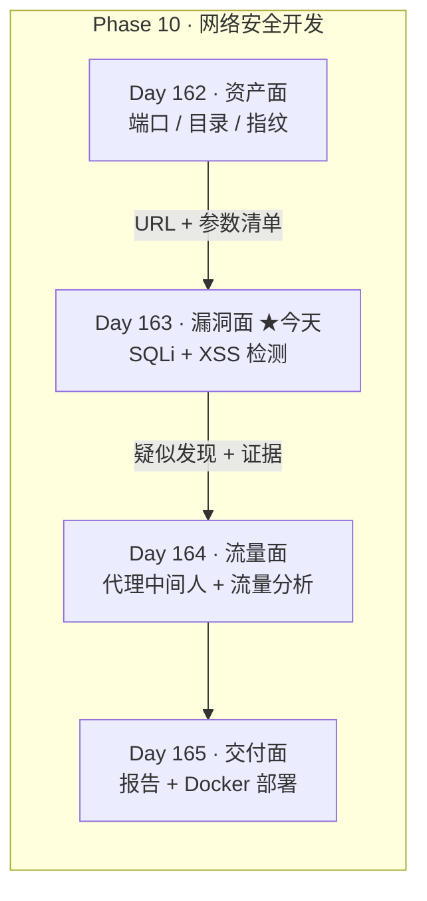
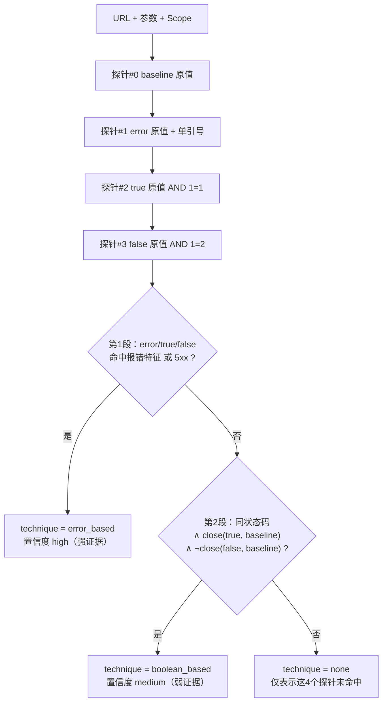

# Day 163 · 图解：SQLi / XSS 检测的判定模型

本文件用 ASCII 与 Mermaid 把 Day 163 的判定逻辑画出来。
建议配合 `README.md` 的 §3（原理解释）一起看。

---

## 1. 今天在阶段项目里的位置



```text
    资产面（昨天）                 漏洞面（今天）                交付面（明天之后）
  ┌──────────────┐            ┌──────────────┐            ┌──────────────┐
  │ 有什么？      │  清单→    │ 哪里有风险？  │  疑似→     │ 怎么交出去？  │
  │ · 主机        │ ─────────▶ │ · SQLi       │ ─────────▶ │ · 统一报告    │
  │ · 端口        │   URL+参数  │ · XSS        │  证据       │ · Docker 部署 │
  │ · 路径        │            │ （只做检测）  │            │ · 语义化退出码│
  │ · 技术栈      │            └──────────────┘            └──────────────┘
  └──────────────┘
```

---

## 2. 四道闸门：一次检测请求的完整生命周期

```text
  目标清单 (URL + 参数)
        │
        ▼
 ┌─────────────────────────────────────────────────────────────┐
 │ ① Scope.check_url()   协议 → 主机 → 端口 → 基址前缀 四重校验 │
 │    越界 ⇒ AuthorizationError ⇒ 退出码 2（不重试、不降级）    │
 └──────────────────────────┬──────────────────────────────────┘
                            ▼
 ┌─────────────────────────────────────────────────────────────┐
 │ ② set_query_param()   只改写目标参数，其余参数原样保留      │
 │    参数不存在 ⇒ ScopeError（不擅自新增参数：会改业务行为）  │
 └──────────────────────────┬──────────────────────────────────┘
                            ▼
 ┌─────────────────────────────────────────────────────────────┐
 │ ③ Scope.check_url() 再校验一次（改写后可能把 URL 带出范围） │
 └──────────────────────────┬──────────────────────────────────┘
                            ▼
 ┌─────────────────────────────────────────────────────────────┐
 │ ④ RateLimiter.get()   令牌桶限速 + 探针硬上限 + 429 计数    │
 │    超上限 ⇒ ScopeError（硬闸门，不静默跳过）                │
 │    429    ⇒ throttled++ ⇒ 覆盖缺口发现 ⇒ 退出码 4           │
 └──────────────────────────┬──────────────────────────────────┘
                            ▼
                     fetch()  只读 GET
              （不跟随重定向 / 不带凭据 / 只读 8KB）
```

---

## 3. SQLi：两段式判定流程图



### 3.1 close() 容差公式

```text
    close(a, b)  ⇔  |a - b| ≤ max( tol_abs ,  tol_rel × max(a, b) )
                               32          5%         取较大者

    为什么取 max？
      · 小页面（~150B）：绝对容差 32 起作用，避免把噪声当信号
      · 大页面（~50KB）：相对容差 5%（=2.5KB）起作用，
                         否则固定 32 会把大页面上的一切都判成"相同"
```

---

## 4. 三组对照的实测长度（为什么必须锚定 baseline）

```text
长度(B)
 180 ┤
 160 ┤                    ███
 140 ┤        ▓▓▓  ░░░  ░░░  ░░░
 120 ┤ ███  ░░░  ░░░  ░░░  ░░░   ███  ░░░
 100 ┤ ░░░  ░░░
     └─────────────────────────────────────────────────────
       /echo       /safe-product        /product
   B=  114          167                124
   e=  120          139                →500 报错
   T=  122          139
   F=  122          139
   ─────────────────────────────────────────────────────
   判定 none        none               error_based ✅

   ███ = baseline（锚点）   ░░░ = error/true/false
   ● /echo  : F 也"贴近 B" → 差分不成立 → 沉默（假阳性被消掉）
   ● /safe  : 三个探针完全一致 → 值被当字面量 → 沉默
   ● /product: 第 1 段就命中报错特征 → 直接下结论
```

---

## 5. XSS：四层判定 + 上下文风险阶梯

```text
                探针 = zq163x7"'><zq163>
                            │
        ┌───────────────────┴───────────────────┐
        │ ① 反射确认  XSS_MARKER in body ?      │
        │    否 → info「本轮未观察到反射」       │
        └───────────────────┬───────────────────┘
                            │ 是
        ┌───────────────────┴───────────────────┐
        │ ② 转义判定  raw_tag / raw_full ?      │
        │    否则 escaped → info「已转义」       │
        └───────────────────┬───────────────────┘
                            │ 原样输出
        ┌───────────────────┴───────────────────┐
        │ ③ 上下文判定 → 严重度                  │
        └───────────────────┬───────────────────┘
                            │
        ┌───────────────────┴───────────────────┐
        │ ④ 缓解措施   缺 CSP / nosniff / charset│
        │    → 追加独立 Finding（low / high 置信度）│
        └───────────────────────────────────────┘
```

### 5.1 上下文 → 严重度阶梯

```text
  风险高                    <script>var who = "【输入】";</script>
   ▲                        └── 一个双引号就能闭合字符串，直接执行 JS
   │                                  → script_block   high / high
   │
   │                        <input value="【输入】">
   │                        └── 需先闭合引号
   │                                  → attr_quoted_double  medium / high
   │
   │                        <p>未找到 “【输入】” 的结果</p>
   │                        └── 可注入标签，但不能直接执行脚本
   │                                  → text_node  medium / high
   │
   │                        <!-- note: 【输入】 -->
   ▼                        └── 需先闭合注释，利用条件最多
  风险低                              → html_comment  low / medium
```

---

## 6. 探针设计：为什么不是 `<script>alert(1)</script>`

```text
   ❌ 新手探针                              ✅ 本课探针
   <script>alert(1)</script>                zq163x7"'><zq163>
   ├─ 浏览器会执行 → 副作用扩散             ├─ 自定义标签，浏览器不执行
   ├─ WAF/浏览器最优先拦截 → 掩盖真缺陷     ├─ 不是攻击特征串，测得的是"真实过滤行为"
   ├─ URL 被分享/爬取/记日志 → 伤及他人     ├─ 无害，可安全分享与复查
   └─ 无唯一标记 → 无法定位上下文           └─ zq163x7 唯一标记 → 可精确定位上下文
```

```text
   响应体里的三种可能（按证据强度排序）：

   ① 原样：      … <p>未找到 “zq163x7"'><zq163>” 的结果</p> …
                   └─ raw_full=True, raw_tag=True → HTML 注入成立

   ② 已转义：    … <p>未找到 “zq163x7&quot;&#x27;&gt;&lt;zq163&gt;” … 
                   └─ escaped=True → 本轮未见注入（不是"安全"）

   ③ 没反射：    响应里根本没有 zq163x7
                   └─ reflected=False → 该参数本轮无反射
```

---

## 7. 缓解措施与"事实 / 结论"分界

```text
   响应头                         检测器看到        报告里写成
   ────────────────────────────────────────────────────────────────
   Content-Security-Policy 缺失   事实（可复验）     「缓解措施缺失（low/high）」
                                        │
                                        └── ▶ ❗不等于"存在 XSS"
   X-Content-Type-Options: nosniff 缺失              同上
   Content-Type 无 charset                            同上

   正确的推论链：
     反射成立（事实）
        + 危险字符原样（事实）
        + 上下文为 script_block（推断，依赖解析简化）
        ─────────────────────────────────────
        =「疑似反射型 XSS，需人工在授权窗口内复核」（结论，标注置信度）
```

---

## 8. 报告与退出码

```text
                         ┌──────────────────────────┐
   findings + coverage → │  build_report()          │
                         │   · findings（含优先级）  │
                         │   · sqli 探针明细         │
                         │   · xss 探针明细          │
                         │   · coverage（完整性）    │
                         │   · disclaimer（边界声明）│
                         └───────────┬──────────────┘
                                     ▼
                 ┌───────────────────┴───────────────────┐
                 ▼                                       ▼
        out/<tag>-report.json                 out/<tag>-report.md
        （机器读：CI / 归档）                  （人读：表格 + 明细）
                                     │
                                     ▼
                          exit_code(findings, incomplete)
                          ┌──────────────────────────────┐
                          │ 2  越界/用法（不重试）        │
                          │ 3  有 P0/P1 → 阻断发布        │
                          │ 4  覆盖不完整 → 降速重跑      │
                          │ 0  跑完且无 P0/P1 → 归档      │
                          └──────────────────────────────┘
   注意顺序：先判 incomplete（4）再判发现（3）——
   "没测完"会掩盖发现，必须先报"这轮结论不可信"。
```

---

## 9. 优先级评分矩阵（严重度 × 置信度）

```text
                置信度 →
           low(1)   medium(2)   high(3)   （序号+1 后相乘）
   严重度 ↓
     info    2×2=4    2×3=6      2×4=8        → P3
     low     3×2=6    3×3=9      3×4=12       → P1/P2/P2
     medium  4×2=8    4×3=12     4×4=16       → P2/P1/P1
     high    5×2=10   5×3=15     5×4=20       → P2/P1/P0
     critical 6×2=12  6×3=18     6×4=24       → P1/P1/P0

   阈值： P0 ≥ 20    P1 ≥ 12    P2 ≥ 6    其余 P3
   为什么相乘：严重度与置信度是**独立**维度，举例比较——
     high+low = 10 → P2（可能很严重，但先别叫醒人）
     medium+high = 15 → P1（不致命，但证据确凿，得处理）
```
