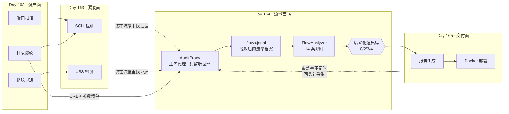

# Day 164 图解 — 代理中间人 + 流量分析

> 本目录只放**字符画 / Mermaid**，不生成图片文件。
> 所有图都可以直接贴在 Markdown 里渲染，也可以当 ASCII 图在终端里读。

---

## 1. 四天项目里的位置与数据流



**读图要点**：Day 163 的结论是**推测**，它给 Day 164 提供的是"**去哪找证据**"；
Day 164 的结论是**事实**，它给 Day 165 提供的是"**报告里最能站住脚的那部分内容**"。

---

## 2. 代理的字节级工作流（两种请求行形式）

```text
                    ① 绝对 URI 形式（标准客户端配代理后发这个）
   ┌──────────┐  GET http://127.0.0.1:18081/api/user?id=1 HTTP/1.1
   │ 客户端    │  Host: 127.0.0.1:18081
   └────┬─────┘ ─────────────────────────────────────────────▶
        │
        │        ② 源站形式（直接对源站说话 / 某些库）
        │        GET /api/user?id=1 HTTP/1.1
        │        Host: 127.0.0.1:18081
        │        ─────────────────────────────────────────────▶
        │                              ┌────────────────────────────┐
        └────────────────────────────▶ │ AuditProxy（只监听回环）    │
                                       │                            │
                                       │ ① 读请求行 (readline 限长)  │
                                       │ ② 读请求头（重复键存列表）  │
                                       │ ③ 是 CONNECT？→ 走隧道分支  │
                                       │ ④ _resolve() 认两种形式     │
                                       │ ⑤ 门禁：主机+端口白名单      │
                                       │    ↑ 校验 request-target     │
                                       │      的主机，**不是** Host 头 │
                                       │ ⑥ 读请求体（含 chunked）    │
                                       │ ⑦ 剔逐跳头 → 转发 → 读响应  │
                                       │ ⑧ 脱敏 → 落 flow → 回客户端 │
                                       └─────────────┬──────────────┘
                                                     │
                              http://127.0.0.1:18081/api/user?id=1
                                                     ▼
                                              ┌──────────────┐
                                              │ LabOrigin    │
                                              │ 自建实验网站  │
                                              └──────────────┘
```

**为什么 ⑤ 必须在 ⑦ 之前？** 因为门禁如果放在"已经开始转发"之后，
就等于"先连上了再说不该连"——那已经构成对越界目标的实际访问。

---

## 3. `CONNECT` 隧道：代理能看见什么、看不见什么

```text
   客户端                  AuditProxy                 服务端 :443
      │                        │                          │
      │ CONNECT example.com:443│                          │
      │ ──────────────────────▶│  TCP connect             │
      │                        │ ────────────────────────▶│
      │ 200 Connection Established                        │
      │ ◀──────────────────────│                          │
      │                        │                          │
      │ ══════ TLS 握手 ═══════▶│ ══════ 原样转发 ════════▶│
      │ ══════ 加密 HTTP ══════▶│ ══════ 原样转发 ════════▶│
      │                        │                          │
      │                        │  ┌─────────────────────┐ │
      │                        │  │ 代理**只能**记录：    │ │
      │                        │  │  · 目标 host:port ✅  │ │
      │                        │  │  · 双向字节数 ✅      │ │
      │                        │  │  · 起止时间 ✅        │ │
      │                        │  │  · URL 路径 ❌        │ │
      │                        │  │  · 请求/响应头 ❌      │ │
      │                        │  │  · 请求/响应体 ❌      │ │
      │                        │  └─────────────────────┘ │
      │                        │                          │
      │                        │  → Flow(inspected=False)  │
      │                        │  → 覆盖缺口 +1            │
      │                        │  → 退出码 4               │
```

**为什么不去解密？** 要解密只有两条路：拿到目标私钥（说明你拥有那台服务器），
或者让客户端信任你的自签 CA（在**自己**的设备上合法，在**别人**的设备上是劫持）。
本课两者都不做，而是把"看不见"如实记账。

---

## 4. 脱敏流水线：先脱敏，再检测

```text
   原始字节流
        │
        ▼
 ┌───────────────────────────────────────────────────────────┐
 │ ① redact_url()       URL 查询串：token=tk_xxx → 指纹         │
 │ ② _redact_query_in_path()  **path 里同一份查询串也要脱敏**    │
 │                      ← 踩坑 ③：漏了这一处 = 前功尽弃          │
 │ ③ redact_mapping()   头：Authorization/Cookie 整条 → 指纹    │
 │ ④ redact_body()      体：password=xxx → <redacted:hash/NB>   │
 │ ⑤ mask_pii()         体：手机号/邮箱/身份证 → <pii:类别>      │
 │                      同时把**类别**记进 flow.pii_labels       │
 │                      ← 擦掉就再也扫不到，必须当场记           │
 │ ⑥ 响应体同样跑 ④⑤（踩坑：审计工具自己成了泄密渠道）           │
 │ ⑦ 截断到 64KB + 打 body_truncated 标记                        │
 └───────────────────────────┬───────────────────────────────┘
                             │  档案里**没有明文**
                             ▼
                    flows.jsonl（可公开的档案）
                             │
                             ▼
 ┌───────────────────────────────────────────────────────────┐
 │ FlowAnalyzer：检测逻辑**看不到明文也能工作**                 │
 │   · 看**字段名**：password / token / api_key …              │
 │   · 看**指纹标记**：redacted: 或 redacted%3a                │
 │   · 看**结构量**：长度、重复指纹、状态码、耗时                │
 └───────────────────────────────────────────────────────────┘
```

**一句话**：脱敏不是"事后补救"，而是**唯一入口**。
只要脱敏覆盖面完整，后面所有环节（包括被别人拿到档案）都不会泄密。

---

## 5. 规则触发映射：flow 字段 → 规则

```text
  flow 字段                        命中规则
  ─────────────────────────────────────────────────────────────
  scheme == "http"  ┬──────────▶  R1 cleartext-credential
                    ├──────────▶  R3 auth-header-cleartext
  query_keys 非空   └──────────▶  R2 sensitive-in-url
  request_body 含标记 ─────────▶  R1
  request_headers[Authorization] ▶ R3
  response Set-Cookie 缺标记 ──▶  R4 cookie-missing-flags
  HTML 200 缺安全头 ───────────▶  R5 missing-security-headers
  response_body 命中报错特征 ──▶  R6 error-disclosure
  response_body 含敏感字段 ────▶  R7 secret-in-response-body
  response_status >= 500 ──────▶  R8 server-error
  response_status ∈ 3xx ───────▶  R9 redirect-chain
  inspected == false ──────────▶  R10 tls-tunnel-uninspected  ← 覆盖类
  method ∈ 写方法 ─────────────▶  R11 state-changing-method
  duration_ms >= 300 ──────────▶  R12 slow-response
  pii_labels 非空 ─────────────▶  R13 pii-in-request
  Server / X-Powered-By ───────▶  R14 server-banner
  ─────────────────────────────────────────────────────────────
  R10 是唯一一条"关于覆盖面"的规则，它决定其余 13 条的结论是否可信。
```

---

## 6. 覆盖率与退出码决策树

```text
                         ┌──────────────────┐
                         │ 所有 flow 进来    │
                         └────────┬─────────┘
                                  ▼
                    ┌─────────────────────────────┐
                    │ 有 flow 的主机越界？          │
                    └──────┬───────────────┬──────┘
                       是  │               │ 否
                           ▼               ▼
                   ┌──────────────┐  ┌──────────────────────────┐
                   │ 退出码 2      │  │ 有 CONNECT 隧道？或传输错误？│
                   │ 门禁拒绝      │  └────┬────────────────┬────┘
                   │ （没开始测）  │    是 │                │ 否
                   └──────────────┘       ▼                ▼
                                  ┌──────────────┐  ┌──────────────────────┐
                                  │ 退出码 4      │  │ 有 P0/P1 发现？        │
                                  │ 覆盖不完整    │  └────┬────────────┬────┘
                                  │ 结论不可信    │    是 │            │ 否
                                  └──────────────┘       ▼            ▼
                                                ┌──────────────┐ ┌────────────┐
                                                │ 退出码 3      │ │ 退出码 0    │
                                                │ 有发现        │ │ 干净通过    │
                                                └──────────────┘ └────────────┘
```

**为什么 4 排在 3 前面？**
"没测完"会**掩盖**发现：一半流量是黑洞时，报告里的 P0 也是"不完整的 P0"。
先告诉上层"这轮结论不可信"，再谈发现了什么，是更诚实的顺序。

---

## 7. 一次演示会话的流量时间线（实测形态）

```text
 t(ms)
   0 ┤ GET  /                   200   ← 建立基线
  20 ┤ GET  /health             204
  40 ┤ GET  /api/user?id=1      200   ← 正常业务
  60 ┤ GET  /api/user?id=1%27   500   ← 报错回显（R6 server-error）
  80 ┤ POST /login              200   ← 明文口令（R1）+ Set-Cookie 缺标记（R4）
 100 ┤ GET  /search?…&token=…   200   ← 敏感参数进 URL（R2）
 120 ┤ GET  /secret             200   ← 响应体泄密（R7）
 140 ┤ GET  /redirect?to=/login 302   ← 重定向链（R9），本课**不跟随**
 160 ┤ GET  /slow               200   ← 460ms（R12 slow-response）
 180 ┤ GET  /large              200   ← 205KB，档案截断（INFO）
 200 ┤ GET  /admin              403   ← 权限边界（预期，不是发现）
 220 ┤ PUT  /api/user/1         200   ← 写方法（R11 打破只读原则）
 240 ┤ POST /login (含手机号)   200   ← PII 进请求体（R13，档案里已擦除）
 260 ┤ CONNECT 127.0.0.1:18082  ---   ← 隧道：inspected=False（R10）
      └──────────────────────────────────────────────────────────
        覆盖率 = 13 / 14 = 92.9%   → 退出码 4（不是 3！）
```

---
