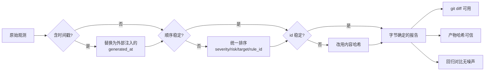

# Day 165 — 图解：报告渲染管线与容器化交付

本文件用 ASCII 图与 Mermaid 图讲清 Day 165 的三条主线：
**报告管线**、**确定性来源**、**容器交付边界**。

---

## 图 1：报告渲染管线（数据流，单向）

```text
  ┌────────────────────────────────────────────────────────────────────────┐
  │ 阶段 0 · 收集（三个面汇入）                                             │
  │                                                                        │
  │   Day 162 资产面        Day 163 漏洞面        Day 164 流量面            │
  │   ┌────────────┐       ┌────────────┐       ┌────────────┐            │
  │   │ 端口开放    │       │ SQLi 错误回显│       │ 明文凭证    │            │
  │   │ 目录列表    │       │ 反射型 XSS  │       │ 可疑 UA     │            │
  │   └─────┬──────┘       └─────┬──────┘       └─────┬──────┘            │
  │         │                    │                    │                   │
  │         └────────────────────┼────────────────────┘                   │
  │                              ▼                                        │
  │                    ┌──────────────────┐                               │
  │                    │ Finding 列表      │  ← 结构化数据，不是文本        │
  │                    └────────┬─────────┘                               │
  └─────────────────────────────┼──────────────────────────────────────────┘
                                ▼
  ┌────────────────────────────────────────────────────────────────────────┐
  │ 阶段 1 · 归一化（**唯一**允许做计算的地方）                             │
  │                                                                        │
  │   去重  · 同 id 只保留 risk 最高的一条                                  │
  │   排序  · (severity ↑, risk ↓, target ↑, rule_id ↑)  ← 四元组保证全序   │
  │   计数  · 含 0 值（表格形状稳定，便于 diff）                            │
  │   脱敏  · 出口兜底，幂等                                                │
  └─────────────────────────────┬──────────────────────────────────────────┘
                                ▼
  ┌────────────────────────────────────────────────────────────────────────┐
  │ 阶段 2 · 中间表示 IR（与格式无关）                                      │
  │                                                                        │
  │   { schema, title, scope, generated_at, tool_version,                  │
  │     total_risk, counts{}, coverage_gaps[], notes[], findings[] }       │
  └─────────────────────────────┬──────────────────────────────────────────┘
                                ▼
  ┌──────────────┬──────────────┬──────────────┬──────────────────────────┐
  │ render_json  │ render_md    │ render_html  │ render_sarif             │
  │              │              │              │                          │
  │ json.dumps   │ 拼字符串      │ 拼字符串      │ 结构映射                  │
  │ **零计算**    │ **零计算**    │ + escape()   │ severity→level(3档)      │
  │              │              │              │ 原始值留在 properties     │
  └──────┬───────┴──────┬───────┴──────┬───────┴────────────┬─────────────┘
         ▼              ▼              ▼                    ▼
   机器 / 归档      评审 / 工单      汇报 / 截图         CI / IDE
                                             │
                                             ▼
                                    ┌──────────────────┐
                                    │ 退出码 0/1/2/3/4 │ ← 流程消费者
                                    └──────────────────┘
```

---

## 图 2：确定性的三个杀手与对策

```text
   不确定来源                    症状                        对策
  ────────────────────────────────────────────────────────────────────────
   ① datetime.now()     每次运行时间戳都不同       generated_at 由调用方传入
                                                   或 SOURCE_DATE_EPOCH 固定
  ────────────────────────────────────────────────────────────────────────
   ② 迭代顺序           多线程/集合/dict 顺序不定   排序键写死四元组
                                                   （末位 rule_id 保证全序）
  ────────────────────────────────────────────────────────────────────────
   ③ uuid4() / 自增号   同一条问题每次换 id        内容哈希 stable_id(
                                                    target, rule_id, severity)
  ────────────────────────────────────────────────────────────────────────

   结果：同一输入 → 字节相同的输出 → 可 diff、可哈希、可缓存、可复现
```

Mermaid 版（支持渲染的环境下）：



---

## 图 3：退出码决策树（CLI 对外契约）

```text
                       ┌──────────────┐
                       │  启动 CLI    │
                       └──────┬───────┘
                              ▼
                  ┌────────────────────────┐
                  │ 输入可读且 JSON 合法？  │──否──► 退出码 2
                  └───────────┬────────────┘        （用法/数据错误）
                              │是
                              ▼
                  ┌────────────────────────┐
                  │ severity 等字段合法？   │──否──► 退出码 2
                  └───────────┬────────────┘   （宁可不跑，也不静默丢条目）
                              │是
                              ▼
                  ┌────────────────────────┐
                  │ 渲染 + 写盘成功？       │──否──► 退出码 3
                  └───────────┬────────────┘   （磁盘/权限）
                              │是
                              ▼
                  ┌────────────────────────┐
                  │ 有 >= 阈值的发现？      │──是──► 退出码 1
                  └───────────┬────────────┘     （去修）
                              │否
                              ▼
                  ┌────────────────────────┐
                  │ 存在覆盖缺口？          │──是──► 退出码 4
                  └───────────┬────────────┘     （补测 或 显式接受盲区）
                              │否
                              ▼
                         ┌─────────┐
                         │ 退出码 0 │
                         └─────────┘
```

**为什么 1 的优先级高于 4？** 因为有高危时行动项明确且紧急（去修），
而覆盖缺口是"需要判断"的状态。多返回一个码不会让人更快行动，
反而会稀释"这个码必须马上处理"的信号强度。

---

## 图 4：容器交付边界（信任分层）

```text
  ┌───────────────────────────── 宿主（信任边界） ──────────────────────────────┐
  │                                                                            │
  │    ./findings.example.json  ──ro──┐        ./out/ (需 chown 10001)          │
  │                                   │              ▲                         │
  │   ┌───────────────────────────────┼──────────────┼──────────────────────┐  │
  │   │ 容器 audit-toolbox:1.0        ▼              │                      │  │
  │   │                                                                    │  │
  │   │   uid=10001 (非 root)    read_only rootfs    cap_drop: ALL          │  │
  │   │   network: none          no-new-privileges   /tmp: 16m, noexec      │  │
  │   │   mem: 256M              cpus: 1.0                                  │  │
  │   │                                                                    │  │
  │   │   /app/report_core.py    ← 只读（改不了自己）                        │  │
  │   │   /app/03-toolbox-cli.py                                            │  │
  │   │   /data/findings.json    ← 只读输入                                  │  │
  │   │   /out/report.*          ← 唯一可写出口                              │  │
  │   │                                                                    │  │
  │   │   PID 1 = python（exec 形式 ENTRYPOINT）                             │  │
  │   │        └─ 退出码直接冒泡给 docker / CI  ──► 门禁成立                 │  │
  │   └────────────────────────────────────────────────────────────────────┘  │
  │                                                                            │
  │   ❌ 不烤进镜像：findings 数据、凭证、客户信息                              │
  │      （镜像会被推送/缓存/拉取，进层就删不干净）                             │
  └────────────────────────────────────────────────────────────────────────────┘
```

---

## 图 5：EACCES 排查路径（本课实测踩坑）

```text
   ❌ Permission denied: '/out/day165-docker.md'

        ┌──────────────────────────────────────────────┐
        │ 第一步：看容器里是谁                          │
        │   docker run --rm --entrypoint id <image>     │
        │   → uid=10001(app) gid=10001(app)             │
        └───────────────────┬──────────────────────────┘
                            ▼
        ┌──────────────────────────────────────────────┐
        │ 第二步：看宿主目录属主                        │
        │   ls -ld out/                                 │
        │   → drwxr-xr-x root root   ← 10001 写不进去   │
        └───────────────────┬──────────────────────────┘
                            ▼
        ┌──────────────────────────────────────────────┐
        │ 修法 A（推荐）chown 10001:10001 out/          │
        │ 修法 B（调试）--user $(id -u):$(id -g)        │
        │ 修法 C（生产）用命名卷 -v audit-out:/out       │
        │                                              │
        │ ✗ 不推荐：把容器改回 root                     │
        │   —— 用整个沙箱换一个目录权限，本末倒置        │
        └──────────────────────────────────────────────┘
```

**这次翻车的正面价值**：程序没有崩溃抛堆栈，而是输出人类可读的错误
并返回**退出码 3**。这个行为本身验证了第 3.4 节的退出码设计——
"渲染/写盘失败"和"有高危发现"是可区分的两类故障。

---

## 图 6：四种格式的信息损失地图

```text
                  信息量（全部字段 + 排序 + 精度）
                              ▲
                              │
        JSON ●────────────────┤  无损失（机器最优）
                              │
        SARIF ●───────────────┤  severity 5 档 → level 3 档
                              │  （原始值保留在 properties）
        HTML ●────────────────┤  需 escape，否则自己变 XSS 载体
        Markdown ●────────────┤  无样式、无机器定位
                              │
                              └────────────────────────────────►
                                 人类可读性（排版 / 层级 / 直观）
```

**结论**：不存在"一个格式打天下"。JSON 给机器、Markdown/HTML 给人、
SARIF 给流程，各自承担自己的那一段。压缩可以，但**必须可还原**。
