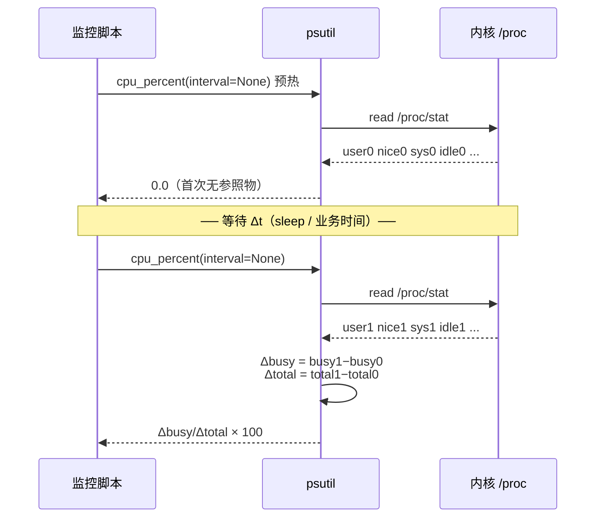
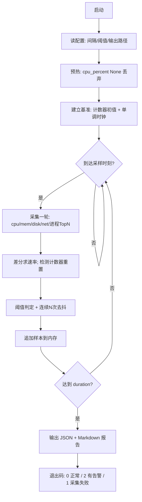

# Day 166 — 系统监控（psutil）图解

> 本文件用 ASCII 图 + Mermaid 图讲清 psutil 的四层结构与采样原理。
> GitHub 支持 Mermaid 渲染；终端环境直接看 ASCII 图即可。

---

## 1. psutil 四层结构总览

```text
┌──────────────────────────────────────────────────────────────────────────┐
│ 第 4 层  你的监控逻辑（本课要写的代码）                                    │
│   采样调度 · 阈值判定 · 去抖 · 报告输出 · 告警分发                          │
├──────────────────────────────────────────────────────────────────────────┤
│ 第 3 层  psutil 的"对象模型"（Python 侧）                                  │
│   cpu/memory/disk/net 函数族    Process(pid) 句柄    process_iter()       │
│   ↑ 把原始计数整理成带单位的、跨平台一致的 Python 对象                      │
├──────────────────────────────────────────────────────────────────────────┤
│ 第 2 层  psutil 的"采集器"（C 扩展 + Python 解析）                          │
│   /proc 文本解析 · statvfs 系统调用 · sysctl · Win32 API                   │
│   ↑ 这一层决定了"哪些字段真的存在"                                          │
├──────────────────────────────────────────────────────────────────────────┤
│ 第 1 层  内核导出的原始数据                                                 │
│   /proc/stat  /proc/meminfo  /proc/<pid>/stat  /proc/net/dev  /proc/diskstats│
│   /sys/fs/cgroup/*  /sys/class/hwmon/*                                      │
└──────────────────────────────────────────────────────────────────────────┘
      ↑ 只有第 1 层是"真相"；上面三层都是它的某种投影（并且会丢信息）
```

**为什么要画这张图？** 因为排查 psutil 的"怪值"时，你要能顺着这四层往下问：

- 值怪 → 是第 4 层逻辑错（阈值/差分）吗？
- 不是 → 是第 3 层语义错（用了 gauge 当 counter）吗？
- 不是 → 是第 2 层字段缺失（平台不支持）吗？
- 不是 → 是第 1 层本来就这样（cgroup 限额 vs 宿主 /proc）吗？

---

## 2. 采样 = 两次差分（核心原理）

```text
   时间轴 ─────────────────────────────────────────────────────────────►
             t0                                        t1
              │                                         │
              │◄───────────── 采样窗口 Δt ─────────────►│
              │                                         │
    读 /proc/stat: user0 nice0 sys0 idle0 …   读 /proc/stat: user1 nice1 sys1 idle1 …
              │                                         │
              └──────────────┬──────────────────────────┘
                             ▼
                    Δbusy  = Σ(busy1)  − Σ(busy0)
                    Δtotal = Σ(total1) − Σ(total0)
                             │
                             ▼
                  CPU% = Δbusy / Δtotal × 100
                             │
                             ▼
         ⚠ 这个数字描述的是【整个 Δt 窗口的平均值】
           不是"t1 这一瞬间"的值 —— 后者在系统里不存在
```



---

## 3. 三类指标的处理路径

```text
                    ┌─── 这个指标是累计的吗？ ───┐
                    │                            │
                 Yes(计数器)                   No(直接值)
                    │                            │
                    ▼                            │
        ┌── 需要两次读数相减 ──┐                 │
        │                     │                 │
     counter               重置/回绕          gauge / state
  (net_io,disk_io,      delta<0 → 视为        (mem.used,disk.used,
   cpu_times at pid)     计数器重置             status,username)
        │                     │                 │
        ▼                     ▼                 ▼
   差分 ÷ 实测Δt          丢弃该样本         直接读 / 按枚举分支
   → 速率(bytes/s, %)    记录异常事件         → 水平值 / 状态字符串
```

> **口诀**：**counter 要减，gauge 要读，state 要判。**
> 90% 的"监控数据不对"都栽在把 counter 当 gauge。

---

## 4. 进程监控的数据流与异常处理

```text
  psutil.process_iter(attrs=[...])
            │
            │  遍历 /proc/<pid> 目录项
            ▼
   ┌──────────────────────────────────────────────────┐
   │  for proc in ...:                                │
   │      try:                                        │
   │          info = proc.info          ← 只含请求字段 │
   │          处理 info                               │
   │      except NoSuchProcess:   计数+1，跳过          │
   │      except AccessDenied:    计数+1，跳过          │
   │      except ZombieProcess:   单独识别              │
   └──────────────────────────────────────────────────┘
            │
            ▼
   ┌──────────────────────────────────────────────────┐
   │ 排序 / Top-N / 进程树 / 阈值判定                   │
   └──────────────────────────────────────────────────┘
            │
            ▼
   ┌──────────────────────────────────────────────────┐
   │ 输出：终端表格 / JSON / Markdown 报告              │
   └──────────────────────────────────────────────────┘

  ⚠ 采集期间系统在变化 → 每轮必须有 (成功, 消失, 无权限, 僵尸) 四个计数
     没有这四个计数的监控脚本，你无法判断"数据少"是正常还是漏采。
```

---

## 5. 容器 vs 宿主机：最容易踩的坑

```text
┌──────────────── 宿主机  64 GiB / 8 vCPU ────────────────────────────┐
│  /proc/meminfo → MemTotal: 65814128 kB                              │
│  /proc/cpuinfo → processor ×8                                       │
│  /proc/stat    → 整机 CPU 累计刻度                                   │
│                                                                     │
│   ┌──── 容器 A  cgroup 限额 512 MiB / 0.5 CPU ────┐                 │
│   │  psutil.virtual_memory().total  → 64 GiB  ✗   │  ← 错：宿主的   │
│   │  psutil.cpu_percent()            → 整机负载 ✗  │                 │
│   │                                               │                 │
│   │  正确来源：                                    │                 │
│   │   /sys/fs/cgroup/memory.max        → 536870912 │  ← cgroup v2    │
│   │   /sys/fs/cgroup/cpu.max           → "50000 100000" → 0.5 核   │
│   │   /sys/fs/cgroup/memory.current    → 容器实际用量                │
│   └───────────────────────────────────────────────┘                 │
└─────────────────────────────────────────────────────────────────────┘

  ✅ 容量判断第一步永远是："我的限额是多少？"（cgroup）
     而不是："机器有多少？"（/proc）
```

---

## 6. 内存字段关系图

```text
        虚拟地址空间 VMS/VSZ（可能几十 GB，多数是未提交的）
  ┌──────────────────────────────────────────────────────────────┐
  │  mmap 未触碰区  │  reserved  │  已提交但未驻留  │   驻留(物理)  │
  └──────────────────────────────────────────────────────────────┘
                                                      │
                                            ┌─────────┴──────────┐
                                            │   RSS（含共享页）    │
                                            ├────────────────────┤
                                            │ PSS（共享页摊分）    │
                                            ├────────────────────┤
                                            │ USS（独占，可释放）  │
                                            └────────────────────┘

  大小关系：VMS ≥ RSS ≥ PSS ≥ USS
  ✅ "谁最占内存"  → RSS
  ✅ "杀掉能省多少" → USS
  ✅ "容器核算"    → PSS
  ❌ "VMS 大就报警" → 错（虚拟内存 ≠ 物理占用）
```

---

## 7. 监控脚本主循环（实战结构）



---

## 8. 退出码语义（监控脚本的"契约"）

```text
  0  ── 采集成功，所有指标在阈值内
  2  ── 采集成功，但触发了告警（有指标超阈值）
  1  ── 采集失败（无法读取关键指标 / 参数错误）

  为什么告警用 2 而不是 1？
  → 让调用方（CI、cron、上层编排）能区分"没跑起来"和"跑了但有问题"。
    1 是"我的错"，2 是"被监控对象的问题"。混用会导致运维把告警当故障排查。
```
