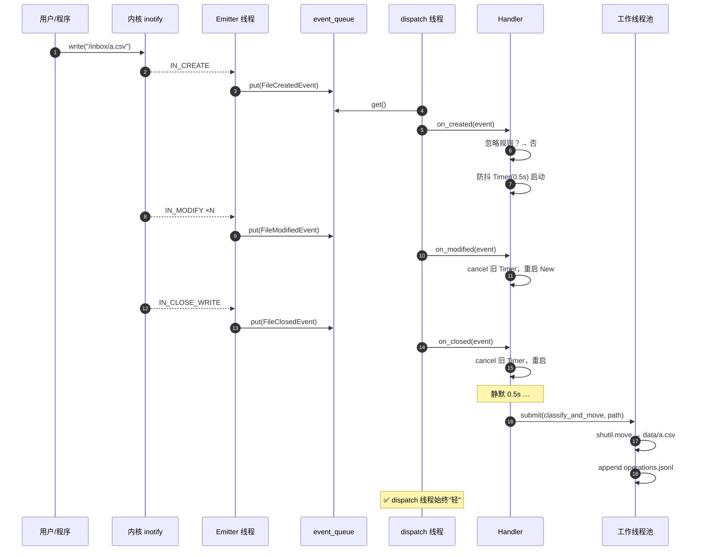
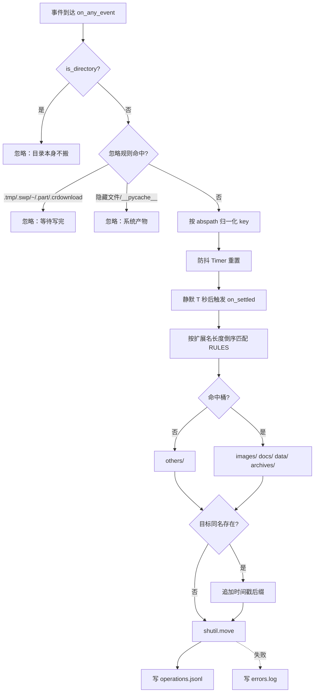

# Day 167 — 文件监控（watchdog）· 图解

> 本文件只放**图**，文字说明见 `../README.md`。
> 所有图用 ASCII / Mermaid 表达，**不生成图片文件**。

---

## 图 1：两条技术路线总览

```text
                    ┌─────────────────────────┐
                    │   我需要知道文件变了     │
                    └────────────┬────────────┘
                                 │
                 ┌───────────────┴───────────────┐
                 │                               │
        ┌────────▼────────┐             ┌────────▼─────────┐
        │  轮询 Polling   │             │  事件 Event       │
        │  os.walk+diff   │             │  inotify/FSEvents │
        └────────┬────────┘             └────────┬─────────┘
                 │                               │
   ┌─────────────▼─────────────┐   ┌─────────────▼──────────────┐
   │ ✅ 跨平台、网络盘可用      │   │ ✅ 空闲 0 CPU、ms 级延迟    │
   │ ✅ 实现简单、无内核配额    │   │ ✅ 不漏事件                  │
   │ ❌ 延迟 = 间隔             │   │ ❌ 平台相关                 │
   │ ❌ 间隔内建+删 → 漏        │   │ ❌ 递归要自己补 watch       │
   │ ❌ 大目录树吃 IO           │   │ ❌ 网络盘 / 部分容器失效     │
   └───────────────────────────┘   └────────────────────────────┘
                 │                               │
                 └───────────────┬───────────────┘
                                 ▼
                 watchdog 把它们统一成同一套 API：
                 Observer / FileSystemEventHandler / FileSystemEvent
                 （PollingObserver 就是"轮询后端"）
```

---

## 图 2：watchdog 线程模型与队列

```text
   主线程                               Observer 内部
   ┌──────────────┐                    ┌──────────────────────────┐
   │ observer     │   start()          │ 线程 A: Emitter          │
   │ .schedule()  │───────────────────►│  read(inotify_fd) 阻塞    │
   │ observer     │                    │        │                 │
   │ .start()     │                    │        ▼                 │
   │              │                    │  FileSystemEvent 对象     │
   │ 业务主循环    │                    │        │ put()           │
   │ (或 sleep)   │                    │        ▼                 │
   │              │                    │  event_queue (Queue)     │
   │              │                    │        │ get()           │
   │              │                    │        ▼                 │
   │              │                    │ 线程 B: dispatch         │
   │              │                    │  逐 handler 调 on_xxx()   │
   │              │                    └──────────┬───────────────┘
   │              │                               │
   │              │        ┌──────────────────────▼───────────────┐
   │              │        │ 你的 Handler（运行在 dispatch 线程）   │
   │              │        │  ⚠ 慢 = 队列堆积 = 溢出丢事件          │
   │              │        └──────────────────────┬───────────────┘
   │ finally:     │                               │
   │ stop()+join()│                    ┌──────────▼───────────┐
   └──────────────┘                    │ 工作线程池 / 自建队列  │
                                       │ ✅ 重活放这里          │
                                       └──────────────────────┘
```

---

## 图 3：inotify 递归监控的真实 watch 分布

```text
  应用层一次调用：schedule(handler, "/data", recursive=True)

  内核实际：
      ┌─ /data        wd=1  ◄── 显式注册
      │   ├─ a        wd=2  ◄── 启动时 os.walk 补齐
      │   │   └─ x    wd=5  ◄── 运行时 IN_CREATE(is_dir) 异步补
      │   ├─ b        wd=3
      │   └─ c        wd=4
      └─ ...

  新目录补齐的时间窗（经典漏事件窗口）：
      t0  mkdir /data/a/new
      t1  IN_CREATE is_directory=True  → 进入 emitter 内部队列
      t2  cp big.bin /data/a/new/      ← ⚠ 此刻 wd 还没补上
      t3  add_watch("/data/a/new")     ← 太晚了，t2 的事件已丢
```

---

## 图 4：一次保存 = 一串事件（原子写）

```text
  编辑器保存 a.txt（POSIX 原子写）

  a.txt.tmp ──IN_CREATE──┐
     │                   │
     ├──IN_MODIFY────────┤   写入内容（可能多次）
     ├──IN_MODIFY────────┤
     │                   │
     └──IN_CLOSE_WRITE───┤   写完关闭
                         │
  rename(a.txt.tmp→a.txt)└──IN_MOVED_FROM/IN_MOVED_TO──► FileMovedEvent

  ┌───────────────── 弱 handler（无防抖）─────────────────┐
  │ on_created  a.txt.tmp   → 处理 ①                        │
  │ on_modified a.txt.tmp   → 处理 ②（读到半截！）          │
  │ on_modified a.txt.tmp   → 处理 ③                        │
  │ on_closed   a.txt.tmp   → 处理 ④                        │
  │ on_moved    a.txt.tmp→a.txt → 处理 ⑤                    │
  │                        ❌ 同一份文件被处理 5 次          │
  └─────────────────────────────────────────────────────────┘

  ┌───────────────── 防抖 handler ─────────────────────────┐
  │ 5 次 trigger → 每次 cancel 上一个 Timer                │
  │ 静默 0.5s 后 → 只执行 1 次 on_settled('/data/a.txt')   │
  │                        ✅ 处理 1 次，且是最终版本        │
  └─────────────────────────────────────────────────────────┘
```

---

## 图 5：Mermaid 时序图 — 事件流转全链路



---

## 图 6：Mermaid 流程图 — 自动分类决策



---

## 图 7：防抖 vs 节流

```text
  事件输入（同一文件，持续写）：
  ▼▼▼▼▼ ▼▼▼ ▼▼▼▼▼▼▼▼ ▼▼▼▼▼▼▼▼▼▼▼▼▼▼▼▼▼ ▼▼▼▼ (t)

  ── 防抖 debounce（T=2）──────────────────────────────
      └─取消─┘ └─取消─┘   └──取消───┘
                          └── 静默 2 格 ──► ● 执行一次
      特点：动作总在最"安静"的时刻发生 → 适合"写完再处理"

  ── 节流 throttle（T=2）──────────────────────────────
      ●         ●         ●         ●         ●
      └──2格──┘ └──2格──┘ └──2格──┘ └──2格──┘
      特点：固定节奏采样 → 适合"实时看进度"

  文件监控 99% 用防抖；只有"实时 tail 进度"类需求才用节流。
```

---

## 图 8：平台能力矩阵

```text
                Linux      macOS     Windows     NFS/SMB    Docker bind
  机制          inotify    FSEvents  RDCW        ❌         部分失效
  粒度          文件级      目录级     文件级      —          —
  递归          自己补      原生       自己补      —          —
  on_closed     ✅          ❌         ✅          ❌          ✅(若可用)
  推荐后端      Observer   Observer  Observer    Polling    Polling
  watchdog 类   Inotify    FSEvents  WinAPI      Polling-   Polling-
                Observer   Observer  Observer    Observer   Observer
```
