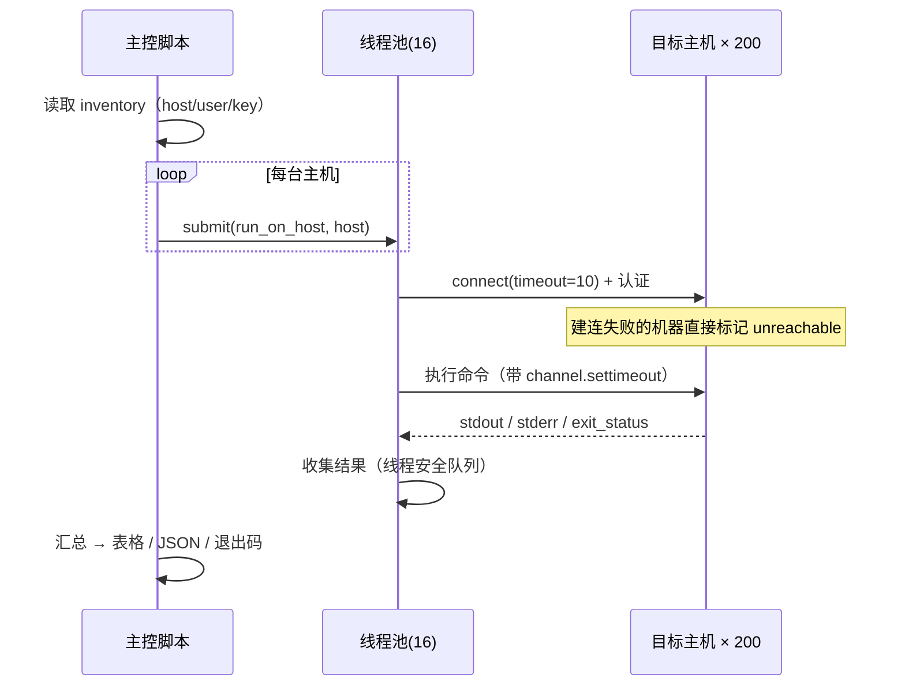
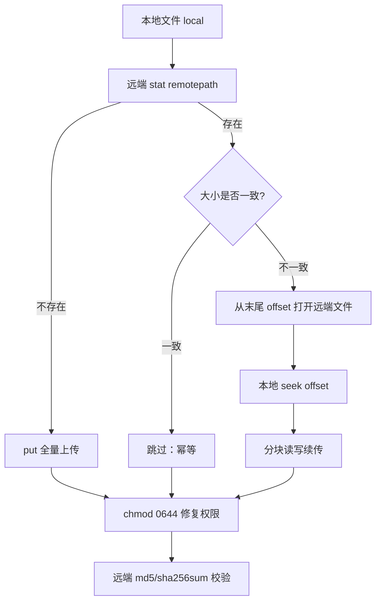

# Day 168 — SSH 远程管理（paramiko）

> **一句话定义**：SSH 是一条**加密、可复用、双向**的隧道；paramiko 是这条隧道的
> **纯 Python 客户端实现**，让你不装 `ssh` 命令也能执行远程命令、传文件。

本课从"SSH 到底在保护什么"讲到"批量运维工具怎么写才不会把自己玩死"，
最后落在一个可运行的四脚本工程上（`code/01`~`04`）。

---

## 1. 学习目标

学完本课，你应该能够：

- [ ] 说清 SSH 协议的四层结构，以及每层各解决什么问题
- [ ] 解释"公钥认证比密码认证更安全"的**三个具体理由**（不是口号）
- [ ] 用 `paramiko.SSHClient` 连上一台机器，正确取回 `stdout`/`stderr`/`exit_status`
- [ ] 用 `Transport` + `Channel` 复用一条连接跑几百条命令，而不是每次新建连接
- [ ] 用 `SFTPClient` 上传/下载文件，并知道它与 `scp`/`sftp` 命令的关系
- [ ] 写出**带并发、带超时、带重试、带审计**的批量运维脚本
- [ ] 说出至少 5 个真实生产事故对应的坑（拼接注入、无超时、不校验主机密钥……）

---

## 2. 概念解释

### 2.1 SSH 解决的是什么问题

回到 1995 年：`telnet` 明文传输，`rsh`/`rlogin` 依赖 `.rhosts` 信任（等于没有认证）。
一个网络抓包就能拿到你的密码和全部操作内容。

SSH 的三个核心承诺（按重要性排序）：

| 承诺 | 手段 | 如果缺失会怎样 |
|:---|:---|:---|
| **机密性** | 对称加密（AES/ChaCha20） | 同网段任何人都能用 tcpdump 看到你的密码 |
| **完整性** | MAC（HMAC）/ AEAD | 中间人可以静默篡改命令内容 |
| **对端认证** | 主机密钥 + 用户认证 | 你以为连的是生产机，其实是攻击者的跳板 |

> **关键认知**：SSH 不是"一条管道"，而是一条**可以复用、可开多路**的隧道。
> 一次 TCP 连接里可以同时跑 3 个 shell、2 个 SFTP 会话、若干端口转发。
> 这就是为什么"每次命令都新建连接"的脚本是**反协议设计**的。

### 2.2 认证：密码 vs 公钥

```text
密码认证（password）：
    client ──"我是 root，密码是 hunter2"──▶ server
    ❌ 密码会离开客户端（虽然隧道加密，但服务端拿到了明文；
       且可被钓鱼、可被暴力破解、无法自动化轮换）

公钥认证（publickey）：
    server 事先持有 client 的公钥
    client ──"我想用 key 指纹 XX 登录"──▶ server
    server ──"challenge: 用私钥签这段随机数"──▶ client
    client ──"签名 = ..."──▶ server  （私钥永不离开客户端！）
    ✅ 私钥不出本机、✅ 抗暴力破解（4096 位 ≈ 不可枚举）、
    ✅ 可无交互自动化、✅ 一条 known_hosts + 一个 key 就能精确吊销
```

**工程结论**：
- 自动化用**密钥**，密钥必须有口令（passphrase）+ 用代理（ssh-agent）避免硬编码
- 密码认证留给"人第一次登录"，之后立刻换密钥
- 永远不要 `password="..."` 写死在代码里（Git 历史删不干净）

### 2.3 paramiko 是什么，不是什么

| 是 | 不是 |
|:---|:---|
| 纯 Python 的 SSH2 客户端/服务端库 | 不是 `ssh` 命令的包装（不读你的 `~/.ssh/config`！） |
| 支持公钥/密码/键盘交互认证、SFTP、端口转发 | 不是运维框架（无并发编排、无重试、无幂等） |
| 依赖 `cryptography`，可跨平台 | 不负责"任务该不该跑"——那是 Ansible/Fabric/Salt 的事 |

> ⚠ 最常见的误解：**paramiko 不会自动读 `~/.ssh/config`**。
> 你在命令行能 `ssh prod` 是因为 `ssh` 命令读了 config；
> 用 paramiko 就必须自己解析 `Host` 段（`04` 实战脚本里演示了简化版解析）。

### 2.4 三层 API：SSHClient / Transport / Channel

```text
┌──────────────────────────────────────────────────────────────┐
│ 最上层 SSHClient   —— "一把好用的瑞士军刀"                      │
│   · connect() / exec_command() / open_sftp()                  │
│   · 每次 exec_command 在内部**复用**同一条 Transport 的 channel │
│   · 适合：脚本化、命令量不大（几十~几百条）                      │
├──────────────────────────────────────────────────────────────┤
│ 中层 Transport     —— "连接本体"，可精细控制                     │
│   · 管理密钥交换、加密、keepalive、channel 生命周期              │
│   · 可同时 open_session() 多个 channel（真正的多路复用）          │
│   · 适合：连接池、长连接、自定义保活、端口转发                    │
├──────────────────────────────────────────────────────────────┤
│ 下层 Channel       —— "一条逻辑流"                              │
│   · 有独立的 recv/send、exit_status、pty 设置                   │
│   · exec_command / invoke_shell / SFTP 都跑在 channel 上         │
└──────────────────────────────────────────────────────────────┘
```

**为什么值得分清**：`SSHClient.exec_command()` 每调一次就开一个新 channel；
如果你要跑 1000 条命令，要么复用 client（推荐），要么用 `Transport.open_session()`
自己管理。`SSHClient` 底层也是 `Transport`，只是帮你把脏活包了。

### 2.5 主机密钥验证：TOFU 模型

```text
第一次连接某主机：
    服务端发来自己的公钥指纹
    客户端：没记录过 → 弹窗"你确定吗？(yes/no)"
            你输 yes → 指纹写进 ~/.ssh/known_hosts（Trust On First Use）

第二次以后：
    指纹与记录一致 → 静默通过
    指纹不一致     → ⚠⚠⚠ "REMOTE HOST IDENTIFICATION HAS CHANGED"
                    （可能被 MITM，也可能只是重装系统）
```

paramiko 的默认策略是 **`RejectPolicy`**：未知主机直接抛异常。
这比命令行 `ssh` 更严格。开发时图省事写成 `AutoAddPolicy` 很方便，
但**生产脚本里应该改成"白名单校验"**（见陷阱 2）。

```python
# ❌ 生产禁用：等于完全不校验
client.set_missing_host_key_policy(paramiko.AutoAddPolicy())

# ✅ 生产写法：显式加载一份受信 known_hosts，未知主机直接失败
client.load_system_host_keys("/etc/ssh/ssh_known_hosts")
client.set_missing_host_key_policy(paramiko.RejectPolicy())
```

### 2.6 SFTP 与 SCP 的区别

| | SCP | SFTP |
|:---|:---|:---|
| 协议 | 复用 `ssh` 命令 + 传统 cp 语义（老） | **独立子系统**，跑在 SSH channel 上 |
| 能否断点续传 | 不能 | 能（`seek` + `prefetch`） |
| 能否列目录/改权限/建软链 | 不能 | 能 |
| 能否在文件不影响 shell 的情况下并发 | 差 | 好 |
| paramiko 支持 | 无直接 API（用 sftp 代替） | `open_sftp()` |

**结论**：自动化里统一用 SFTP。paramiko 的 `SFTPClient` 还提供了
`put`/`get`/`listdir`/`stat`/`chmod`/`rename`/`symlink` 等一整套。

### 2.7 并发模型：批量运维为什么必须并发

假设 200 台机器，每台执行一条 `uptime` 耗时 1.2 秒（网络 RTT 占大头）：

| 模式 | 总耗时 | 说明 |
|:---|:---|:---|
| 顺序 | 200 × 1.2 ≈ **240 秒** | 4 分钟里你只是在等网络 |
| 并发 20 | 10 批 × 1.2 ≈ **12 秒** | 运维体验的临界点 |
| 并发 100 | 2 批 × 1.2 ≈ **2.4 秒** | 但可能触发目标机 `sshd` 的 `MaxStartups` 限流 |
| 并发 200 | ~1.2 秒 | ❌ 大概率被限流/被安全设备判定为扫描 |

> **关键认知**：并发的瓶颈**不是 CPU**（网络 IO 等待），
> 所以用 `ThreadPoolExecutor` 就够了，不需要 asyncio 重写。
> 但并发度必须**有上限**（默认建议 8~16），否则你会亲手制造一次"分布式拒绝服务"。

```text
顺序执行（200 台）             并发 16（200 台）
台1 ──1.2s──▶                  16 台并排 ──1.2s──▶ 第 1 批
台2 ──1.2s──▶                  16 台并排 ──1.2s──▶ 第 2 批
...                            ...
台200 ──1.2s──▶                ≈ 13 批 × 1.2s ≈ 15.6s
总计 ≈ 240s                    吞吐提升 ≈ 15×
```

---

## 3. 原理深入

### 3.1 SSH 协议的分层（RFC 4251~4254）

```text
┌─────────────────────────────────────────────────────────────┐
│ ④ 连接层 Connection Protocol (RFC 4254)                      │
│    把一条隧道切成多个 channel：session / direct-tcpip /       │
│    forwarded-tcpip / x11。每个 channel 有自己的流控窗口。      │
├─────────────────────────────────────────────────────────────┤
│ ③ 用户认证 User Auth (RFC 4252)                              │
│    publickey / password / keyboard-interactive / hostbased   │
│    认证发生在**加密隧道已建立之后** —— 密码本来就受保护        │
├─────────────────────────────────────────────────────────────┤
│ ② 密钥交换 Key Exchange (RFC 4253)                           │
│    协商算法套件 + 交换临时密钥 → 派生会话密钥                   │
│    支持 ECDH/DH/curve25519 → 前向保密（PFS）                  │
├─────────────────────────────────────────────────────────────┤
│ ① 传输层 Transport (RFC 4253)                                │
│    加密、压缩、MAC、重传；本质是 TCP 之上的一层安全封装        │
└─────────────────────────────────────────────────────────────┘
        ▲ 版本交换："SSH-2.0-OpenSSH_9.6"（**明文**，别放敏感信息）
```

**为什么要分层**：认证方式可以升级（从密码到公钥到 FIDO2）而不动传输层；
通道类型可以扩展（新增 `session` 子类型）而不动认证层。

### 3.2 密钥交换与"前向保密"

```text
❌ 不用 PFS（老式 RSA 传输）：
   client 生成随机会话密钥 → 用 server 的 RSA 公钥加密 → 发给 server
   ⇒ 攻击者今天录下全部流量，三年后拿到 server 私钥 → **全部历史流量被解**

✅ 用 PFS（ECDH / curve25519）：
   client 与 server 各生成**临时**密钥对，交换公钥，各自算出同一个共享密钥
   ⇒ 临时私钥用完即弃；即使 server 长期私钥泄露，历史流量依然无法解
```

因此现代 `sshd_config` 应该优先 `KexAlgorithms curve25519-sha256,ecdh-*`。
`paramiko` 会自动协商，你通常不用管——但要**知道**你在享受 PFS。

### 3.3 伪终端（pty）：为什么"没有输出"

```text
不开 pty（默认 exec_command）：
    sshd 把远端进程的 stdout 直接接到 channel 上
    ⇒ 输出是"字节流"，没有回显、没有行缓冲、颜色/TTY 探测失败

开 pty（get_pty=True）：
    sshd 分配一个伪终端（/dev/pts/N）
    ⇒ 有回显、有行缓冲、`ls --color` 有效
    ❌ 但 stdout 与 stderr **被合并**在一起（都在 pty 上），且会多出 \r\n
```

**踩坑实例**：`sudo` 通常要求 tty。不开 pty 时 `sudo -n cmd` 可能报
`sudo: sorry, you must have a tty to run sudo`。
工程上两条路：① `get_pty=True`（牺牲 stdout/stderr 分离）；
② 配置 `sudoers` 的 `!requiretty`（推荐，保持流纯净）。

### 3.4 退出状态码：`exit_status` 从哪来

```python
stdin, stdout, stderr = client.exec_command("exit 3")
status = stdout.channel.recv_exit_status()   # 阻塞直到远端进程结束 → 3
```

三个必须知道的点：

1. `recv_exit_status()` 会**阻塞**。如果远端命令永不退出，你的脚本也永不退出
   —— 必须配合 `channel.settimeout()` 或用 `channel.status_event.wait(timeout)`。
2. `stdout.read()` 也可能**永远阻塞**（远端还在写）。
   稳妥写法：`read()` 之后才 `recv_exit_status()`，或用 `channel.recv_exit_status()` 前先关写端。
3. 远端命令的退出码 **127** = 命令不存在，**126** = 不可执行，
   **128+N** = 被信号 N 杀死（如 137 = SIGKILL，常见于 OOM）。
   **自定义退出码契约**（0 成功 / 2 有告警 / 1 失败）能让你的运维脚本被上游自动化消费。

### 3.5 保活（keepalive）与"卡死"

```text
问题场景：NAT/防火墙 300 秒无流量就静默丢弃连接映射
   → 你的脚本 5 分钟不执行任何东西，然后下一次 read() 永远阻塞
   （TCP 层面认为连接还活着，因为没人发 RST）

解法三层：
   ① transport.set_keepalive(30)      # SSH 层：每 30s 发一个加密空包
   ② channel.settimeout(10)           # 应用层：单次 IO 超时
   ③ 全局 connect(timeout=10, banner_timeout=15, auth_timeout=15)
                                      # 连接建立三阶段的分别超时
```

**为什么三层都要**：第①层防"空闲被掐"，第②层防"对端假死"，
第③层防"连一个不响应的 IP 时卡在三次握手"。缺任何一层都有对应的故障姿势。

### 3.6 SFTP 是独立子系统

```text
SSH 连接
 ├── channel(session)  → 交互式 shell / exec_command
 ├── channel(session)  → sftp 子系统（ssh usr@host -s sftp）
 └── channel(direct-tcpip) → 端口转发

paramiko:  client.open_sftp()  ← 新开一个 channel 并请求 "sftp" 子系统
           → 之后的 sftp.put/get/listdir 都是在这个 channel 上发
             带二进制头的 SFTP 协议包（SSH_FXP_*）
```

**性能结论**：SFTP 有**每文件一次往返**的开销（open/write/close）。
传 1000 个小文件时，往返延迟会主导总耗时 —— 这时应先用
`tar` + 一次上传，而不是 1000 次 `sftp.put`。

### 3.7 命令拼装：为什么 `shell=True` 式的拼接是灾难

```python
# ❌ 危险
cmd = f"ls {user_input}"        # user_input = "; rm -rf /"  → 完蛋
cmd = f"grep {pattern} /var/log/app.log"   # pattern 含空格/管道 → 命令被改写

# ✅ 安全
from shlex import quote
cmd = f"ls {quote(user_input)}"          # 转义成单个参数
# 或者干脆把参数固定，不接受用户输入（白名单）
```

**原理**：`exec_command` 把字符串交给远端 `/bin/sh -c`，
远端 shell 会**再次解释**它。所以"转义一次"不够，要按远端 shell 的规则转义
（`shlex.quote` 就是干这个的）。这也是"命令注入"在生产运维脚本里最常见的原因。

---

## 4. 定义与使用方法（API 速查表）

### 4.1 `SSHClient` —— 最常用入口

| 方法 | 作用 | 关键参数 |
|:---|:---|:---|
| `connect(hostname, port=22, username=None, password=None, pkey=None, key_filename=None, timeout=None, allow_agent=True, look_for_keys=True, compress=False, banner_timeout=None, auth_timeout=None)` | 建立连接并认证 | `timeout` 只作用于 TCP 建连；`banner_timeout` 等 banner；`auth_timeout` 等认证 |
| `exec_command(command, bufsize=-1, timeout=None, get_pty=False, environment=None)` | 执行命令 | 返回 `(stdin, stdout, stderr)`，都是 `ChannelFile` |
| `open_sftp()` | 打开 SFTP | 返回 `SFTPClient` |
| `get_transport()` | 拿到底层 Transport | 用于设 keepalive |
| `set_missing_host_key_policy(policy)` | 未知主机策略 | `RejectPolicy`(默认) / `AutoAddPolicy` / `WarningPolicy` |
| `load_system_host_keys(filename=None)` | 从文件加载受信主机密钥 | 传路径才生效 |
| `close()` | 关闭连接 | 别忘了 `finally` |

### 4.2 命令执行三件套

```python
stdin, stdout, stderr = client.exec_command("uname -a", timeout=10)
out = stdout.read().decode("utf-8", errors="replace")
err = stderr.read().decode("utf-8", errors="replace")
status = stdout.channel.recv_exit_status()
```

| 对象 | 方法 | 说明 |
|:---|:---|:---|
| `ChannelFile` | `read()` / `readline()` / `readlines()` | **读到 EOF 才返回**（远端进程结束） |
| `Channel` | `recv_exit_status()` | 阻塞式取退出码 |
| `Channel` | `settimeout(sec)` | 单次 IO 超时（超时抛 `socket.timeout`） |
| `Channel` | `get_pty()` 参数 | 见 3.3 |
| `Channel` | `shutdown_write()` | 关掉 stdin，常用于让远端 `cat` 之类收尾 |

### 4.3 `SFTPClient` 速查

| 方法 | 说明 |
|:---|:---|
| `put(localpath, remotepath, callback=None, confirm=True)` | 上传；`confirm=True` 会额外 `stat` 一次校验 |
| `get(remotepath, localpath, callback=None)` | 下载 |
| `putfo(fileobj, remotepath, file_size=None)` | 从内存中的文件对象上传（省一次落盘） |
| `listdir(path)` / `listdir_attr(path)` | 列目录；后者带属性、少一次往返 |
| `stat(path)` / `lstat(path)` | 属性；`lstat` 不跟随软链 |
| `mkdir` / `rmdir` / `remove` / `rename` / `chmod` / `symlink` | 文件系统操作 |
| `open(path, mode)` | 返回远端文件对象，可 `seek`（断点续传基础） |
| `sftp.get_channel().settimeout(sec)` | 给 SFTP 设超时 |

### 4.4 `Transport` 精细控制

| 方法/属性 | 说明 |
|:---|:---|
| `set_keepalive(seconds)` | 空闲保活；`0` 关闭 |
| `open_session()` | 手动开 channel |
| `is_active()` | 连接是否还活着 |
| `use_compression()` | 开压缩（CPU 换带宽，内网大文本传输有用） |
| `auth_publickey` / `auth_password` / `auth_none` | 手动认证序列 |
| `get_security_options()` | 查/改本端支持的算法列表 |

### 4.5 常用策略类

```python
paramiko.RejectPolicy()      # 默认：未知主机 → SSHException
paramiko.AutoAddPolicy()     # 自动接受并写入（开发方便，生产慎用）
paramiko.WarningPolicy()     # 接受但打印警告
```

---

## 5. 图解

### 5.1 一次 `exec_command` 的完整旅程

```text
 你的脚本                paramiko                    TCP/加密隧道                远端 sshd
    │                       │                             │                        │
    │ exec_command("uptime")│                             │                        │
    ├──────────────────────▶│                             │                        │
    │                       │ open channel (session)       │                        │
    │                       ├──── CHANNEL_OPEN ──────────▶│───────────────────────▶│
    │                       │◀─── CHANNEL_OPEN_CONFIRM ───│◀───────────────────────┤
    │                       │ exec 请求 "uptime"            │                        │
    │                       ├──── CHANNEL_REQUEST(exec) ─▶│───────────────────────▶│
    │                       │                             │       fork /bin/sh -c  │
    │                       │◀──── CHANNEL_DATA("...") ───│◀───────────────────────┤
    │  stdout.read()  ⏳    │◀──── CHANNEL_DATA ──────────│                        │
    │                       │◀──── CHANNEL_EOF ───────────│◀──── 进程退出 ──────────┤
    │                       │◀──── CHANNEL_REQUEST(exit-status=0)
    │  recv_exit_status()=0 │                             │                        │
    │◀──────────────────────┤                             │                        │
```

### 5.2 三层 API 与"连接复用"的真实结构

```text
一次 TCP 连接（一次 KEX、一次认证）
│
Transport
├── channel#1  session  ── exec_command("uptime")        ← 用完就关
├── channel#2  session  ── exec_command("df -h")
├── channel#3  session  ── invoke_shell()（交互式）
├── channel#4  session  ── sftp 子系统（open_sftp）
└── channel#5  direct-tcpip ── 本地 8080 → 远端 80（端口转发）

❌ 错误模式：每台机器每条命令都 SSHClient().connect()
   → 200 台 × 5 条 = 1000 次密钥交换 + 1000 次认证
   → 目标机 auth.log 刷屏，安全设备告警，自己也慢 10 倍

✅ 正确模式：每台机器 1 条 Transport，命令都挂在它上面
```

### 5.3 Mermaid：批量运维的执行时序



### 5.4 Mermaid：SFTP 上传与断点续传



### 5.5 命令注入：一次 `; rm -rf /` 的解构

```text
  脚本拼接：cmd = f"tar -czf /backup/{name}.tar.gz /data"
  攻击输入：name = "x; rm -rf /"
  ────────────────────────────────────────────────
  远端 /bin/sh -c 看到的：
      tar -czf /backup/x; rm -rf /.tar.gz
                            └── 分号把命令切成两条！第二条真的会跑

  修法（二选一）：
   ① shlex.quote(name) → 'x; rm -rf /' 被包成单引号整体参数
   ② 不接受用户输入，只接受白名单 ID → 查表得到固定命令
```

---

## 6. 常见陷阱 Top 8

### 陷阱 1：把 paramiko 当 `ssh` 命令用，指望它读 `~/.ssh/config`

```python
# ❌ 你在命令行 `ssh prod` 能通，是因为 ssh 命令读了 config
client.connect("prod")           # paramiko: 会去解析 DNS "prod" → 失败

# ✅ 自己解析 config（04 实战里有 30 行实现），或显式传 host/port/user
```

`~/.ssh/config` 里的 `Host alias` / `ProxyJump` / `IdentityFile` paramiko **一概不管**。

### 陷阱 2：`AutoAddPolicy()` 一把梭

它等价于"任何主机我都信"。一旦你在中间有个 DNS 污染/ARP 欺骗的环境，
就是把自己的凭据交给攻击者。生产里改成加载受信 `known_hosts` + `RejectPolicy`。

### 陷阱 3：忘记超时 → 脚本永久挂起

```python
# ❌ 三个超时全都没有
client.connect(host, username=u, key_filename=k)
stdin, stdout, stderr = client.exec_command("tail -f /var/log/app.log")  # 永不返回
out = stdout.read()

# ✅ 建连超时 + channel 超时 + keepalive
client.connect(host, username=u, key_filename=k,
               timeout=10, banner_timeout=15, auth_timeout=15)
tr = client.get_transport(); tr.set_keepalive(30)
stdin, stdout, stderr = client.exec_command("tail -f ...", timeout=10)
try:
    out = stdout.read()
except socket.timeout:
    print("读超时，放弃")
```

### 陷阱 4：不读 `stderr` 导致"远端缓冲区写满 → 命令挂死"

```text
远端进程往 stderr 写了很多（例如 100 MB 报错日志），
你没读 stderr，TCP 接收窗口填满 → 远端进程 write() 阻塞
→ 你的 stdout.read() 也永远读不到 EOF
→ 双向死锁。
```

**修法**：要么同时读两个流，要么用 `stdout.channel` 分别带超时读；
批量场景推荐"边执行边 drain"（`04` 里用 select/轮询读）。

### 陷阱 5：`get_pty=True` 后 stdout 与 stderr 混在一起

开了 pty，`stderr` 通道永远为空，全部内容跑到 `stdout` 里，
还会多出 `\r` 和回显。除非远端强制要求 tty（sudo、部分交互命令），否则别开。

### 陷阱 6：把密码/私钥口令硬编码进代码

```python
# ❌ Git 历史会永久保留
client.connect(host, username="root", password="P@ssw0rd!")

# ✅ 从环境变量/密钥文件/ssh-agent 取
import os
pkey = paramiko.Ed25519Key.from_private_key_file(
    os.path.expanduser("~/.ssh/id_ed25519"), password=os.environ.get("KEY_PASSPHRASE"))
client.connect(host, username="deploy", pkey=pkey)
```

### 陷阱 7：SFTP 传完不校验，传了个"半个文件"上去

网络抖动/磁盘满会让 `put` 静默截断。**必须**在传完后校验：
- 小文件：远端 `md5sum` 比对
- 大文件：至少比对 `stat().st_size`
- 关键发布：本地算 sha256 → 远端 `sha256sum`

### 陷阱 8：并发度无上限 → 把目标机打死

`ThreadPoolExecutor(max_workers=200)` 会在 1 秒内对 200 台机器发起认证。
`sshd_config` 的 `MaxStartups 10:30:100` 表示"超过 10 个未认证连接就开始随机丢弃"，
你的脚本会看到一堆 `Connection reset by peer`，还以为是网络问题。
**默认 8~16，大集群也不要超过 32。**

---

## 7. 实战代码案例

`code/` 下 4 个脚本，都与真实运维任务对齐：

| 文件 | 定位 | 你会学到 |
|:---|:---|:---|
| `01-basic-ssh.py` | 基础 | connect/exec_command/SFTP 的最小正确写法 + `--self-test` |
| `02-pitfalls.py` | 避坑 | 离线复现 6 个坑（超时、stderr 死锁、注入、pty、并发上限、幂等） |
| `03-advanced-ssh.py` | 进阶 | 连接复用 + channel 池 + keepalive + 断点续传上传 |
| `04-batch-ops.py` | 实战 | **批量运维工具**：inventory 解析 + 并发执行 + 审计 + JSON/表格报告 |

### 7.1 运行方法

```bash
cd days/day-168-ssh-远程管理/code
pip install paramiko                 # 唯一依赖

# 离线自检（不需要真的 SSH 服务器）
python3 01-basic-ssh.py --self-test
python3 02-pitfalls.py --self-test      # 只演示"正确解法"，不真连
python3 03-advanced-ssh.py --self-test
python3 04-batch-ops.py --self-test

# 真机联调（把 dev 换成你自己的主机）
python3 01-basic-ssh.py --host dev --user deploy --key ~/.ssh/id_ed25519 --cmd "uptime"
python3 04-batch-ops.py --inventory ./inventory.ini --cmd "df -h /" --workers 8 --out ./reports
```

> 没有可用的 SSH 目标机时，可以在本机起一个：
> `sudo apt install openssh-server && sudo systemctl start ssh`，
> 然后 `ssh-keygen -t ed25519` + `ssh-copy-id localhost` 自连自测。

### 7.2 批量运维工具的"三条设计红线"

```text
① 幂等优先：同一批命令重复执行 N 次，结果必须一致（跳过已完成的）
   → 部署类任务里，先 stat/比对 hash，再决定要不要传

② 结果必须可审计：每台机器、每条命令、开始时间、结束时间、退出码、输出摘要
   → 落盘 JSONL，出问题能翻账

③ 退出码必须能表达"部分失败"：
   0 = 全部成功     1 = 全部/多数失败     2 = 部分失败（有告警）
   → 让 CI/上游自动化能据此决策，而不是人去数日志
```

### 7.3 实测输出样例（04 的表格报告）

```text
================================================================================
主机                 状态        耗时(s)  退出码  摘要
--------------------------------------------------------------------------------
web-01               ok             0.42       0  Filesystem      Size  Used Avail Use%
web-02               ok             0.51       0  Filesystem      Size  Used Avail Use%
db-01                unreachable   10.00     -1  connect timeout (timeout=10s)
web-03               warn           0.63       2  /dev/sda1        98% full
================================================================================
汇总：成功 2 / 告警 1 / 失败 1 / 总计 4        退出码 = 2（部分失败）
```

---

## 8. 思考题

1. **为什么"公钥认证"能让私钥永不离开客户端？**
   请描述 challenge-response 的完整三步，并说明"服务端拿到的是签名而不是私钥"
   为什么在数学上是安全的（提示：签名的不可逆性与随机数的作用）。

2. **`timeout=10` 为什么不能阻止脚本永久挂起？**
   请分别说出"建连阶段"、"认证阶段"、"命令执行阶段"、"空闲等待阶段"
   四类阻塞各需要哪个参数/机制来兜底。

3. **为什么批量运维脚本的并发上限不是越大越好？**
   从目标机 `sshd` 的 `MaxStartups`、防火墙的"连接速率触发"，以及
   你自己脚本的内存占用（每个线程栈 + socket 缓冲）三个角度量化说明。

4. **`recv_exit_status()` 和 `stdout.read()` 谁应该先调用？**
   给出两种顺序各自可能死锁的场景，并解释为什么"同时 drain stdout 与 stderr"
   能同时解决两个方向的死锁。

5. **如果远端有 500 台机器、要分发一个 200 MB 的包，你会怎么设计？**
   提示：考虑"先推到几台中继机再 P2P"、"rsync 增量"、"压缩"、
   "并发上限"与"校验与回滚"这五个维度。

6. **为什么 SFTP 上传 1000 个 1 KB 文件比上传 1 个 1 MB 文件慢得多？**
   请从"每文件至少几次协议往返"出发估算，并给出工程上的合并策略。

---

## 9. 小结

```text
  一句话记住 paramiko：
    它是"把加密隧道包装成 Python 对象"的库；
    Transport 是连接本体，Channel 是逻辑流，SSHClient 是便利门面。

  四条铁律：
    ① 连接要复用（一台机一条 Transport），并发要有上限（8~16）
    ② 超时三层齐全（connect / channel / keepalive），否则必挂
    ③ stdout 与 stderr 都要读，命令拼接一律 shlex.quote
    ④ 结果落盘审计 + 退出码表达"部分失败"，让自动化能接力

  三个最常见的生产事故：
    · AutoAddPolicy + 硬编码密码  → 安全事故
    · 没超时 + 不读 stderr        → 脚本永久挂起
    · 并发 200 无上限             → 目标机不可用（自己造成 DDoS）
```

> 下一课 Day 169：**Fabric 批量执行** —— 把本课手写的"线程池 + 连接复用 + 审计"
> 换成更高层的声明式任务框架，并学会多服务器并行与错误处理。
