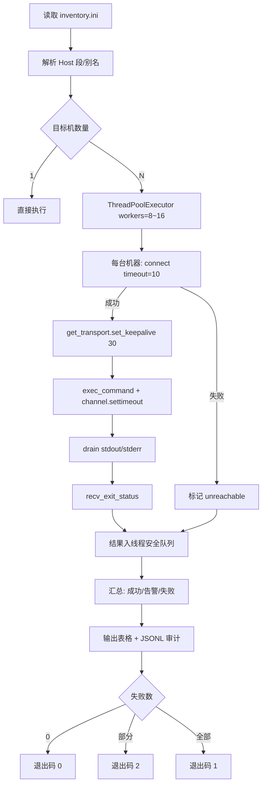
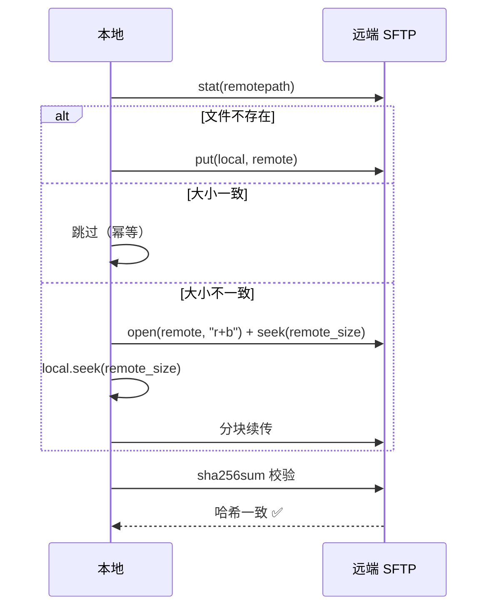

# Day 168 — SSH 远程管理（paramiko）· 图解

> 图都可用纯文本阅读。Mermaid 代码块可直接粘到支持 Mermaid 的渲染器里看效果。

---

## 图 1：SSH 协议分层与"保护了什么"

```text
        ┌──────────────────────────────────────────────────┐
        │ 你的脚本 / 运维动作                                │
        └───────────────────────┬──────────────────────────┘
                                │
┌───────────────────────────────▼────────────────────────────────┐
│ ④ 连接层 Connection (RFC 4254)                                  │
│    channel 多路复用：session / direct-tcpip / sftp / x11        │
│    解决：一条隧道跑很多事                                        │
├────────────────────────────────────────────────────────────────┤
│ ③ 用户认证 UserAuth (RFC 4252)                                  │
│    publickey / password / keyboard-interactive                  │
│    解决：你是谁                                                  │
├────────────────────────────────────────────────────────────────┤
│ ② 密钥交换 KEX (RFC 4253)                                       │
│    curve25519 / ecdh / DH → 派生会话密钥 → 前向保密(PFS)          │
│    解决：密钥怎么安全地"当场产生"                                │
├────────────────────────────────────────────────────────────────┤
│ ① 传输层 Transport (RFC 4253)                                   │
│    AES-GCM / chacha20-poly1305 + MAC + 压缩                     │
│    解决：机密性 + 完整性                                         │
└───────────────────────────────┬────────────────────────────────┘
                                │
                        TCP :22（明文之外再无明文）
```

**读法**：从下往上是"先建安全管道，再认证身份，最后开多路通道"。
版本串 `SSH-2.0-OpenSSH_x.y` 是唯一明文交换，别在那里塞敏感信息。

---

## 图 2：公钥认证的 challenge-response

```text
        client（持有私钥）                        server（持有公钥）
              │                                        │
              │ ① "我要用 key 指纹 SHA256:ab.. 登录"     │
              ├───────────────────────────────────────▶│
              │                                        │ 检查 authorized_keys
              │ ② challenge = 随机数 R（每次不同）       │
              │◀───────────────────────────────────────┤
              │                                        │
              │ ③ signature = sign(私钥, R)             │
              ├───────────────────────────────────────▶│
              │                                        │ verify(公钥, R, signature)?
              │ ④ "OK / FAIL"                          │
              │◀───────────────────────────────────────┤

关键：R 只有本次有效 → 录下 ③ 也无法重放
      私钥从未离开 client → 服务端被拖库也拿不到你的私钥
```

---

## 图 3：三层 API 与连接复用

```text
    ❌ 反模式：每命令一次连接                 ✅ 正模式：一机一连接

  SSHClient ─TCP─▶ 主机A                    Transport ──┬─ channel#1 exec("uptime")
  SSHClient ─TCP─▶ 主机A  (第 2 次认证)                  ├─ channel#2 exec("df -h")
  SSHClient ─TCP─▶ 主机A  (第 3 次认证)                  ├─ channel#3 sftp 子系统
  ...                                                    └─ channel#4 direct-tcpip
  5 条命令 = 5 次 KEX + 5 次认证                5 条命令 = 1 次 KEX + 1 次认证

  开销对比（局域网，单机 5 条命令）：
    反模式 ≈ 5 × (KEX 80ms + 认证 30ms) ≈ 550ms
    正模式 ≈ 110ms + 5 × 2ms             ≈ 120ms
```

---

## 图 4：`exec_command` 的双向死锁（陷阱 4）

```text
   远端 /bin/sh                                       你的 Python
   ┌──────────────┐                                  ┌──────────────┐
   │ 写 stdout ───┼──────────▶ TCP 窗口 ─────────────▶│ stdout buffer │
   │ 写 stderr ───┼──────────▶ 窗口满了 → write()    │  （你没读）   │
   │              │            阻塞 ⛔               │ stderr buffer │
   └──────────────┘                                  └──────────────┘
            ▲                                                 │
            │              你还在等 stdout.read() 的 EOF ◀─────┘
            └──────────── 双向等待 → 永久挂起 ──────────────────┘

   修法：两条流都要 drain；或给 channel 设 settimeout 并循环读。
```

---

## 图 5：Mermaid — 批量运维全流程



---

## 图 6：Mermaid — 幂等上传（断点续传 + 校验）



---

## 图 7：并发度与"自伤"曲线

```text
  总耗时(s)                          失败率
  240 │●                            100% │                    ● 200
      │  ●                                │                ● 100
      │    ●                              │            ● 32
   16 │      ●────●────●                 10% │      ● 16
      │                       ●             │  ● 8
    0 │━━━━━━━━━━━━━━━━━━━━━━▶           0% │●──────────────▶
      1   4   8   16  32  200              8   16  32  100 200
              并发度                                并发度
       ▲ 总耗时随并发指数下降              ▲ 失败率随并发陡升
                              ┌──────────────────────────┐
                              │ 甜蜜点：8~16             │
                              │ 原因：sshd MaxStartups   │
                              │       防火墙连接速率      │
                              └──────────────────────────┘
```

---

## 图 8：平台/工具能力对照

```text
                     SSHClient   Transport   SFTPClient   外部命令 ssh/scp
  执行单条命令           ✅          ✅(手动)      ❌           ✅
  多路复用              部分         ✅           ✅           ✅(ControlMaster)
  精细超时/保活          部分         ✅          部分          ❌
  读 ~/.ssh/config       ❌          ❌           ❌           ✅
  端口转发               ✅          ✅           ❌           ✅(-L/-R)
  纯 Python 无子进程      ✅          ✅           ✅           ❌

  结论：自动化脚本用 paramiko（可编程、可并发、可审计）；
        人工交互、临时排障用系统 ssh 命令（省事，且懂你的 config）。
```
