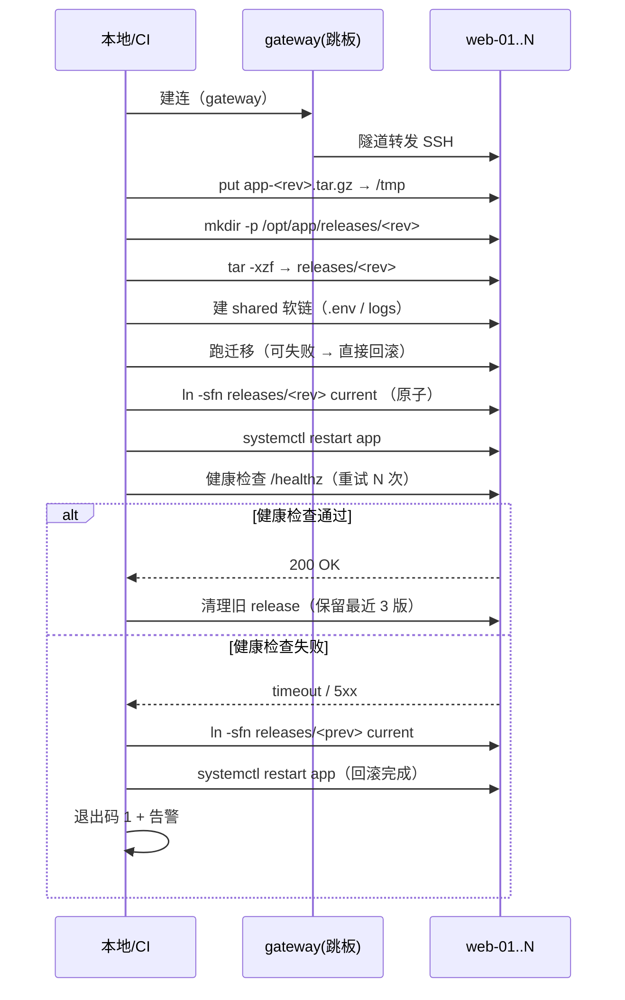
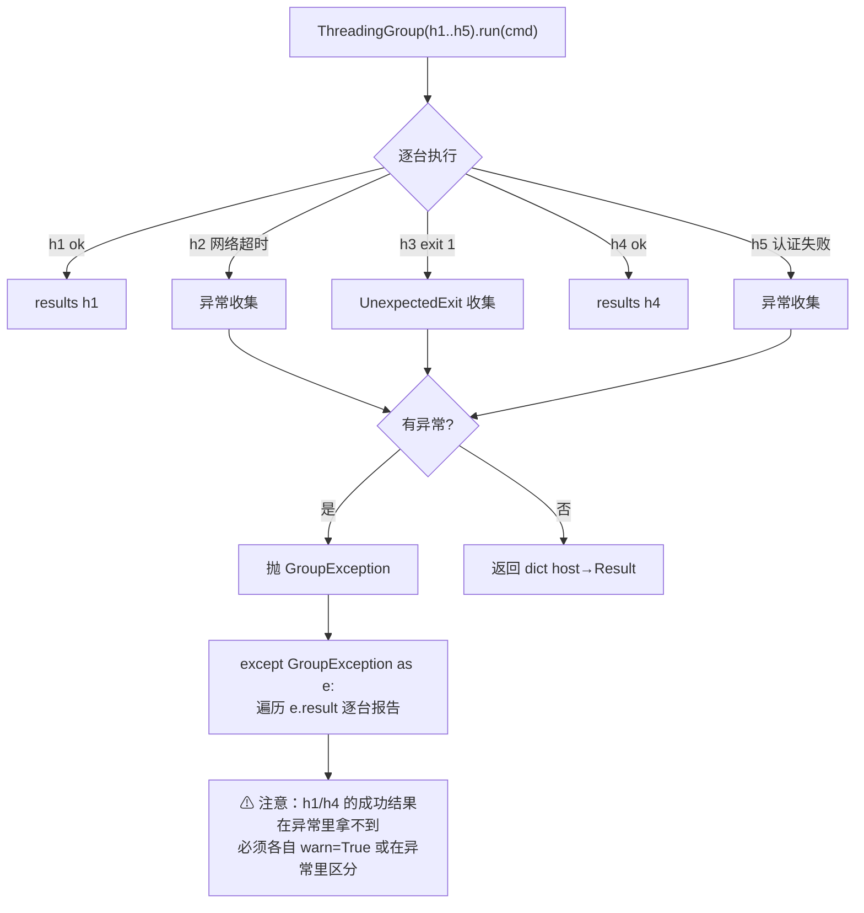

# Day 169 — Fabric 批量执行

> **一句话定义**：Fabric = **Invoke（任务/CLI 层）** + **Paramiko（SSH 层）**。
> 它把你昨天手写的"连接池 + 线程池 + 审计"换成了几个声明式原语，
> 代价是你必须接受它的**抽象边界**（尤其：它不提供幂等）。

本课从"Fabric 到底帮你做了什么"讲到"如何写出一份能回滚的部署脚本"。

---

## 1. 学习目标

学完本课，你应该能够：

- [ ] 说清 Fabric 的三层结构（`@task` / `Connection` / `Group`）与它和 paramiko 的关系
- [ ] 用 `Connection.run()` / `sudo()` / `put()` / `get()` 完成一次单机交互
- [ ] 用 `ThreadingGroup` / `SerialGroup` 做多机批量执行，并正确处理 `GroupException`
- [ ] 解释 `warn` / `hide` / `echo` / `pty` 四个参数各自的语义与误用后果
- [ ] 写出"release 目录 + 软链切换 + 上一版保留"的可回滚部署脚本
- [ ] 说清 Fabric **不提供**什么（幂等、状态管理、依赖图），以及什么时候该换 Ansible

---

## 2. 概念解释

### 2.1 Fabric 是什么：先把两层拆开

```text
┌───────────────────────────────────────────────────────────────┐
│  Invoke（任务与 CLI 层）                                        │
│    @task 装饰的函数 → 自动变成命令行子命令                        │
│    fab deploy --env=prod                                      │
│    处理：参数解析、任务依赖、环境变量（Context）、交互式提示        │
├───────────────────────────────────────────────────────────────┤
│  Fabric（SSH 层，本站重点）                                     │
│    Connection  —— 一台机器的一次会话                             │
│    Group       —— 多台机器的集合（Threading / Serial）            │
│    处理：run/sudo/put/get、认证、跳板机、结果对象                   │
├───────────────────────────────────────────────────────────────┤
│  Paramiko（协议层，Day 168 学过）                               │
│    Transport / Channel / SFTPClient                           │
└───────────────────────────────────────────────────────────────┘
```

**为什么这个分层很重要**：当 Fabric 的行为让你困惑时，先判断"这是 Invoke 的问题、
Fabric 的问题，还是 Paramiko 的问题"。绝大多数诡异的"卡住"，根因都在最底下那层
（TCP/认证/超时），而 Fabric 只是没帮你设好超时。

### 2.2 `Connection`：一台机器的一切动作都收进一个对象

```python
from fabric import Connection

c = Connection("web-01", user="deploy", port=22,
               connect_kwargs={"key_filename": "~/.ssh/id_ed25519"})

r = c.run("uname -a")          # 执行命令，返回 Result
print(r.stdout.strip())        # Result 是"已执行完的快照"，不是流
c.put("app.tar.gz", "/tmp/app.tar.gz")
c.sudo("systemctl restart nginx")
```

**三个关键点**：

| 点 | 说明 |
|:---|:---|
| `Connection` 复用一条 SSH 连接 | 同一个 `c` 上的多次 `run` 复用 Transport（和 Day 168 的池是一样的道理） |
| `run` 默认**非惰性** | 调用即执行、立即返回 `Result`，异常会立刻抛（除非 `warn=True`） |
| `connect_kwargs` 透传给 paramiko | 所以 `timeout`、`banner_timeout`、`auth_timeout` 都在这里设 |

### 2.3 `Result`：一次执行的完整快照

```python
from invoke.runners import Result

r = c.run("cat /etc/hostname")
r.command        # 'cat /etc/hostname'
r.stdout         # 'web-01\n'
r.stderr         # ''
r.return_code    # 0
r.ok             # True   （return_code == 0）
r.failed         # False
r.exited         # True   （进程已退出）
```

**为什么要看 `ok` 而不是 `return_code == 0`**：
`ok` 是 `return_code == 0` 的语义化别名；而 `exited` 在"被信号杀死"时为 `True`
但 `return_code` 可能是 `-1`。用 `ok`/`failed` 表达意图，用 `return_code` 做精细判断。

### 2.4 `Group`：多机原语

```python
from fabric import ThreadingGroup, SerialGroup

web = ThreadingGroup("web-01", "web-02", "web-03",
                     user="deploy", connect_kwargs={...})

results = web.run("uptime")        # dict: {host_str: Result}
for host, r in results.items():
    print(host, r.ok, r.stdout.strip())
```

| 类 | 执行方式 | 适用场景 |
|:---|:---|:---|
| `ThreadingGroup` | 全部并发（每台一个线程） | 只读巡检、采集信息：快 |
| `SerialGroup` | 顺序执行，一台一台来 | 变更操作、滚动重启：安全（有问题立即停） |

**关键区别（也是本课最重要的一条实践）**：

```text
巡检 / 采集 / 查状态   → ThreadingGroup（并发，越快越好，失败无所谓）
变更 / 部署 / 重启     → SerialGroup   （串行，一台失败立刻停，别把集群一起打挂）
```

**为什么**：并发变更一旦打到一半失败，你的集群会处于"一半新一半旧"的中间态，
而且很难判断停在哪。串行变更的失败是"清晰可判定"的。

### 2.5 `GroupException`：并行失败的聚合

```python
from fabric.exceptions import GroupException

try:
    ThreadingGroup("a", "b", "c").run("false")
except GroupException as exc:
    # exc.result 是 dict: {host_str: Exception}
    for host, err in exc.result.items():
        print(host, type(err).__name__, err)
```

**为什么需要它**：并发时"部分失败"是常态，但 Python 的异常模型只能抛一个。
Fabric 的解法是"抛一个装着所有失败的容器异常"。你必须显式遍历它，
否则会丢掉"另外两台成功/失败的信息"。

### 2.6 `sudo` 与 pty：为什么它要密码参数

```python
# 远端有 NOPASSWD sudo → 直接跑
c.sudo("systemctl restart nginx")

# 需要密码 → 必须显式给（Fabric 不会去猜）
from invoke import Responder
c.sudo("systemctl restart nginx", password="...", pty=True)
```

`sudo` 在远端通常要求 **tty**，所以 Fabric 内部会帮你加 `pty=True`。
而 pty 的副作用（Day 168 陷阱 3）在这里同样成立：**stdout 与 stderr 合流**。
所以"需要干净地分离输出"时，宁可走 `run("sudo -n ...")` + `!requiretty`。

### 2.7 `Config`：配置优先级

```text
优先级从低到高：
  ① 内置默认值
  ② ~/.fabric.yml / fabric.yml（项目级 Config）
  ③ 环境变量（FABRIC_*）
  ④ 代码里显式传入（Connection(config=...)）
  ⑤ 命令行参数（-H host、--user、--port）

配置合并用：
    from fabric import Config
    cfg = Config(overrides={"run": {"warn": True},
                            "ssh": {"connect_kwargs": {"timeout": 10}}})
```

**为什么要分层**：同一份部署代码要在 CI（无交互）和本地（有交互）跑出不同行为，
分层配置让你**不改代码**就能切换。

### 2.8 与 paramiko / Ansible 的定位对比

| | paramiko | Fabric | Ansible |
|:---|:---|:---|:---|
| 抽象层级 | 协议/会话 | 会话 + 任务 CLI | 声明式状态编排 |
| 多机并发 | 自己写线程池 | `ThreadingGroup` | `forks` 内建 |
| 幂等 | ❌ | ❌（要自己写检查） | ✅（模块级） |
| 需要目标机装东西吗 | 只需 sshd | 只需 sshd | 只需 python（或无 agent 模式） |
| 适合 | 库/精细控制 | **一次性脚本/部署/巡检** | 长期配置管理、大规模状态收敛 |

**判断口诀**：
> "我要**执行命令**" → paramiko / Fabric；
> "我要**保证状态**" → Ansible。

Fabric 是**过程式**的：你写的是"先 A 再 B"。
Ansible 是**声明式**的：你写的是"最终应该是 X"。这两种诉求不会互相替代。

---

## 3. 原理深入

### 3.1 Fabric 内部：一次 `c.run("uptime")` 到底发生了什么

```text
  你的代码                Fabric                    Invoke                 Paramiko
    │                       │                         │                      │
    │ c.run("uptime")       │                         │                      │
    ├──────────────────────▶│                         │                      │
    │                       │ 组装上下文（env/hide/   │                      │
    │                       │ warn/pty/echo…）        │                      │
    │                       ├────────────────────────▶│                      │
    │                       │                         │ 选 runner（Local/Remote）
    │                       │                         ├─────────────────────▶│
    │                       │                         │  open_session()      │
    │                       │                         │  exec_command()      │
    │                       │                         │◀── stdout/stderr ────┤
    │                       │◀── Result(stdout, ...) ─┤                      │
    │◀── Result ────────────┤                         │                      │

  要点：Connection 自己持有一个 paramiko.SSHClient（惰性建连 + 复用），
        所以同一个 Connection 上的 100 次 run 只做 1 次 KEX/认证。
```

**惰性建连**：`Connection(...)` 只是记下参数，**不**发网络包；
直到第一次 `run()` / `put()` 才真正连接。所以"构造 Connection 不写 try"
是安全的，而"run 不写 try"是危险的。

### 3.2 跳板机（gateway）：Fabric 帮你做的事

```python
jump = Connection("bastion", user="ops", connect_kwargs={"key_filename": "~/.ssh/id_rsa"})

inner = Connection("10.0.0.11", user="deploy", gateway=jump,
                   connect_kwargs={"key_filename": "~/.ssh/id_ed25519"})
inner.run("hostname")     # 实际链路：本机 → bastion → 10.0.0.11
```

**原理**：Fabric 在 gateway 上开一个 `direct-tcpip` channel（Day 168 图 3 提到的
第四种 channel 类型），把内网的 TCP 流"隧道"过去，然后在隧道里跑完整的 SSH。

**为什么重要**：手工 `ssh -o ProxyJump` 无法在 Python 里编排多跳；
Fabric 把这件事变成一行参数。这也是"为什么不用系统 ssh 命令"的现实理由之一。

### 3.3 `warn` / `hide` / `echo` / `pty`：四个高频参数的真实语义

| 参数 | 默认 | 语义 | 误用后果 |
|:---|:---|:---|:---|
| `warn` | `False` | `False`：非 0 退出码 → 抛 `UnexpectedExit`；`True`：只记录不抛 | 批量场景里用默认值，第一台失败就中断整批；反过来全用 `True` 会**静默吞掉**真故障 |
| `hide` | `False` | `True`：不打印命令与输出；也可 `hide="stdout"` / `hide="both"` | 部署时把整个文件内容 echo 出来，日志刷屏还泄露内容 |
| `echo` | `False` | `True`：把执行的命令本身打到本地输出 | 调试神器；但会泄露命令里的敏感参数 |
| `pty` | `False` | `True`：远端分配伪终端 | 见 Day 168 陷阱 3：stdout/stderr 合流、多出 `\r` |

**推荐组合**：

```python
c.run("systemctl is-active nginx", hide=True, warn=True)   # 巡检：静默 + 不中断
c.run("tar -xzf /tmp/app.tar.gz", echo=True)               # 变更：打印命令便于审计
c.sudo("systemctl restart nginx", pty=True)                # 需要 tty：只在这时才开
```

### 3.4 并发模型的真相：`ThreadingGroup` 没有"连接池"

```text
  ThreadingGroup("h1".."h200").run("uptime")

  构造时：为每台机器**预先**创建一个 Connection 对象（含 connect_kwargs）
  run 时：  每台一个线程，各自连接 + 执行

  ⇒ 并发度 = 机器数，没有上限概念
  ⇒ 200 台就是 200 个线程同时发起认证 → 目标侧 MaxStartups 限流
  ⇒ Fabric 没有 "workers" 参数；要限流必须**自己分片**
```

**限流写法（生产必备）**：

```python
import itertools
from fabric import ThreadingGroup

def chunks(seq, n):
    it = iter(seq)
    while (batch := list(itertools.islice(it, n))):
        yield batch

for batch in chunks(hosts, 16):          # 每批 16 台
    try:
        ThreadingGroup(*batch, **opts).run("uptime")
    except GroupException as exc:
        ...                              # 逐批处理失败，别让一批拖垮全局
```

### 3.5 幂等：Fabric 不提供，你必须自己写

```text
   ❌ 不幂等
   c.run("mkdir /opt/app/releases/20260927")     # 重跑一次 → 报错 exist
   c.run("systemctl restart nginx")              # 重跑 → 服务抖动

   ✅ 幂等
   c.run("mkdir -p /opt/app/releases/20260927")  # -p 容忍存在
   c.run("test -f /opt/app/current/.deployed-20260927 || systemctl restart nginx")
```

**为什么要强调**：Fabric 的定位是"远程命令执行器"，它**不理解**你的目标状态。
幂等必须由你在命令层与脚本层保证（`-p`、`||`、先查后改、版本标记文件）。

### 3.6 部署事务：release 目录 + 软链切换

```text
 /opt/app/
 ├── releases/
 │   ├── 20260926-1830/     ← 上一版（保留，用于回滚）
 │   └── 20260927-0600/     ← 本次发布
 ├── current -> releases/20260927-0600     ← 原子切换点（ln -sfn）
 └── shared/
     ├── .env               ← 配置不进 release 目录
     └── logs/              ← 日志目录软链进 release

 部署步骤：
   ① 上传 → ② 解包到新 release 目录
   ③ 装上 shared 软链 → ④ 跑迁移/预热
   ⑤ ln -sfn 原子切换 current → ⑥ 重启服务 → ⑦ 健康检查
   ⑧ 失败 → ln -sfn 回上一版 → 重启（回滚，秒级）

 为什么这么设计：
   · 新版本在切换前**不影响**正在服务的旧版本 → 出错不影响线上
   · 软链切换是**原子**的（rename 语义），不会出现"半个版本"
   · 旧目录保留 N 版 → 回滚只需要一次 ln + 一次 restart
```

### 3.7 健康检查与"假成功"

```text
  重启服务返回 exit 0 ≠ 服务真的起来了。
  systemctl restart 成功只代表"进程被拉起了"，不代表它能接受请求。

  三级健康检查：
    ① 进程级：systemctl is-active --quiet nginx        （最快，最弱）
    ② 端口级：ss -ltn | grep -q ':80 '                 （中等）
    ③ 业务级：curl -fsS -m 5 http://127.0.0.1/healthz  （最真实）

  部署脚本必须等到 ③ 通过才算成功；并设置**超时**与**重试间隔**：
    失败了要回滚，不能让"半启动"的服务继续对外。
```

---

## 4. 定义与使用方法（API 速查表）

### 4.1 `Connection`

| 成员 | 说明 |
|:---|:---|
| `Connection(host, user=None, port=None, config=None, gateway=None, forward_agent=None, connect_timeout=None, connect_kwargs=None, inline_ssh_env=None)` | 惰性建连；`connect_kwargs` 传给 paramiko |
| `run(command, warn=False, hide=False, echo=False, pty=False, timeout=None, watchers=(), env=None, replace_env=False)` | 执行命令 → `Result` |
| `sudo(command, password=None, user=None, ...)` | sudo 执行（内部偏 pty） |
| `local(command, ...)` | 在**本地**执行（同一套 Result 语义） |
| `put(local, remote=None, preserve_mode=True)` | SFTP 上传 |
| `get(remote, local=None, preserve_mode=True)` | SFTP 下载 |
| `is_connected` | 是否已建连 |
| `open()` / `close()` | 显式控制连接生命周期 |
| `cd(path)` / `prefix(cmd)` | 上下文管理器：`with c.cd("/opt/app"):` |

### 4.2 `Result`（`invoke.runners.Result`）

| 属性 | 说明 |
|:---|:---|
| `stdout` / `stderr` | 字符串（pty 模式下 stderr 为空） |
| `return_code` | 退出码；被信号杀死时可能是负数 |
| `ok` / `failed` | `return_code == 0` 的语义别名 |
| `exited` | 进程是否已退出 |
| `command` | 原始命令 |
| `shell` | 执行用的 shell 包装 |
| `tail(stream, count=10)` | **方法**（不是属性）：取某个流末尾 N 行。`r.tail("stdout")` / `r.tail("stderr")`，排查最常用 |
| `__str__` | 还原为"命令 + 输出"的可读文本 |

### 4.3 `Group`

| 成员 | 说明 |
|:---|:---|
| `ThreadingGroup(*hosts, **kwargs)` | 并发；`kwargs` 与 `Connection` 相同 |
| `SerialGroup(*hosts, **kwargs)` | 串行 |
| `.run(cmd, ...)` / `.sudo(...)` / `.put(...)` / `.get(...)` | 返回 `{host: Result}` |
| `.from_connections([c1, c2])` | 用已有 Connection 构造 Group（可带各自参数） |
| 失败行为 | 任一主机失败 → 抛 `GroupException`；其 `.result` 是 `{host: Exception}` |

### 4.4 `Config` 与 task

```python
from fabric import Config, task, Connection

# 配置分层
cfg = Config(overrides={"run": {"warn": True, "hide": True},
                        "ssh": {"connect_kwargs": {"timeout": 10}}})

@task
def check(c, hosts="web-01,web-02"):
    """巡检：fab check --hosts=web-01,web-02"""
    for h in hosts.split(","):
        with Connection(h, config=cfg) as conn:
            r = conn.run("uptime", hide=True)
            print(h, r.stdout.strip())

# 命令行：fab -f tasks.py check --hosts=web-01
```

| 要点 | 说明 |
|:---|:---|
| `@task` 函数第一个参数是 `Context`（习惯叫 `c`） | 不是 Connection！对本地用 `c.run`，对远端用 `Connection(...)` |
| `fab -l` | 列出所有任务（含 docstring） |
| `fab -H h1,h2 task` | 临时指定主机（需任务里读取 `c.hosts`） |
| `hide`/`warn` 也可在 `@task(hide=True)` 指定 | 任务级默认值 |

---

## 5. 图解

### 5.1 Fabric 三层与"谁负责什么"

```text
  你写的代码            fab CLI / @task
  ──────────────────────────────────────────────────
  from fabric import …   ← Invoke 层：参数、任务、上下文
  Connection / Group     ← Fabric 层：会话与多机原语
  Transport / Channel    ← Paramiko 层：协议与加密
  ──────────────────────────────────────────────────
  排查顺序（自下而上）：
    连不上？        → paramiko 层（超时/密钥/known_hosts）
    连上但不执行？  → fabric 层（warn/hide/pty/gateway）
    执行了但没跑对？→ invoke 层（参数没传进去 / task 覆盖了默认值）
```

### 5.2 `ThreadingGroup` vs `SerialGroup`

```text
ThreadingGroup（并发）                       SerialGroup（串行）

 t=0  ┌─h1─┐                                 t=0  ─h1─▶ done
      ├─h2─┤                                 t=1        ─h2─▶ done
      ├─h3─┤  总耗时 ≈ 单台耗时               t=2             ─h3─▶ done
      └─h4─┘  失败 = 一堆并发错误的聚合                    失败 = 立刻停在"哪一台"很明确

 用途：读、查、采集（快、可容忍单点失败）      用途：写、改、重启（安全、可判定停点）
```

### 5.3 Mermaid：一次可回滚的部署



### 5.4 Mermaid：`GroupException` 的信息流



### 5.5 限流分片：把 N 台切成每批 16 台

```text
  hosts = [h1 .. h200]

  batch 1  ┌h1 … h16┐   ThreadingGroup → 16 线程
  batch 2  ┌h17…h32┐   ThreadingGroup → 16 线程
  ...
  batch 13 ┌h193…h200┐

  单批耗时 ≈ 单台耗时（假设 1.2s）→ 总耗时 ≈ 13 × 1.2 ≈ 15.6s
  对比"一次 200 并发"：目标机 MaxStartups 限流 → 大量 Connection reset
```

---

## 6. 常见陷阱 Top 8

### 陷阱 1：以为 `Connection(...)` 就会连（其实惰性）

```python
c = Connection("不存在的域名")     # ✅ 不报错（只是记参数）
c.run("uptime")                   # ❌ 这里才炸
```
**修法**：`try/except` 包住**第一次 run**；或显式 `c.open()` 提前暴露问题。

### 陷阱 2：`run()` 默认 `warn=False` → 一台失败中断整批

```python
# ❌ nginx 没装 → UnexpectedExit → 后面的机器全不执行
group.run("systemctl is-active nginx")

# ✅ 巡检场景：warn=True，自己判断 r.ok
results = group.run("systemctl is-active nginx", warn=True, hide=True)
down = [h for h, r in results.items() if not r.ok]
```
**但**：变更场景**不要**无脑 `warn=True` —— 那会让你漏掉真故障。用 `SerialGroup` + 默认
`warn=False` 更安全（失败即停，停点清晰）。

### 陷阱 3：`pty=True` 后 `r.stderr` 永远是空的

见 Day 168 陷阱 3。**修法**：只在 `sudo` 等确需 tty 的场合开 pty；
其他场景用 `run("sudo -n cmd")` 或配置 `!requiretty`。

### 陷阱 4：`hide=True` 吞掉了诊断信息，出事时无从排查

```python
# ❌ 出问题时你什么都看不到
r = c.run("./deploy.sh", hide=True)

# ✅ 失败时把输出捞回来
r = c.run("./deploy.sh", hide=True, warn=True)
if not r.ok:
    print(r.stdout, r.stderr)     # 或者写进审计文件
```

### 陷阱 5：把 `GroupException` 当成"一个异常"

```python
# ❌ 只打印 str(exc)，丢掉 per-host 细节
except GroupException as exc:
    print(exc)

# ✅ 遍历 exc.result
except GroupException as exc:
    for host, err in exc.result.items():
        print(f"❌ {host}: {type(err).__name__}: {err}")
```
**关键认知**：异常抛出时，**成功主机的 Result 不在异常里**。
要么所有操作都 `warn=True`（拿到完整 dict），要么接受"异常时只知道失败的"。

### 陷阱 6：`ThreadingGroup` 无并发上限

200 台就是 200 线程同时认证。**修法**：见 3.4 的分片写法，
每批 8~16 台。**顺便**：Fabric 的 Group 也没有"单机超时"概念，
`connect_timeout` 必须在 `connect_kwargs` 里逐台设置。

### 陷阱 7：忘了关连接 → 脚本结束时不退出

```python
# ❌ 进程可能 hang（paramiko 后台线程未收尾）
c = Connection("h")
c.run("uptime")

# ✅ 用上下文管理器
with Connection("h") as c:
    c.run("uptime")
```
`Group` 对象也有 `close()`；批量脚本结束前 `group.close()`。

### 陷阱 8：把 Fabric 当 Ansible 用（追求幂等/状态收敛）

Fabric 不会帮你判断"这个包装没装"。写一次部署脚本你可以接受；
一旦你要维护 30 个服务的"最终状态"，就该换 Ansible。
**判断标准**：脚本里出现大量"先查再决定"的分支 → 你在手写 Ansible，换成 Ansible 吧。

---

## 7. 实战代码案例

`code/` 下 4 个脚本：

| 文件 | 定位 | 你会学到 |
|:---|:---|:---|
| `01-basic-fabric.py` | 基础 | Connection/run/sudo/put/get + Result 解析 + `--self-test` |
| `02-pitfalls.py` | 避坑 | 6 个可离线复现的坑（惰性建连、warn 语义、pty、GroupException、限流、幂等） |
| `03-advanced-fabric.py` | 进阶 | 分片并发 + 串行滚动 + 跳板机 + 分组巡检 |
| `04-deploy-tool.py` | 实战 | **批量部署脚本**：release 目录 + 原子软链 + 健康检查 + 回滚 |

### 7.1 运行方法

```bash
cd days/day-169-fabric-批量执行/code
pip install fabric            # 会自动带上 invoke + paramiko

python3 01-basic-fabric.py --self-test
python3 01-basic-fabric.py --host <h> --user <u> --key <k> --cmd "uname -a"

python3 02-pitfalls.py --self-test
python3 02-pitfalls.py

python3 03-advanced-fabric.py --self-test
python3 03-advanced-fabric.py --hosts h1,h2,h3 --user u --key k --cmd "uptime" --batch 16

python3 04-deploy-tool.py --self-test
python3 04-deploy-tool.py --hosts h1,h2 --user u --key k --artifact ./app.tar.gz \
        --release 20260927 --root /opt/app --dry-run
```

> **没机器也能练**：`docker run -d -p 2222:22 linuxserver/openssh-server`，
> 或用前一课的本地 sshd 起两三个实例；`--hosts` 里重复 `127.0.0.1:2222` 即可。

### 7.2 部署脚本的"三条红线"（与 Day 168 呼应，但更严格）

```text
① 切换必须原子：ln -sfn（rename 语义），永远别 rm -rf current && ln -s ...
② 失败必须能回滚：保留上一版 release，回滚 = 一次软链 + 一次重启
③ 成功必须被验证：健康检查（进程/端口/业务三级），不通过就是失败
```

### 7.3 实测输出样例（04 的 dry-run）

```text
🚀 发布 20260927 → 2 台
--------------------------------------------------------------------------------
[local-a:2222] ① 准备目录 /opt/app/releases/20260927
[local-a:2222] ② 上传 app.tar.gz (12.3 KB)
[local-a:2222] ③ 解包
[local-a:2222] ④ shared 软链
[local-a:2222] ⑤ 原子切换 current → releases/20260927
[local-a:2222] ⑥ 重启 + 健康检查
[local-a:2222] ✅ 发布完成（dry-run，未真实执行）
--------------------------------------------------------------------------------
汇总：成功 2 / 失败 0      退出码 = 0
```

---

## 8. 思考题

1. **为什么 `ThreadingGroup` 比 `SerialGroup` "快"，但部署时却应该用后者？**
   请从"失败的可判定性"与"集群中间态"两个角度回答。

2. **`warn=True` 到底是"更健壮"还是"更危险"？**
   分别给出一个必须用 `warn=True` 的场景和一个绝对不能用它的场景，
   并说明判断依据是什么。

3. **`ln -sfn` 为什么是原子的？**
   它底层实际执行了哪个系统调用？（提示：`symlink` + `rename`）。
   如果换成 `rm -f current && ln -s ...`，会出现什么竞态窗口？

4. **Fabric 没有"并发上限"，这会带来什么风险？**
   请设计一个"既并发又限流"的实现，并说出为什么不能简单地把
   `ThreadingGroup` 的 `hosts` 分批就完事（提示：失败后想重试怎么办）。

5. **如果发布必须跨 200 台机器、每台 3 个服务，你会怎么组织？**
   从"分片并发 + 串行滚动 + 健康检查 + 回滚 + 审计"五个维度给出方案。
   并说明什么时候你会放弃 Fabric 改用 Ansible。

6. **为什么健康检查要分三级（进程 / 端口 / 业务）？**
   各举一个"只有本级能发现"的故障例子。

---

## 9. 小结

```text
  一句话记住 Fabric：
    它是"paramiko + 任务 CLI"的组合，
    用 Connection 管一台，用 Group 管多台，
    但**不**负责幂等、不负责状态收敛。

  五条铁律：
    ① 读用 ThreadingGroup，写用 SerialGroup
    ② 并发必须自己分片限流（每批 8~16）
    ③ 巡检 warn=True 拿全集，变更保持默认（失败即停）
    ④ 部署 = release 目录 + 原子软链 + 健康检查 + 可回滚
    ⑤ 一律用 with Connection(...) / group.close()，否则脚本不退出

  和 paramiko 的分工（Day 168）：
    paramiko → 你要"精细控制每一项"时用
    Fabric   → 你要"快速表达一批操作"时用
```

> 下一课 Day 170：**定时任务** —— `schedule` 库与 `APScheduler`，
> 以及"任务持久化"这个在生产里最容易翻车的点。
