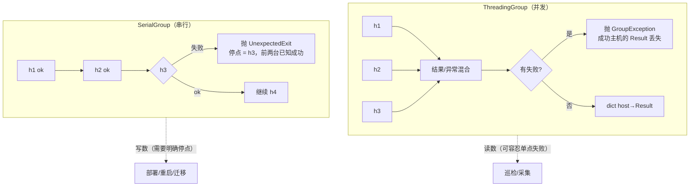
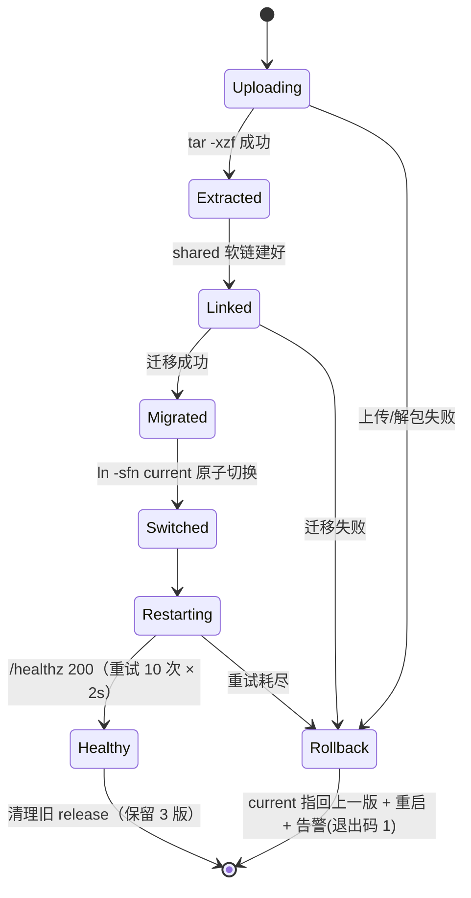

# Day 169 — Fabric 批量执行 · 图解

> 全部为纯文本/Mermaid，可离线阅读。

---

## 图 1：Fabric 的栈与"该去哪一层排错"

```text
  ┌──────────────────────────────────────────────────────────┐
  │  Invoke 层     @task / Context / fab CLI / 参数解析        │  ← 参数没传进来？
  ├──────────────────────────────────────────────────────────┤
  │  Fabric 层     Connection / Group / Config / gateway      │  ← 连上但不执行？
  ├──────────────────────────────────────────────────────────┤
  │  Paramiko 层   Transport / Channel / SFTPClient           │  ← 连不上？
  ├──────────────────────────────────────────────────────────┤
  │  OpenSSH 层    sshd / 认证 / pty / subsystem sftp         │  ← 权限/配置问题？
  ├──────────────────────────────────────────────────────────┤
  │  TCP/IP        :22 / 防火墙 / NAT / MTU                   │  ← 网络问题？
  └──────────────────────────────────────────────────────────┘
   自下而上排查；症状与层次的对应关系写在 README 第 5.1 节。
```

---

## 图 2：`Connection` 的生命周期（惰性建连 + 复用）

```text
   c = Connection("web-01", ...)          c.run("uptime")      c.run("df -h")
   │                                       │                     │
   │ 只记参数                               │ 首次：建连          │ 复用同一 Transport
   │ 无网络 IO                              │ KEX+认证 ≈ 100ms    │ 新开 channel ≈ 2ms
   ▼                                       ▼                     ▼
 ┌──────────┐                            ┌──────────┐          ┌──────────┐
 │ 参数对象  │  ──────────────────────▶  │ Transport│ ───────▶ │ Transport│
 └──────────┘                            │ channel#1│          │ channel#2│
                                         └──────────┘          └──────────┘

  ❌ c = Connection("坏域名")  不会报错
  ❌ c.run(...) 不写 try        才报错（而且可能等很久，若 connect_kwargs 没设 timeout）
```

---

## 图 3：`Result` 的结构与判断路径

```text
                        Result
   ┌──────────────────────────────────────────────┐
   │ command      'systemctl is-active nginx'      │
   │ stdout       'active\n'                       │
   │ stderr       ''                               │
   │ return_code  0          （= exited，别名）          │
   │ ok / failed  True / False   ← 用这个表达意图   │
   │ exited       0          ← 就是退出码(int)，没跑完为 None│
   │ tail(stream,count) 方法：r.tail("stdout") ← 最常用    │
   └──────────────────────────────────────────────┘

   判断建议：
     成功？        if r.ok
     具体错误码？  if r.return_code == 2
     没跑完？      if r.exited is None        （超时/自动应答失败）
     被信号杀？    if r.exited is not None and (r.exited < 0 or r.exited >= 128)
     看日志尾巴？  print(r.tail("stdout"))  （比切 splitlines() 稳）
```

---

## 图 4：Mermaid — 并发 vs 串行的失败语义



---

## 图 5：限流分片（因为 Fabric 没有 workers 参数）

```text
   hosts = [h1..h200]   batch = 16

   ┌─ batch1 ─┐  ┌─ batch2 ─┐        ┌─ batch13 ─┐
   │h1..h16   │  │h17..h32  │  ...   │h193..h200│
   └────┬─────┘  └────┬─────┘        └────┬─────┘
        │             │                   │
     16 线程并发    16 线程并发        8 线程并发
        │             │                   │
   try/except GroupException 每批独立处理
        │
   ┌────▼───────────────────────────────────────┐
   │ 为什么要 per-batch try：                     │
   │  · 一批失败不影响后续批次（可继续/可中止）      │
   │  · 失败批次可以单独重试                       │
   │  · 避免 200 个线程同时认证撞 MaxStartups      │
   └────────────────────────────────────────────┘
```

---

## 图 6：Mermaid — 零停机发布与回滚的状态机



---

## 图 7：跳板机链路

```text
   本机/CI                    bastion(4.4.4.4)              内网 web-01(10.0.0.11)
      │                              │                              │
      │ ① SSH 建连 + 认证             │                              │
      ├─────────────────────────────▶│                              │
      │ ② CHANNEL_OPEN(direct-tcpip, dst=10.0.0.11:22)              │
      ├─────────────────────────────▶│──────── 建立 TCP 隧道 ───────▶│
      │ ③ 在隧道里跑**第二次** SSH（KEX + 认证）                      │
      ├─────────────────────────────▶│─────────────────────────────▶│
      │ ④ 之后的 channel 都在内层连接上                              │
      │◀─────────────────────────────┴──────────────────────────────┤

   Fabric 写法：
     jump  = Connection("bastion", user="ops", connect_kwargs={...})
     inner = Connection("10.0.0.11", user="deploy", gateway=jump, ...)
   ⇒ 两次认证、两条 SSH、一次 TCP 隧道；超时参数要**分别**设置。
```

---

## 图 8：健康检查三级金字塔

```text
                    ▲ 最真实、最慢、最容易误报
                   ╱ ╲
                  ╱ ③ ╲   业务级  curl -fsS -m5 /healthz
                 ╱─────╲  能发现：DB 连不上 / 依赖挂了 / 迁移未完成
                ╱   ②   ╲ 端口级  ss -ltn | grep ':80 '
               ╱─────────╲ 能发现：进程活着但没监听（配置错、端口被占）
              ╱     ①     ╲ 进程级  systemctl is-active --quiet
             ╱─────────────╲ 能发现：进程根本没起来
            ▼ 最快、最弱     ▼

  部署验收标准：③ 必须通过；① ② 用作失败时的**定位线索**。
```
