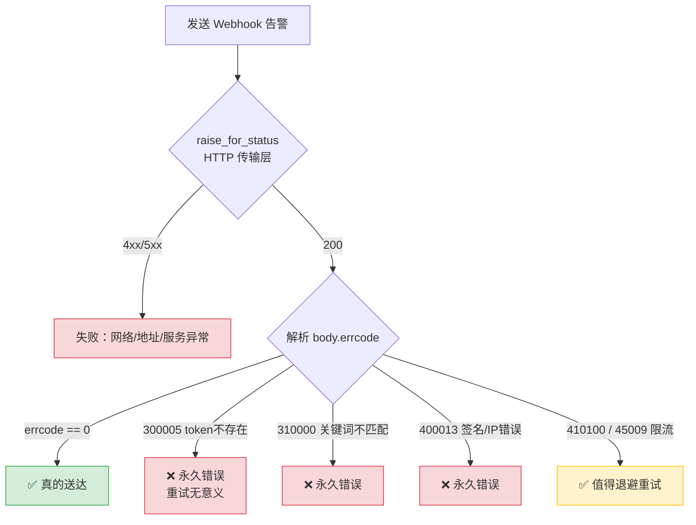
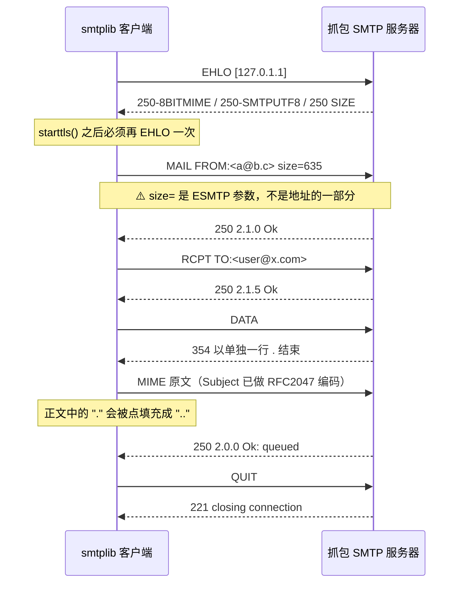
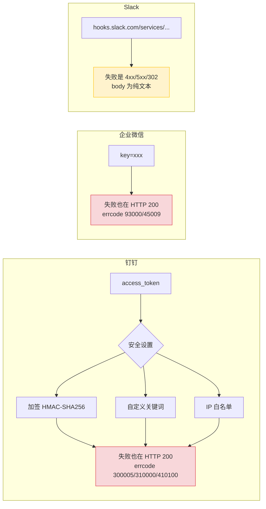

# Day 171 — 通知告警 · 图解

共 11 张图。

---

## 1. 告警系统的四层模型

```
┌──────────────────────────────────────────────────────────────┐
│  ④ 送达层  Channel   ── 邮件(SMTP) / 钉钉 / 企业微信 / Slack │
│                 ▲ 本课 80% 的内容在这里                        │
├──────────────────────────────────────────────────────────────┤
│  ③ 路由层  Router    ── 按级别选渠道、@谁、要不要全渠道        │
├──────────────────────────────────────────────────────────────┤
│  ② 判定层  Evaluator ── 阈值、滞回、时间窗口                   │
├──────────────────────────────────────────────────────────────┤
│  ① 采集层  Collector ── psutil / 日志 / 健康检查               │
└──────────────────────────────────────────────────────────────┘

每一层都会「悄悄」断掉，而断掉时通常不报错 —— 这才是告警系统难的地方。
```

---

## 2. 完整数据流

```
  ┌──────────┐   指标    ┌──────────┐   Alert    ┌──────────────────┐
  │ Collector│──────────▶│ Evaluator│──────────▶│    AlertHub      │
  │ psutil   │  disk%    │ threshold│  结构化事件 │ fingerprint      │
  └──────────┘           └──────────┘            │ suppress window  │
                                              │ token bucket     │
                                              │ mask()           │
                                              └────────┬─────────┘
                                     ┌─────────────────┼─────────────────┐
                                     ▼                 ▼                 ▼
                              ┌────────────┐   ┌────────────┐   ┌────────────┐
                              │ SMTPChannel│   │ WebhookCh. │   │ StdoutCh.  │
                              │ 邮件(详)   │   │ IM(快)     │   │ 兜底(永不失败)
                              └──────┬─────┘   └─────┬──────┘   └────────────┘
                                     │               │
                                  ┌──▼───────────────▼──┐
                                  │   平台侧 errcode    │
                                  │  200 != 成功        │
                                  └─────────────────────┘
```

---

## 3. ⭐ HTTP 200 ≠ 成功（核心图）



**本机实测**（故意写错 token，真连官方端点）：

```
钉钉     HTTP 200  errcode=300005  token is not exist     ← 失败
企业微信  HTTP 200  errcode=93000   invalid webhook url   ← 失败
Slack    HTTP 404  no_team                               ← 失败（语义不同）
```

---

## 4. 告警风暴与指纹去重

```
时间 ──────────────────────────────────────────────────────▶
指标  92%  88%  93%  89%  91%  87%  94%  86%  90%  92%
      ███    ░    ███    ░    ███    ░    ███    ░    ███

朴素实现：  ! ! ! ! ! ! ! ! !          → 10 条一模一样的内容
            ████████████████████

指纹去重：  █                           → 1 条（抑制窗口 30 分钟内不重复）
fingerprint = sha1("disk_usage|web-01|disk")
            = 5fa27966b740a126

本机实测压缩比：40 次越界 → 1 条通知（40:1）
```

---

## 5. 令牌桶限流原理

```
        容量 capacity = 20（= 平台 1 分钟上限）
     ┌───────────────────────────┐
     │ ● ● ● ● ● ● ● ● ● ● ● ●  │  ← 满桶，可突发 20 条
     │ ● ● ● ● ● ● ● ● ● ● ○ ○  │  ← 消耗中
     │ ● ● ● ● ● ○ ○ ○ ○ ○ ○ ○  │  ← 空了
     └───────────────────────────┘
                ↑
      以 rate = 20/60 每秒 的速度持续回充
      桶空时 acquire() 阻塞等待（或返回 False = 丢弃）

本机实测：40 次突发调用 → 放行 21 次（多出的 1 个来自 1 秒多的回充），19 次被拦
```

---

## 6. SMTP 会话完整时序



---

## 7. 邮件身份：Envelope vs Header

```
┌─────────────────────────────────────────────────────────┐
│ Envelope（信封）— 由 smtplib.login() 决定，参与 SPF/退信 │
│   MAIL FROM:<noreply@company.com>                        │
│   RCPT TO:<niedong@company.com>                           │
├─────────────────────────────────────────────────────────┤
│ Header（信头）— 你自己写的，只影响显示                    │
│   From: "Learn-Python 告警" <noreply@company.com>        │
│   To:   niedong@company.com                              │
│   Subject: [P1] 磁盘告警                                   │
└─────────────────────────────────────────────────────────┘

两者解耦的好处：用 noreply@ 账号也能发出"运维组"署名的告警，
且不会被邮箱的 SPF 规则拒收。
```

---

## 8. 中文主题的 RFC 2047 编码

```
原始（有中文）:  Subject: 数据库磁盘使用率 91%

编码后（实际发出）: Subject: =?utf-8?b?5pWw5o2u5bqT56OB55uY5L2/55So546H?= 91%
                                            └──── base64 ────┘
                                            └─ utf-8 ─┘

原因：邮件头在 SMTP 协议里只允许 ASCII（RFC 5322），
      所以任何非 ASCII 标题必须先按 RFC 2047 编码。

✅ EmailMessage 会自动做这件事 —— 你不需要手写 base64。
```

---

## 9. MIME multipart 结构

```
Content-Type: multipart/mixed; boundary="===5168995940=="

--===5168995940==
Content-Type: text/plain; charset="utf-8"
Content-Transfer-Encoding: 8bit

磁盘使用率超过阈值。                        ← 正文段
--===5168995940==
Content-Type: text/plain; charset="utf-8"
Content-Disposition: attachment; filename="app.log"

log line 1
log line 2                                 ← 附件段
--===5168995940==--
```

类型速查：`multipart/mixed`（任意组合）、`multipart/alternative`（多版本二选一）、
`multipart/related`（HTML + 内嵌图片，邮件里显示图片必须用它）。

---

## 10. 三平台安全设置与失败语义



⚠️ 本课实验发现：企业微信的错误信息会**回显调用方的公网出口 IP**。
所以 Webhook URL 必须当密钥保管，并开启 IP 白名单。

---

## 11. 告警风暴的整体防线（分层降级）

```
第 1 层  抑制窗口 30 分钟      → 600 事件降到 21 条   （本课实测 99.1%）
   │  降不下来？
第 2 层  令牌桶 20 条/分钟     → 不撞平台限流
   │  还是降不下来？
第 3 层  渠道 fan-out          → IM + 邮件并行，互不影响
   │  某个渠道挂了？
第 4 层  单渠道失败隔离        → 其余渠道照常送达
   │  全挂了？
第 5 层  stdout 兜底           → 至少在日志/CI 里留痕（永不失败）

本课 self-test 第 5 项即验证第 4/5 层：
  3 渠道全失败 → 自动降级 stdout，且 errcode 300005 被正确识别为失败
```

> 真正的第 6 层不在代码里 —— 那是"用什么完全独立的路径监控告警系统本身"，
> 见 README 思考题 5。
