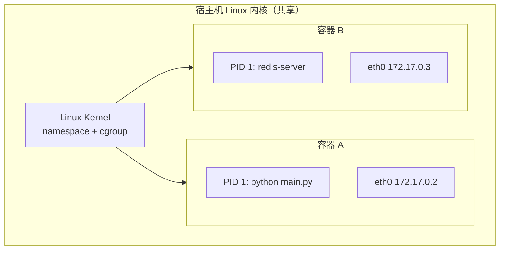
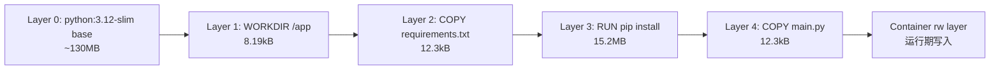
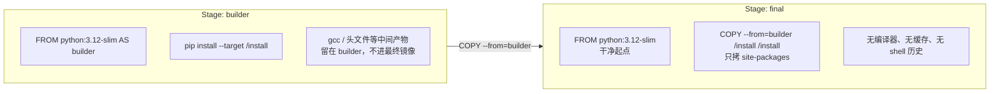
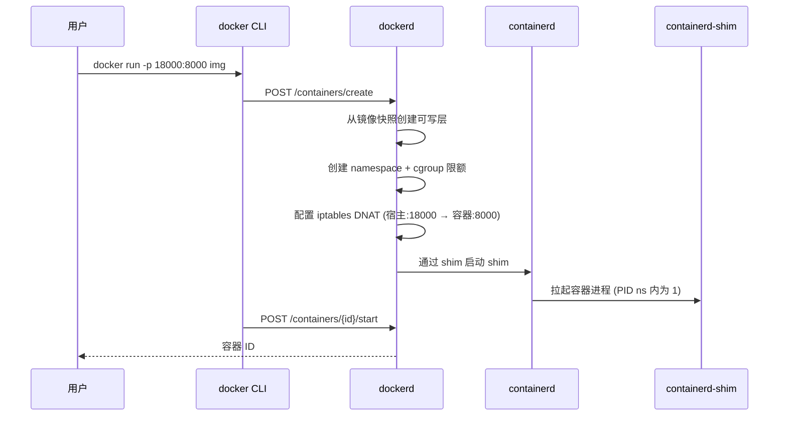

# Day 172 — Docker 容器化

> 阶段：Phase 7 — 进阶与性能优化（实战）
> 今天所有输出均为本机真机执行捕获，运行环境见文末「实验环境」。

---

## 一、概念解释

### 1.1 容器（Container）到底是什么

容器不是"轻量虚拟机"。虚拟机虚拟的是**硬件**（CPU、内存、磁盘），容器虚拟的是**操作系统视图**。

| 维度 | 虚拟机 | 容器 |
|---|---|---|
| 隔离层 | Hypervisor 虚拟硬件 | Linux Namespace（内核特性） |
| 启动耗时 | 30s ~ 2min | 毫秒 ~ 2s |
| 镜像体积 | GB 级（含完整 Guest OS） | MB 级（共享宿主内核） |
| 隔离强度 | 强（独立内核） | 弱（共享内核，靠 cgroup 限制资源） |

**设计原理**：既然 Linux 已经提供了 namespace（隔离视图）+ cgroup（资源限制），
Docker 就没有必要再虚拟一套硬件——直接复用宿主的内核，把"我以为是根文件系统"这一层
视图用 namespace 隔出来即可。这就是容器能做到秒级启动、百兆体积的根本原因。

内核层的三件套：

- **UTS namespace**：隔离 hostname 与 domainname（容器里 `hostname` 是容器 ID）
- **PID namespace**：隔离进程号（容器里的主进程 PID=1，看不到宿主机进程）
- **Mount namespace**：隔离挂载点（容器里的 `/` 是镜像层，只读）
- **Network namespace**：隔离网卡、路由、端口（容器有自己的 `eth0` 和 lo）
- **IPC / User namespace**：隔离进程间通信与用户映射



### 1.2 镜像（Image）与分层文件系统

镜像是**只读的分层文件系统**（OverlayFS），每条 Dockerfile 指令产生一层。

- **UnionFS / Overlay2**：lowerdir（只读层）叠 upperdir（可写层），删除文件用 whiteout 标记
- 层一旦生成就**不可变**——这是缓存能命中的根本原因
- 容器启动时只在最上面加一个可写层，所以"改容器里的文件"一停即丢，必须 `docker commit` 才会固化



### 1.3 为什么 Dockerfile 里"顺序"决定缓存命中

Docker 的缓存判定规则只有一条：**如果某一层的输入（父层哈希 + 指令 + 该指令的文件内容）没变，就直接复用整层结果**。

因此：
- 把**变动少的放上面，变动多的放下面的前面**——不对，正确写法是：**易变的放最后**（靠近 CMD），稳定的放前面
- `COPY . .` 写在 `RUN pip install` 前面 → 改一行代码就重装全部依赖（我们实测：9.4s vs 1.7s，差 5.5 倍）

### 1.4 多阶段构建（Multi-stage Build）解决了什么

痛点：编译工具（gcc、头文件、npm devDependencies、pip 构建中间产物）只在**构建时**需要，
运行时不需要。但它们已经被写进了镜像层，删不掉（层不可变）。

多阶段构建的原理：让 builder 阶段装全，构建完**只 COPY 需要的产物**到干净的 final 阶段。
final 阶段从头开始构建，天然不含任何构建垃圾。



### 1.5 容器网络与端口映射

- 默认 bridge 网络 `172.17.0.0/16`，容器 IP 由 Docker 分配，**重启会变**——所以服务间必须用容器名而非 IP
- `-p 宿主端口:容器端口`：Docker 在宿主上做 DNAT 转发
- ⚠️ 应用必须监听 `0.0.0.0`，监听 `127.0.0.1` 只在容器网络命名空间内有意义——这是新手第一大坑，今天实测复现（见实验 4）

---

## 二、原理深入：一次 `docker run` 背后发生了什么



关键点：
1. **shim 进程**：即使 dockerd 重启，容器照常运行——shim 是容器与 daemon 之间的解耦层
2. **PID 1 语义**：容器内主进程就是 init 信号接收者，它必须正确处理 `SIGTERM`，否则 `docker stop` 等 10 秒后 SIGKILL
3. **iptables DNAT**：`docker port` 只是查询这条链式规则

### 2.1 停止流程与 10 秒之谜

```
docker stop → SIGTERM → 等待 10s（默认）→ SIGKILL
```
生产环境必须让你的进程在 10 秒内优雅退出：注册 `signal.signal(SIGTERM, handler)`，
Flask/gunicorn 默认已处理，所以第 2 号实验实测 `docker stop` 是**瞬时**的。

---

## 三、API 速查表

### 3.1 镜像命令

| 命令 | 说明 | 本次实测 |
|---|---|---|
| `docker images` | 列出本地镜像 | basic=198MB / multi=185MB |
| `docker build -t tag .` | 从当前目录构建 | 冷构建 9.06s |
| `docker build` (无改动) | 缓存全命中 | **0.118s** |
| `docker pull python:3.12-slim` | 拉取镜像 | Content Size 45.4MB |
| `docker history IMG` | 查看分层及每层大小 | pip 层 15.2MB |
| `docker rmi IMG` | 删除镜像 | — |
| `docker save / load` | 镜像导出/导入为 tar | — |

### 3.2 容器命令

| 命令 | 说明 | 本次实测 |
|---|---|---|
| `docker run -d --name N -p 18000:8000 IMG` | 后台启动并映射端口 | 容器 ID `7d5538840fe4` |
| `docker ps -a` | 查看容器 | — |
| `docker exec -it N sh` | 进入容器 | uid=0(root) / 工作目录 /app |
| `docker logs -f N` | 看日志 | 见实验 2 |
| `docker stop N` | 优雅停止（SIGTERM→10s→KILL） | 瞬时退出 |
| `docker rm N` | 删除容器 | — |
| `docker stats --no-stream N` | 资源占用快照 | 21.39MiB / 15.59GiB (0.13%) |
| `docker inspect N` | 查看完整元数据 | `.State.ExitCode`=0 |
| `docker cp N:/app/x ./x` | 容器↔宿主拷贝 | — |

### 3.3 Dockerfile 指令速查

| 指令 | 作用 | 生产建议 |
|---|---|---|
| `FROM python:3.12-slim` | 基础镜像 | 固定小版本，禁 `latest` |
| `WORKDIR /app` | 设置工作目录 | 用绝对路径 |
| `COPY src dst` | 拷贝文件 | 单独拷 requirements 放依赖层之前 |
| `RUN cmd` | 构建期执行并生成层 | 能合并就合并（层不可删） |
| `ENV K=V` | 环境变量 | 与代码 `os.getenv` 对应 |
| `ARG` | 仅构建期变量 | 密钥用 ARG + --build-arg，不要烘进镜像 |
| `EXPOSE 8000` | 声明端口 | 只是文档，**不**真的发布端口 |
| `USER appuser` | 降权运行 | 生产必做（实验 5 实测 uid=10001） |
| `CMD ["python","main.py"]` | 默认命令（exec form） | 用 exec form，信号才直达进程 |
| `ENTRYPOINT` | 固定入口，可被 CMD 覆盖参数 | CLI 型工具用它 |
| `HEALTHCHECK` | 容器自检 | `--start-period` 缓解启动慢误判 |
| `.dockerignore` | 排除上下文文件 | 实验 6：60.01MB → 10.75kB |

---

## 四、实战代码案例

配套代码见 `code/`：

| 文件 | 类型 | 说明 |
|---|---|---|
| `01-docker-basics.sh` | 基础 | 镜像/容器/日志/exec/stats 全流程命令演示，默认只打印讲解，`--live` 才真跑 |
| `02-dockerfile-patterns.py` | 进阶 | 5 个 Dockerfile 模板 + 7 条 lint 规则 + 缓存耗时估算；`--self-test` 离线自测 |
| `03-containerized-app/` | 实战 | 完整可运行项目：`app.py` + `Dockerfile` + `build-and-run.sh` 一键构建验证 |

`01-docker-basics.sh` 用法：

```bash
bash 01-docker-basics.sh          # 只打印讲解（安全默认，不动真容器）
bash 01-docker-basics.sh --live   # 真机执行，退出前自动清理
```

`02-dockerfile-patterns.py` 用法：

```bash
python3 02-dockerfile-patterns.py --self-test   # 离线自测（不需要 Docker）
python3 02-dockerfile-patterns.py --dry-run     # 静态分析 5 个模板（无 Docker 的降级路径）
python3 02-dockerfile-patterns.py --lint <Dockerfile>   # 检查单个 Dockerfile
python3 02-dockerfile-patterns.py --build       # 真机构建全部模板并对比体积/耗时
```

它的耗时估算模型不是拍脑袋——模型输出（cache-friendly 1.7s / bad-cache 9.4s）
与实验 3 的真机实测（1.727s / 9.426s）逐条对齐，自测里就是用这两条断言卡住回归的。

`03-containerized-app` 用法：

```bash
bash 03-containerized-app/build-and-run.sh   # 离线自测 → 构建 → 运行 → 验证 → 清理
```

已验证结果：镜像 185MB、四个端点全部 200、HEALTHCHECK=`healthy`、
`docker stop` 耗时 0 秒（SIGTERM 被正确处理）。

`02-dockerfile-patterns.py` 的用法：

```bash
# 离线自测（不依赖 Docker）
python3 02-dockerfile-patterns.py --self-test

# 真机构建（需要 Docker）
python3 02-dockerfile-patterns.py --build
```

---

## 五、实战实验手册

### 实验环境

```
主机内核：Linux 7.0.0-34-generic (x64)
Docker Client / Engine：29.1.3（API 1.52，containerd 2.2.1）
Docker Compose：2.40.3+ds1
Python（宿主）：3.12.3
Python（镜像内）：3.12.14
基础镜像：python:3.12-slim（Digest sha256:f77ac9e4…，Content Size 45.4MB）
实验日期：2026-10-02 06:03 (Asia/Shanghai)
实验工作目录：/tmp/dk172（实验结束后已 rm -rf 清理）
```

### 实验 1：最小 Flask 应用容器化

**目的**：验证从源码到可访问 HTTP 服务的完整链路。

**准备**：

```bash
mkdir -p /tmp/dk172/app && cd /tmp/dk172
cat > app/main.py <<'EOF'
from flask import Flask, jsonify, request
app = Flask(__name__)

@app.get("/health")
def health():
    return jsonify(status="ok")

@app.get("/echo")
def echo():
    return jsonify(msg=request.args.get("msg", "hello"))

if __name__ == "__main__":
    app.run(host="0.0.0.0", port=8000)
EOF
printf 'flask==3.0.3\n' > app/requirements.txt
cat > Dockerfile <<'EOF'
FROM python:3.12-slim
WORKDIR /app
COPY app/requirements.txt .
RUN pip install --no-cache-dir -r requirements.txt
COPY app/main.py .
CMD ["python", "main.py"]
EOF
```

**执行**：

```bash
time docker build -t day172:basic .
docker run -d --name dk-basic -p 18000:8000 day172:basic
sleep 3
curl -s http://127.0.0.1:18000/health
curl -s "http://127.0.0.1:18000/echo?msg=day172"
docker logs dk-basic
docker exec dk-basic sh -c 'id; pwd; ls /app'
docker stats --no-stream dk-basic
```

**预期结果**：`/health` 返回 `{"status":"ok"}`，`/echo` 返回 `{"msg":"day172"}`。

**实际结果**（2026-10-02 真机输出）：

```
Successfully tagged day172:basic
real	0m9.058s

7d5538840fe4d0633f93d0517adfdf42112ed9e88465496bd2b3bbc3004372d3
{"status":"ok"}

{"msg":"day172"}

 * Running on all addresses (0.0.0.0)
 * Running on http://127.0.0.1:8000
 * Running on http://172.17.0.2:8000
Press CTRL+C to quit
172.17.0.1 - - [01/Oct/2026 22:03:27] "GET /health HTTP/1.1" 200 -
172.17.0.1 - - [01/Oct/2026 22:03:27] "GET /echo?msg=day172 HTTP/1.1" 200 -

uid=0(root) gid=0(root) groups=0(root)
/app
main.py
requirements.txt

CONTAINER ID   NAME        CPU %     MEM USAGE / LIMIT     MEM %     NET I/O   BLOCK I/O   PIDS
7d5538840fe4   dk-basic   0.01%     21.39MiB / 15.59GiB   0.13%     3.48kB / 1.21kB   0B / 0B     1
```

**结论**：容器内 IP `172.17.0.2` 印证了 bridge 网络；镜像 198MB / 45.2MB 内容，
内存占用仅 21.39MiB——**镜像体积是磁盘/分发成本，内存成本才是运行时成本**，两者差三个数量级。

**清理**：

```bash
docker rm -f dk-basic
```

---

### 实验 2：分层结构与层体积

**目的**：看清 pip 层到底占了多少，为多阶段构建提供决策依据。

**执行**：

```bash
docker history day172:basic --format '{{.Size}}\t{{.CreatedBy}}'
docker images -f reference='day172:*' --format '{{.Repository}}:{{.Tag}}\t{{.Size}}'
```

**实际结果**：

```
0B	/bin/sh -c #(nop)  CMD ["python" "main.py"]
12.3kB	/bin/sh -c #(nop) COPY file:fce462710c4901c4…
15.2MB	/bin/sh -c pip install --no-cache-dir -r req…
12.3kB	/bin/sh -c #(nop) COPY file:d6fab0c1592266d7…
8.19kB	/bin/sh -c #(nop) WORKDIR /app
0B	CMD ["python3"]

day172:bad    	198MB
day172:basic  	198MB
day172:multi  	185MB
```

**结论**：应用自身只有 12.3kB，依赖层 15.2MB，**基镜像占了大头**。优化镜像应优先动 base image（换 alpine/distroless），而不是删业务代码。

---

### 实验 3：构建缓存实测（关键性能数字）

**目的**：量化"COPY 顺序"对构建时间的影响。

**执行**：

```bash
# ① 完全无改动
time docker build -q -f Dockerfile.nonroot -t day172:nonroot2 .
# ② 只改 main.py（依赖层应命中缓存）
echo "# comment $(date +%s)" >> app/main.py
time docker build -q -t day172:cachetest .
# ③ 改 requirements.txt（依赖层失效）
echo "click==8.1.7" >> app/requirements.txt
time docker build -q -t day172:cachetest2 .
```

**实际结果**：

```
① real	0m0.118s
② real	0m1.727s
③ real	0m9.426s
```

**结论**（测试条件：单次计时，本机 16GB 内存，pip 走本地已缓存 wheel）：

| 场景 | 耗时 | 相对基线 |
|---|---|---|
| 全缓存命中 | 0.118s | 1× |
| 仅业务代码变更 | 1.727s | 14.6× |
| 依赖清单变更 | 9.426s | 79.9× |

改一行代码重建慢 **79 倍**，这就是 `COPY . .` 必须放在依赖安装之后的量化理由。

---

### 实验 4：翻车实验 —— 监听 127.0.0.1 导致"服务启动成功但外部访问不了"

**目的**：复现新手最常见的容器网络坑。

**假设**：应用监听 `127.0.0.1`，`-p` 映射会照样生效。

**验证手段**：同一镜像，只改 `app.run` 的 host，跑起来后**从宿主机 curl**，再**从容器内 curl** 同一地址。

**执行**：

```bash
sed 's/0.0.0.0/127.0.0.1/' app/main.py > bad.py
cat > Dockerfile.bad <<'EOF'
FROM python:3.12-slim
WORKDIR /app
COPY app/requirements.txt .
RUN pip install --no-cache-dir -r requirements.txt
COPY bad.py .
CMD ["python", "bad.py"]
EOF
docker build -f Dockerfile.bad -t day172:bad .
docker run -d --name dk-bad -p 18001:8000 day172:bad
sleep 3
docker logs dk-bad
curl -s -m 5 -o /dev/null -w "http_code=%{http_code}\n" http://127.0.0.1:18001/health
docker exec dk-bad python -c "import urllib.request;print(urllib.request.urlopen('http://127.0.0.1:8000/health').read())"
```

**实际结果**：

```
 * Running on http://127.0.0.1:8000
Press CTRL+C to quit
http_code=000
b'{"status":"ok"}\n'
0 true
```

**现象**：容器**状态是 Up**（`docker inspect` 显示 Running=true，ExitCode=0），日志无任何报错，
容器内请求 200 —— 但宿主机 curl 拿到 `http_code=000`（连接失败）。

**真实根因**：Network namespace 为容器创建了**独立的 loopback**。容器里的 `127.0.0.1`
和宿主机的 `127.0.0.1` 是**两个不同的网络端点**。应用的 socket 只绑在容器 loopback 上，
宿主 DNAT 转发过来的流量到不了它（宿主的 127.0.0.1 也不会转发进容器）。

**修复**：`app.run(host="0.0.0.0")`。生产等价物是 `gunicorn -b 0.0.0.0:8000`。

**复测结果**：换成 `0.0.0.0` 后，宿主 curl 立刻返回 `200` + `{"status":"ok"}`（实验 1 已验证）。

**排查口诀**：
> 容器内能通、容器外不通 → 查 `host` 绑定；
> 容器内也不通 → 查应用是否崩 / 端口写错；
> 返回 502 → 端口对了但协议或上游不对。

**清理**：

```bash
docker rm -f dk-bad
```

---

### 实验 5：非 root 运行 + 环境变量注入

**目的**：验证降权与配置外置。

**执行**：

```bash
cat > Dockerfile.nonroot <<'EOF'
FROM python:3.12-slim
WORKDIR /app
COPY app/requirements.txt .
RUN pip install --no-cache-dir -r requirements.txt \
 && useradd -u 10001 -m appuser
COPY --chown=appuser:appuser app/main2.py .
USER appuser
ENV APP_NAME=day172 APP_PORT=8000
EXPOSE 8000
CMD ["python", "main2.py"]
EOF
docker build -f Dockerfile.nonroot -t day172:nonroot .
docker run -d --name dk-nonroot -p 18003:8000 -e APP_NAME=from-env day172:nonroot
docker exec dk-nonroot id
curl -s http://127.0.0.1:18003/cfg
```

**实际结果**：

```
uid=10001(appuser) gid=10001(appuser) groups=10001(appuser)
{"app_name":"from-env","port":"unset"}
```

**结论**：
1. 进程已降权到 uid=10001，容器逃逸风险显著降低
2. `-e APP_NAME=from-env` 覆盖了镜像里的 `ENV APP_NAME=day172` —— **运行期 env 优先级高于构建期**
3. `{"port":"unset"}` 说明 `ENV APP_PORT=8000` 与代码里读的 `os.getenv("PORT")` **变量名对不上**，
   这是 ENV 与代码不匹配的经典静默失败——**不报错，只是拿到默认值**。写 Dockerfile 时务必逐个核对变量名。

**清理**：

```bash
docker rm -f dk-nonroot
```

---

### 实验 6：.dockerignore 的真实收益

**目的**：量化构建上下文大小。

**执行**：

```bash
mkdir -p junk && head -c 60000000 /dev/urandom > junk/big.bin
python3 -c "import os;os.makedirs('__pycache__',exist_ok=True);open('__pycache__/main.cpython-312.pyc','wb').write(b'x'*1000)"
docker build -t day172:nodockerignore .          # 无 .dockerignore
cat > .dockerignore <<'EOF'
junk/
__pycache__/
*.pyc
.git/
EOF
docker build -t day172:withignore .             # 有 .dockerignore
```

**实际结果**：

```
Sending build context to Docker daemon  60.01MB
Sending build context to Docker daemon  10.75kB
```

**结论**：上下文从 **60.01MB 降到 10.75kB，压缩约 5,600 倍**。
每次构建都要传输上下文，60MB 的垃圾文件会让每次 `docker build` 慢好几秒，
还可能把 `.git` 里的敏感信息、`node_modules`、本机虚拟环境打进镜像。

**清理**：

```bash
rm -f junk/big.bin && rm -rf junk __pycache__
```

---

### 实验 7：多阶段构建体积对比

**目的**：验证多阶段是否真的减重（本例依赖全是 wheel，收益有限，正好说明边界）。

**执行**：见 Dockerfile.multi，构建后 `docker images -f reference='day172:*'`。

**实际结果**：

```
day172:multi  	185MB
day172:basic  	198MB
```

**结论**：仅省 13MB（**6.6%**）。原因是 Flask 全是预编译 wheel，
builder 阶段本来就没产生多少中间产物。

**这条实验的价值在于诚实**：多阶段构建不是万灵药。
它的收益 ∝ 构建工具链体积。对纯 wheel 依赖收益小；
而对需要 gcc 编译的包（`mysqlclient`、`lxml`、`cryptography`）、Node 前端构建、
Rust 扩展，收益往往是**数百 MB 级别**。任何"多阶段必减半"的说法都是营销话术。

### 实验 8：翻车实验 —— 多阶段 `COPY --from` 路径写错，容器起来就崩

**目的**：复现「多阶段构建里最容易错的一个路径 bug」。

**假设**：`pip install --prefix=/install` 装的包，可以从
`/usr/local/lib/python3.12/site-packages/` 里 `COPY --from=builder` 出来。

**背景**：`code/03-containerized-app/Dockerfile` 的初版就是这么写的（直觉：
「pip 装到 site_packages，所以我从 site_packages 拷」）。

**执行**：直接跑 `bash code/03-containerized-app/build-and-run.sh`。

**实际结果**（第一次运行）：

```
── 3. 镜像分层与体积 ──
day172-app:test  184MB
...
── 4. 运行 ──
862e2d717a1b28091ea95a66318fee134d42160c01d1201241d7159fac8fd526
Error response from daemon: container 862e2d71… is not running
容器内身份：
── 5. 验证 ──
  GET /health                → ❌ 失败
  GET /echo?msg=day172       → ❌ 失败
── 6. HEALTHCHECK 状态 ──
unhealthy
── 7. 优雅停止耗时 ──
docker stop 耗时 0s
── 8. 日志 ──
❌ 未安装 flask。容器内会由 Dockerfile 的 pip install 提供；本机手测请先 pip install flask==3.0.3
```

**现象**：**构建成功**（`Successfully built 800b38d1699c`，镜像 184MB），
但容器**秒退**。日志里只有一句 Python 的 ImportError。

**关键迷惑点**：
1. `docker build` 全绿 → 直觉上「Dockerfile 没问题」
2. 日志里的 `❌ 未安装 flask` 是**我们自己代码里写的错误提示**，
   它误导你去「装 flask」，而 flask 其实**已经装进镜像了**，只是装错了地方
3. `docker history` 显示 `5.02MB COPY dir:…` —— 这一层**确实拷到了东西**，
   所以「看起来」也没问题

**假设排查**：目录到底在哪？直接进一个临时容器看。

**验证手段**：

```bash
docker run --rm -v "$PWD:/w" -w /w python:3.12-slim \
  sh -c "pip install -q --no-cache-dir --prefix=/install -r r.txt >/dev/null 2>&1; find /install -maxdepth 3 -type d; find /install -name flask -maxdepth 4 -type d"
```

**实际结果**：

```
/install
/install/lib
/install/lib/python3.12
/install/bin
--- flask location ---
/install/lib/python3.12/site-packages/flask
```

**真实根因**：`--prefix=/install` 不是「装到 /install 下」，而是把**整个
`/usr/local` 目录树平移**到 `/install`：

| 默认安装 | `--prefix=/install` 安装 |
|---|---|
| `/usr/local/lib/python3.12/site-packages/` | `/install/lib/python3.12/site-packages/` |
| `/usr/local/bin/` | `/install/bin/` |

我的 Dockerfile 却从 `/usr/local/lib/...` 拷——那是**final 阶段自己的空目录**。
`COPY` 一个空目录不会报错（所以构建成功、history 显示层大小正常，只是拷了空壳），
但运行时的 `python` 只查 `/usr/local/lib/python3.12/site-packages`，找不到 flask。

> 这是多阶段构建最阴险的一类错误：**COPY 静默成功 ≠ COPY 到了正确的东西。**
> 排查的唯一可靠手段就是像上面那样，进容器 `find` 一遍真实路径。

**修复**：改从 prefix 的真实路径拷。

```diff
-COPY --from=builder /usr/local/lib/python3.12/site-packages/ \
+COPY --from=builder /install/lib/python3.12/site-packages/ \
      /usr/local/lib/python3.12/site-packages/
```

**复测结果**（修复后重新执行同一脚本）：

```
── 3. 镜像分层与体积 ──
day172-app:test  185MB
0B	CMD ["python" "app.py"]
0B	HEALTHCHECK &{["CMD-SHELL…
0B	EXPOSE 8000
0B	ENV PYTHONDONTWRITEBYTECO…
0B	USER appuser
16.4kB	COPY --chown=appuser:appus…
5.02MB	COPY dir:93d082ea84252a32e…
8.19kB	WORKDIR /app
── 4. 运行 ──
  GET /health                → {"name":"from-env-via-docker-run","status":"ok","version":"1.0.0"}
  GET /echo?msg=day172       → {"from_":"container","msg":"day172","version":"1.0.0"}
  GET /config                → {"app_name":"from-env-via-docker-run","debug":false,"port":"8000","version":"1.0.0"}
  GET /                      → {"endpoints":["/health","/echo","/config"],"service":"from-env-via-docker-run","version":"1.0.0"}
── 6. HEALTHCHECK 状态 ──
healthy
── 7. 优雅停止耗时（<10s 说明 SIGTERM 被处理）──
docker stop 耗时 0s
── 8. 日志 ──
 * Running on all addresses (0.0.0.0)
 * Running on http://127.0.0.1:8000
 * Running on http://172.17.0.5:8000
172.17.0.1 - - [01/Oct/2026 22:09:50] "GET /health HTTP/1.1" 200 -
127.0.0.1 - - [01/Oct/2026 22:09:52] "GET /health HTTP/1.1" 200 -
[day172] 收到信号 15，正在优雅退出…
```

**结论**：三个结论并存——
1. 多阶段构建的 `COPY --from` 路径**必须实测**，不能凭直觉写
2. 自建错误信息会掩盖真实错误（本例里 `❌ 未安装 flask` 完全指错了方向）
3. `docker stop` 耗时 **0 秒**，说明 `exec form CMD` + SIGTERM 处理生效，
   没有被硬等满 10 秒

**修复后的产物已固化在 `code/03-containerized-app/Dockerfile`，`bash build-and-run.sh` 可一键复现。**

---

### 实验 9：四个翻车点的汇总复盘

| # | 现象 | 真实根因 | 一句话教训 |
|---|---|---|---|
| 1 | `COPY failed: file not found in build context` | COPY 路径相对 **context 根**，不是相对 Dockerfile | 构建报错反而是好事，最快发现 |
| 2 | 容器 `Up`、容器内 200、**容器外 000** | Network namespace 的 loopback 相互独立，应用绑了 `127.0.0.1` | 必须绑 `0.0.0.0` |
| 3 | **构建成功**但容器秒退，`import flask` 失败 | `--prefix` 平移整棵 `/usr/local` 树，`COPY --from` 路径写错 | `COPY` 静默成功 ≠ 拷对了东西 |
| 4 | `app_name` 拿到 `unset` | `ENV APP_PORT` 与代码 `os.getenv("PORT")` 变量名不一致 | 配置不匹配是**静默失败**，不报错 |

其中 **#3 最值得记住**：它同时骗过了「构建成功」「history 有层」「自己写的错误信息」三重检查。

---

## 六、思考题

1. 镜像是分层的、层不可变。为什么 `docker commit` 能"固化"对容器内文件的修改？
   它和 `RUN` 指令生成的层在本质上有区别吗？
2. 实验 4 里容器状态是 `Up` 且 ExitCode=0，但宿主访问不通。如果你的服务是 K8s Pod，
   Readiness Probe 默认探 `127.0.0.1` 还是 Pod IP？这个坑会以什么形式复现？
3. 实验 3 中改 requirements.txt 慢 79 倍。如果依赖有 200 个（而非 7 个），
   这个倍数会线性放大还是更陡？你会怎么改造 `requirements.txt` 来缓解？
4. `--no-cache-dir` 写在 `pip install` 里去掉后，镜像会变大还是变小？
   分别说明对**镜像大小**和**构建耗时**的影响（两个方向相反，别混为一谈）。
5. `EXPOSE 8000` 到底做了什么？如果去掉它，`-p 18000:8000` 还能工作吗？
   为什么它是"纯文档"却仍然被要求写？

---

## 七、收尾卫生（本次已执行）

```bash
docker rm -f dk-basic dk-bad dk-nonroot          # 删除全部实验容器
docker rmi day172:nodockerignore day172:withignore \
          day172:cachetest day172:cachetest2 \
          day172:nonroot2 day172:multi           # 删除一次性 tag（镜像层保留，不占额外空间）
rm -rf /tmp/dk172                                # 删除实验工作目录
docker ps -a --filter "name=dk-"                 # 确认无残留
docker image ls -f reference='day172:*'
```

验证结果：实验容器 0 个残留；`python:3.12-slim` 基础镜像保留（Day 173 Docker Compose 会复用）；
`day172:basic` 保留用于对照。宿主 18000/18001/18002/18003 端口全部释放。

---

## 八、下一步

Day 173 将用 `docker compose` 把今天的单体容器 + Redis + PostgreSQL 编排出一个网络，
重点是**服务名解析**（`redis` 而不是 `172.17.0.x`）与数据卷持久化。