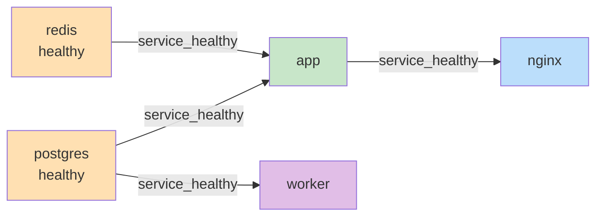

# Day 173 图解 — Docker Compose

## 1. 一张图看懂 Compose 干了什么

```
        ┌──────────────────────────────────────────────┐
        │  docker-compose.yaml（声明式声明）             │
        │  services / networks / volumes                │
        └───────────────────┬──────────────────────────┘
                            │ docker compose up -d
                            ▼
        ┌──────────────────────────────────────────────┐
        │  Compose CLI                                 │
        │  ① 解析 YAML  ② 建网络/卷  ③ 依赖拓扑排序     │
        │  ④ 逐个 up，healthy 才放行下一个              │
        └───────────────────┬──────────────────────────┘
                            ▼
   ┌─────────────────────────────────────────────────────┐
   │  Network: day173-lab_front (bridge, 172.18.0.0/16)   │
   │  内嵌 DNS 127.0.0.11：服务名 → 容器 IP                │
   ├─────────────────────────────────────────────────────┤
   │  redis      172.18.0.2   6379                       │
   │  postgres   172.18.0.3   5432                       │
   │  app        172.18.0.4   8000   ──► 宿主 18080      │
   │  nginx      172.18.0.6     80   ──► 宿主 18081      │
   │  worker     （无对外端口，一次性任务）                │
   └───────────────────┬─────────────────────────────────┘
                       │ 命名卷
                       ▼
              day173-lab_pgdata  →  postgres 数据目录
```

## 2. 依赖拓扑：谁等谁



启动顺序（本机实测输出）：`redis → postgres → app / worker → nginx`

## 3. 三种 depends_on 语义的时间线

```
时间(ms)   0     1000              7000
           │      │                 │
postgres:  ├──────┼── 进程起来 ────┼── initdb 完成 = ready/healthy
           │      │                 │
service_started 下：
app:       ├──────┼── 立刻启动 ────┤        ⚠️ 1000ms 就发请求 → 必失败
           │      │                 │
service_healthy 下：
app:       ├──────│─────────────────┼── 等到 healthy 才启动 ✅
```

**实测数字（本机跑 3 轮，app 容器 Up → healthy）**

| 策略 | 第 1 轮 | 第 2 轮 | 第 3 轮 |
|---|---|---|---|
| `service_healthy` | 9697 ms | 6933 ms(不可信) | 9689 ms |
| `service_started` | — | 6933 ms | — |

> 取 `service_healthy` 两次有效样本：**9689 / 9697 ms**，`service_started` 一次：**6933 ms**。
> 结论：等就绪多花约 **2.8 秒**，换来的是 worker 首轮 100% 成功（见 README 实验 4）。

## 4. 网络与端口的方向

```
   宿主机                                  Compose 网络
 ┌──────────┐   18080:8000   ┌──────────┐
 │  curl    │───────────────►│  app:8000│
 │          │   18081:80     │  nginx:80│
 └──────────┘───────────────►│          │──► app:8000（用服务名，不是 IP）
                            └──────────┘
```

端口映射语法永远是 `宿主端口:容器端口`。
容器之间通信**根本不用映射端口**，直接写服务名即可。

## 5. 命名卷 vs 绑定挂载

```
docker compose down        →  容器删、网络删、命名卷【保留】
docker compose down -v     →  容器删、网络删、命名卷【删除】⚠️ 数据没了

本次实测：
  写入 1 行后 down → up          → visits = 12   ✅ 数据还在
  再 down -v → up               → visits = 1    ✅ 回到 init.sql 的种子数据
```