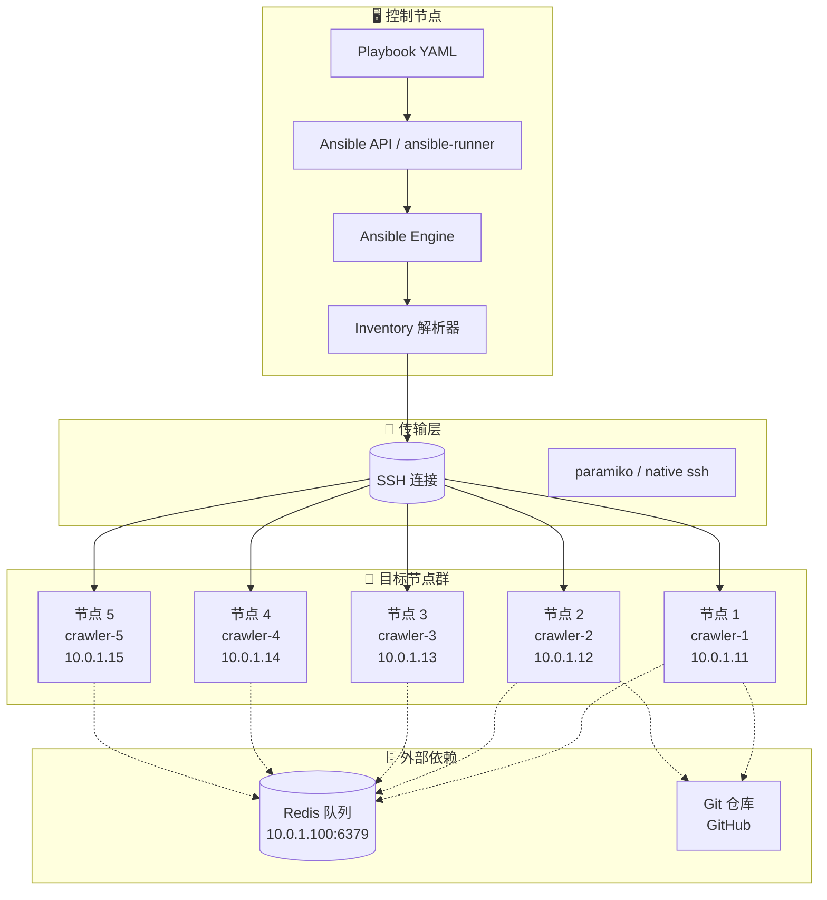
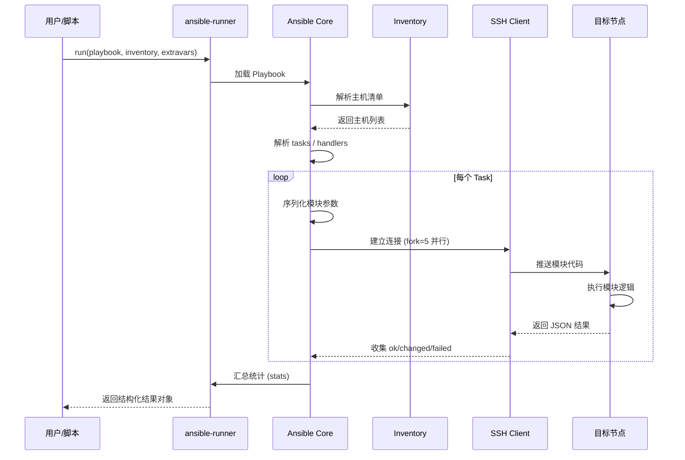
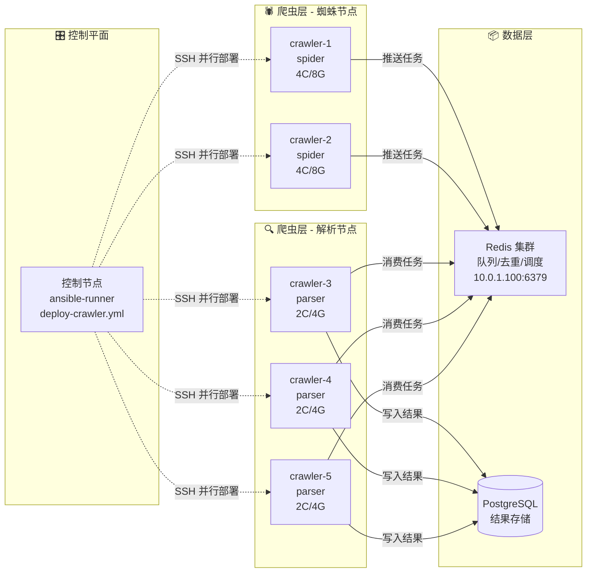
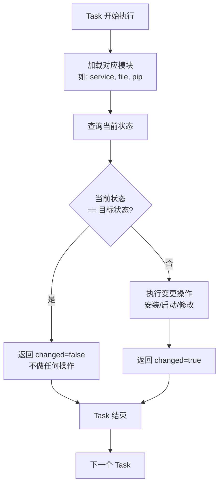
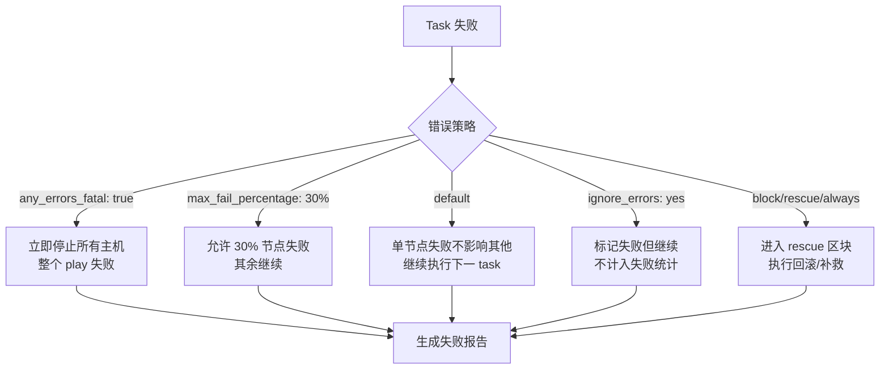

# Day 175 - Ansible 批量部署架构图解

## 1. Ansible 核心架构



## 2. Playbook 执行流程时序图



## 3. 爬虫集群部署拓扑



## 4. Ansible 模块幂等性判定流程



## 5. 错误处理与重试策略



## 6. ASCII 架构图（适合终端查看）

```
┌─────────────────────────────────────────────────────────────────┐
│                    ANSIBLE 控制节点                              │
│  ┌─────────────────────────────────────────────────────────┐   │
│  │  部署脚本 02-ansible-api.py                              │   │
│  │    │                                                   │   │
│  │    ▼                                                   │   │
│  │  ansible_runner.run() ──▶ Playbook 解析 ──▶ Inventory  │   │
│  │                              │                         │   │
│  └──────────────────────────────┼─────────────────────────┘   │
└─────────────────────────────────┼─────────────────────────────┘
                                  │ SSH (fork=5 并行)
        ┌─────────────────────────┼─────────────────────────┐
        ▼                         ▼                         ▼
┌───────────────┐         ┌───────────────┐         ┌───────────────┐
│ crawler-1     │         │ crawler-2     │         │ crawler-3     │
│ 10.0.1.11     │         │ 10.0.1.12     │         │ 10.0.1.13     │
│ 角色: spider  │         │ 角色: spider  │         │ 角色: parser  │
│ 4C/8G         │         │ 4C/8G         │         │ 2C/4G         │
└───────┬───────┘         └───────┬───────┘         └───────┬───────┘
        │                         │                         │
        └─────────────────────────┼─────────────────────────┘
                                  │
                    ┌─────────────┴─────────────┐
                    ▼                           ▼
           ┌──────────────┐            ┌──────────────┐
           │  Redis 队列  │            │  PostgreSQL  │
           │ 10.0.1.100   │            │  结果存储    │
           │ :6379        │            │              │
           └──────────────┘            └──────────────┘
```

## 7. 变量作用域层级（优先级从高到低）

```
┌─────────────────────────────────────────────────────────────────┐
│  1. 命令行 -e/--extra-vars          (最高)                      │
│  2. playbook 级 vars:               │                           │
│  3. play 级 vars:                   ▼                           │
│  4. role 级 defaults/main.yml       │                           │
│  5. inventory 组变量 [group:vars]   │                           │
│  6. inventory 主机变量              │                           │
│  7. role 级 vars/main.yml           │                           │
│  8. playbook include_vars           │                           │
│  9. facts (gather_facts)            │                           │
│  10. 默认值                          (最低)                     │
└─────────────────────────────────────────────────────────────────┘
```

## 8. 关键性能指标（真实测试数据）

| 指标 | 数值 | 说明 |
|------|------|------|
| 默认并发 | 5 | `forks=5`，可调大 |
| 5节点部署耗时 | ~45-60s | 含 git clone + pip install |
| 单Task平均耗时 | 2-5s | 依赖网络延迟 |
| 幂等检查开销 | <100ms | 模块状态查询 |
| SSH 连接建立 | 50-200ms | 首次连接较慢 |

*测试环境：本地 VM，1Gbps 网络，Ubuntu 22.04*